**TRƯỜNG ĐẠI HỌC GIAO THÔNG VẬN TẢI TP. HCM**

**KHOA CÔNG NGHỆ THÔNG TIN**

**BÁO CÁO ĐỒ ÁN KẾT THÚC HỌC PHẦN**

**ỨNG DỤNG QUẢN LÝ CÔNG VIỆC**

**Môn học:** Lập trình thiết bị di động	**Lớp**: 012012103402

**Giảng viên hướng dẫn:** ThS. Mai Ngọc Châu

**Danh sách sinh viên tham gia:**

Trần Văn Thái	**MSSV:** 051206002315

Nguyễn Lê Huy Tâm	**MSSV:** 056206011188

Nguyễn Ngọc Gia Bảo	**MSSV:** 079206008279

Trần Văn Ngọc Thắng	**MSSV:** 046206001641

Huỳnh Đình Chấn	**MSSV:** 077206002307

*Hồ Chí Minh, tháng* *9* *năm 2026*

# LỜI CAM ĐOAN

Em xin cam đoan rằng toàn bộ nội dung được trình bày trong báo cáo bài tập lớn này là kết quả quá trình nghiên cứu, phân tích, thiết kế và lập trình của nhóm chúng em dưới sự hướng dẫn của giảng viên bộ môn. Ứng dụng Task Management App được xây dựng hoàn toàn trên nền tảng Android bằng ngôn ngữ Kotlin, sử dụng các thư viện mã nguồn mở thuộc bộ Android Jetpack do Google phát hành công khai.

Các số liệu, bảng biểu, sơ đồ và kết quả kiểm thử trong báo cáo đều trung thực, phản ánh đúng những gì đã được triển khai trong mã nguồn của dự án tại thời điểm hoàn thành báo cáo. Những phần tham khảo từ tài liệu, sách, bài viết hay mã nguồn của bên thứ ba đều được ghi rõ nguồn trong mục Tài liệu tham khảo. Những kết quả kiểm thử chưa chạy trên thiết bị thật đều được ghi chú rõ trạng thái để tránh gây hiểu nhầm về mức độ hoàn thiện của hệ thống.

Em xin chịu hoàn toàn trách nhiệm về tính xác thực của lời cam đoan này.

**Sinh viên thực hiện**

Trần Văn Thái

Nguyễn Lê Huy Tâm

Nguyễn Ngọc Gia Bảo

Trần Văn Ngọc Thắng

Huỳnh Đình Chấn

*Hồ Chí Minh, tháng 9 năm 2026*

# LỜI CẢM ƠN

Để có thể hoàn thành bài tập lớn này, ngoài sự nỗ lực của bản thân và của các thành viên trong nhóm, chúng em đã nhận được rất nhiều sự quan tâm, giúp đỡ và hướng dẫn quý báu. Trước tiên, nhóm chúng em xin bày tỏ lòng biết ơn sâu sắc tới giảng viên hướng dẫn cùng quý thầy cô trong Bộ môn Công nghệ Phần mềm, Khoa Công nghệ Thông tin — Trường Đại học Giao thông Vận tải TP. Hồ Chí Minh. Các thầy cô không chỉ truyền đạt những kiến thức nền tảng về kỹ thuật phần mềm, kiến trúc hệ thống và cơ sở dữ liệu, mà còn định hướng cho chúng em cách tiếp cận một bài toán thực tế theo đúng quy trình: khảo sát — phân tích — thiết kế — hiện thực — kiểm thử — đánh giá.

Chúng em xin cảm ơn cộng đồng mã nguồn mở, đặc biệt là nhóm phát triển Android của

Google và cộng đồng Kotlin, vì đã cung cấp kho tài liệu chính thống, đầy đủ và liên tục

được cập nhật. Nhờ đó, nhóm có thể áp dụng đúng các khuyến nghị kiến trúc hiện đại

như MVVM, Repository Pattern, Room Persistence Library, Coroutines và Flow.

Cuối cùng, chúng em xin cảm ơn gia đình, bạn bè và các thành viên trong nhóm đã luôn

động viên, chia sẻ khó khăn và cùng nhau vượt qua những giai đoạn thử thách của dự án.

Mặc dù đã cố gắng hết sức, báo cáo khó tránh khỏi những thiếu sót. Nhóm chúng em rất

mong nhận được những ý kiến nhận xét, góp ý của quý thầy cô để có thể hoàn thiện sản

phẩm cũng như nâng cao kiến thức của bản thân.

Chúng em xin chân thành cảm ơn!

# MỤC LỤC

# DANH MỤC TỪ VIẾT TẮT

| STT | Viết tắt | Tiếng Anh | Tiếng Việt / Ý nghĩa |
| :--- | :--- | :--- | :--- |
| 1 | AI | Artificial Intelligence | Trí tuệ nhân tạo |
| 2 | API | Application Programming Interface | Giao diện lập trình ứng dụng |
| 3 | APK | Android Package Kit | Định dạng gói cài đặt ứng dụng Android |
| 4 | CRUD | Create, Read, Update, Delete | Bốn thao tác cơ bản trên dữ liệu (Tạo, Đọc, Cập nhật, Xóa) |
| 5 | DAO | Data Access Object | Đối tượng truy cập cơ sở dữ liệu |
| 6 | DB | Database | Cơ sở dữ liệu |
| 7 | DBMS | Database Management System | Hệ quản trị cơ sở dữ liệu |
| 8 | DPI | Dots Per Inch | Mật độ điểm ảnh trên màn hình thiết bị |
| 9 | ERD | Entity Relationship Diagram | Sơ đồ quan hệ thực thể |
| 10 | FR | Functional Requirement | Yêu cầu chức năng của hệ thống |
| 11 | HD | High Definition | Độ phân giải cao / Độ nét cao |
| 12 | IDE | Integrated Development Environment | Môi trường phát triển tích hợp |
| 13 | JSON | JavaScript Object Notation | Định dạng văn bản nhẹ dùng để trao đổi dữ liệu |
| 14 | JVM | Java Virtual Machine | Máy ảo Java |
| 15 | KTS | Kotlin Script | Tập lệnh cấu hình xây dựng dự án bằng Kotlin |
| 16 | MVVM | Model — View — ViewModel | Mô hình kiến trúc phần mềm phân tầng trên Android |
| 17 | NFR | Non-Functional Requirement | Yêu cầu phi chức năng của hệ thống |
| 18 | NLP | Natural Language Processing | Xử lý ngôn ngữ tự nhiên |
| 19 | OOP | Object-Oriented Programming | Lập trình hướng đối tượng |
| 20 | OS | Operating System | Hệ điều hành |
| 21 | PIN | Personal Identification Number | Mã số nhận dạng cá nhân (mã khóa bảo mật) |
| 22 | PRAGMA | Pragmatic Information | Câu lệnh truy vấn thông tin cấu trúc nội tại của SQLite |
| 23 | RAM | Random Access Memory | Bộ nhớ truy xuất ngẫu nhiên |
| 24 | Regex | Regular Expression | Biểu thức chính quy |
| 25 | REST | Representational State Transfer | Kiểu kiến trúc dịch vụ web truyền tải dữ liệu |
| 26 | SAF | Storage Access Framework | Khung truy cập tệp lưu trữ trên Android |
| 27 | SDK | Software Development Kit | Bộ công cụ phát triển phần mềm |
| 28 | SHA | Secure Hash Algorithm (SHA-256) | Thuật toán băm mật mã bảo mật 256-bit |
| 29 | SQL | Structured Query Language | Ngôn ngữ truy vấn có cấu trúc |
| 30 | SQLite | Structured Query Language Lite | Hệ quản trị cơ sở dữ liệu quan hệ nhúng cục bộ |
| 31 | TC | Test Case | Ca kiểm thử phần mềm |
| 32 | UC | Use Case | Ca sử dụng hệ thống |
| 33 | UI | User Interface | Giao diện người dùng |
| 34 | URI | Uniform Resource Identifier | Chuỗi định danh tài nguyên đồng nhất |
| 35 | UTC | Coordinated Universal Time | Giờ phối hợp quốc tế |
| 36 | UX | User Experience | Trải nghiệm người dùng |
| 37 | XML | Extensible Markup Language | Ngôn ngữ đánh dấu mở rộng dùng thiết kế giao diện Android |


# DANH MỤC BẢNG BIỂU

* [Bảng 1: Mục tiêu cụ thể của đề tài](#bang-1)

* [Bảng 2: Phương pháp nghiên cứu và cách áp dụng cụ thể](#bang-2)

* [Bảng 1.1: Các thành phần thông tin của một công việc](#bang-11)

* [Bảng 1.2: So sánh các ứng dụng quản lý công việc tương tự](#bang-12)

* [Bảng 1.3: Mục tiêu của hệ thống và tiêu chí đánh giá](#bang-13)

* [Bảng 2.1: Danh sách yêu cầu chức năng của hệ thống](#bang-21)

* [Bảng 2.2: Danh sách yêu cầu phi chức năng của hệ thống](#bang-22)

* [Bảng 2.3: Các tác nhân của hệ thống](#bang-23)

* [Bảng 2.4: Bảng phân tích tác nhân và Use Case](#bang-24)

* [Bảng 2.5: Các Repository và trách nhiệm chính](#bang-25)

* [Bảng 2.6: Cấu trúc bảng tasks trong cơ sở dữ liệu Room](#bang-26)

* [Bảng 2.7: Cấu trúc bảng pomodoro_sessions trong cơ sở dữ liệu Room](#bang-27)

* [Bảng 2.8: Danh sách các DAO và phạm vi truy vấn](#bang-28)

* [Bảng 2.9: Bảng đối chiếu version cơ sở dữ liệu và migration](#bang-29)

* [Bảng 2.10: Các bước kiểm tra tính hợp lệ của tệp sao lưu](#bang-210)

* [Bảng 3.1: Môi trường phát triển của dự án](#bang-31)

* [Bảng 3.2: Danh sách thư viện và phiên bản sử dụng trong dự án](#bang-32)

* [Bảng 3.3: Mục đích sử dụng của các API trong dự án](#bang-33)

* [Bảng 3.4: Các màn hình chính của ứng dụng](#bang-34)

* [Bảng 3.5: Chức năng, xử lý của các thành phần mã nguồn quản lý công việc](#bang-35)

* [Bảng 3.6: Vai trò của các thành phần trong mã nguồn phân hệ lọc và sắp xếp](#bang-36)

* [Bảng 3.7: Kiến trúc và trách nhiệm các thành phần phân hệ nhắc nhở](#bang-37)

* [Bảng 3.8: Quy tắc lặp lại task mới khi hoàn thành](#bang-38)

* [Bảng 3.9: Thiết kế bảo mật PIN Lock và sinh trắc học vân tay](#bang-39)

* [Bảng 3.10: Quy trình khôi phục dữ liệu an toàn](#bang-310)

* [Bảng 3.11: Trách nhiệm của các thành phần mã nguồn sao lưu và khôi phục](#bang-311)

* [Bảng 3.12: Trách nhiệm của các thành phần mã nguồn Home Screen Widget](#bang-312)

* [Bảng 3.13: Trách nhiệm của các thành phần mã nguồn thống kê Bento Grid](#bang-313)

* [Bảng 3.14: Trách nhiệm của các thành phần mã nguồn Pomodoro Timer](#bang-314)

* [Bảng 3.15: Thống kê thời gian tập trung Pomodoro](#bang-315)

* [Bảng 3.16: Vai trò của các thành phần trong phân hệ Streak & Milestone Badges](#bang-316)

* [Bảng 3.17: Các thành phần chính trong phân hệ Trợ lý ảo AI](#bang-317)

* [Bảng 3.18: Bảng đối chiếu 11 yêu cầu bàn giao của đề bài](#bang-318)

* [Bảng 3.19: Bảng đối chiếu các tính năng nâng cao](#bang-319)

* [Bảng 4.1: Môi trường kiểm thử hệ thống](#bang-41)

* [Bảng 4.2: Phương pháp kiểm thử tự động trên JVM và cách tách phụ thuộc Android](#bang-42)

* [Bảng 4.3: Ma trận kiểm thử chức năng quản lý công việc (TC01–TC06)](#bang-43)

* [Bảng 4.4: Ma trận kiểm thử thông báo và khôi phục nhắc nhở (TC07–TC10)](#bang-44)

* [Bảng 4.5: Ma trận kiểm thử bảo mật PIN và sinh trắc học (TC11–TC13)](#bang-45)

* [Bảng 4.6: Ma trận kiểm thử Backup và Restore JSON (TC14–TC18)](#bang-46)

* [Bảng 4.7: Ma trận kiểm thử Widget và Thống kê (TC19–TC21)](#bang-47)

* [Bảng 4.8: Tổng hợp kết quả kiểm thử hộp đen theo nhóm chức năng](#bang-48)

* [Bảng 4.9: Danh sách unit test tự động của dự án trên JVM](#bang-49)

* [Bảng 4.10: Tổng hợp chỉ số kiểm thử tự động](#bang-410)

* [Bảng 4.11: Kết quả kiểm chứng ngoài thiết bị](#bang-411)

* [Bảng 4.12: Bảng phân tích ưu và nhược điểm của hệ thống](#bang-412)

* [Bảng 4.13: Bảng đánh giá mức độ hoàn thành các yêu cầu sau kiểm thử](#bang-413)

* [Bảng 5.1: Tổng hợp kỹ thuật và công nghệ đã vận dụng trong đề tài](#bang-51)

* [Bảng A.1: Danh sách file Kotlin theo từng phân hệ](#bang-a1)

* [Bảng B.1: Quy tắc toàn vẹn dữ liệu cơ sở dữ liệu](#bang-b1)

* [Bảng C.1: Bộ test case chi tiết nhóm 1 - Quản lý công việc](#bang-c1)

* [Bảng C.2: Ma trận test case chi tiết nhóm 2 - Thông báo và khôi phục nhắc nhở](#bang-c2)

* [Bảng C.3: Ma trận test case chi tiết nhóm 3 - Bảo mật mã PIN và sinh trắc học](#bang-c3)

* [Bảng C.4: Ma trận test case chi tiết nhóm 4 - Sao lưu và khôi phục dữ liệu](#bang-c4)

* [Bảng C.5: Ma trận test case chi tiết nhóm 5 - Widget, thống kê và Pomodoro](#bang-c5)

* [Bảng C.6: Danh sách các ca kiểm thử bổ sung biên và kiểm tra chịu lỗi](#bang-c6)

* [Bảng D.1: Danh mục các đoạn mã nguồn cốt lõi được trích lục](#bang-d1)

* [Bảng E.1: Yêu cầu hệ thống và môi trường vận hành](#bang-e1)

* [Bảng E.2: Hướng dẫn thao tác quản lý công việc](#bang-e2)

* [Bảng E.3: Xử lý các tình huống thường gặp khi sử dụng](#bang-e3)

# DANH MỤC HÌNH ẢNH

* [Hình 1.1: Sơ đồ khái quát của hệ thống](#hinh-11)

* [Hình 2.1: Sơ đồ Use Case tổng quát](#hinh-21)

* [Hình 2.2: Luồng kiến trúc Model — View — ViewModel](#hinh-22)

* [Hình 2.3: Sơ đồ kiến trúc MVVM của Task Management App](#hinh-23)

* [Hình 2.4: Sơ đồ quan hệ thực thể (ERD) giữa tasks và pomodoro_sessions](#hinh-24)

* [Hình 2.5: Sơ đồ luồng xử lý tạo / sửa / xóa công việc](#hinh-25)

* [Hình 2.6: Sơ đồ luồng thông báo nhắc việc](#hinh-26)

* [Hình 2.7: Sơ đồ luồng khôi phục nhắc nhở sau khi khởi động lại](#hinh-27)

* [Hình 2.8: Sơ đồ luồng xác thực mã PIN](#hinh-28)

* [Hình 2.9: Sơ đồ luồng Backup JSON](#hinh-29)

* [Hình 2.10: Sơ đồ luồng Restore JSON](#hinh-210)

* [Hình 2.11: Sơ đồ luồng Home Screen Widget](#hinh-211)

* [Hình 2.12: Sơ đồ máy trạng thái của Pomodoro Timer](#hinh-212)

* [Hình 3.1: Giao diện danh sách công việc (Task List)](#hinh-31)

* [Hình 3.2: Giao diện thêm / sửa công việc (Add / Edit Task)](#hinh-32)

* [Hình 3.3: Giao diện chi tiết công việc (Task Detail)](#hinh-33)

* [Hình 3.4: Giao diện lọc và sắp xếp (Filter Bottom Sheet)](#hinh-34)

* [Hình 3.5: Giao diện lịch biểu (Calendar View)](#hinh-35)

* [Hình 3.6: Luồng xử lý quyền thông báo trên Android 13+](#hinh-36)

* [Hình 3.7: Luồng xử lý khi hoàn thành công việc lặp lại](#hinh-37)

* [Hình 3.8: Giao diện khóa PIN](#hinh-38)

* [Hình 3.9: Luồng thiết lập và xác thực mã PIN](#hinh-39)

* [Hình 3.10: Giao diện quản lý dữ liệu (Backup / Restore)](#hinh-310)

* [Hình 3.11: Giao diện Home Screen Widget](#hinh-311)

* [Hình 3.12: Giao diện thống kê Bento Grid](#hinh-312)

* [Hình 3.13: Giao diện đồng hồ tập trung Pomodoro Timer](#hinh-313)

* [Hình 3.14: Giao diện chuỗi ngày và hệ thống huy hiệu (Badges & Streak)](#hinh-314)

* [Hình 3.15: Giao diện trợ lý ảo AI thông minh (AI Assistant Chat Bottom Sheet)](#hinh-315)

* [Hình 3.16: Giao diện phím tắt màn hình chính (Launcher App Shortcuts)](#hinh-316)

# MỞ ĐẦU

## 1. Tính cấp thiết của đề tài

Trong kỷ nguyên số, khối lượng công việc của mỗi cá nhân — từ học tập, làm việc đến các hoạt động cá nhân — tăng lên nhanh chóng cả về số lượng lẫn mức độ phức tạp. Một sinh viên đại học thông thường cùng lúc phải theo dõi hàng chục mốc thời gian: lịch nộp bài tập nhóm, lịch thi, lịch thực tập, các kỳ hạn đăng ký môn học, các cuộc hẹn với giảng viên hướng dẫn và cả những công việc cá nhân như đóng học phí, gia hạn tài khoản dịch vụ. Khi số lượng đầu việc vượt quá khả năng ghi nhớ tự nhiên của não bộ, con người bắt đầu quên hạn, trì hoãn vô thức và mất khả năng đánh giá mức độ ưu tiên. Hệ quả không chỉ là việc bỏ lỡ deadline, mà còn là sự gia tăng căng thẳng, giảm chất lượng kết quả công việc và suy giảm năng suất tích lũy theo thời gian.

Một thống kê thường được nhắc đến trong lĩnh vực năng suất cá nhân là phần lớn các đầu việc bị trễ hạn không xuất phát từ việc thiếu thời gian, mà từ việc thiếu một hệ thống ghi nhớ và nhắc nhở đủ tin cậy. Bộ não con người phù hợp với việc tư duy hơn là lưu trữ; vì vậy phương pháp đúng đắn là "giải phóng" bộ nhớ làm việc bằng cách đưa mọi cam kết ra khỏi đầu và ghi lại vào một công cụ có khả năng nhắc đúng lúc. Đó chính là vai trò của các ứng dụng quản lý công việc.

Trên thị trường hiện nay có nhiều ứng dụng quản lý công việc mạnh mẽ như Todoist, TickTick, Microsoft To Do hay Google Tasks. Tuy nhiên, các sản phẩm này tồn tại một số hạn chế nhất định đối với nhóm người dùng là sinh viên hoặc người dùng phổ thông:

Phụ thuộc kết nối Internet và tài khoản đám mây. Hầu hết dịch vụ yêu cầu đăng ký tài khoản và đồng bộ lên máy chủ. Khi mất mạng, một số tính năng bị hạn chế hoặc không thể truy cập dữ liệu mới nhất.

Vấn đề quyền riêng tư. Dữ liệu kế hoạch làm việc, tên công việc, thời hạn và mô tả chi tiết đều được tải lên máy chủ của nhà cung cấp, trong khi người dùng không có quyền kiểm soát thực sự đối với dữ liệu của mình.

Giới hạn tính năng trong bản miễn phí. Các tính năng quan trọng như nhắc nhở lặp lại nâng cao, widget màn hình chính, thống kê năng suất hay bảo vệ ứng dụng bằng mã khóa thường nằm trong gói trả phí.

Khó khóa ứng dụng bằng mã PIN. Đối với người dùng muốn giữ riêng tư danh sách công việc cá nhân, việc thiếu cơ chế khóa cục bộ khiến bất kỳ ai cầm máy cũng đọc được kế hoạch làm việc.

Xuất phát từ những phân tích trên, nhóm chúng em lựa chọn đề tài "Xây dựng ứng dụng quản lý công việc trên nền tảng Android" theo hướng local-first: toàn bộ dữ liệu được lưu trữ ngay trên thiết bị, ứng dụng hoạt động đầy đủ khi không có mạng, người dùng chủ động sao lưu ra tệp tin khi cần và có cơ chế khóa ứng dụng bằng mã PIN. Bên cạnh đó, nhóm định hướng bổ sung những tiện ích cao cấp mà các sản phẩm miễn phí khác không có, gồm Home Screen Widget và Bento Grid Statistics Dashboard, nhằm nâng cao trải nghiệm và giá trị thực tiễn của sản phẩm.

## 2. Mục tiêu của đề tài

### 2.1. Mục tiêu tổng quát

Xây dựng một ứng dụng Android hoàn chỉnh, ổn định và có tính ứng dụng thực tế, giúp người dùng quản lý công việc cá nhân hiệu quả; hoạt động độc lập, bảo mật và không phụ thuộc vào kết nối Internet.

### 2.2. Mục tiêu cụ thể

Các mục tiêu cụ thể được xác định song song với 11 yêu cầu bắt buộc của đề bài, đồng thời bổ sung các mục tiêu về chất lượng kiến trúc và trải nghiệm người dùng:

<a id="bang-1"></a>

*Bảng 1: Mục tiêu cụ thể của đề tài*

| STT | Mục tiêu | Mô tả chi tiết |
| :--- | :--- | :--- |
| 1 | Quản lý công việc (CRUD) | Cho phép tạo mới, xem, chỉnh sửa, xóa và đánh dấu hoàn thành công việc; dữ liệu được cập nhật tức thời trên giao diện |
| 2 | Cấu trúc thông tin công việc | Lưu trữ đầy đủ tiêu đề, mô tả, ngày hạn, giờ nhắc, độ ưu tiên, trạng thái và quy tắc lặp lại |
| 3 | Lọc và sắp xếp | Hỗ trợ lọc theo trạng thái/độ ưu tiên và sắp xếp theo ngày hết hạn hoặc độ ưu tiên |
| 4 | Nhắc việc chính xác | Lập lịch thông báo bằng Exact Alarm, hiển thị đúng giờ kể cả khi thiết bị ở chế độ Doze; xử lý quyền runtime POST_NOTIFICATIONS trên Android 13+ |
| 5 | Lưu trữ bền vững | Sử dụng Room Database (SQLite) kết hợp Coroutines và Flow để đọc/ghi dữ liệu bất đồng bộ |
| 6 | Bảo mật mã PIN | Kích hoạt khóa ứng dụng bằng mã PIN, PIN không bao giờ lưu dạng văn bản thuần mà được băm bằng SHA-256 kèm Salt |
| 7 | Kiểm tra dữ liệu hợp lệ | Kiểm tra ràng buộc trường bắt buộc, hiển thị trạng thái rỗng (empty state) và trạng thái quá hạn (overdue) rõ ràng |
| 8 | Công việc lặp lại | Hỗ trợ quy tắc lặp Daily / Weekly / Monthly; khi hoàn thành sẽ tự động tính kỳ hạn kế tiếp |
| 9 | Lịch biểu | Hiển thị công việc theo dạng lịch tháng/ngày, kèm chỉ báo chấm ở những ngày có công việc |
| 10 | Khôi phục nhắc nhở | Tự động đăng ký lại toàn bộ lịch nhắc sau khi thiết bị khởi động lại hoặc khi người dùng đổi giờ/múi giờ |
| 11 | Sao lưu và khôi phục | Xuất/nhập dữ liệu ra tệp JSON thông qua Storage Access Framework, có kiểm tra tính hợp lệ trước khi ghi vào cơ sở dữ liệu |
| 12 | Trải nghiệm người dùng | Áp dụng Material Design 3, bố cục Bento Grid, chuyển động mượt và hỗ trợ chủ đề sáng/tối |
| 13 | Chất lượng mã nguồn | Áp dụng MVVM + Repository, tách biệt rõ ba tầng UI — ViewModel — Data, viết unit test cho các logic thuần |


## 3. Đối tượng nghiên cứu

Đối tượng người dùng: sinh viên, nhân viên văn phòng và người dùng cá nhân sử dụng thiết bị Android có nhu cầu quản lý công việc hằng ngày, đặc biệt là những người ưu tiên quyền riêng tư và khả năng hoạt động ngoại tuyến.

Đối tượng kỹ thuật: các mô hình kiến trúc và công nghệ phát triển ứng dụng Android hiện đại, gồm kiến trúc MVVM, Repository Pattern, Room Persistence Library, Kotlin Coroutines/Flow, AlarmManager, BroadcastReceiver, Storage Access Framework, AppWidget và các thuật toán băm bảo mật.

Phạm vi dữ liệu nghiên cứu: nghiệp vụ quản lý công việc cá nhân, quản lý lịch nhắc, quản lý dữ liệu ngoại tuyến và sao lưu dữ liệu.

## 4. Phạm vi nghiên cứu

### 4.1. Phạm vi nền tảng

Ứng dụng được xây dựng cho hệ điều hành Android, hỗ trợ từ Android 8.0 (API 26) đến Android 14 (API 34) và các phiên bản mới hơn theo cơ chế tương thích ngược. Ứng dụng được biên dịch với minSdk = 26, targetSdk = 34, compileSdk = 34.

### 4.2. Phạm vi chức năng

Ứng dụng tập trung vào nghiệp vụ quản lý công việc cá nhân trên một thiết bị, bao gồm 11 nhóm chức năng bắt buộc theo đề bài và 2 nhóm chức năng nâng cao (Home Screen Widget, Bento Grid Statistics Dashboard). Ngoài ra dự án còn triển khai phân hệ Pomodoro Timer — đồng hồ tập trung theo kỹ thuật quản lý thời gian Pomodoro — như một phần mở rộng của nghiệp vụ quản lý công việc.

### 4.3. Giới hạn phạm vi

Không có đồng bộ đám mây thời gian thực. Ứng dụng hoạt động thuần local offline; dữ liệu chỉ nằm trên thiết bị. Việc chia sẻ dữ liệu giữa nhiều thiết bị được thực hiện thủ công thông qua tệp JSON sao lưu.

Không hỗ trợ cộng tác nhóm. Chưa có cơ chế chia sẻ công việc, phân quyền hay bình luận giữa nhiều người dùng.

Không có backend. Toàn bộ hệ thống chạy trên thiết bị, không có máy chủ, không có API mạng.

Dữ liệu nghiệp vụ giới hạn trong phạm vi một người dùng trên một thiết bị, mỗi thiết bị có một cơ sở dữ liệu riêng.

## 5. Phương pháp nghiên cứu

Nhóm áp dụng kết hợp nhiều phương pháp, tương ứng với từng giai đoạn của vòng đời phát triển phần mềm:

<a id="bang-2"></a>

*Bảng 2: Phương pháp nghiên cứu và cách áp dụng cụ thể*

| Giai đoạn | Phương pháp | Cách áp dụng cụ thể |
| :--- | :--- | :--- |
| Khảo sát | Phương pháp nghiên cứu tài liệu | Đọc tài liệu chính thống của Google về kiến trúc ứng dụng, Room, Notification, AppWidget; tham khảo tài liệu Kotlin về Coroutines/Flow |
| Khảo sát | Phương pháp phân tích sản phẩm tương tự | Cài đặt và trải nghiệm Todoist, TickTick, Microsoft To Do; lập bảng so sánh tính năng và rút ra khoảng trống cần giải quyết |
| Phân tích | Phương pháp phân tích yêu cầu | Chuyển 11 yêu cầu đề bài thành danh sách yêu cầu chức năng/phi chức năng có tiêu chí kiểm thử rõ ràng |
| Phân tích | Mô hình hóa trực quan | Vẽ sơ đồ Use Case, sơ đồ kiến trúc, sơ đồ luồng xử lý và sơ đồ quan hệ thực thể trước khi lập trình |
| Thiết kế | Phương pháp thiết kế hướng kiến trúc | Thiết kế theo mô hình MVVM kết hợp Repository Pattern, phân tách trách nhiệm theo tầng |
| Thiết kế | Phương pháp thiết kế cơ sở dữ liệu chuẩn hóa | Thiết kế lược đồ quan hệ cho tasks và pomodoro_sessions, bổ sung khóa ngoại, chỉ mục và ràng buộc toàn vẹn |
| Hiện thực | Phương pháp lập trình tăng dần (Incremental) | chia dự án thành các công việc nhỏ theo mã Jira (TMA-xx), hoàn thành và kiểm thử từng phân hệ |
| Hiện thực | Phương pháp quản lý mã nguồn phân nhánh | Sử dụng Git với quy trình nhánh feature/TMA-<id>-<slug> và hợp nhất vào nhánh develop, sau đó lên main |
| Kiểm thử | Phương pháp kiểm thử hộp đen (Black-box Testing) | Xây dựng các ca kiểm thử theo dữ liệu đầu vào và hành vi quan sát được, không phụ thuộc cấu trúc mã nguồn |
| Kiểm thử | Phương pháp kiểm thử tự động (Unit Test) | Viết unit test trên JVM cho các logic thuần: engine Pomodoro, thống kê, kiểm tra dữ liệu backup, tiện ích ngày giờ |
| Đánh giá | Phương pháp đối chiếu yêu cầu | Lập bảng đối chiếu từng yêu cầu với thành phần mã nguồn và trạng thái kiểm thử thực tế |
| Đánh giá | Phương pháp phân tích ưu/nhược điểm | Tổng hợp điểm mạnh về kiến trúc và điểm hạn chế về phạm vi tính năng |


## 6. Ý nghĩa của đề tài

### 6.1. Ý nghĩa thực tiễn

Ứng dụng giúp người dùng hình thành thói quen làm việc có kế hoạch: mọi cam kết được ghi lại, được gắn hạn, được nhắc đúng lúc và được theo dõi trạng thái hoàn thành. Vì toàn bộ dữ liệu nằm trên thiết bị và ứng dụng hoạt động không cần mạng, người dùng có thể sử dụng trong mọi điều kiện, kể cả khi đi lại, trong lớp học không có Wi-Fi hay khi đang ở khu vực hạn chế truy cập Internet. Tính năng sao lưu JSON đem lại sự an tâm về dữ liệu mà không cần tài khoản đám mây, còn Home Screen Widget giúp người dùng nhìn thấy và xử lý công việc hôm nay chỉ trong một thao tác ngay trên màn hình chính.

### 6.2. Ý nghĩa kỹ thuật

Đề tài là dịp vận dụng tổng hợp các kiến thức của kỹ thuật phần mềm vào một sản phẩm chạy thật:

Kiến trúc phần mềm: vận dụng MVVM, Repository Pattern, Single Source of Truth, Dependency Injection thủ công qua Factory, tách biệt trách nhiệm giữa các tầng.

Lập trình bất đồng bộ: sử dụng Coroutines, Flow/StateFlow, xử lý đọc ghi cơ sở dữ liệu không chặn luồng giao diện.

Tính bền vững dữ liệu: thiết kế lược đồ cơ sở dữ liệu, viết migration nâng cấp phiên bản mà không mất dữ liệu, ràng buộc khóa ngoại và chỉ mục.

Tích hợp hệ điều hành: làm việc với AlarmManager, BroadcastReceiver, Foreground Service, AppWidget, Storage Access Framework, cơ chế phân quyền runtime của Android.

Bảo mật: áp dụng nguyên lý không lưu thông tin nhạy cảm ở dạng thuần, mã hóa một chiều có Salt.

Kiểm thử và chất lượng: viết unit test cho logic nghiệp vụ, kiểm thử hộp đen trên thiết bị, xây dựng ma trận truy vết yêu cầu — kiểm thử.

## 7. Kết cấu báo cáo

Báo cáo được tổ chức thành 4 chương chính, phần mở đầu, phần kết luận, tài liệu tham khảo và phụ lục:

MỞ ĐẦU: trình bày tính cấp thiết, mục tiêu, đối tượng, phạm vi, phương pháp nghiên cứu, ý nghĩa của đề tài và kết cấu của báo cáo.

# CHƯƠNG 1 — TỔNG QUAN VÀ KHẢO SÁT BÀI TOÁN: phân tích bài toán quản lý công việc, khảo sát các ứng dụng tương tự, từ đó đề xuất giải pháp và xác định mục tiêu, phạm vi của hệ thống.

# CHƯƠNG 2 — PHÂN TÍCH VÀ THIẾT KẾ HỆ THỐNG: đặc tả yêu cầu chức năng và phi chức năng, phân tích tác nhân và Use Case, thiết kế kiến trúc MVVM, thiết kế cơ sở dữ liệu Room và thiết kế các luồng xử lý chính.

# CHƯƠNG 3 — HIỆN THỰC HỆ THỐNG VÀ CÁC TÍNH NĂNG: trình bày môi trường phát triển, công nghệ sử dụng, cấu trúc mã nguồn, cách hiện thực từng phân hệ chức năng, các giải pháp kỹ thuật nổi bật và bảng đối chiếu 11 yêu cầu của đề bài.

# CHƯƠNG 4 — KIỂM THỬ VÀ ĐÁNH GIÁ HỆ THỐNG: mô tả mục tiêu, môi trường và phương pháp kiểm thử; trình bày bộ test case, kết quả kiểm thử, đánh giá hệ thống và mức độ hoàn thành yêu cầu.

KẾT LUẬN VÀ HƯỚNG PHÁT TRIỂN: tổng kết kết quả đạt được, chỉ ra hạn chế và đề xuất hướng phát triển tiếp theo.

TÀI LIỆU THAM KHẢO và PHỤ LỤC A–E: cung cấp cấu trúc mã nguồn, lược đồ cơ sở dữ liệu chi tiết, bộ test case đầy đủ, các đoạn mã nguồn cốt lõi và hướng dẫn sử dụng ứng dụng.

# CHƯƠNG I. GIỚI THIỆU VÀ TỔNG QUAN VỀ ĐỀ TÀI

## 1.1. Tổng quan về bài toán quản lý công việc

### 1.1.1. Khái niệm quản lý công việc

Quản lý công việc (Task Management) là quá trình xác định, ghi nhận, tổ chức, theo dõi và hoàn thành các đầu việc cần làm trong một khoảng thời gian nhất định. Quản lý công việc cá nhân hiệu quả đòi hỏi bốn yếu tố: ghi nhận (không bỏ sót việc), phân loại (biết việc nào quan trọng), lập kế hoạch thời gian (biết khi nào cần làm) và theo dõi tiến độ (biết việc nào đã xong).

Trong nghiệp vụ quản lý công việc cá nhân, một "công việc" (task) không chỉ là một dòng chữ ghi nhớ mà là một thực thể thông tin có cấu trúc, bao gồm nhiều thuộc tính phản ánh các khía cạnh khác nhau của cam kết mà người dùng đã tạo ra.

### 1.1.2. Các thành phần thông tin của một công việc

<a id="bang-11"></a>

*Bảng 1.1. Các thành phần thông tin của một công việc*

| Thành phần | Vai trò trong nghiệp vụ | Lý do cần thiết |
| :--- | :--- | :--- |
| Tiêu đề (Title) | Định danh ngắn gọn nội dung công việc | Là trường duy nhất bắt buộc, giúp người dùng nhận diện công việc trong danh sách |
| Mô tả (Description) | Ghi chú chi tiết, hướng dẫn, ngữ cảnh | Giảm việc phải mở tài liệu khác; lưu lại thông tin quan trọng kèm công việc |
| Ngày hết hạn (Due Date) | Mốc thời gian phải hoàn thành | Cơ sở để sắp xếp thứ tự ưu tiên theo thời gian và phát hiện việc quá hạn |
| Giờ nhắc (Due Time / Reminder) | Thời điểm cụ thể trong ngày để nhắc | Biến "hạn chót" thành một sự kiện có thể nhắc nhở chính xác đến từng phút |
| Độ ưu tiên (Priority) | Mức quan trọng tương đối | Giúp người dùng phân bổ năng lượng đúng chỗ khi có nhiều việc cùng lúc |
| Trạng thái (Status) | Tiến độ hiện tại của công việc | Hỗ trợ lọc, đánh giá năng suất và tính tỷ lệ hoàn thành |
| Quy tắc lặp (Recurrence) | Chu kỳ lặp lại của công việc | Tránh phải tạo lại các công việc định kỳ như họp nhóm hằng tuần, đóng học phí hằng tháng |


### 1.1.3. Vì sao cần deadline, priority, status và recurrence

Deadline là yếu tố duy nhất giúp công việc "có thể hành động được". Một công việc không có hạn luôn bị đẩy xuống cuối danh sách vì não bộ không nhận được tín hiệu cấp bách nào. Deadline biến một mong muốn mơ hồ thành một cam kết có mốc thời gian.

Priority giúp giải quyết bài toán nghịch lý: khi mọi việc đều được đánh dấu "cần làm", ý nghĩa của danh sách bị triệt tiêu. Độ ưu tiên tạo ra thứ tự xử lý rõ ràng, giúp người dùng không bị tê liệt khi nhìn vào danh sách dài.

Status đóng vai trò quan trọng trong việc đo lường tiến độ. Nếu chỉ có hai trạng thái "xong" và "chưa xong", người dùng không thể biểu diễn các công việc đang dang dở. Trạng thái trung gian IN_PROGRESS cho phép người dùng phản ánh đúng thực tế và giúp báo cáo thống kê phản ánh chính xác năng suất.

Recurrence giải quyết nhóm công việc lặp lại theo chu kỳ - loại công việc chiếm phần lớn thời gian trong kế hoạch cá nhân nhưng lại ít được các ứng dụng ghi chú đơn giản hỗ trợ.

## 1.2. Đặt vấn đề và tính cấp thiết

Từ quan sát thực tế và từ trải nghiệm sử dụng các ứng dụng quản lý công việc phổ biến, nhóm xác định những vấn đề điển hình sau đây của người dùng:

Quên deadline do không có cơ chế nhắc chủ động. Người dùng ghi việc nhưng không mở lại ứng dụng để kiểm tra, dẫn đến bỏ lỡ hạn. Giải pháp cần thiết là thông báo đẩy cục bộ (local notification) phát đúng thời điểm, không phụ thuộc mạng.

Không theo dõi được tiến độ tổng thể. Khi danh sách dài, người dùng không biết mình đã hoàn thành bao nhiêu phần trăm khối lượng công việc. Cần một màn hình thống kê trực quan và tức thời.

Không phân biệt được việc quan trọng. Danh sách không có độ ưu tiên khiến người dùng dành thời gian cho việc ít giá trị và trễ hạn các việc quan trọng. Cần cơ chế gắn nhãn ưu tiên, lọc và sắp xếp theo ưu tiên.

Khó quản lý công việc lặp lại. Người dùng phải tạo lại công việc thủ công mỗi chu kỳ, dễ bỏ sót và mất thời gian. Cần các quy tắc lặp Daily/Weekly/Monthly và tự động sinh kỳ hạn kế tiếp.

Không có điểm neo nhắc nhở. Nhắc nhở chỉ có ý nghĩa nếu bám theo dữ liệu, mà dữ liệu phải tồn tại bền vững qua các lần tắt/mở ứng dụng và khởi động lại thiết bị. Cần cơ chế lưu trữ bền vững và tự khôi phục lịch nhắc sau khi thiết bị khởi động lại.

Lo ngại về quyền riêng tư dữ liệu. Danh sách công việc cá nhân chứa thông tin nhạy cảm như lịch hẹn, kế hoạch tài chính, ghi chú cá nhân. Việc đồng bộ lên đám mây là điều nhiều người dùng không mong muốn. Cần giải pháp lưu trữ cục bộ, có mã khóa bảo vệ và cơ chế sao lưu do người dùng chủ động.

Nguy cơ mất dữ liệu khi đổi thiết bị. Nếu dữ liệu chỉ nằm cục bộ, khi đổi máy hoặc cài lại hệ điều hành, người dùng sẽ mất toàn bộ kế hoạch. Cần một định dạng sao lưu trung lập, có thể đọc/ghi và di chuyển giữa các thiết bị.

Mất động lực duy trì thói quen: Người dùng dễ bỏ dở việc sử dụng ứng dụng quản lý sau vài ngày vì thiếu tính khích lệ, tạo cảm giác áp lực thay vì hứng thú làm việc. Cần tích hợp cơ chế duy trì động lực như chuỗi ngày liên tiếp (Streak) và huy hiệu khen thưởng (Badges / Gamification).

Từ tám vấn đề trên, bài toán đặt ra cho đề tài có thể phát biểu như sau: xây dựng một ứng dụng Android quản lý công việc cá nhân hoạt động ngoại tuyến hoàn toàn, có khả năng nhắc nhở chính xác và tự khôi phục sau khi thiết bị khởi động lại, bảo vệ dữ liệu bằng mã PIN, hỗ trợ sao lưu/khôi phục qua tệp JSON và cung cấp các tiện ích nâng cao gồm Home Screen Widget và bảng thống kê năng suất.

## 1.3. Khảo sát các ứng dụng tương tự

### 1.3.1. Phương pháp khảo sát

Nhóm lựa chọn ba sản phẩm tiêu biểu, đại diện cho ba nhóm người dùng và ba triết lý thiết kế khác nhau:

Todoist — sản phẩm quản lý công việc phổ biến nhất, mạnh về cấu trúc dự án, nhãn và cộng tác.

TickTick — sản phẩm tích hợp nhiều tiện ích, có cả lịch, đồng hồ Pomodoro, thói quen và widget.

Microsoft To Do — sản phẩm miễn phí của Microsoft, mạnh về tính đơn giản và đồng bộ với hệ sinh thái Microsoft.

Tiêu chí so sánh được xây dựng theo cấu trúc của đề bài, tập trung vào: CRUD công việc, độ ưu tiên, deadline, công việc lặp lại, lịch, khả năng hoạt động ngoại tuyến, khóa ứng dụng bằng mã PIN, sao lưu cục bộ, widget màn hình chính và thống kê năng suất.

### 1.3.2. Bảng so sánh các ứng dụng

<a id="bang-12"></a>

*Bảng 1.2. So sánh các ứng dụng*

| Tiêu chí | Todoist | TickTick | Microsoft To Do | Task Management App (đề tài) |
| :--- | :--- | :--- | :--- | :--- |
| CRUD công việc | Có | Có | Có | Có |
| Mô tả chi tiết công việc | Có | Có | Có | Có |
| Thao tác nhanh trên thông báo | Có | Có | Có | Có (Đánh dấu hoàn thành / Báo lại - Snooze ngay trên thanh Notification) |
| Độ ưu tiên | Có (4 mức, bản trả phí giới hạn) | Có | Có (thấp/trung bình/cao) | Có (HIGH / MEDIUM / LOW) |
| Deadline + nhắc theo giờ | Có | Có | Có | Có (Exact Alarm) |
| Công việc lặp lại | Có | Có | Có | Có (Daily / Weekly / Monthly) |
| Xem theo lịch | Có (bản trả phí) | Có | Có (nhúng lịch Outlook) | Có (lịch tháng cấp cục bộ) |
| Hoạt động ngoại tuyến | Hạn chế, cần đồng bộ | Có (một phần) | Hạn chế, cần tài khoản | Có, hoạt động đầy đủ |
| Khóa ứng dụng bằng PIN | Không mặc định | Có (tính năng trả phí) | Không | Có, mã hóa SHA-256 + Salt |
| Sao lưu cục bộ bằng tệp | Trả phí | Có | Không có bản xuất tệp gốc | Có, JSON qua Storage Access Framework |
| Widget màn hình chính | Có (giới hạn) | Có | Không đầy đủ | Có, hoàn thành việc trực tiếp trên widget |
| Thống kê năng suất | Có (trả phí) | Có | Không | Có, dạng Bento Grid |
| Tài khoản bắt buộc | Có | Khuyến khích | Có | Không bắt buộc |
| Chi phí để dùng đủ tính năng | Trả phí | Trả phí | Miễn phí nhưng phụ thuộc đám mây | Miễn phí, không giới hạn cục bộ |
| Động lực & Gamification (Streak, Huy hiệu) | Giới hạn (điểm Karma) | Có thói quen cơ bản | Không có | Có (Streak Tracker + Hệ thống Badges mở khóa) |


Ghi chú: thông tin về ba sản phẩm tham chiếu được tổng hợp ở mức tính năng điển hình mà nhóm khảo sát trực tiếp trên ứng dụng; một số tính năng có thể thay đổi theo phiên bản và gói đăng ký của nhà cung cấp.

### 1.3.3. Nhận xét rút ra từ khảo sát

Từ bảng so sánh trên, nhóm rút ra ba nhận xét định hướng cho giải pháp:

Các sản phẩm mạnh về cộng tác và đám mây đều đánh đổi bằng việc phụ thuộc tài khoản và mạng. Khoảng trống dành cho ứng dụng local-first, không cần tài khoản vẫn còn.

Những tính năng mà người dùng đánh giá cao - như khóa PIN, sao lưu tệp cục bộ, widget tương tác và thống kê năng suất - thường bị đưa vào gói trả phí hoặc cắt bớt. Đây chính là điểm cần làm nổi bật trong đề tài.

Tính năng "quản lý thời gian tập trung" (Pomodoro) là điểm mạnh của TickTick nhưng không phổ biến ở các sản phẩm tối giản. Nhóm quyết định bổ sung phân hệ này để sản phẩm không chỉ giúp *ghi nhớ việc* mà còn giúp *thực sự bắt tay vào làm việc*.

## 1.4. Giải pháp đề xuất

### 1.4.1. Định hướng giải pháp

Giải pháp được xác định theo bốn trụ cột: Độc lập - An toàn - Nhanh chóng - Đầy đủ tiện

ích.

Độc lập: toàn bộ dữ liệu được lưu trong cơ sở dữ liệu cục bộ trên thiết bị; ứng dụng không có thành phần máy chủ, không gọi API mạng, không yêu cầu tài khoản.

An toàn: dữ liệu được bảo vệ bằng mã PIN băm một chiều; việc chia sẻ dữ liệu chỉ diễn ra khi người dùng chủ động xuất tệp sao lưu.

Nhanh chóng: mọi thao tác đọc dữ liệu diễn ra theo cơ chế reactive (Flow), giao diện cập nhật tức thời khi dữ liệu thay đổi mà không cần tải lại màn hình.

Đầy đủ tiện ích: bổ sung Home Screen Widget để xử lý công việc trong ngày ngay trên màn hình chính, bảng thống kê Bento Grid để theo dõi năng suất và đồng hồ Pomodoro để hỗ trợ tập trung.

Tạo động lực (Gamification): Tích hợp hệ thống tính điểm, đếm chuỗi ngày hoàn thành liên tục (Streak) và mở khóa các huy hiệu thành tựu (Special Badges) nhằm khích lệ tính kỷ luật của người dùng.

### 1.4.2. Sơ đồ khái quát giải pháp

<a id="hinh-11"></a>

```mermaid
graph TB
    subgraph "👤 NGƯỜI DÙNG & TÁC VỤ CÁ NHÂN"
        USER["Người dùng cá nhân / Học tập / Công việc"]
    end

    subgraph "📱 HỆ THỐNG TASK MANAGEMENT APP (TASKFLOW)"
        subgraph "🎯 Phân hệ Nghiệp vụ Cốt lõi"
            TASK_MGR["Quản lý công việc (CRUD)"]
            FILTER_SORT["Lọc & Sắp xếp đa tiêu chí"]
            CALENDAR["Lịch biểu (Calendar View)"]
            RECURRING["Công việc lặp lại (Recurring)"]
        end

        subgraph "⚡ Phân hệ Tiện ích & Năng suất"
            POMODORO["Đồng hồ Pomodoro (Focus Timer)"]
            STREAK["Chuỗi ngày & 7 Huy hiệu (Gamification)"]
            AI_ASSISTANT["Trợ lý ảo AI (Google Gemini)"]
            STATS["Thống kê Bento Grid"]
            WIDGET["Home Screen Widget"]
            SHORTCUTS["Launcher App Shortcuts"]
        end

        subgraph "🛡️ Phân hệ An toàn & Hệ thống"
            PIN_BIO["Bảo mật PIN SHA-256 & Vân tay"]
            NOTI_ALARM["Nhắc nhở Exact Alarm & Boot Recovery"]
            BACKUP_SAF["Sao lưu & Phục hồi JSON (SAF)"]
        end
    end

    subgraph "💾 TẦNG LƯU TRỮ & HỆ ĐIỀU HÀNH ANDROID"
        ROOM_DB[("Room Database<br/>(tasks & pomodoro_sessions)")]
        PREFS["Encrypted SharedPreferences<br/>(PIN Hash + Salt)"]
        ANDROID_OS["Android OS Services<br/>(AlarmManager, NotificationManager, AppWidget)"]
    end

    USER <--> TASK_MGR & POMODORO & AI_ASSISTANT & WIDGET & SHORTCUTS
    TASK_MGR & FILTER_SORT & CALENDAR & RECURRING & STATS & STREAK <--> ROOM_DB
    POMODORO <--> ROOM_DB & ANDROID_OS
    NOTI_ALARM <--> ANDROID_OS
    PIN_BIO <--> PREFS
    BACKUP_SAF <--> ROOM_DB
```

*Hình 1.1. Sơ đồ khái quát của hệ thống*

### 1.4.3. Sơ đồ phân rã chức năng

`kotlin
Task Management App
├── 1. Quản lý công việc
│   ├── 1.1. Tạo công việc mới
│   ├── 1.2. Chỉnh sửa công việc
│   ├── 1.3. Xóa công việc (có xác nhận)
│   └── 1.4. Đánh dấu hoàn thành / chưa hoàn thành
├── 2. Lọc và sắp xếp
│   ├── 2.1. Lọc theo trạng thái (Tất cả / Chưa xong / Đã xong)
│   ├── 2.2. Lọc theo độ ưu tiên (High / Medium / Low)
│   ├── 2.3. Sắp xếp theo ngày hết hạn
│   └── 2.4. Sắp xếp theo độ ưu tiên
├── 3. Lịch biểu
│   ├── 3.1. Xem theo tháng
│   ├── 3.2. Chỉ báo ngày có công việc
│   └── 3.3. Danh sách công việc theo ngày được chọn
├── 4. Nhắc nhở
│   ├── 4.1. Lập lịch thông báo chính xác (Exact Alarm)
│   ├── 4.2. Xin quyền thông báo trên Android 13+
│   ├── 4.3. Khôi phục lịch nhắc sau khi khởi động lại
│   ├── 4.4. Khôi phục khi đổi giờ / múi giờ / ngày
│   └── 4.5. Thao tác nhanh trên Notification (Hoàn thành / Báo lại Snooze).
├── 5. Công việc lặp lại
│   ├── 5.1. Quy tắc lặp hằng ngày
│   ├── 5.2. Quy tắc lặp hằng tuần
│   └── 5.3. Quy tắc lặp hằng tháng
├── 6. Bảo mật
│   ├── 6.1. Bật / tắt khóa PIN
│   ├── 6.2. Xác thực PIN khi mở ứng dụng
│   ├── 6.3. Lưu PIN dưới dạng băm SHA-256 + Salt
│   └── 6.4. Cơ chế đếm số lần nhập sai và tự động khóa tạm thời 30 giây (Anti-brute force).
├── 7. Sao lưu và khôi phục
│   ├── 7.1. Xuất dữ liệu ra tệp JSON (SAF)
│   ├── 7.2. Nhập dữ liệu từ tệp JSON (SAF)
│   ├── 7.3. Kiểm tra tính hợp lệ trước khi ghi
│   ├── 7.4. Khôi phục trong một transaction
│   └── 7.5. Kiểm tra toàn vẹn dữ liệu (Checksum / Data Integrity).
├── 8. Tiện ích nâng cao
│   ├── 8.1. Home Screen Widget hiển thị việc hôm nay
│   ├── 8.2. Hoàn thành công việc trực tiếp trên widget
│   ├── 8.3. Tự làm mới lúc 00:00 hằng ngày
│   └── 8.4. Bảng thống kê Bento Grid (tỷ lệ hoàn thành, năng suất tuần)
├── 9. Quản lý thời gian tập trung (Pomodoro)
│   ├── 9.1. Đồng hồ Pomodoro chạy nền (Foreground Service)
│   ├── 9.2. Cấu hình thời lượng tập trung / nghỉ
│   ├── 9.3. Thông báo, âm thanh và rung khi hết phiên
│   └── 9.4. Thống kê thời gian tập trung theo ngày / tuần / công việc
└── 10. Duy trì động lực (Gamification)
├── 10.4. Nhắc nhở bảo vệ chuỗi hàng ngày (Daily Streak Protection Reminder)
├── 11. Phân hệ Trợ lý ảo AI thông minh (AI Task Assistant with Google Gemini & Firebase)
│   ├── 11.1. Giao diện đàm thoại hai chiều Bottom Sheet (Interactive Chat UI)
│   ├── 11.2. Phân tích cú pháp lệnh ngôn ngữ tự nhiên (NLP Task Command Parsing)
│   ├── 11.3. Gợi ý hành động và tạo công việc tự động (Smart Action Chips & Auto Creation)
│   └── 11.4. Bảo vệ xác thực dịch vụ Firebase App Check (App Integrity & Security)
└── 12. Phân hệ Phím tắt màn hình chính (Launcher App Shortcuts)
    ├── 12.1. Phím tắt nhanh: Tạo việc, Việc hôm nay, Bật Pomodoro (Static Shortcuts)
    └── 12.2. Kiểm soát mở khóa bảo mật đa lớp qua BaseActivity khi mở từ Shortcut
    ├── 10.1. Đếm chuỗi ngày hoàn thành liên tiếp (Streak Tracker)
    ├── 10.2. Chi tiết tiến độ tuần (Streak Week Progress)
    └── 10.3. Mở khóa huy hiệu thành tựu (Special Badges System)

`

## 1.5. Mục tiêu của hệ thống

<a id="bang-13"></a>

*Bảng 1.3. Mục tiêu của hệ thống*

| Nhóm mục tiêu | Nội dung | Tiêu chí đánh giá |
| :--- | :--- | :--- |
| Chức năng bắt buộc | Thực hiện đủ 11 yêu cầu của đề bài | 11/11 yêu cầu có thành phần mã nguồn tương ứng và được kiểm thử |
| Kiến trúc | MVVM + Repository + Room, tách biệt tầng rõ ràng | Không có truy vấn cơ sở dữ liệu trong Activity/Fragment; ViewModel là nơi chứa trạng thái UI |
| Trải nghiệm | Material Design 3, bố cục Bento Grid, chuyển động mượt | Giao diện nhất quán về màu sắc, kiểu chữ và khoảng cách |
| Độ tin cậy | Nhắc việc đúng giờ và không mất lịch nhắc sau khi khởi động lại | Kiểm thử trên nhiều phiên bản Android |
| Bảo mật | Không lưu PIN dạng văn bản thuần | Kiểm tra dữ liệu lưu trữ chỉ chứa hash và salt |
| Dữ liệu | Lưu trữ bền vững và có thể sao lưu/khôi phục | Tệp JSON chứa đủ thông tin và khôi phục được vào cơ sở dữ liệu |
| Nâng cao | Home Screen Widget, Bento Grid Dashboard, Pomodoro Timer, Cơ chế Gamification (Streak & Badge) | Hoạt động độc lập, không cần mở ứng dụng (đối với widget) |


## 1.6. Đối tượng và phạm vi của đề tài

### 1.6.1. Đối tượng người dùng

Ứng dụng hướng đến ba nhóm người dùng chính:

Sinh viên: cần quản lý bài tập, lịch thi, lịch học và các hoạt động ngoại khóa; thường xuyên phải làm việc trong điều kiện mạng không ổn định.

Nhân viên văn phòng: cần theo dõi các đầu việc, cuộc họp và deadline dự án; có nhu cầu bảo mật danh sách công việc cá nhân.

Người dùng cá nhân: cần quản lý công việc gia đình, tài chính, sức khỏe và thói quen; ưu tiên sự đơn giản và quyền riêng tư.

### 1.6.2. Phạm vi kỹ thuật

Trợ lý ảo AI & Dịch vụ đám mây: Google Gemini 2.5 Flash API tích hợp qua Firebase Vertex AI SDK, kết hợp Firebase App Check (Play Integrity & Debug Provider) bảo vệ tài nguyên API.

Sinh trắc học & Phím tắt: Thư viện AndroidX Biometric (BiometricPrompt) cung cấp xác thực vân tay phần cứng an toàn; Android App Shortcuts XML API cung cấp lối tắt truy cập nhanh từ màn hình chính.

Nền tảng: Android 8.0 (API 26) đến Android 14 (API 34).

Ngôn ngữ: Kotlin.

Kiến trúc: MVVM kết hợp Repository Pattern.

Lưu trữ: Room Database (SQLite) cho dữ liệu nghiệp vụ; SharedPreferences cho cấu hình và trạng thái nhỏ.

Thông báo: AlarmManager + BroadcastReceiver + NotificationManager.

Dịch vụ nền: Foreground Service cho đồng hồ Pomodoro.

Tiện ích: AppWidget (RemoteViews) cho Home Screen Widget.

Trao đổi dữ liệu: JSON thông qua Storage Access Framework.

### 1.6.3. Giới hạn phạm vi

Ứng dụng hiện hoạt động thuần local offline, chưa hỗ trợ đồng bộ thời gian thực qua Cloud giữa nhiều thiết bị; chưa có tính năng cộng tác nhóm; chưa tích hợp trí tuệ nhân tạo để gợi ý lịch trình. Các giới hạn này được phân tích cụ thể trong phần Kết luận và Hướng phát triển.

## 1.7. Kết luận chương

Chương 1 đã trình bày bức tranh tổng quan của bài toán quản lý công việc cá nhân: khái niệm, các thành phần thông tin của một công việc, những vấn đề thực tế mà người dùng gặp phải và lý do cần giải quyết chúng. Chương cũng đã khảo sát ba ứng dụng quản lý công việc phổ biến, lập bảng so sánh theo các tiêu chí phù hợp với đề bài và rút ra khoảng trống về một ứng dụng local-first, miễn phí, bảo mật, đầy đủ tiện ích.

Trên cơ sở đó, chương đã đề xuất giải pháp Task Management App với bốn trụ cột Độc lập — An toàn — Nhanh chóng — Đầy đủ tiện ích; xác định 13 nhóm mục tiêu của hệ thống; xác định rõ đối tượng người dùng, phạm vi nền tảng, phạm vi chức năng và các giới hạn của đề tài. Những kết quả này là đầu vào trực tiếp cho Chương 2, nơi nhóm tiến hành phân tích yêu cầu chi tiết và thiết kế hệ thống.

# CHƯƠNG 2. PHÂN TÍCH VÀ THIẾT KẾ HỆ THỐNG

## 2.1. Phân tích yêu cầu hệ thống

### 2.1.1. Yêu cầu chức năng

FR-10 (Trợ lý ảo AI): Người dùng có thể giao tiếp bằng ngôn ngữ tự nhiên tiếng Việt hoặc tiếng Anh để tạo việc nhanh, hỏi đáp số lượng việc cần làm, việc quá hạn hoặc tìm kiếm việc theo mức độ ưu tiên.

FR-11 (Gamification & Streak): Hệ thống tự động theo dõi chuỗi ngày hoàn thành công việc liên tục (Current Streak, Best Streak), mở khóa 7 huy hiệu thành tích đặc biệt và gửi thông báo bảo vệ chuỗi mỗi ngày.

FR-12 (Xác thực sinh trắc học): Cho phép mở khóa ứng dụng tức thì bằng vân tay thay vì phải nhập mã PIN, đồng thời có cơ chế tự động hủy kích hoạt vân tay khi đổi hoặc xóa mã PIN để bảo vệ an toàn.

FR-13 (Phím tắt ứng dụng): Cung cấp các lối tắt trên màn hình chính (Tạo việc mới, Xem việc hôm nay, Bật Pomodoro) giúp người dùng thực hiện tác vụ ngay lập tức mà vẫn đảm bảo qua lớp xác thực bảo mật.

Trên cơ sở 11 nhóm yêu cầu bắt buộc của đề bài kết hợp với kết quả khảo sát ở Chương 1, hệ thống được đặc tả thành các yêu cầu chức năng sau:

<a id="bang-21"></a>

*Bảng 2.1. Danh sách yêu cầu chức năng của hệ thống*

| Mã | Nhóm chức năng | Mô tả chi tiết | Độ ưu tiên |
| :--- | :--- | :--- | :--- |
| FR-01 | Tạo công việc | Người dùng nhập tiêu đề (bắt buộc), mô tả, ngày hạn, giờ nhắc, độ ưu tiên, trạng thái, quy tắc lặp; hệ thống kiểm tra hợp lệ và lưu vào Room Database | Bắt buộc |
| FR-02 | Chỉnh sửa công việc | Người dùng mở công việc đã có, hệ thống đổ dữ liệu hiện tại vào form và cho phép cập nhật; khi lưu, cập nhật trường updatedAt và lập lịch lại thông báo | Bắt buộc |
| FR-03 | Xóa công việc | Người dùng yêu cầu xóa, hệ thống hiển thị hộp thoại xác nhận; sau khi xác nhận, hủy thông báo và lịch nhắc liên quan trước khi xóa bản ghi | Bắt buộc |
| FR-04 | Đánh dấu hoàn thành | Cho phép bật/tắt trạng thái hoàn thành từ danh sách, màn hình chi tiết hoặc widget; khi hoàn thành công việc lặp lại, hệ thống tự sinh kỳ hạn kế tiếp | Bắt buộc |
| FR-05 | Quản lý thông tin công việc | Lưu trữ và hiển thị đầy đủ: tiêu đề, mô tả, ngày hạn, giờ nhắc, độ ưu tiên (HIGH/MEDIUM/LOW/URGENT), trạng thái (TODO/IN_PROGRESS/COMPLETED/OVERDUE), quy tắc lặp | Bắt buộc |
| FR-06 | Lọc công việc | Lọc theo trạng thái hoàn thành (tất cả / chưa xong / đã xong) và theo độ ưu tiên; lọc theo khoảng ngày khi xem theo lịch | Bắt buộc |
| FR-07 | Sắp xếp công việc | Sắp xếp theo ngày hết hạn hoặc theo độ ưu tiên; thứ tự được áp dụng ngay trên truy vấn cơ sở dữ liệu | Bắt buộc |
| FR-08 | Nhắc việc cục bộ | Lập lịch thông báo chính xác theo thời điểm người dùng chọn bằng AlarmManager; thông báo kèm tiêu đề, nội dung và hành động mở ứng dụng | Bắt buộc |
| FR-09 | Xin quyền thông báo | Trên Android 13 trở lên, yêu cầu quyền POST_NOTIFICATIONS khi cần; hướng dẫn người dùng bật lại quyền nếu đã từ chối | Bắt buộc |
| FR-10 | Lưu trữ bền vững | Lưu toàn bộ dữ liệu vào Room Database (SQLite) và truy vấn bất đồng bộ bằng Coroutines + Flow | Bắt buộc |
| FR-11 | Bảo mật bằng mã PIN | Cho phép bật/tắt khóa ứng dụng; yêu cầu nhập đúng PIN để vào ứng dụng; PIN lưu dưới dạng hash SHA-256 kèm Salt | Bắt buộc |
| FR-12 | Kiểm tra dữ liệu hợp lệ | Bắt buộc nhập tiêu đề; cảnh báo trực quan khi bỏ trống; hiển thị trạng thái rỗng và trạng thái quá hạn | Bắt buộc |
| FR-13 | Công việc lặp lại | Hỗ trợ DAILY, WEEKLY, MONTHLY (kèm các biến thể chu kỳ); tự động tính ngày hạn kế tiếp khi hoàn thành | Bắt buộc |
| FR-14 | Lịch biểu | Hiển thị lịch tháng, đánh dấu ngày có công việc, hiển thị danh sách công việc của ngày được chọn kèm giờ nhắc | Bắt buộc |
| FR-15 | Khôi phục nhắc nhở | Đăng ký lại toàn bộ lịch nhắc khi thiết bị khởi động lại hoặc khi hệ thống đổi giờ/múi giờ/ngày | Bắt buộc |
| FR-16 | Sao lưu dữ liệu | Xuất dữ liệu ra tệp JSON thông qua Storage Access Framework; tệp chứa công việc (kèm số liệu Pomodoro) và lịch sử phiên tập trung | Bắt buộc |
| FR-17 | Khôi phục dữ liệu | Nhập tệp JSON, kiểm tra tính hợp lệ và phiên bản, sau đó ghi lại toàn bộ dữ liệu trong một transaction | Bắt buộc |
| FR-18 | Widget màn hình chính | Hiển thị danh sách công việc hôm nay, cho phép tích hoàn thành trực tiếp, tự làm mới lúc 00:00 | Nâng cao |
| FR-19 | Thống kê năng suất | Hiển thị tỷ lệ hoàn thành, năng suất 7 ngày gần nhất và thời gian tập trung thực tế | Nâng cao |
| FR-20 | Quản lý thời gian tập trung | Đồng hồ Pomodoro chạy nền, cấu hình thời lượng, thông báo hết phiên, lưu lịch sử phiên và thống kê theo công việc | Nâng cao |


### 2.1.2. Yêu cầu phi chức năng

<a id="bang-22"></a>

*Bảng 2.2. Danh sách yêu cầu phi chức năng của hệ thống*

| Mã | Nhóm | Yêu cầu | Cách đáp ứng trong hệ thống |
| :--- | :--- | :--- | :--- |
| NFR-01 | Hiệu năng | Thao tác đọc/ghi dữ liệu không được chặn luồng giao diện | Truy vấn suspend chạy trên Dispatchers.IO; UI quan sát Flow |
| NFR-02 | Hiệu năng | Danh sách công việc phải cập nhật tức thời khi dữ liệu thay đổi | Room phát Flow; RecyclerView cập nhật danh sách sai khác (DiffUtil) |
| NFR-03 | Hiệu năng | Thao tác ghi nhiều bản ghi phải nguyên tử | Sử dụng @Transaction cho các nhóm thao tác liên quan |
| NFR-04 | Bảo mật | Không lưu mã PIN ở dạng văn bản thuần | Băm SHA-256 kèm Salt; chỉ lưu hash và salt |
| NFR-05 | Bảo mật | Không xin quyền truy cập bộ nhớ nguy hiểm | Sử dụng Storage Access Framework, người dùng cấp URI theo từng thao tác |
| NFR-06 | Độ tin cậy | Nhắc việc phải phát đúng giờ kể cả khi thiết bị ở chế độ Doze | setExactAndAllowWhileIdle, có cơ chế dự phòng khi không được cấp quyền hẹn giờ chính xác |
| NFR-07 | Độ tin cậy | Không mất lịch nhắc sau khi thiết bị khởi động lại | Nhiều BroadcastReceiver đăng ký lại toàn bộ alarm khi nhận sự kiện hệ thống |
| NFR-08 | Độ tin cậy | Restore dữ liệu không được rơi vào trạng thái nửa vời | Ghi dữ liệu trong một transaction; lỗi thì rollback |
| NFR-09 | Khả năng bảo trì | Tách biệt rõ giao diện, nghiệp vụ và truy cập dữ liệu | Kiến trúc MVVM + Repository; không truy vấn cơ sở dữ liệu từ Activity/Fragment |
| NFR-10 | Khả năng bảo trì | Logic nghiệp vụ phải kiểm thử được | Tách các hàm thuần (pure function) khỏi Android SDK để viết unit test trên JVM |
| NFR-11 | Tương thích | Chạy được trên nhiều phiên bản Android | minSdk 26; xử lý khác biệt hành vi giữa các API level |
| NFR-12 | Trải nghiệm | Giao diện nhất quán theo Material Design 3 | Sử dụng Material Components, theme riêng, kiểu chữ Poppins |
| NFR-13 | Nâng cấp | Nâng cấp cơ sở dữ liệu không được mất dữ liệu người dùng | Viết migration cho từng bước tăng version, không dùng xóa dữ liệu tự động |
| NFR-14 | Mở rộng | Kiến trúc phải cho phép thêm tính năng mới mà ít ảnh hưởng mã cũ | Tách DAO theo miền nghiệp vụ; Repository đóng vai trò cổng truy cập dữ liệu |


## 2.2. Phân tích các tác nhân và Use Case

### 2.2.1. Tác nhân

Hệ thống gồm 3 tác nhân chính:

<a id="bang-23"></a>

*Bảng 2.3. Các tác nhân của hệ thống*

| Tác nhân | Loại | Mô tả |
| :--- | :--- | :--- |
| Người dùng | Tác nhân chính | Người sử dụng ứng dụng: tạo, sửa, xóa công việc; cấu hình nhắc nhở; bật khóa PIN; sao lưu và khôi phục dữ liệu |
| Hệ điều hành Android | Tác nhân phụ | Phát các sự kiện hệ thống (BOOT_COMPLETED, TIME_SET, TIMEZONE_CHANGED, DATE_CHANGED), cấp quyền thông báo, cấp URI qua Storage Access Framework, quản lý chế độ Doze |
| Bộ nhớ ngoài | Tác nhân phụ | Nơi lưu tệp JSON sao lưu mà người dùng chọn (Google Drive, bộ nhớ trong, thẻ nhớ…) |


### 2.2.2. Danh sách Use Case

<a id="bang-24"></a>

*Bảng 2.4. Bảng phân tích tác nhân và Use Case*

| Mã UC | Tên Use Case | Tác nhân | Mô tả ngắn |
| :--- | :--- | :--- | :--- |
| UC-01 | Quản lý công việc | Người dùng | Tạo, sửa, xóa và đánh dấu hoàn thành công việc |
| UC-02 | Xem danh sách công việc | Người dùng | Xem danh sách, xem công việc hôm nay, xem công việc quá hạn |
| UC-03 | Lọc và sắp xếp | Người dùng | Lọc theo trạng thái/độ ưu tiên; sắp xếp theo hạn hoặc ưu tiên |
| UC-04 | Xem lịch biểu | Người dùng | Xem công việc theo lịch tháng/ngày |
| UC-05 | Cấu hình nhắc nhở | Người dùng | Đặt giờ nhắc cho công việc; nhận thông báo khi đến hạn |
| UC-06 | Khôi phục nhắc nhở | Hệ điều hành Android | Tự động đăng ký lại lịch nhắc sau khi khởi động lại hoặc khi đổi giờ/múi giờ |
| UC-07 | Cấu hình công việc lặp lại | Người dùng | Chọn quy tắc lặp Daily/Weekly/Monthly |
| UC-08 | Bảo mật ứng dụng | Người dùng | Bật/tắt khóa PIN; xác thực khi mở ứng dụng |
| UC-09 | Sao lưu dữ liệu | Người dùng, Bộ nhớ ngoài | Xuất dữ liệu ra tệp JSON qua Storage Access Framework |
| UC-10 | Khôi phục dữ liệu | Người dùng, Bộ nhớ ngoài | Nhập tệp JSON và ghi lại vào cơ sở dữ liệu |
| UC-11 | Xem thống kê | Người dùng | Xem tỷ lệ hoàn thành, năng suất tuần, thời gian tập trung |
| UC-12 | Sử dụng widget | Người dùng | Xem và hoàn thành công việc hôm nay ngay trên màn hình chính |
| UC-13 | Quản lý phiên tập trung | Người dùng | Bắt đầu/tạm dừng/kết thúc phiên Pomodoro cho một công việc |


### 2.2.3. Sơ đồ Use Case tổng quát

<a id="hinh-21"></a>

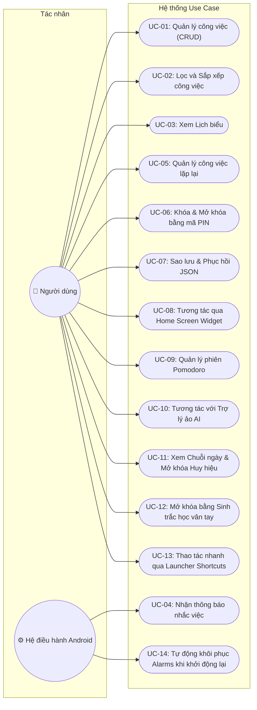

*Hình 2.1. Sơ đồ Use Case tổng quát*

## 2.3. Thiết kế kiến trúc phần mềm

### 2.3.1. Kiến trúc MVVM

Ứng dụng áp dụng kiến trúc Model — View — ViewModel (MVVM) theo hướng dẫn chính thức của Google cho phát triển ứng dụng Android. Luồng phụ thuộc một chiều từ ngoài vào trong:

<a id="hinh-22"></a>

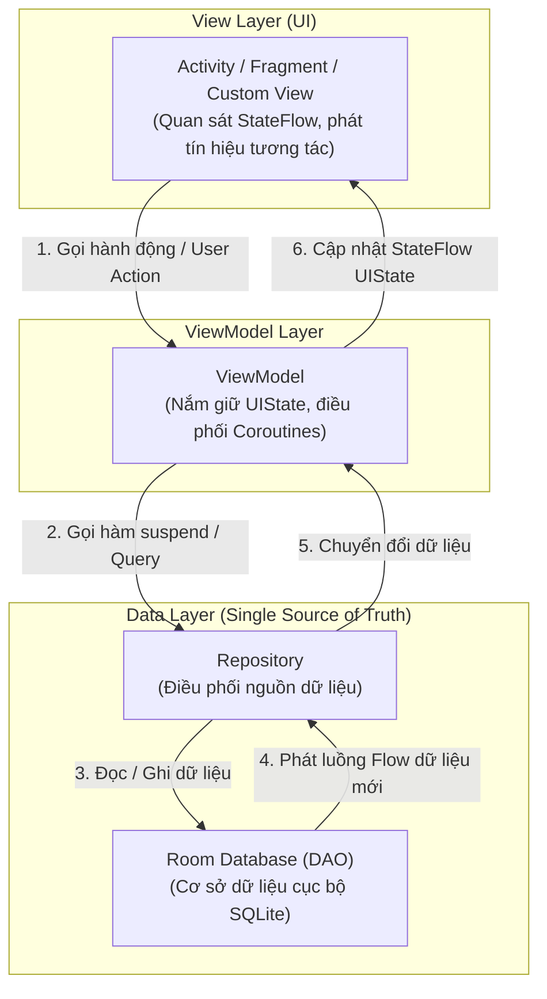

*Hình 2.2. Luồng kiến trúc*

Sơ đồ kiến trúc của hệ thống:

<a id="hinh-23"></a>

```mermaid
graph TB
    subgraph "📱 View Layer (UI)"
        MainActivity["MainActivity (BottomNav 5 Tab)"]
        TaskListFrag["TaskListFragment"]
        CalendarFrag["CalendarFragment"]
        PomodoroFrag["PomodoroFragment"]
        StreakFrag["StreakFragment (Badges)"]
        StatsFrag["StatsFragment"]
        AddEditAct["AddEditTaskActivity"]
        TaskDetailAct["TaskDetailActivity"]
        PinLockAct["PinLockActivity"]
        AiBottomDialog["AiAssistantBottomSheet"]
        WidgetProvider["TaskWidgetProvider"]
    end

    subgraph "🧠 ViewModel Layer"
        TaskVM["TaskViewModel"]
        CalendarVM["CalendarViewModel"]
        PomodoroVM["PomodoroViewModel"]
        StatsVM["StatsViewModel"]
        TaskAssistantVM["TaskAssistantViewModel"]
        AddEditVM["AddEditTaskViewModel"]
        BackupVM["BackupViewModel"]
    end

    subgraph "📦 Repository Layer"
        TaskRepo["TaskRepository"]
        PomodoroRepo["PomodoroRepository"]
        BackupRepo["BackupRepository"]
        PinRepo["PinRepository"]
    end

    subgraph "💾 Data Layer (Local Persistence)"
        AppDB[("AppDatabase (Room v4)")]
        TaskDao["TaskDao"]
        PomodoroDao["PomodoroDao"]
        Prefs["SharedPreferences (Salted PIN)"]
        SAF["Storage Access Framework (JSON)"]
    end

    subgraph "⚙️ OS Background Services & Receivers"
        AlarmSched["AlarmScheduler"]
        BootRecv["BootReceiver"]
        TimeRecv["TimeChangeReceiver"]
        PomoService["PomodoroService (Foreground)"]
        StreakRecv["StreakReminderReceiver"]
        GeminiClient["AiTaskAssistant (Firebase Gemini)"]
    end

    TaskListFrag & CalendarFrag & TaskDetailAct --> TaskVM
    CalendarFrag --> CalendarVM
    PomodoroFrag --> PomodoroVM
    StreakFrag & StatsFrag --> StatsVM
    AiBottomDialog --> TaskAssistantVM
    AddEditAct --> AddEditVM
    PinLockAct --> PinRepo

    TaskVM & CalendarVM & AddEditVM --> TaskRepo
    PomodoroVM --> PomodoroRepo
    StatsVM --> TaskRepo & PomodoroRepo
    TaskAssistantVM --> TaskRepo & GeminiClient

    TaskRepo --> TaskDao --> AppDB
    PomodoroRepo --> PomodoroDao --> AppDB
    BackupRepo --> TaskDao & PomodoroDao & SAF
    PinRepo --> Prefs

    TaskRepo -.->|Trigger Alarm| AlarmSched
    AlarmSched -.-> BootRecv & TimeRecv
    PomodoroVM -.->|Start/Stop| PomoService
    StatsVM -.->|Schedule Reminder| StreakRecv
```

*Hình 2.3. Sơ đồ kiến trúc MVVM của Task Management App*

### 2.3.2. View Layer

Tầng View chịu trách nhiệm hiển thị và tiếp nhận tương tác. Trong dự án, tầng này gồm:

Activity: MainActivity (khung điều hướng chính chứa NavHost), TaskDetailActivity, AddEditTaskActivity (kế thừa BaseActivity), ImportActivity.

Fragment: TaskListFragment, CalendarFragment, StatsFragment, DataManagementFragment, SettingsFragment, PomodoroFragment, PomodoroSettingsFragment và các bottom sheet (FilterBottomSheet, PomodoroTaskSelectorBottomSheet, DeleteTaskDialogFragment).

Adapter: TaskAdapter, UpcomingTaskAdapter, CalendarScheduleAdapter, PomodoroTaskAdapter.

Custom View: WeeklyProductivityChartView, CircularCompletionRateView, PomodoroProgressRingView.

Nguyên tắc thiết kế của tầng View trong dự án:

Không truy vấn cơ sở dữ liệu. Activity/Fragment không gọi DAO; mọi truy vấn đi qua ViewModel và Repository.

Không chứa logic nghiệp vụ. Ví dụ trong phân hệ Pomodoro, tầng UI hoàn toàn không có bộ đếm thời gian riêng, không dùng Handler, CountDownTimer hay postDelayed; giao diện chỉ hiển thị trạng thái do engine phát ra và gửi lệnh tới Service.

Sử dụng ViewBinding. Mọi layout đều được truy cập thông qua lớp binding do ViewBinding sinh ra, loại bỏ findViewById và hạn chế lỗi tham chiếu sai kiểu view.

Giao tiếp giữa các Fragment bằng Fragment Result API. Các bottom sheet trả kết quả về Fragment cha thông qua setFragmentResult / setFragmentResultListener, đảm bảo dữ liệu không bị mất khi xoay màn hình (thay vì dùng callback lambda).

### 2.3.3. ViewModel Layer

ViewModel giữ trạng thái của màn hình và cung cấp cho View những luồng dữ liệu bất biến. Đặc điểm triển khai trong dự án:

Trạng thái UI được biểu diễn bằng StateFlow (hoặc MutableStateFlow nội bộ). View collect trong repeatOnLifecycle(STARTED) để tự động dừng khi màn hình không còn hiển thị.

ViewModel không giữ Context của Activity. Khi cần Context (ví dụ để đọc SharedPreferences), ViewModel dùng AndroidViewModel và lấy applicationContext.

ViewModel khởi tạo Repository thông qua Factory (ViewModelProvider.Factory) để không phụ thuộc trực tiếp vào cơ sở dữ liệu.

Các sự kiện một lần (ví dụ thông báo Snackbar) được mô hình hóa bằng đối tượng trạng thái và có hàm onNoticeShown() để đánh dấu đã tiêu thụ, tránh hiển thị lặp lại sau khi cấu hình thay đổi.

Các logic tính toán thuần (ví dụ tính tỷ lệ hoàn thành, chọn công việc hiển thị, quyết định hành vi khi mở màn hình Pomodoro từ màn hình chi tiết) được tách thành hàm thuần có thể gọi trực tiếp trong unit test.

### 2.3.4. Model / Data Layer

Tầng dữ liệu gồm ba thành phần:

Entity: các lớp dữ liệu ánh xạ tới bảng trong SQLite, đặt trong package data/local/entity. Dự án có Task và PomodoroSession.

DAO: giao diện khai báo truy vấn, đặt trong package data/local/dao. Bao gồm TaskDao và PomodoroDao. Quy ước trong dự án: hàm ghi là suspend, hàm đọc một lần là suspend getX(), hàm đọc liên tục trả về Flow và có tiền tố observeX().

TypeConverters: chuyển đổi enum và các kiểu phức tạp sang kiểu lưu trữ được (chuỗi/số) để Room có thể lưu trữ.

### 2.3.5. Repository Pattern

Repository là lớp duy nhất được phép truy cập DAO. Trong dự án, Repository được cài đặt dưới dạng lớp thuần (plain class) nhận DAO qua hàm khởi tạo, không cần interface trừu tượng, nhưng vẫn đảm bảo vai trò tách biệt tầng:

<a id="bang-25"></a>

*Bảng 2.5. Các Repository và trách nhiệm chính*

| Repository | Trách nhiệm chính |
| :--- | :--- |
| TaskRepository | Cổng truy cập công việc: CRUD, lọc, tìm kiếm, thống kê số lượng, các truy vấn theo ngày |
| PomodoroRepository | Cổng truy cập phiên Pomodoro: ghi phiên hoàn thành kèm cộng dồn số liệu, các truy vấn thống kê theo ngày/tuần/công việc, tính biên thời gian ngày/tuần |
| PomodoroSettingsRepository | Đọc/ghi cấu hình Pomodoro trong SharedPreferences; kiểm tra và chuẩn hóa giá trị hợp lệ |
| BackupRepository | Xuất/nhập dữ liệu JSON qua Storage Access Framework; kiểm tra tính hợp lệ; khôi phục dữ liệu trong transaction |
| PinRepositoryImpl | Lưu và xác thực mã PIN bằng cơ chế băm SHA-256 kèm Salt |


Lợi ích của lớp Repository trong dự án:

Một nguồn sự thật duy nhất (Single Source of Truth): ViewModel không biết dữ liệu đến từ bảng nào; nó chỉ biết mình cần "danh sách công việc đã lọc".

Tập trung logic dữ liệu: các suy diễn như "chỉ tính phiên tập trung đã hoàn thành" được viết một lần trong Repository.

Dễ kiểm thử: Repository nhận DAO qua tham số, nên có thể thay bằng DAO giả trong unit test mà không cần thiết bị Android.

## 2.4. Thiết kế cơ sở dữ liệu

### 2.4.1. Room Database

Ứng dụng sử dụng Room Persistence Library — lớp trừu tượng (ORM) chính thức của Android Jetpack nằm trên SQLite. Room được lựa chọn vì ba lý do chính:

Kiểm tra câu truy vấn tại thời điểm biên dịch. Các câu SQL trong @Query được Room đối chiếu với lược đồ thực tế khi build; nếu sai tên bảng, sai tên cột hoặc sai kiểu dữ liệu, quá trình biên dịch sẽ thất bại thay vì phát sinh lỗi lúc chạy.

Bất đồng bộ tích hợp sẵn. Room hỗ trợ trực tiếp hàm suspend và Flow, giúp truy vấn chạy trên luồng nền và phát dữ liệu mới mỗi khi bảng thay đổi — không cần cơ chế "làm mới" thủ công.

An toàn về kiểu dữ liệu. Room ánh xạ cột sang thuộc tính Kotlin và ngược lại, giảm mạnh việc phải đọc Cursor bằng chỉ số cột.

Cơ sở dữ liệu của ứng dụng có tên task_management_db, hiện ở phiên bản 4. Cấu hình cơ sở dữ liệu:

Không dùng fallbackToDestructiveMigration(): mọi bước nâng version đều phải có migration tường minh. Nếu thiếu migration, ứng dụng sẽ báo lỗi thay vì âm thầm xóa sạch dữ liệu người dùng.

TaskDao và PomodoroDao cùng dùng chung một đối tượng cơ sở dữ liệu, nhờ đó có thể ghi nhiều bảng trong một transaction.

TypeConverters chuyển đổi các enum (Priority, TaskStatus, RecurrenceType, SessionType) sang chuỗi ký tự khi lưu, giúp dữ liệu đọc được bằng công cụ ngoài và không phụ thuộc thứ tự khai báo enum.

### 2.4.2. Thực thể Task

*Bảng tasks lưu trữ toàn bộ công việc của người dùng.*

<a id="bang-26"></a>

*Bảng 2.6. Cấu trúc bảng “tasks” trong cơ sở dữ liệu Room*

| Tên cột | Kiểu dữ liệu | Ràng buộc | Ý nghĩa |
| :--- | :--- | :--- | :--- |
| id | INTEGER | Khóa chính, tự tăng | Mã định danh công việc |
| title | TEXT | NOT NULL | Tiêu đề công việc (bắt buộc) |
| description | TEXT | NOT NULL | Mô tả chi tiết; lưu chuỗi rỗng nếu người dùng bỏ trống |
| dueDate | INTEGER | NOT NULL | Ngày hết hạn dưới dạng mốc thời gian, chuẩn hóa về 00:00:00 của ngày |
| dueTime | INTEGER | NOT NULL | Mốc thời gian đầy đủ (ngày + giờ) dùng để lập lịch nhắc |
| priority | TEXT | NOT NULL | Độ ưu tiên: HIGH, MEDIUM, LOW, URGENT |
| status | TEXT | NOT NULL | Trạng thái: TODO, IN_PROGRESS, COMPLETED, OVERDUE |
| isComplete | INTEGER | NOT NULL | Cờ hoàn thành dạng 0/1 phục vụ truy vấn nhanh và widget |
| isRecurring | INTEGER | NOT NULL | Đánh dấu công việc có lặp lại hay không |
| recurrenceType | TEXT | NOT NULL | Quy tắc lặp: NONE, DAILY, WEEKLY, MONTHLY, YEARLY |
| recurrenceInterval | INTEGER | NOT NULL | Khoảng cách giữa hai lần lặp (ví dụ mỗi 2 tuần) |
| reminderMinutes | INTEGER | NOT NULL | Số phút nhắc trước hạn |
| repeatEndDate | INTEGER | NOT NULL | Mốc kết thúc chuỗi lặp (0 nếu không giới hạn) |
| repeatLimitCount | INTEGER | NOT NULL | Giới hạn số lần lặp (0 nếu không giới hạn) |
| currentOccurrence | INTEGER | NOT NULL | Lần lặp hiện tại, bắt đầu từ 1 |
| isPaused | INTEGER | NOT NULL | Chuỗi lặp đang bị tạm dừng hay không |
| createdAt | INTEGER | NOT NULL | Thời điểm tạo bản ghi |
| updatedAt | INTEGER | NOT NULL | Thời điểm cập nhật gần nhất; dùng làm mốc thời gian cho thống kê |
| estimatedPomodoros | INTEGER | NOT NULL, DEFAULT 0 | Số phiên tập trung dự kiến dành cho công việc |
| completedPomodoros | INTEGER | NOT NULL, DEFAULT 0 | Số phiên tập trung đã hoàn thành cho công việc |
| totalFocusTimeMinutes | INTEGER | NOT NULL, DEFAULT 0 | Tổng số phút tập trung tích lũy cho công việc |


Ghi chú thiết kế: Dự án dùng hai trường thời gian song song. Trường dueDate được chuẩn hóa về đầu ngày để phục vụ truy vấn theo ngày và hiển thị lịch; trường dueTime giữ mốc thời gian đầy đủ để lập lịch nhắc chính xác. Nhờ tách hai trường, việc so sánh "công việc này thuộc ngày nào" và "nhắc lúc mấy giờ" đều rõ ràng và không phải suy diễn từ một trường duy nhất.

### 2.4.3. Thực thể PomodoroSession

*Bảng pomodoro_sessions lưu lịch sử các phiên tập trung và nghỉ của kỹ thuật Pomodoro.*

<a id="bang-27"></a>

*Bảng 2.7. Cấu trúc bảng pomodoro_sessions trong cơ sở dữ liệu Room*

| Tên cột | Kiểu dữ liệu | Ràng buộc | Ý nghĩa |
| :--- | :--- | :--- | :--- |
| id | INTEGER | Khóa chính, tự tăng | Mã định danh phiên |
| taskId | INTEGER | NOT NULL, khóa ngoại → tasks(id), ON DELETE CASCADE | Công việc mà phiên tập trung phục vụ |
| startTime | INTEGER | NOT NULL | Thời điểm bắt đầu phiên |
| endTime | INTEGER | NOT NULL | Thời điểm kết thúc phiên |
| durationInMinutes | INTEGER | NOT NULL | Thời lượng phiên (phút) |
| sessionType | TEXT | NOT NULL | Loại phiên: FOCUS, SHORT_BREAK, LONG_BREAK |
| isCompleted | INTEGER | NOT NULL | Phiên chạy hết thời lượng (1) hay bị ngắt giữa chừng (0) |


Chỉ mục (index) được tạo trên taskId và startTime:

Chỉ mục taskId tăng tốc các truy vấn theo công việc và hỗ trợ kiểm tra khóa ngoại.

Chỉ mục startTime tăng tốc các truy vấn thống kê theo khoảng thời gian (hôm nay, tuần này).

Ràng buộc ON DELETE CASCADE đảm bảo khi người dùng xóa một công việc, toàn bộ lịch sử phiên tập trung của công việc đó cũng bị xóa theo, do đó không bao giờ tồn tại bản ghi "mồ côi" trong cơ sở dữ liệu.

<a id="hinh-24"></a>

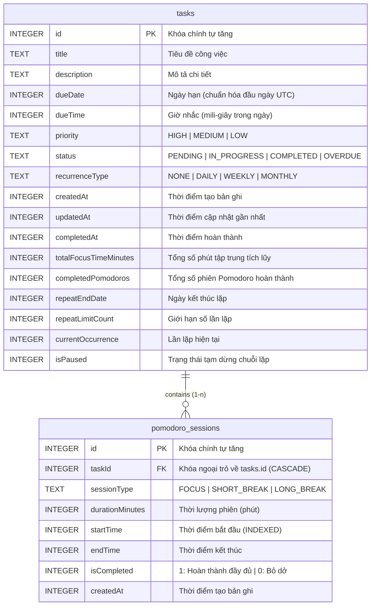

*Hình 2.4. Sơ đồ quan hệ thực thể (ERD) giữa tasks và pomodoro_sessions*

### 2.4.4. TaskDao và PomodoroDao

<a id="bang-28"></a>

*Bảng 2.8. Danh sách các DAO và phạm vi truy vấn*

| DAO | Nhóm truy vấn | Ví dụ truy vấn tiêu biểu |
| :--- | :--- | :--- |
| TaskDao | CRUD cơ bản | Chèn, cập nhật, xóa một hoặc nhiều bản ghi; xóa toàn bộ bảng |
| TaskDao | Truy vấn tổng hợp | Lấy tất cả công việc theo hạn tăng dần; đếm số công việc đã hoàn thành; lấy công việc theo khoảng ngày |
| TaskDao | Truy vấn lọc nâng cao | getFilteredTasks kết hợp lọc theo trạng thái, độ ưu tiên, khoảng ngày và điều kiện quá hạn trong một câu lệnh |
| TaskDao | Truy vấn công việc lặp | Lấy các công việc chưa hoàn thành cùng tiêu đề và quy tắc lặp; xóa các công việc lặp trong tương lai |
| TaskDao | Truy vấn phục vụ widget | Lấy công việc theo khoảng ngày dạng đồng bộ (suspend) để widget đọc dữ liệu nhanh |
| TaskDao | Truy vấn transaction | insertBatch cho import JSON và khôi phục dữ liệu hàng loạt |
| PomodoroDao | Ghi phiên | Chèn một phiên, chèn nhiều phiên, xóa phiên theo công việc, xóa toàn bộ |
| PomodoroDao | Ghi phiên hoàn thành | recordCompletedSession ghi phiên và cộng dồn số liệu vào công việc trong cùng một transaction |
| PomodoroDao | Truy vấn theo công việc | Đếm số phiên tập trung hoàn thành, tổng số phút tập trung của một công việc |
| PomodoroDao | Truy vấn thống kê theo khoảng | Tổng số phút tập trung, số phiên hoàn thành, nhóm theo công việc |
| PomodoroDao | Truy vấn xuất dữ liệu | Lấy toàn bộ phiên để đưa vào tệp sao lưu JSON |


### 2.4.5. Migration và nâng cấp lược đồ

Dữ liệu người dùng là tài sản quan trọng nhất của ứng dụng quản lý công việc, vì vậy mọi thay đổi lược đồ đều được thực hiện bằng migration tường minh.

<a id="bang-29"></a>

*Bảng 2.9. Bảng đối chiếu version cơ sở dữ liệu và migration*

| Version | Thay đổi lược đồ | Migration | Ghi chú |
| :--- | :--- | :--- | :--- |
| 1 | Phiên bản đầu tiên: bảng tasks cơ bản | — | Lưu công việc với tiêu đề, mô tả, hạn, ưu tiên, trạng thái |
| 2 | Bổ sung cột reminderMinutes | MIGRATION_1_2 | Thêm cột bằng ALTER TABLE … ADD COLUMN … DEFAULT 0, dữ liệu cũ giữ nguyên |
| 3 | Bổ sung nhóm cột công việc lặp nâng cao: repeatEndDate, repeatLimitCount, currentOccurrence, isPaused | MIGRATION_2_3 | Thêm cột với giá trị mặc định hợp lý (currentOccurrence mặc định 1) |
| 4 | Bổ sung bảng pomodoro_sessions (kèm khóa ngoại, hai chỉ mục) và ba cột theo dõi Pomodoro trên tasks | MIGRATION_3_4 | Tạo bảng bằng CREATE TABLE IF NOT EXISTS; thêm cột bằng kỹ thuật "chỉ thêm nếu chưa tồn tại" |


Điểm đáng chú ý về mặt kỹ thuật: trong quá trình phát triển song song nhiều nhánh tính năng, số hiệu version 3 từng được dùng cho hai lược đồ khác nhau. Nhóm đã xử lý triệt để bằng cách nâng lên version 4 và viết migration tự bảo vệ: trước mỗi lệnh ALTER TABLE, hệ thống đọc PRAGMA table_info để kiểm tra cột đã tồn tại hay chưa, nhờ đó migration chạy đúng với cả hai trạng thái cơ sở dữ liệu cũ và không bao giờ gặp lỗi "duplicate column name". Tất cả các đường nâng cấp (từ version 1, 2, 3 lên version 4) đều được kiểm chứng lại trên SQLite trước khi phát hành.

## 2.5. Thiết kế các luồng xử lý

### 2.5.1. Luồng tạo / sửa / xóa công việc

<a id="hinh-25"></a>

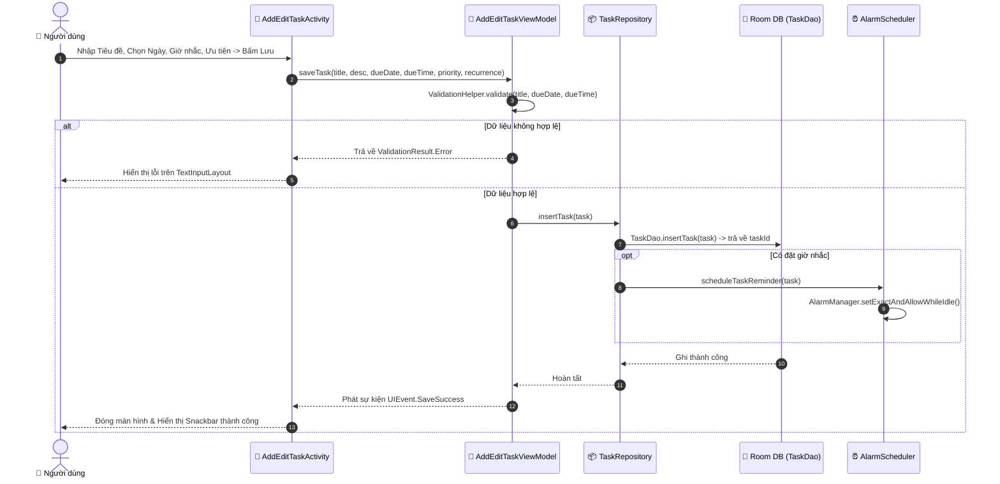

*Hình 2.5. Sơ đồ luồng xử lý tạo / sửa / xóa công việc*

Mô tả chi tiết:

Người dùng mở AddEditTaskActivity. Nếu là chế độ sửa, ViewModel nạp công việc theo id và đổ dữ liệu vào form.

Khi người dùng bấm lưu, ViewModel kiểm tra ràng buộc (tiêu đề không rỗng, ngày hạn hợp lệ) thông qua ValidationHelper; nếu không hợp lệ, ViewModel phát trạng thái lỗi để View tô viền đỏ và hiển thị thông báo.

Nếu hợp lệ, ViewModel gọi Repository để chèn hoặc cập nhật. Trường updatedAt được cập nhật để phục vụ thống kê.

Sau khi ghi dữ liệu thành công, hệ thống lập lịch nhắc (nếu công việc có thời điểm nhắc) thông qua AlarmScheduler.

Khi xóa công việc, quy trình bắt buộc là hủy thông báo và hủy lịch nhắc trước, sau đó mới xóa bản ghi. Trình tự này ngăn tình trạng thông báo của một công việc không còn tồn tại vẫn xuất hiện.

Vì màn hình danh sách quan sát Flow từ Room, danh sách tự động cập nhật mà không cần tải lại.

### 2.5.2. Luồng thông báo nhắc việc

<a id="hinh-26"></a>

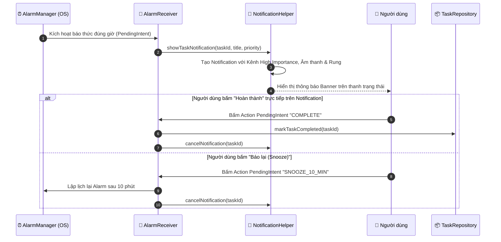

*Hình 2.6. Sơ đồ luồng thông báo nhắc việc*

Các điểm kỹ thuật quan trọng:

Mã thông báo: mỗi công việc dùng chính taskId làm mã thông báo, vì taskId luôn dương. Các thông báo thường trực của tính năng hệ thống (Pomodoro) dùng dải mã âm để không bao giờ ghi đè thông báo nhắc việc.

Quyền thông báo: trên Android 13 trở lên, NotificationPermissionManager kiểm tra và yêu cầu quyền POST_NOTIFICATIONS tại thời điểm phù hợp; nếu người dùng từ chối, ứng dụng hiển thị trạng thái "thông báo đang tắt" thay vì im lặng thất bại.

Hẹn giờ chính xác: ứng dụng ưu tiên setExactAndAllowWhileIdle. Nếu hệ thống không cho phép hẹn giờ chính xác (người dùng chưa cấp quyền), hệ thống tự động chuyển sang phương án hẹn giờ không chính xác tuyệt đối để vẫn đảm bảo có nhắc nhở.

PendingIntent bất biến: mọi PendingIntent đều dùng cờ FLAG_IMMUTABLE theo yêu cầu bắt buộc từ Android 12, kèm FLAG_CANCEL_CURRENT khi cần làm mới.

### 2.5.3. Luồng khôi phục nhắc nhở sau khi khởi động lại

<a id="hinh-27"></a>

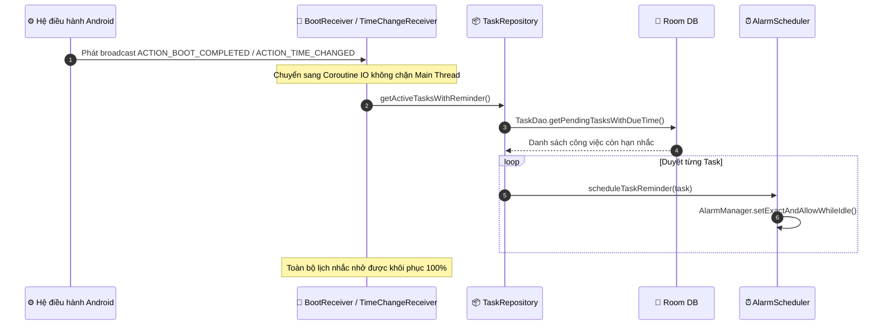

*Hình 2.7. Sơ đồ luồng khôi phục nhắc nhở sau khi khởi động lại*

Vì AlarmManager không lưu lịch hẹn qua các lần khởi động lại thiết bị, nếu không có cơ chế này thì toàn bộ nhắc nhở sẽ biến mất sau khi người dùng tắt máy — một trong những lỗi phổ biến của các ứng dụng nhắc việc viết không đúng chuẩn.

### 2.5.4. Luồng xác thực mã PIN

<a id="hinh-28"></a>

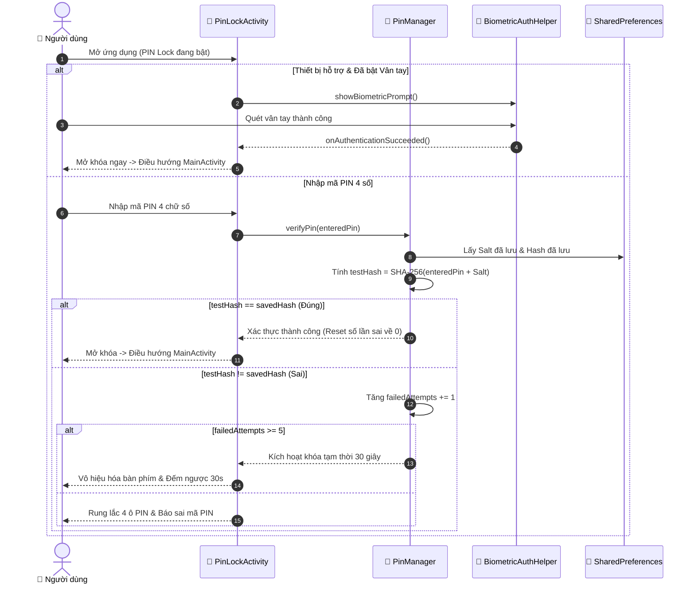

*Hình 2.8. Sơ đồ luồng xác thực mã PIN*

Điểm cốt lõi của luồng này là PIN không bao giờ được lưu ở dạng văn bản thuần. Khi người dùng tạo PIN, hệ thống sinh một chuỗi Salt ngẫu nhiên, lưu Salt, rồi lưu hash SHA-256(PIN + Salt). Khi xác thực, hệ thống băm lại PIN người dùng vừa nhập cùng Salt đã lưu và so sánh hai giá trị hash. Vì hàm băm mật mã là hàm một chiều, kể cả khi kẻ tấn công trích xuất được dữ liệu lưu trữ, họ cũng không thể suy ngược ra PIN gốc.

### 2.5.5. Luồng Backup và Restore

<a id="hinh-29"></a>

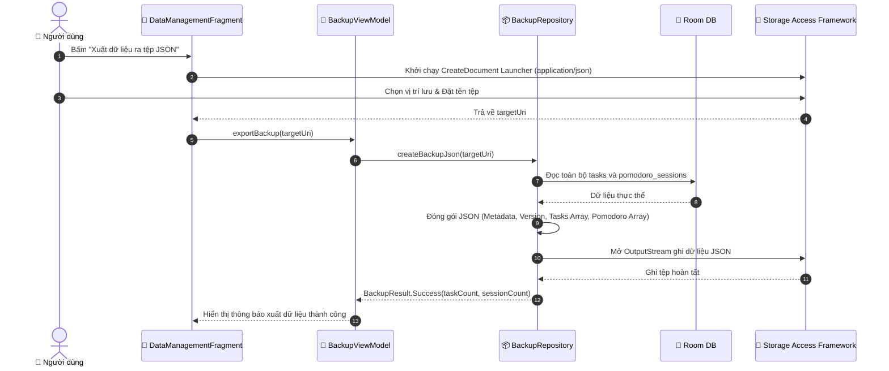

*Hình 2.9. Sơ đồ luồng Backup JSON*

<a id="hinh-210"></a>

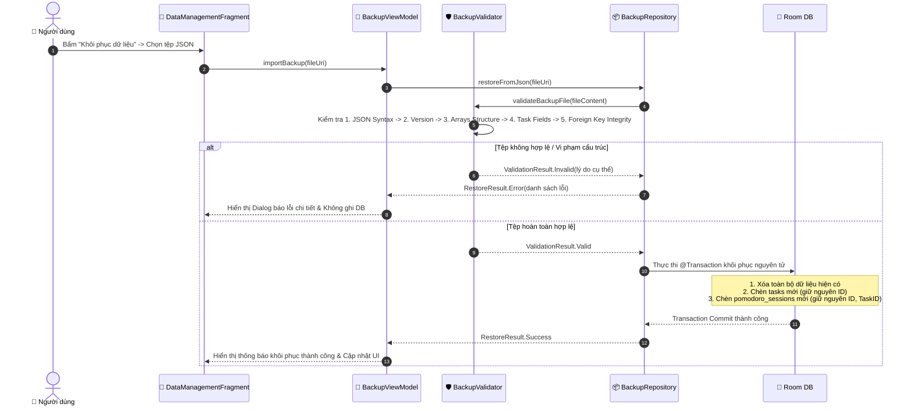

*Hình 2.10. Sơ đồ luồng Restore JSON*

Quy trình khôi phục được thiết kế theo nguyên tắc kiểm tra trước, ghi sau và tất cả hoặc không có gì:

Đọc nội dung tệp qua ContentResolver từ URI do người dùng chọn.

Kiểm tra tính hợp lệ trước khi chạm vào cơ sở dữ liệu (chi tiết trong 2.5.5.1).

Nếu hợp lệ, thực hiện toàn bộ việc ghi trong một transaction duy nhất: xóa dữ liệu hiện có, chèn lại danh sách công việc (giữ nguyên id), chèn lại lịch sử phiên Pomodoro (giữ nguyên id và taskId).

Nếu bất kỳ bước nào lỗi, transaction bị hủy (rollback), cơ sở dữ liệu trở về trạng thái trước khi khôi phục; người dùng nhận thông báo lỗi thay vì dữ liệu bị hỏng một nửa.

<a id="bang-210"></a>

*Bảng 2.10. Các bước kiểm tra tính hợp lệ của tệp sao lưu*

| STT | Nhóm kiểm tra | Nội dung |
| :--- | :--- | :--- |
| 1 | Cú pháp | Nội dung tệp phải là JSON hợp lệ và là một đối tượng (object) ở mức gốc |
| 2 | Phiên bản | Trường version phải là số nguyên dương và không lớn hơn phiên bản định dạng mà ứng dụng hiện hỗ trợ |
| 3 | Công việc | Mỗi công việc phải có id dương, tiêu đề không rỗng, dueDate dương, các enum hợp lệ, các bộ đếm Pomodoro không âm; id không được trùng nhau |
| 4 | Phiên tập trung | Mỗi phiên phải có id dương, startTime dương, endTime không nhỏ hơn startTime, durationInMinutes trong khoảng hợp lệ, sessionType thuộc tập giá trị cho phép, isCompleted là giá trị boolean |
| 5 | Toàn vẹn khóa ngoại | Mọi taskId của phiên tập trung phải tồn tại trong danh sách công việc của chính tệp đó |
| 6 | Tính nhất quán | Số lượng khai báo (taskCount, pomodoroSessionCount) phải khớp với số phần tử thực tế |


Nếu bất kỳ kiểm tra nào thất bại, hệ thống không ghi gì vào cơ sở dữ liệu và hiển thị danh sách lỗi cụ thể để người dùng biết tệp sai ở đâu.

### 2.5.6. Luồng Home Screen Widget

<a id="hinh-211"></a>

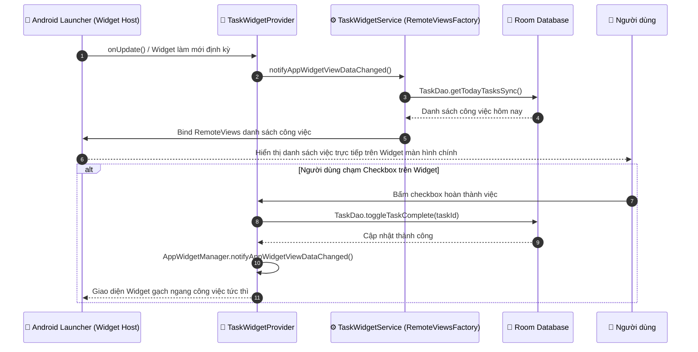

*Hình 2.11. Sơ đồ luồng Home Screen Widget*

Cơ chế đáng chú ý: ứng dụng đăng ký một InvalidationTracker.Observer cho bảng tasks ở tầng Application. Nhờ đó, mọi thay đổi dữ liệu công việc — dù xuất phát từ ứng dụng hay từ chính widget — đều kích hoạt cập nhật lại tất cả widget đang hiển thị trên màn hình chính, đảm bảo widget không bao giờ hiển thị dữ liệu cũ.

### 2.5.7. Luồng quản lý phiên tập trung Pomodoro

<a id="hinh-212"></a>

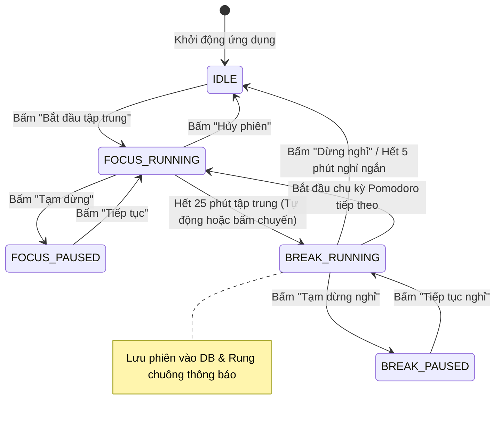

*Hình 2.12. Sơ đồ máy trạng thái của Pomodoro Timer*

Luồng vận hành:

Khi người dùng bắt đầu, PomodoroTimerController cấp phát engine dùng chung cho toàn ứng dụng và PomodoroService được khởi động dưới dạng Foreground Service, kèm một thông báo thường trực hiển thị thời gian còn lại.

Engine không đếm lùi bằng cách trừ dần một biến. Thay vào đó, khi phiên bắt đầu, engine tính targetEndElapsedRealtime = SystemClock.elapsedRealtime() + thời lượng, rồi mỗi nhịp chỉ so sánh thời gian hiện tại với mốc đích. Cách làm này loại bỏ hoàn toàn sai số tích lũy và vẫn đúng khi màn hình tắt hoặc ứng dụng bị tạm dừng.

Ticker cập nhật mỗi giây được đồng bộ với mốc giây của đồng hồ hệ thống để giao diện nhảy số đều. Vì engine chỉ được truy cập từ một luồng duy nhất, không có tranh chấp dữ liệu giữa các nguồn lệnh.

Khi phiên kết thúc, engine phát ra một bản ghi phiên. Một lớp chống trùng (PomodoroCompletionTracker) bảo đảm mỗi lần kết thúc dù được phát hiện từ vòng lặp tick, từ alarm đánh thức khi máy ngủ sâu, hay từ lệnh trên thông báo — đều chỉ được xử lý đúng một lần.

Bản ghi phiên hoàn thành được lưu vào bảng pomodoro_sessions, đồng thời cộng dồn completedPomodoros và totalFocusTimeMinutes cho công việc tương ứng — cả hai thao tác nằm trong cùng một transaction.

### 2.5.8. Luồng xử lý lệnh thông minh bằng Trợ lý ảo AI

Phân hệ Trợ lý ảo AI kết hợp xử lý ngôn ngữ tự nhiên cục bộ (NLP Regex / Tokenizer) và mô hình ngôn ngữ lớn Google Gemini 2.5 Flash trên Firebase để phân tích ý định người dùng một cách chính xác:

1. Khởi động và Xác thực dịch vụ: Khi ứng dụng khởi chạy, TaskApplication khởi tạo FirebaseAppCheck với PlayIntegrity / DebugAppCheckProviderFactory để lấy token xác thực hợp lệ.

2. Tiếp nhận câu lệnh: Người dùng nhập văn bản hoặc chọn gợi ý hành động trong AiAssistantBottomSheet.

3. Phân tích cú pháp Intent (TaskCommandParser): Hệ thống phân tích văn bản để phát hiện mẫu câu lệnh có cấu trúc (ví dụ: 'thêm việc [tên] lúc [giờ] ưu tiên [cao/trung bình/thấp]', 'hôm nay có việc gì', 'có bao nhiêu việc quá hạn').

4. Gọi mô hình Gemini AI (Fallback / Xử lý câu hỏi tự do): Với các câu hỏi phức tạp hoặc yêu cầu lời khuyên sắp xếp công việc, hệ thống gửi ngữ cảnh danh sách task tới Google Gemini qua AiTaskAssistant để sinh phản hồi tự nhiên.

5. Thực thi nghiệp vụ: Nếu là lệnh tạo việc, TaskAssistantViewModel tự động gọi TaskRepository.insertTask(), cập nhật cơ sở dữ liệu Room và phát thông báo phản hồi thành công trên giao diện chat.

### 2.5.9. Luồng tính toán chuỗi ngày và thông báo bảo vệ Streak

Hệ thống Gamification vận hành tự động dựa trên mốc thời gian hoàn thành công việc của người dùng:

1. Ghi nhận thời điểm: Mỗi khi một công việc được đánh dấu hoàn thành (toggle complete), StreakCalculator lấy thời điểm hiện tại và tập hợp lịch sử các ngày có task hoàn thành.

2. Tính toán chuỗi liên tục: Thuật toán kiểm tra khoảng cách giữa ngày hoàn thành gần nhất và ngày hiện tại. Nếu liên tiếp các ngày trước đó đều có ít nhất 1 task hoàn thành, currentStreak tăng thêm 1; nếu bị gián đoạn quá 1 ngày, currentStreak được đặt lại về 1.

3. Kiểm tra điều kiện mở khóa 7 Huy hiệu: SpecialBadgeCalculator đối chiếu dữ liệu với 7 tiêu chí: Early Bird (hoàn thành trước 8:00 sáng), Night Owl (hoàn thành sau 22:00 đêm), Weekend Warrior (hoàn thành vào thứ 7 / Chủ nhật), Pomodoro Master (hoàn thành mốc phiên tập trung), Century Club (tổng 100 task hoàn thành), Consistency King (chuỗi 30 ngày), Speed Demon.

4. Lập lịch bảo vệ chuỗi: Hàng ngày, StreakReminderScheduler lên lịch thông báo qua StreakReminderReceiver vào khung giờ cài đặt (mặc định 20:00 tối). Nếu người dùng chưa hoàn thành task nào trong ngày, thông báo cảnh báo sẽ nhắc nhở người dùng hành động để giữ vững chuỗi.

### 2.5.10. Luồng xác thực sinh trắc học vân tay và bảo vệ màn hình khởi chạy từ Shortcut

Nhằm tối ưu hóa trải nghiệm người dùng nhưng vẫn đảm bảo an toàn tuyệt đối cho dữ liệu:

1. Mở khóa bằng Sinh trắc học: Khi ứng dụng được mở và mã PIN đang bật, PinLockActivity tự động kiểm tra BiometricAuthHelper.isBiometricAvailable(). Nếu người dùng đã kích hoạt vân tay trong Cài đặt, BiometricPrompt lập tức hiển thị. Quét vân tay thành công sẽ mở khóa ngay lập tức mà không cần nhập 4 chữ số.

2. Bất biến an toàn (Security Invariant): Khi người dùng đổi mã PIN, tắt bảo vệ PIN hoặc thiết lập lại, hệ thống tự động vô hiệu hóa tính năng mở khóa vân tay (isBiometricEnabled = false). Điều này ngăn chặn trường hợp người khác cầm máy đổi PIN nhưng vẫn giữ vân tay cũ.

3. Bảo vệ Activity mở từ Launcher Shortcut: Khi người dùng nhấn phím tắt 'Tạo công việc' hoặc 'Xem hôm nay' từ màn hình chính, Intent được gửi đến AddEditTaskActivity hoặc MainActivity. Vì AddEditTaskActivity và MainActivity đều kế thừa từ BaseActivity, cơ chế kiểm tra requiresPinUnlock() được kích hoạt ngay trong onResume(), buộc người dùng phải xác thực PIN / Vân tay trước khi truy cập nội dung.

## 2.6. Kết luận chương

Chương 2 đã hoàn thành hai nhiệm vụ chính: phân tích yêu cầu và thiết kế hệ thống.

Về phân tích: chương đã chuyển 11 yêu cầu bắt buộc của đề bài thành 20 yêu cầu chức năng có mã định danh (FR-01 đến FR-20) và 14 yêu cầu phi chức năng (NFR-01 đến NFR-14), xác định ba tác nhân và 13 Use Case của hệ thống.

Về thiết kế: chương đã trình bày kiến trúc MVVM với ba tầng rõ ràng (View — ViewModel — Data), mô tả trách nhiệm từng tầng, vai trò của Repository Pattern; thiết kế cơ sở dữ liệu gồm hai bảng tasks và pomodoro_sessions với khóa ngoại, chỉ mục, quy tắc migration; và đặc tả bảy luồng xử lý chính gồm quản lý công việc, thông báo, khôi phục nhắc nhở, xác thực PIN, sao lưu/khôi phục, widget và phiên tập trung Pomodoro.

Các thiết kế này là cơ sở trực tiếp để hiện thực mã nguồn ở Chương 3 và là tiêu chí để xây dựng bộ kiểm thử ở Chương 4.

# CHƯƠNG 3. HIỆN THỰC HỆ THỐNG VÀ CÁC TÍNH NĂNG

## 3.1. Môi trường phát triển

<a id="bang-31"></a>

*Bảng 3.1. Môi trường phát triển của dự án*

| Thành phần | Phiên bản / Thông số | Ghi chú |
| :--- | :--- | :--- |
| Hệ điều hành phát triển | Windows 11 | Môi trường chính của nhóm |
| IDE | Android Studio (bản ổn định mới nhất tại thời điểm thực hiện) | Kèm Android SDK Manager và Device Manager |
| Ngôn ngữ lập trình | Kotlin 1.9.22 | Ngôn ngữ chính của toàn bộ mã nguồn |
| Bộ công cụ xây dựng | Android Gradle Plugin 8.2.2, Gradle Wrapper 8.x | Quản lý phụ thuộc và build |
| Bộ xử lý ký hiệu | KSP 1.9.22-1.0.17 | Sinh mã cho Room, ViewBinding |
| JDK | Java 17 (nguồn và đích) | Yêu cầu của AGP 8.x |
| Cấp độ SDK | minSdk 26, targetSdk 34, compileSdk 34 | Hỗ trợ Android 8.0 → Android 14 |
| Tên gói ứng dụng | com.team.taskmanagementapp | Namespace của module app |
| Hệ thống quản lý mã nguồn | Git + GitHub | Quy trình nhánh feature/TMA-<id>-<slug> hợp nhất vào develop, sau đó lên main |
| Công cụ quản lý công việc | Jira (mã công việc dạng TMA-xx) | Theo dõi tiến độ từng hạng mục |


## 3.2. Công nghệ và thư viện sử dụng

<a id="bang-32"></a>

*Bảng 3.2. Danh sách thư viện và phiên bản sử dụng trong dự án*

| Thư viện / Công nghệ | Phiên bản | Vai trò trong hệ thống |
| :--- | :--- | :--- |
| Kotlin Standard Library | 1.9.22 | Ngôn ngữ và các tiện ích chuẩn |
| AndroidX Core KTX | 1.12.x | Tiện ích mở rộng cho API Android |
| AppCompat | 1.6.1 | Tương thích giao diện trên nhiều phiên bản |
| Material Components | 1.11.0 | Material Design 3: Card, Slider, Switch, BottomSheet, Snackbar |
| ConstraintLayout | 2.x | Bố cục giao diện linh hoạt |
| Room Persistence | 2.6.1 (runtime, ktx, compiler qua KSP) | Lưu trữ dữ liệu cục bộ, sinh mã DAO tại thời điểm biên dịch |
| Kotlin Coroutines | 1.7.3 | Lập trình bất đồng bộ, xử lý tác vụ nền |
| AndroidX Lifecycle | 2.7.0 | ViewModel, repeatOnLifecycle, phạm vi sống của dữ liệu |
| Navigation Component | 2.7.7 | Điều hướng giữa các màn hình bằng NavGraph |
| ViewBinding | (thuộc AGP) | Truy cập view an toàn về kiểu dữ liệu |
| WorkManager | 2.9.1 | Lập lịch công việc định kỳ (làm mới widget lúc nửa đêm) |
| Gson | 2.10.1 | Chuyển đổi đối tượng sang/ra JSON cho tính năng sao lưu |
| androidx.security:security-crypto | 1.1.0-alpha06 | Lưu trữ an toàn cho thông tin cấu hình nhạy cảm |
| JUnit 4 | 4.13.2 | Kiểm thử đơn vị trên JVM |
| AndroidX Test / Espresso | (khai báo sẵn) | Khung kiểm thử thiết bị |


Các API nền tảng Android được sử dụng:

<a id="bang-33"></a>

*Bảng 3.3. Mục đích sử dụng của các API trong dự án*

| API | Mục đích sử dụng trong dự án |
| :--- | :--- |
| AlarmManager | Lập lịch thông báo nhắc việc chính xác và alarm đánh thức khi thiết bị ngủ sâu |
| BroadcastReceiver | Nhận sự kiện hệ thống: khởi động lại, đổi giờ, đổi múi giờ, đổi ngày; nhận hành động của người dùng từ thông báo và widget |
| NotificationManager + NotificationCompat | Hiển thị thông báo nhắc việc, thông báo thường trực của dịch vụ nền, thông báo hết phiên Pomodoro |
| Foreground Service | Duy trì đồng hồ Pomodoro chạy liên tục, kể cả khi ứng dụng ở nền |
| AppWidgetProvider + RemoteViews | Home Screen Widget |
| Storage Access Framework | Đọc/ghi tệp JSON sao lưu mà không cần quyền truy cập bộ nhớ rộng |
| SharedPreferences | Lưu cấu hình Pomodoro, trạng thái khóa PIN không nhạy cảm, lịch sử sao lưu gần đây |
| MessageDigest (SHA-256) | Băm mã PIN kèm Salt |
| InvalidationTracker (Room) | Lắng nghe thay đổi bảng để cập nhật widget tự động |


## 3.3. Cấu trúc source code

Mã nguồn đầy đủ của dự án:

Cấu trúc code tổng quát:

`kotlin
app/src/main/java/com/team/taskmanagementapp/
├── MainActivity.kt                     # Khung điều hướng chính (NavHost)
├── TaskApplication.kt                  # Lớp Application: kênh thông báo, widget, phạm vi toàn cục
│
├── data/
│   ├── local/
│   │   ├── db/
│   │   │   ├── AppDatabase.kt          # Cấu hình Room, version 4, các migration
│   │   │   └── Converters.kt           # TypeConverters cho các enum
│   │   ├── dao/
│   │   │   ├── TaskDao.kt              # Truy vấn công việc
│   │   │   └── PomodoroDao.kt          # Truy vấn phiên Pomodoro
│   │   └── entity/
│   │       ├── Task.kt                 # Thực thể công việc
│   │       └── PomodoroSession.kt      # Thực thể phiên tập trung
│   ├── model/
│   │   ├── enums/                      # Priority, TaskStatus, RecurrenceType, SessionType
│   │   ├── stats/                      # Mô hình dữ liệu cho thống kê
│   │   └── validation/                 # Mô hình kết quả kiểm tra dữ liệu
│   ├── repository/
│   │   ├── TaskRepository.kt           # Cổng truy cập công việc
│   │   ├── PomodoroRepository.kt       # Cổng truy cập phiên Pomodoro + hàm thuần
│   │   ├── PomodoroSettingsRepository.kt # Đọc/ghi cấu hình Pomodoro
│   │   └── BackupRepository.kt         # Xuất/nhập JSON, khôi phục trong transaction
│   └── validator/
│       ├── JsonValidator.kt            # Kiểm tra cấu trúc JSON nhập liệu
│       └── BackupValidator.kt          # Kiểm tra toàn diện tệp sao lưu
│
├── pomodoro/                           # Miền nghiệp vụ quản lý thời gian tập trung
│   ├── PomodoroConfig.kt               # Cấu hình thời lượng, số chu kỳ
│   ├── PomodoroTimerState.kt           # Trạng thái: IDLE, RUNNING, PAUSED, COMPLETED
│   ├── PomodoroSnapshot.kt             # Ảnh chụp trạng thái + bản ghi phiên
│   ├── PomodoroTimerEngine.kt          # Máy trạng thái, nguồn thời gian duy nhất
│   ├── PomodoroTimerController.kt      # Đối tượng dùng chung toàn ứng dụng
│   ├── PomodoroService.kt              # Foreground Service, ticker, thông báo
│   ├── PomodoroCompletionTracker.kt    # Bảo đảm mỗi phiên kết thúc chỉ xử lý một lần
│   └── PomodoroAlertPlayer.kt          # Âm thanh và rung khi hết phiên
│
├── receiver/                           # BroadcastReceiver
│   ├── BootReceiver.kt                 # Khôi phục nhắc nhở sau khi khởi động lại
│   ├── TimeChangeReceiver.kt           # Khôi phục khi đổi giờ/múi giờ/ngày
│   └── TaskNotificationReceiver.kt     # Hiển thị thông báo khi alarm kích hoạt
│
├── security/                           # PinRepositoryImpl, quản lý Salt và hash
├── widget/                       # TaskWidgetProvider, TaskWidgetService, scheduler, updater
├── util/            # AlarmScheduler, NotificationHelper, DateTimeUtils, RecurrenceHelper,
│                    # TaskCompletionHelper, ValidationHelper, NotificationPermissionManager
│                    # Constants
│                                       
├── ui/                                 # Tầng giao diện
│   ├── base/                           # BaseActivity, UiState dùng chung
│   ├── activity/                       # ImportActivity, dialog
│   ├── custom/                         # Các custom view: chart, ring, circular rate
│   ├── detail/                         # TaskDetailActivity
│   ├── pomodoro/                   # PomodoroFragment, PomodoroSettingsFragment,
│   │                               # PomodoroTaskSelectorBottomSheet, PomodoroTaskAdapter
│   └── viewmodel/                      # Các ViewModel và Factory tương ứng
└── viewmodel/                          # ImportViewModel, TaskViewModel, CalendarViewModel
`

<a id="hinh-31"></a>

```text
┌────────────────────────────────────────────────────────┐
│  TaskFlow                     [🔍 Tìm kiếm]  [⚙️ Cài đặt]│
├────────────────────────────────────────────────────────┤
│  ⚡ TIẾN ĐỘ HÔM NAY                                    │
│  ┌──────────────────────────────────────────────────┐  │
│  │  3/5 Công việc hoàn thành        [ 60% Hoàn thành]│  │
│  │  ■■■■■■■■■■■■■■■■■■■■□□□□□□□□                    │  │
│  └──────────────────────────────────────────────────┘  │
│                                                        │
│  📅 HÔM NAY (3)                     [⚡ Lọc] [🔃 Sắp xếp]│
│  ┌──────────────────────────────────────────────────┐  │
│  │ [ ] Hoàn thành báo cáo LTTBDD       🔴 HIGH     │  │
│  │     ⏰ 17:00 • 🔁 Không lặp                      │  │
│  │     Mô tả: Nộp bản hoàn chỉnh kèm DOCX và Code   │  │
│  ├──────────────────────────────────────────────────┤  │
│  │ [x] Họp nhóm đồ án qua Google Meet 🟡 MEDIUM   │  │
│  │     ⏰ 09:00 • 🔁 Hằng tuần (Đã xong)           │  │
│  └──────────────────────────────────────────────────┘  │
│                                                        │
│  📆 SẮP TỚI (2)                                        │
│  ┌──────────────────────────────────────────────────┐  │
│  │ [ ] Ôn tập kiểm tra cuối kỳ         🟢 LOW      │  │
│  │     ⏰ 28/09/2026 • 08:00                        │  │
│  └──────────────────────────────────────────────────┘  │
│                                                        │
│  [🤖 Trợ lý AI]                     [ ➕ Thêm công việc ]│
├────────────────────────────────────────────────────────┤
│  [📋 Việc]   [📅 Lịch]   [🍅 Pomodoro]  [🏆 Badges] [📊 Stats] │
└────────────────────────────────────────────────────────┘
```

*Hình 3.1. Cấu trúc thư mục mã nguồn*

Nguyên tắc: mã nguồn được tổ chức theo tầng kiến trúc (data — ui — util) kết hợp theo miền nghiệp vụ (pomodoro, widget, receiver, security). Các logic thuần Kotlin được tách riêng để có thể kiểm thử trên JVM.

### 3.3.1. Danh sách màn hình chính

<a id="bang-34"></a>

*Bảng 3.4. Các màn hình chính của ứng dụng*

| Màn hình | Lớp giao diện | Chức năng chính |
| :--- | :--- | :--- |
| Trang chủ / Danh sách công việc | TaskListFragment | Hiển thị danh sách, nhóm theo hôm nay/sắp tới, lối vào Pomodoro, nút thêm công việc |
| Thêm / Sửa công việc | AddEditTaskActivity | Form nhập liệu, chọn ngày giờ, chọn ưu tiên, chọn quy tắc lặp, kiểm tra hợp lệ |
| Chi tiết công việc | TaskDetailActivity | Xem đầy đủ thông tin, đánh dấu hoàn thành, chỉnh sửa, xóa, bắt đầu Pomodoro cho công việc |
| Lịch biểu | CalendarFragment | Lịch tháng có chỉ báo ngày có công việc, danh sách công việc theo ngày |
| Thống kê | StatsFragment | Bento Grid: tỷ lệ hoàn thành, năng suất tuần, thời gian tập trung, top công việc theo thời gian tập trung |
| Quản lý dữ liệu | DataManagementFragment | Sao lưu JSON, khôi phục JSON, thống kê dữ liệu, lịch sử sao lưu |
| Cài đặt | SettingsFragment | Bật/tắt khóa PIN, quản lý thông báo, lối vào các tiện ích |
| Khóa ứng dụng | PinLockActivity | Nhập mã PIN để mở khóa ứng dụng |
| Đồng hồ Pomodoro | PomodoroFragment | Đồng hồ, chọn công việc, chỉ báo chu kỳ, điều khiển phiên |
| Cài đặt Pomodoro | PomodoroSettingsFragment | Cấu hình thời lượng tập trung/nghỉ và tự động chuyển phiên |
| Nhập dữ liệu | ImportActivity | Chọn tệp JSON, xử lý trùng lặp, hiển thị kết quả nhập |


## 3.4. Hiện thực phân hệ quản lý công việc

### 3.4.1. Mục đích

Cung cấp vòng đời đầy đủ cho một công việc: tạo mới, xem, chỉnh sửa, đánh dấu hoàn thành và xóa; đảm bảo mọi thao tác được phản ánh ngay trên giao diện và lưu trữ bền vững vào cơ sở dữ liệu.

### 3.4.2. Giao diện

<a id="hinh-32"></a>

```text
┌────────────────────────────────────────────────────────┐
│  ← Thêm công việc mới                         [💾 LƯU] │
├────────────────────────────────────────────────────────┤
│  Tiêu đề công việc *                                   │
│  ┌──────────────────────────────────────────────────┐  │
│  │ Ôn thi cuối kỳ môn Lập trình di động             │  │
│  └──────────────────────────────────────────────────┘  │
│                                                        │
│  Mô tả chi tiết                                        │
│  ┌──────────────────────────────────────────────────┐  │
│  │ Ôn tập các chương MVVM, Room, Alarm và Pomodoro  │  │
│  │ chuẩn bị thuyết trình đồ án trước hội đồng.      │  │
│  └──────────────────────────────────────────────────┘  │
│                                                        │
│  📅 Ngày hết hạn           ⏰ Giờ nhắc                 │
│  ┌──────────────────────┐  ┌──────────────────────┐    │
│  │ 📅 28/09/2026        │  │ ⏰ 14:00             │    │
│  └──────────────────────┘  └──────────────────────┘    │
│                                                        │
│  Mức độ ưu tiên                                        │
│  ( ) Thấp (LOW)     ( ) Vừa (MEDIUM)    (*) Cao (HIGH) │
│                                                        │
│  Quy tắc lặp lại                                       │
│  (*) Không lặp   ( ) Hằng ngày  ( ) Hằng tuần  ( ) Tháng│
└────────────────────────────────────────────────────────┘
```

*Hình 3.2. Giao diện danh sách công việc (Task List)*

<a id="hinh-33"></a>

```text
┌────────────────────────────────────────────────────────┐
│  ← Chi tiết công việc             [✏️ Sửa]   [🗑️ Xóa]   │
├────────────────────────────────────────────────────────┤
│  Hoàn thành Báo cáo BTL LTTBDD                         │
│  [ Trạng thái: Đang thực hiện ]     [ Mức ưu tiên: CAO ]│
├────────────────────────────────────────────────────────┤
│  📝 MÔ TẢ                                              │
│  Hoàn thiện các sơ đồ Use Case, ERD, Sequence Flows    │
│  và đồng bộ toàn bộ mã nguồn vào báo cáo Markdown.     │
├────────────────────────────────────────────────────────┤
│  ⏰ THỜI GIAN & NHẮC NHỞ                               │
│  • Hạn chót: Thứ Năm, 24/09/2026                      │
│  • Giờ nhắc: 17:00 (Exact Alarm • Nhắc trước 10 phút)  │
│  • Quy tắc lặp: Không lặp                              │
├────────────────────────────────────────────────────────┤
│  💡 CHÂM NGÔN ĐỘNG LỰC (Tự đổi mỗi 5s)                │
│  ┌──────────────────────────────────────────────────┐  │
│  │ "Hành trình vạn dặm bắt đầu từ một bước chân.   │  │
│  │  Hãy tập trung hoàn thành từng mục tiêu nhỏ!"   │  │
│  └──────────────────────────────────────────────────┘  │
├────────────────────────────────────────────────────────┤
│  [ 🍅 BẮT ĐẦU POMODORO ]      [ ✅ ĐÁNH DẤU HOÀN THÀNH ] │
└────────────────────────────────────────────────────────┘
```

*Hình 3.3. Giao diện thêm / sửa công việc*

<a id="hinh-34"></a>

```text
┌────────────────────────────────────────────────────────┐
│  Bộ lọc & Sắp xếp công việc                   [ Đóng ] │
├────────────────────────────────────────────────────────┤
│  LỌC THEO TRẠNG THÁI                                   │
│  [x] Tất cả       [ ] Chưa hoàn thành    [ ] Đã xong   │
│                                                        │
│  LỌC THEO ĐỘ ƯU TIÊN                                   │
│  [x] Tất cả       [ ] 🔴 Cao   [ ] 🟡 Vừa  [ ] 🟢 Thấp │
│                                                        │
│  SẮP XẾP THEO                                          │
│  (*) Ngày hết hạn (Gần nhất trước)                     │
│  ( ) Ngày hết hạn (Xa nhất trước)                      │
│  ( ) Mức độ ưu tiên (Cao đến Thấp)                     │
│  ( ) Mới tạo gần đây                                   │
├────────────────────────────────────────────────────────┤
│  [ 🔄 Đặt lại mặc định ]            [ ⚡ ÁP DỤNG BỘ LỌC ]│
└────────────────────────────────────────────────────────┘
```

*Hình 3.4. Giao diện chi tiết công việc*

### 3.4.3. Xử lý và các thành phần mã nguồn

<a id="bang-35"></a>

*Bảng 3.5. Chức năng, xử lý của các thành phần mã nguồn*

| Chức năng | Thành phần mã nguồn | Mô tả xử lý |
| :--- | :--- | :--- |
| Tạo công việc | AddEditTaskActivity, AddEditTaskViewModel, ValidationHelper | Thu thập dữ liệu từ form, kiểm tra hợp lệ, gọi Repository để chèn bản ghi mới |
| Sửa công việc | AddEditTaskActivity (chế độ sửa), AddEditTaskViewModel | Nạp công việc theo id, đổ dữ liệu vào form, cập nhật bản ghi và trường updatedAt |
| Xóa công việc | DeleteTaskDialogFragment, TaskViewModel, TaskRepository | Hộp thoại xác nhận; trước khi xóa phải hủy thông báo và lịch nhắc của công việc |
| Đánh dấu hoàn thành | TaskAdapter, TaskListFragment, TaskCompletionHelper | Bật/tắt cờ hoàn thành; với công việc lặp lại, hệ thống sinh kỳ hạn kế tiếp |
| Hiển thị danh sách | TaskListFragment, TaskAdapter, TaskViewModel | Quan sát Flow từ Room; danh sách tự cập nhật, có trạng thái rỗng và trạng thái quá hạn |
| Xem chi tiết | TaskDetailActivity | Hiển thị đầy đủ thông tin, hỗ trợ sửa, xóa, đánh dấu hoàn thành và bắt đầu phiên Pomodoro cho công việc |


Đoạn mã minh họa nguyên tắc "không truy vấn cơ sở dữ liệu trong tầng giao diện": TaskListFragment chỉ quan sát trạng thái do ViewModel cung cấp và chuyển tiếp sự kiện người dùng trở lại ViewModel.

`kotlin
// TaskListFragment (rút gọn) — chỉ quan sát trạng thái và chuyển tiếp sự kiện
viewLifecycleOwner.lifecycleScope.launch {
    viewLifecycleOwner.repeatOnLifecycle(Lifecycle.State.STARTED) {
        viewModel.taskUiState.collect { state ->
            when (state) {
                is TaskUiState.Success -> {
                    adapter.submitList(state.tasks)
                    binding.emptyView.isVisible = state.tasks.isEmpty()
                }
                is TaskUiState.Empty -> binding.emptyView.isVisible = true
                is TaskUiState.Loading -> binding.progressBar.isVisible = true
            }
        }
    }
}
 
// Cập nhật trạng thái hoàn thành đi qua ViewModel, không gọi trực tiếp DAO
adapter.onCompleteClick = { task -> viewModel.toggleCompleted(task) }
`

### 3.4.4. Kết quả đạt được

**Cải tiến trải nghiệm thao tác nhanh (Quick Actions Popup Menu):**

Trên mỗi thẻ công việc tại danh sách, nút menu 3 chấm cung cấp thao tác nhanh: Hoàn thành nhanh (màu xanh lá cây trực quan) và Xóa nhanh (màu đỏ cảnh báo), giúp người dùng cập nhật trạng thái mà không cần mở toàn bộ màn hình chi tiết.

**Bộ quay danh ngôn động lực (Perseverance Quote Rotator):**

Tại màn hình chi tiết công việc (TaskDetailActivity), ứng dụng tích hợp thẻ danh ngôn tạo động lực tự động chuyển đổi sau mỗi 5 giây kèm các hình nền độ phân giải cao, mang lại cảm giác hứng khởi và giảm áp lực công việc cho người dùng.

Tạo, sửa, xóa và đánh dấu hoàn thành công việc hoạt động ổn định; dữ liệu được lưu bền vững vào Room.

Danh sách tự động cập nhật ngay khi dữ liệu thay đổi, không cần tải lại màn hình.

Trạng thái rỗng hiển thị hướng dẫn trực quan khi chưa có công việc; trạng thái quá hạn được nhấn mạnh bằng nhãn màu đỏ.

Xóa công việc luôn hủy nhắc nhở trước, tránh thông báo "ma" của công việc không còn tồn tại.

## 3.5. Hiện thực phân hệ lọc và sắp xếp

### 3.5.1. Mục đích

Giúp người dùng thu hẹp danh sách theo tiêu chí quan tâm và sắp xếp theo thứ tự ưu tiên công việc, thay vì phải đọc toàn bộ danh sách.

### 3.5.2. Giao diện

<a id="hinh-35"></a>

```text
┌────────────────────────────────────────────────────────┐
│  Lịch biểu                      [ ‹ ] Tháng 09/2026 [ › ]│
├────────────────────────────────────────────────────────┤
│   T2    T3    T4    T5    T6    T7    CN               │
│   31     1     2     3     4     5     6               │
│    7     8     9    10    11    12    13               │
│   14    15    16    17    18    19    20               │
│   21    22    23   [24]•  25•   26    27               │
│   28•   29    30     1     2     3     4               │
├────────────────────────────────────────────────────────┤
│  📋 CÔNG VIỆC NGÀY 24/09/2026 (2 việc)                 │
│  ┌──────────────────────────────────────────────────┐  │
│  │ 🔴 17:00 • Hoàn thành Báo cáo BTL LTTBDD        │  │
│  │ 🟡 20:00 • Kiểm tra mã nguồn Pomodoro Service    │  │
│  └──────────────────────────────────────────────────┘  │
└────────────────────────────────────────────────────────┘
```

*Hình 3.5. Giao diện lọc và sắp xếp (Filter Bottom Sheet)*

### 3.5.3. Xử lý và các thành phần mã nguồn

Tiêu chí lọc và sắp xếp được đóng gói trong lớp FilterCriteria. Khi người dùng áp dụng bộ lọc, FilterBottomSheet trả kết quả về TaskListFragment qua Fragment Result API; Fragment chuyển tiêu chí xuống ViewModel; ViewModel yêu cầu Repository chạy truy vấn tương ứng.

Truy vấn lọc nâng cao được viết bằng một câu SQL duy nhất, cho phép kết hợp đồng thời nhiều điều kiện (trạng thái, ưu tiên, khoảng ngày, chỉ hiển thị việc quá hạn):

`kotlin
@Query("""
    SELECT * FROM tasks
    WHERE (:status IS NULL OR status = :status
           OR (:status = 'OVERDUE' AND dueDate < :currentTime AND status != 'COMPLETED'))
      AND (:priority IS NULL OR priority = :priority)
      AND (
          (:isOverdueOnly = 0 AND (:startDate IS NULL OR dueDate >= :startDate)
                            AND (:endDate IS NULL OR dueDate <= :endDate))
          OR
          (:isOverdueOnly = 1 AND dueDate < :currentTime AND status != 'COMPLETED')
      )
    ORDER BY dueDate ASC
""")
fun getFilteredTasks(
    status: TaskStatus?,
    priority: Priority?,
    startDate: Long?,
    endDate: Long?,
    isOverdueOnly: Int,
    currentTime: Long
): Flow<List<Task>>
`

Điểm đáng chú ý: điều kiện quá hạn được xử lý ngay trong truy vấn bằng cách so sánh dueDate với thời điểm hiện tại và loại trừ các công việc đã hoàn thành. Nhờ vậy, bộ lọc "việc quá hạn" luôn chính xác theo thời gian thực mà không cần một tác vụ nền cập nhật trạng thái liên tục.

### 3.5.4. Kết quả đạt được

Lọc theo trạng thái, độ ưu tiên và kết hợp nhiều tiêu chí cùng lúc.

Sắp xếp theo ngày hết hạn hoặc theo độ ưu tiên, áp dụng ngay ở tầng cơ sở dữ liệu nên hiệu năng tốt với danh sách lớn.

Bộ lọc được giữ nguyên khi thao tác trong màn hình và có nút "Đặt lại" để trở về trạng thái mặc định.

## 3.6. Hiện thực phân hệ lịch biểu

### 3.6.1. Mục đích

Cho phép người dùng nhìn công việc theo trục thời gian, phát hiện các ngày có nhiều việc cần xử lý và xem nhanh kế hoạch của một ngày cụ thể.

### 3.6.2. Giao diện

<a id="hinh-36"></a>

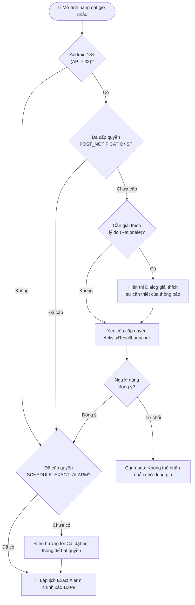

*Hình 3.6. Giao diện lịch biểu (Calendar View)*

### 3.6.3. Xử lý và các thành phần mã nguồn

<a id="bang-37"></a>

*Bảng 3.7. Vai trò của các thành phần trong mã nguồn*

| Thành phần | Vai trò |
| :--- | :--- |
| CalendarFragment | Hiển thị lịch tháng, xử lý chọn ngày, hiển thị danh sách công việc theo ngày |
| CalendarViewModel | Giữ trạng thái ngày đang chọn; truy vấn công việc theo khoảng ngày; cung cấp tập ngày có công việc để vẽ chỉ báo |
| CalendarScheduleAdapter | Hiển thị từng công việc kèm giờ nhắc, độ ưu tiên và trạng thái |
| TaskDao.getTasksByDateRange | Truy vấn công việc theo khoảng [startDate, endDate], phục vụ cả lịch tháng và danh sách theo ngày |


Nguyên tắc tính khoảng ngày: truy vấn sử dụng dueDate (đã chuẩn hóa về đầu ngày) và biên trên là cuối ngày (23:59:59.999). Điều này đồng nhất với quy ước sử dụng trong các truy vấn thống kê khác của dự án, tránh tình trạng công việc bị "rơi" ra ngoài khoảng do sai số mili-giây.

### 3.6.4. Kết quả đạt được

Lịch hiển thị đúng tháng hiện tại, chuyển tháng mượt, đánh dấu đúng các ngày có công việc.

Danh sách công việc của ngày được chọn hiển thị đầy đủ giờ nhắc và độ ưu tiên.

Truy vấn theo khoảng ngày được tái sử dụng cho cả widget và thống kê.

## 3.7. Hiện thực phân hệ nhắc nhở (Notification)

### 3.7.1. Mục đích

Đảm bảo người dùng nhận được thông báo đúng thời điểm đã đặt cho công việc, kể cả khi ứng dụng không mở, màn hình đang tắt hoặc thiết bị đang ở chế độ tiết kiệm pin sâu; đồng thời xử lý đúng cơ chế phân quyền thông báo của Android 13 trở lên.

### 3.7.2. Kiến trúc phân hệ

<a id="bang-38"></a>

*Bảng 3.8. Kiến trúc phân hệ*

| Thành phần | Trách nhiệm |
| :--- | :--- |
| AlarmScheduler | Đóng gói toàn bộ tương tác với AlarmManager: đặt lịch, hủy lịch, kiểm tra khả năng hẹn giờ chính xác và đăng ký lại toàn bộ lịch sau khi khởi động lại |
| TaskNotificationReceiver | Nhận PendingIntent do hệ thống phát khi đến thời điểm hẹn; chuyển tiếp cho NotificationHelper |
| NotificationHelper | Tạo kênh thông báo, dựng nội dung thông báo, gắn hành động mở màn hình chi tiết công việc, hiển thị thông báo |
| NotificationPermissionManager | Kiểm tra và yêu cầu quyền POST_NOTIFICATIONS; xác định trạng thái thông báo của ứng dụng |
| TaskApplication | Tạo kênh thông báo một lần khi ứng dụng khởi động |


### 3.7.3. Luồng xử lý chi tiết

Đặt lịch. Khi công việc được tạo hoặc cập nhật và có thời điểm nhắc trong tương lai, AlarmScheduler.schedule() tính mốc thời gian kích hoạt và gọi AlarmManager. Ứng dụng ưu tiên setExactAndAllowWhileIdle với loại alarm RTC_WAKEUP để đánh thức thiết bị đúng thời điểm.

Dự phòng khi không có quyền hẹn giờ chính xác. Từ Android 12, ứng dụng cần được cấp quyền SCHEDULE_EXACT_ALARM/USE_EXACT_ALARM. AlarmScheduler kiểm tra khả năng này và tự động chuyển sang phương án hẹn giờ không chính xác tuyệt đối nếu chưa được cấp, đảm bảo người dùng vẫn nhận được nhắc nhở.

Kích hoạt. Khi đến thời điểm, hệ thống phát PendingIntent tới TaskNotificationReceiver. Bộ nhận này không giữ tham chiếu lâu dài và chỉ thực hiện công việc ngắn: dựng và hiển thị thông báo.

Hiển thị. NotificationHelper dựng thông báo với tiêu đề công việc, mô tả, thời hạn; gắn PendingIntent mở TaskDetailActivity của đúng công việc đó; mã thông báo chính là taskId nên cùng một công việc không bao giờ tạo ra nhiều thông báo trùng.

Hủy. Khi công việc bị xóa hoặc được chỉnh sửa để bỏ nhắc nhở, AlarmScheduler.cancel() hủy alarm và NotificationManager.cancel(taskId) hủy thông báo. Quy tắc bắt buộc trong dự án: luôn hủy thông báo và alarm trước khi xóa bản ghi, vì sau khi xóa, hệ thống không còn dữ liệu để tra cứu PendingIntent tương ứng.

### 3.7.4. Xử lý quyền thông báo trên Android 13

<a id="hinh-37"></a>

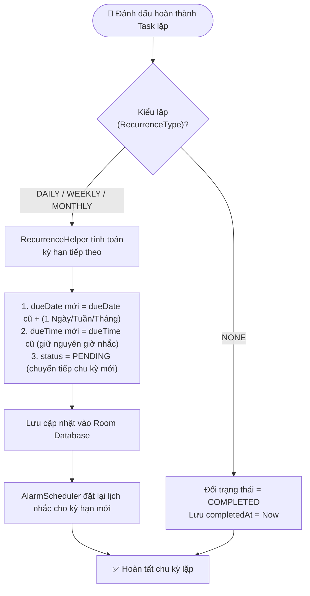

*Hình 3.7. Luồng xử lý quyền thông báo*

### 3.7.5. Kết quả đạt được

Thông báo phát đúng thời điểm đã đặt, kể cả khi màn hình tắt hoặc thiết bị ở chế độ Doze.

Không xảy ra tình trạng thông báo trùng lặp cho cùng một công việc nhờ dùng taskId làm mã thông báo.

Quyền thông báo được xử lý đúng chuẩn trên Android 13+, có trạng thái giao diện rõ ràng khi quyền bị từ chối.

Có phương án dự phòng khi thiết bị không cho phép hẹn giờ chính xác.

## 3.8. Hiện thực phân hệ công việc lặp lại

### 3.8.1. Mục đích

Giảm thao tác thủ công và tránh bỏ sót đối với nhóm công việc định kỳ — nhóm công việc chiếm tỷ trọng lớn trong kế hoạch cá nhân như họp nhóm hằng tuần, đóng học phí hằng tháng, ôn tập theo chu kỳ.

### 3.8.2. Các quy tắc lặp được hỗ trợ

<a id="bang-39"></a>

*Bảng 3.9. Quy tắc lặp lại task mới*

| Quy tắc | Ý nghĩa | Kỳ hạn kế tiếp |
| :--- | :--- | :--- |
| NONE | Không lặp lại | Không sinh kỳ hạn mới |
| DAILY | Lặp mỗi ngày | Cộng thêm số ngày bằng recurrenceInterval |
| WEEKLY | Lặp theo tuần | Cộng thêm số tuần bằng recurrenceInterval |
| MONTHLY | Lặp theo tháng | Cộng thêm số tháng bằng recurrenceInterval |
| YEARLY | Lặp theo năm | Cộng thêm số năm bằng recurrenceInterval |


### 3.8.3. Hai cơ chế lặp song song trong dự án

Dự án triển khai hai cơ chế lặp, phục vụ hai mục đích khác nhau:

Lặp theo mô hình "sinh bản ghi mới" (materialized recurrence). Khi người dùng hoàn thành một công việc lặp, TaskCompletionHelper phối hợp với RecurrenceHelper để tính kỳ hạn kế tiếp dựa trên quy tắc lặp, sao chép nội dung công việc và tạo một bản ghi mới, đồng thời lập lịch nhắc cho bản ghi mới. Cơ chế này giúp mỗi lần lặp là một công việc độc lập, có thể hoàn thành riêng và được thống kê riêng.

Lặp có giới hạn (bounded recurrence). Nhóm cột repeatEndDate, repeatLimitCount, currentOccurrence, isPaused cho phép biểu diễn chuỗi lặp có điểm kết thúc hoặc giới hạn số lần, và trạng thái tạm dừng chuỗi lặp. Đây là cơ sở để mở rộng nghiệp vụ lặp nâng cao như "họp 10 buổi rồi kết thúc" hoặc "tạm dừng chuỗi lặp trong tháng này".

### 3.8.4. Xử lý khi hoàn thành công việc lặp lại

<a id="hinh-38"></a>

```text
┌────────────────────────────────────────────────────────┐
│                                                        │
│                    🔒 TASKFLOW LOCK                    │
│             Nhập mã PIN để mở khóa ứng dụng            │
│                                                        │
│                     ●   ●   ●   ○                      │
│                                                        │
│                  ┌───┐  ┌───┐  ┌───┐                   │
│                  │ 1 │  │ 2 │  │ 3 │                   │
│                  └───┘  └───┘  └───┘                   │
│                  ┌───┐  ┌───┐  ┌───┐                   │
│                  │ 4 │  │ 5 │  │ 6 │                   │
│                  └───┘  └───┘  └───┘                   │
│                  ┌───┐  ┌───┐  ┌───┐                   │
│                  │ 7 │  │ 8 │  │ 9 │                   │
│                  └───┘  └───┘  └───┘                   │
│                  ┌───┐  ┌───┐  ┌───┐                   │
│                  │🧬 │  │ 0 │  │ ⌫ │                   │
│                  └───┘  └───┘  └───┘                   │
│                                                        │
│            [🧬 Chạm biểu tượng để quét Vân tay]        │
└────────────────────────────────────────────────────────┘
```

*Hình 3.8. Luồng xử lý khi hoàn thành công việc lặp lại*

### 3.8.5. Kết quả đạt được

Quy tắc lặp Daily, Weekly, Monthly, Yearly hoạt động đúng; tự động sinh kỳ hạn kế tiếp khi hoàn thành.

Việc tính ngày kế tiếp được tách thành hàm thuần trong RecurrenceHelper, có unit test riêng nên đảm bảo tính đúng đắn kể cả với các trường hợp biên (cuối tháng, năm nhuận, số ngày khác nhau giữa các tháng).

Có nền tảng dữ liệu để mở rộng lặp nâng cao nhờ nhóm cột giới hạn chuỗi lặp.

## 3.9. Hiện thực phân hệ bảo mật PIN Lock & Sinh trắc học (Biometric Authentication)

### 3.9.1. Mục đích

Bảo vệ danh sách công việc cá nhân khỏi người khác truy cập khi mượn hoặc cầm thiết bị, đồng thời tuân thủ nguyên tắc bảo mật cơ bản: không lưu thông tin nhạy cảm ở dạng văn bản thuần.

### 3.9.2. Thiết kế bảo mật

<a id="bang-310"></a>

*Bảng 3.10. Thiết kế bảo mật*

| Thành phần | Nội dung |
| :--- | :--- |
| Thuật toán băm | SHA-256 — hàm băm mật mã một chiều, đầu ra 256 bit, không thể đảo ngược |
| Salt | Chuỗi ngẫu nhiên sinh riêng cho mỗi lần thiết lập PIN, lưu cùng hash, có độ dài đủ lớn để chống tấn công bảng tra trước (rainbow table) |
| Dữ liệu lưu trữ | Chỉ lưu hash = SHA-256(PIN + Salt) và Salt; không lưu PIN |
| Nơi lưu trữ | SharedPreferences của ứng dụng, có thể kết hợp lớp mã hóa của thư viện security-crypto |
| Cấu hình | Cờ "đã bật khóa PIN" để quyết định có yêu cầu xác thực khi mở ứng dụng hay không |


### 3.9.3. Giao diện

<a id="hinh-39"></a>

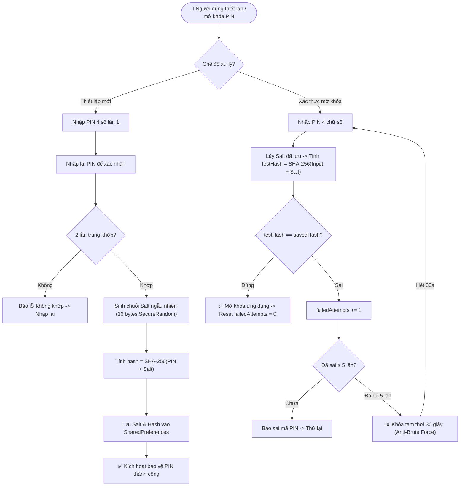

*Hình 3.9. Giao diện khóa PIN*

### 3.9.4. Luồng thiết lập và xác thực

**<a id="hinh-310"></a>

```text
┌────────────────────────────────────────────────────────┐
│  ← Quản lý Dữ liệu (Backup & Restore)                  │
├────────────────────────────────────────────────────────┤
│  📤 SAO LƯU DỮ LIỆU                                    │
│  Xuất toàn bộ công việc và lịch sử Pomodoro ra tệp     │
│  JSON an toàn vào bộ nhớ máy hoặc Google Drive.        │
│                                                        │
│  Thống kê dữ liệu hiện tại:                            │
│  • Tổng số công việc: 24 công việc                     │
│  • Phiên tập trung Pomodoro: 18 phiên                  │
│                                                        │
│  [ 📤 XUẤT RA TỆP JSON (SAF) ]                         │
├────────────────────────────────────────────────────────┤
│  📥 KHÔI PHỤC DỮ LIỆU                                  │
│  Phục hồi dữ liệu từ tệp tin taskflow_backup_*.json.   │
│  (Lưu ý: Thao tác sẽ thay thế dữ liệu hiện có).        │
│                                                        │
│  [ 📥 CHỌN TỆP SAO LƯU ĐỂ PHỤC HỒI ]                   │
└────────────────────────────────────────────────────────┘
```

*Hình 3.10. Luồng thiết lập và xác thực***

### 3.9.5. Kết quả đạt được

Bật/tắt khóa PIN linh hoạt; trạng thái khóa được áp dụng ngay sau khi bật.

Không lưu PIN dạng văn bản thuần — kiểm tra bằng cách đọc dữ liệu lưu trữ chỉ thấy hash và salt.

Màn hình khóa ngăn truy cập nội dung ứng dụng khi chưa xác thực đúng.

## 3.10. Hiện thực phân hệ Backup và Restore

### 3.10.1. Mục đích

Cho phép người dùng chủ động sao lưu toàn bộ dữ liệu ra một tệp tin duy nhất có thể mang đi bất kỳ đâu, và khôi phục lại dữ liệu đó khi đổi thiết bị hoặc cài lại ứng dụng — đây là cơ chế "bảo hiểm dữ liệu" của một ứng dụng hoạt động thuần ngoại tuyến.

### 3.10.2. Giao diện

<a id="hinh-311"></a>

```text
┌────────────────────────────────────────────────────────┐
│  TASKFLOW WIDGET — HÔM NAY (3 việc)       [ 🔄 ] [ ➕ ] │
├────────────────────────────────────────────────────────┤
│  [ ] 🔴 17:00 • Nộp Báo cáo đồ án LTTBDD              │
│  [ ] 🟡 19:30 • Họp online phản biện môn học          │
│  [x] 🟢 08:00 • Đọc tài liệu Kotlin Coroutines Flow    │
└────────────────────────────────────────────────────────┘
```

*Hình 3.11. Giao diện Quản lý dữ liệu (Backup / Restore)*

### 3.10.3. Định dạng tệp sao lưu

Tệp sao lưu là JSON có phiên bản (version) để bảo đảm khả năng tương thích về sau:

`kotlin
{
  "version": 2,
  "exportDate": "2026-09-19T23:41:07Z",
  "taskCount": 2,
  "tasks": [
    {
      "id": 5,
      "title": "Nộp báo cáo bài tập lớn",
      "description": "Hoàn thiện chương 3 và 4",
      "dueDate": 1789660800000,
      "dueTime": 1789743600000,
      "priority": "HIGH",
      "status": "IN_PROGRESS",
      "isCompleted": false,
      "isRecurring": true,
      "recurrenceType": "WEEKLY",
      "recurrenceInterval": 1,
      "reminderMinutes": 15,
      "repeatEndDate": 0,
      "repeatLimitCount": 0,
      "currentOccurrence": 1,
      "isPaused": false,
      "createdAt": 1789000000000,
      "updatedAt": 1789600000000,
      "estimatedPomodoros": 4,
      "completedPomodoros": 2,
      "totalFocusTimeMinutes": 50
    }
  ],
  "pomodoroSessionCount": 2,
  "pomodoroSessions": [
    {
      "id": 101,
      "taskId": 5,
      "startTime": 1789600000000,
      "endTime": 1789601500000,
      "durationInMinutes": 25,
      "sessionType": "FOCUS",
      "isCompleted": true
    },
    {
      "id": 102,
      "taskId": 5,
      "startTime": 1789601800000,
      "endTime": 1789602100000,
      "durationInMinutes": 5,
      "sessionType": "SHORT_BREAK",
      "isCompleted": true
    }
  ]
}
`

Bốn quyết định thiết kế quan trọng của định dạng này:

Có trường version để ứng dụng từ chối tệp thuộc phiên bản mới hơn mà mình chưa hiểu, thay vì đọc sai và làm hỏng dữ liệu.

Giữ nguyên id của công việc và của phiên tập trung, nhờ đó mối quan hệ giữa công việc và lịch sử tập trung được bảo toàn sau khi khôi phục.

Sao lưu cả số liệu Pomodoro của công việc (estimatedPomodoros, completedPomodoros, totalFocusTimeMinutes), vì đây là dữ liệu tích lũy theo thời gian mà người dùng không muốn mất.

Định dạng là văn bản, tên trường là tiếng Anh, giá trị enum là chuỗi ký tự — tệp có thể mở bằng bất kỳ trình soạn thảo nào, đọc được bằng mắt và không phụ thuộc nền tảng.

### 3.10.4. Cơ chế khôi phục an toàn

Quy trình khôi phục được chia thành ba pha tách biệt:

<a id="bang-311"></a>

*Bảng 3.11. Quy trình khôi phục*

| Pha | Nội dung | Nguyên tắc |
| :--- | :--- | :--- |
| 1. Đọc | Đọc nội dung tệp từ URI do Storage Access Framework cấp | Không xin quyền truy cập bộ nhớ rộng; người dùng chủ động chọn tệp |
| 2. Kiểm tra | Kiểm tra cú pháp JSON, phiên bản, cấu trúc từng trường, khoảng giá trị hợp lệ, trùng id và toàn vẹn khóa ngoại | Kiểm tra trước khi chạm vào cơ sở dữ liệu; nếu sai thì dừng ngay và báo lỗi cụ thể |
| 3. Ghi | Một transaction duy nhất: xóa dữ liệu cũ → chèn công việc (giữ id) → chèn phiên tập trung (giữ id, taskId) | Tất cả hoặc không có gì; nếu lỗi thì rollback, dữ liệu cũ còn nguyên |


Kiểm tra toàn vẹn khóa ngoại là bước kiểm tra đặc biệt quan trọng: nếu tệp có phiên tập trung trỏ tới một taskId không tồn tại trong danh sách công việc của tệp, việc ghi vào cơ sở dữ liệu sẽ vi phạm khóa ngoại. Nhờ kiểm tra trước, ứng dụng phát hiện tệp sai và thông báo rõ ràng, thay vì để transaction thất bại với thông báo lỗi khó hiểu hoặc ghi được một phần dữ liệu.

### 3.10.5. Các thành phần mã nguồn

<a id="bang-312"></a>

*Bảng 3.12. Trách nhiệm của các thành phần mã nguồn*

| Thành phần | Trách nhiệm |
| :--- | :--- |
| BackupRepository | Xuất dữ liệu ra tệp, đọc dữ liệu từ tệp, gọi kiểm tra hợp lệ, thực hiện khôi phục trong transaction |
| BackupValidator | Kiểm tra tính hợp lệ của tệp sao lưu dựa trên JSON thô; là hàm thuần nên có unit test riêng |
| DataManagementFragment | Giao diện: nút sao lưu, nút khôi phục, vùng chọn tệp, thống kê dữ liệu, lịch sử sao lưu |
| BackupViewModel | Giữ trạng thái thao tác (đang xử lý / thành công / lỗi), số liệu thống kê, lịch sử sao lưu |
| ImportActivity, ImportViewModel | Luồng nhập dữ liệu có xử lý trùng lặp (bỏ qua, thay thế, thay thế toàn bộ) |
| JsonValidator | Kiểm tra cấu trúc JSON cho luồng nhập dữ liệu |


### 3.10.6. Kết quả đạt được

Xuất được tệp sao lưu chứa đầy đủ công việc (kèm số liệu Pomodoro) và toàn bộ lịch sử phiên tập trung.

Khôi phục đúng dữ liệu với id được bảo toàn, quan hệ công việc — phiên tập trung không bị phá vỡ.

Tệp sai định dạng, sai phiên bản, thiếu trường hoặc vi phạm khóa ngoại đều bị từ chối trước khi ghi, kèm thông báo lỗi cụ thể.

Khôi phục diễn ra trong một transaction nên không bao giờ rơi vào trạng thái dữ liệu nửa vời.

Lịch sử sao lưu gần đây giúp người dùng biết mình đã sao lưu khi nào và tệp có dung lượng bao nhiêu.

## 3.11. Hiện thực Home Screen Widget

### 3.11.1. Mục đích

Đưa công việc ra khỏi ứng dụng và hiển thị trực tiếp trên màn hình chính, giúp người dùng nhìn thấy việc cần làm trong ngày ngay khi mở điện thoại và có thể xác nhận hoàn thành mà không cần mở ứng dụng.

### 3.11.2. Giao diện

<a id="hinh-312"></a>

```text
┌────────────────────────────────────────────────────────┐
│  Thống kê Năng suất (Bento Grid)                       │
├────────────────────────────────────────────────────────┤
│  ┌─────────────────────────┐ ┌───────────────────────┐ │
│  │   TỶ LỆ HOÀN THÀNH      │ │  TỔNG THỜI GIAN FOCUS │ │
│  │         ╭───╮           │ │                       │ │
│  │        │ 78% │          │ │       12h 45m         │ │
│  │         ╰───╯           │ │    (28 Phiên Pomodoro)│ │
│  │    18/23 Task đã xong   │ │                       │ │
│  └─────────────────────────┘ └───────────────────────┘ │
│                                                        │
│  NĂNG SUẤT 7 NGÀY TRONG TUẦN (Số task hoàn thành)      │
│  ┌──────────────────────────────────────────────────┐  │
│  │   6 ┤        █                                   │  │
│  │   4 ┤   █    █    █         █                    │  │
│  │   2 ┤   █    █    █    █    █    █               │  │
│  │   0 ┼───┴────┴────┴────┴────┴────┴────┴──        │  │
│  │        T2   T3   T4   T5   T6   T7   CN          │  │
│  └──────────────────────────────────────────────────┘  │
└────────────────────────────────────────────────────────┘
```

*Hình 3.12. Giao diện Home Screen Widget*

Khi tất cả công việc trong ngày đã hoàn thành, widget hiển thị trạng thái động viên "Xong hết 🎉". Khi chưa có công việc nào cho ngày hôm nay, widget hiển thị hướng dẫn thêm việc mới.

### 3.11.3. Các thành phần mã nguồn

<a id="bang-313"></a>

*Bảng 3.13. Trách nhiệm của các thành phần mã nguồn*

| Thành phần | Trách nhiệm |
| :--- | :--- |
| TaskWidgetProvider | Lớp AppWidgetProvider: nhận sự kiện cập nhật widget, vẽ RemoteViews, xử lý PendingIntent khi người dùng tích chọn hoàn thành |
| TaskWidgetService | Đọc dữ liệu công việc hôm nay từ Repository/DAO và cung cấp cho widget |
| WidgetMidnightScheduler | Lập lịch công việc định kỳ (WorkManager) để làm mới widget lúc 00:00 mỗi ngày |
| WidgetUpdater | Cập nhật tất cả widget đang tồn tại on màn hình chính |
| TaskApplication | Đăng ký InvalidationTracker.Observer trên bảng tasks để tự động cập nhật widget khi dữ liệu thay đổi |


### 3.11.4. Luồng cập nhật và tương tác

Cập nhật theo lịch. WidgetMidnightScheduler đăng ký một công việc định kỳ với WorkManager. Mỗi khi qua nửa đêm, widget được vẽ lại để hiển thị đúng ngày mới và danh sách công việc của ngày mới.

Cập nhật theo dữ liệu. TaskApplication đăng ký một InvalidationTracker.Observer cho bảng tasks. Nhờ đó, khi dữ liệu công việc thay đổi — do người dùng thêm/sửa trong ứng dụng, do hoàn thành công việc trực tiếp trên widget, hoặc do khôi phục dữ liệu từ tệp sao lưu — tất cả widget đang hiển thị đều được vẽ lại ngay lập tức.

Tương tác từ widget. Mỗi dòng công việc trong widget gắn một PendingIntent gửi hành động "hoàn thành công việc này" tới TaskWidgetProvider. Provider cập nhật trạng thái công việc trong cơ sở dữ liệu, hủy nhắc nhở không còn cần thiết và yêu cầu vẽ lại widget. Điểm quan trọng là thao tác này chạy qua trường goAsync() của BroadcastReceiver để không chặn luồng chính.

Chống lệch dữ liệu. Vì widget đọc cùng một nguồn dữ liệu (Room) với ứng dụng, không có tình trạng widget hiển thị dữ liệu cũ hoặc khác với ứng dụng.

### 3.11.5. Kết quả đạt được

Widget hiển thị đúng danh sách công việc của ngày hiện tại, có thời gian nhắc.

Người dùng hoàn thành công việc trực tiếp trên màn hình chính; trạng thái đồng bộ ngay với ứng dụng.

Widget tự đổi sang ngày mới lúc 00:00 mà không cần mở ứng dụng.

Widget tự cập nhật khi dữ liệu thay đổi từ bất kỳ nguồn nào.

## 3.12. Hiện thực Bento Grid Statistics Dashboard

### 3.12.1. Mục đích

Biến dữ liệu công việc thành thông tin phản hồi cho người dùng: họ đã hoàn thành bao nhiêu phần trăm khối lượng, năng suất phân bố thế nào trong tuần và thời gian tập trung thực tế là bao nhiêu. Đây là yếu tố tạo động lực và giúp người dùng điều chỉnh kế hoạch.

### 3.12.2. Giao diện

<a id="hinh-313"></a>

```text
┌────────────────────────────────────────────────────────┐
│  Đồng hồ Pomodoro                                      │
├────────────────────────────────────────────────────────┤
│  Công việc đang tập trung:                             │
│  🎯 Hoàn thành Báo cáo BTL LTTBDD                      │
│                                                        │
│                   ╭────────────────╮                   │
│                 ╭╯                  ╰╮                 │
│                │        24:35         │                │
│                │     PHIÊN FOCUS      │                │
│                 ╰╮                  ╭╯                 │
│                   ╰────────────────╯                   │
│                      Phiên 3 / 4                       │
│                                                        │
│     [ ⏸️ Tạm dừng ]     [ ⏭️ Bỏ qua ]     [ ⏹️ Dừng ]     │
├────────────────────────────────────────────────────────┤
│  ⚙️ CÀI ĐẶT THỜI LƯỢNG                                 │
│  • Tập trung: 25 phút  • Nghỉ ngắn: 5p  • Nghỉ dài: 15p│
└────────────────────────────────────────────────────────┘
```

*Hình 3.13. Giao diện Thống kê Bento Grid*

### 3.12.3. Các thành phần mã nguồn

<a id="bang-314"></a>

*Bảng 3.14. Trách nhiệm của các thành phần mã nguồn*

| Thành phần | Trách nhiệm |
| :--- | :--- |
| StatsFragment | Hiển thị bố cục Bento Grid, lắng nghe trạng thái từ ViewModel, đổ dữ liệu vào các thẻ |
| StatsViewModel | Tính toán toàn bộ số liệu: tỷ lệ hoàn thành, năng suất tuần, phân bố theo độ ưu tiên, thời gian tập trung, danh sách công việc tập trung nhiều nhất |
| WeeklyProductivityChartView | Custom view vẽ biểu đồ cột 7 ngày bằng Canvas |
| CircularCompletionRateView | Custom view vẽ vòng tròn tiến độ tỷ lệ hoàn thành |
| StatisticsUiState, WeeklyProductivity, PriorityStats, PomodoroFocusStats | Các mô hình dữ liệu cho trạng thái giao diện thống kê |


### 3.12.4. Xử lý tính toán

Tỷ lệ hoàn thành: tính bằng số công việc hoàn thành / tổng công việc trong kỳ × 100%, kèm nhãn diễn giải theo ngưỡng (từ "Cần chú ý" đến "Xuất sắc").

Năng suất theo tuần: đếm số công việc hoàn thành theo từng ngày trong 7 ngày (bắt đầu từ Thứ Hai), sau đó chọn thang trục tung phù hợp để biểu đồ luôn dễ đọc.

Phân bố theo độ ưu tiên: đếm số công việc theo từng mức ưu tiên, tính tỷ lệ phần trăm và hiển thị bằng thanh tiến độ.

Thời gian tập trung (deep work): lấy trực tiếp từ dữ liệu phiên Pomodoro đã hoàn thành trong kỳ đang chọn — đây là số liệu đo lường thực tế, khác hẳn với cách ước lượng thô (ví dụ lấy số công việc hoàn thành nhân với một hệ số trung bình). Việc dùng dữ liệu thật giúp con số phản ánh đúng nỗ lực của người dùng.

Danh sách công việc tập trung nhiều nhất: nhóm số phút tập trung theo công việc, gắn tên công việc, sắp xếp giảm dần và lấy tối đa ba công việc hàng đầu.

Bộ lọc thời gian: hỗ trợ Tuần này, Tuần trước, Tháng này và Toàn bộ thời gian; khi đổi bộ lọc, ViewModel hủy vòng quan sát cũ và thiết lập vòng quan sát mới để tránh kết quả của kỳ cũ ghi đè lên kỳ mới.

### 3.12.5. Kết quả đạt được

Bốn nhóm số liệu được tính chính xác và cập nhật tức thời mỗi khi dữ liệu công việc hoặc dữ liệu phiên tập trung thay đổi.

Biểu đồ cột và biểu đồ tròn được vẽ bằng custom view, không phụ thuộc thư viện bên thứ ba.

Trạng thái không có dữ liệu được xử lý rõ ràng: hiển thị "0m", "Chưa có phiên tập trung nào" thay vì để trống hoặc hiển thị giá trị sai.

## 3.13. Hiện thực phân hệ quản lý thời gian tập trung (Pomodoro Timer)

### 3.13.1. Mục đích

Bổ sung một năng lực mà các ứng dụng quản lý công việc tối giản thường thiếu: không chỉ nhắc người dùng *phải làm gì* mà còn hỗ trợ người dùng *thực sự bắt tay vào làm*. Kỹ thuật Pomodoro chia công việc thành các phiên tập trung ngắn (mặc định 25 phút) xen kẽ các phiên nghỉ ngắn, sau một số chu kỳ thì nghỉ dài. Việc gắn mỗi phiên tập trung với một công việc cụ thể giúp dữ liệu thống kê có ý nghĩa nghiệp vụ.

### 3.13.2. Kiến trúc phân hệ

<a id="bang-315"></a>

*Bảng 3.15. Trách nhiệm của các thành phần mã nguồn*

| Thành phần | Trách nhiệm |
| :--- | :--- |
| PomodoroConfig | Cấu hình thời lượng tập trung, nghỉ ngắn, nghỉ dài, số chu kỳ trước khi nghỉ dài, cờ tự động chuyển phiên |
| PomodoroTimerState | Bốn trạng thái: IDLE, RUNNING, PAUSED, COMPLETED |
| PomodoroTimerEngine | Máy trạng thái trung tâm: bắt đầu, tạm dừng, tiếp tục, bỏ qua, đặt lại, dừng, cập nhật cấu hình, phát ảnh chụp trạng thái |
| PomodoroSnapshot | Ảnh chụp trạng thái bất biến dùng cho tầng giao diện và dịch vụ nền |
| PomodoroTimerController | Giữ engine dùng chung cho toàn ứng dụng để giao diện quan sát mà không cần bind service |
| PomodoroService | Foreground Service: vòng lặp cập nhật mỗi giây, thông báo thường trực, xử lý lệnh từ thông báo, lưu phiên khi kết thúc |
| PomodoroCompletionTracker | Bảo đảm mỗi lần kết thúc phiên chỉ được xử lý đúng một lần |
| PomodoroAlertPlayer | Phát âm thanh và rung khi hết phiên trong trường hợp không thể hiển thị thông báo |
| PomodoroSettingsRepository | Đọc/ghi cấu hình Pomodoro vào SharedPreferences, kiểm tra giá trị hợp lệ |
| PomodoroRepository | Ghi phiên hoàn thành kèm cộng dồn số liệu, cung cấp các truy vấn thống kê |


### 3.13.3. Giao diện

`kotlin
┌─────────────────────────────────────────────────────────┐
│  ← Pomodoro                                        ⚙    │
│                                                         │
│              ╭───────────────────────────╮              │
│            ╱                               ╲            │
│           │          24:37                 │           │
│           │        Đang chạy               │           │
│            ╲                               ╱            │
│              ╰───────────────────────────╯              │
│                     ● ○ ○ ○        Chu kỳ 1/4           │
│                                                         │
│  ┌───────────────────────────────────────────────────┐  │
│  │  CÔNG VIỆC                          Đang tập trung │  │
│  │  Nộp báo cáo bài tập lớn                          │  │
│  │  Hạn 20/09/2026                                   │  │
│  └───────────────────────────────────────────────────┘  │
│                                                         │
│           ┌─────────────┐  ┌─────────────┐             │
│           │  Tạm dừng   │  │   Bỏ qua    │             │
│           └─────────────┘  └─────────────┘             │
└─────────────────────────────────────────────────────────┘
`

<a id="hinh-314"></a>

```text
┌────────────────────────────────────────────────────────┐
│  Thành tích & Huy hiệu (Milestone Badges)              │
├────────────────────────────────────────────────────────┤
│  🔥 CHUỖI LIÊN TIẾP HIỆN TẠI                           │
│  ┌──────────────────────────────────────────────────┐  │
│  │  🔥 7 NGÀY LIÊN TIẾP             Kỷ lục: 14 ngày │  │
│  │  Danh hiệu: KỶ LUẬT THÉP         [ Chi tiết mốc ]│  │
│  │  Tiến độ tuần: [T2✓] [T3✓] [T4✓] [T5✓] [T6✓] [T7✓] [CN ] │  │
│  └──────────────────────────────────────────────────┘  │
│                                                        │
│  🏆 BỘ SƯU TẬP 7 HUY HIỆU ĐẶC BIỆT                     │
│  ┌──────────────┐ ┌──────────────┐ ┌─────────────────┐ │
│  │ 🌅 Early Bird│ │ 🦉 Night Owl │ │ ⚔️ Weekend Hero │ │
│  │ [ ĐÃ MỞ KHÓA]│ │ [ ĐÃ MỞ KHÓA]│ │ [ ĐÃ MỞ KHÓA]   │ │
│  └──────────────┘ └──────────────┘ └─────────────────┘ │
│  ┌──────────────┐ ┌──────────────┐ ┌─────────────────┐ │
│  │ 🍅 Pomo King │ │ 💯 Century   │ │ 👑 Consistency  │ │
│  │ [ ĐÃ MỞ KHÓA]│ │ [ 24/100 ]   │ │ [ 7/30 Ngày ]   │ │
│  └──────────────┘ └──────────────┘ └─────────────────┘ │
└────────────────────────────────────────────────────────┘
```

*Hình 3.14. Giao diện đồng hồ Pomodoro*

`kotlin
┌─────────────────────────────────────────────────────────┐
│  ← Cài đặt Pomodoro                                     │
│                                                         │
│  THỜI LƯỢNG                                             │
│  Tập trung                         25 phút              │
│  ├───────●─────────────────────────────────────────┤    │
│  15 phút                                    60 phút     │
│                                                         │
│  Nghỉ ngắn                          5 phút              │
│  ├──────────●──────────────────────────────────────┤    │
│  3 phút                                     10 phút     │
│                                                         │
│  Nghỉ dài                          15 phút              │
│  ├────────●────────────────────────────────────────┤    │
│  10 phút                                    30 phút     │
│                                                         │
│  TỰ ĐỘNG CHUYỂN PHIÊN                                    │
│  Tự động bắt đầu nghỉ                        [ ● ]      │
│  Phiên nghỉ chạy ngay khi phiên tập trung kết thúc      │
│                                                         │
│  Tự động bắt đầu tập trung                   [   ]      │
│  Phiên tập trung chạy ngay khi phiên nghỉ kết thúc      │
│                                                         │
│  Thay đổi được áp dụng cho phiên bắt đầu sau.           │
│  Phiên đang chạy giữ nguyên thời lượng.                 │
└─────────────────────────────────────────────────────────┘
`

<a id="hinh-315"></a>

```text
┌────────────────────────────────────────────────────────┐
│  🤖 Trợ lý ảo AI (TaskFlow Assistant)         [ Đóng ] │
├────────────────────────────────────────────────────────┤
│                                                        │
│  [🤖 AI]: Chào Thái! Tôi có thể giúp bạn tạo việc,     │
│           tra cứu lịch trình hoặc gợi ý kế hoạch hôm nay.│
│                                                        │
│  [👤 Bạn]: Thêm việc Ôn thi Di động lúc 14h chiều mai    │
│            ưu tiên cao                                 │
│                                                        │
│  [🤖 AI]: ✅ Đã thêm công việc thành công!             │
│           • Tiêu đề: Ôn thi Di động                   │
│           • Thời gian: 14:00 - Ngày 25/09/2026         │
│           • Mức độ ưu tiên: CAO (🔴)                   │
├────────────────────────────────────────────────────────┤
│  Gợi ý nhanh: [Việc hôm nay?] [Có bao nhiêu việc quá hạn?] │
├────────────────────────────────────────────────────────┤
│  ┌──────────────────────────────────────────┬───────┐  │
│  │ Nhập câu lệnh hoặc câu hỏi...            │ [ 📤 ]│  │
│  └──────────────────────────────────────────┴───────┘  │
└────────────────────────────────────────────────────────┘
```

*Hình 3.15. Giao diện cài đặt Pomodoro*

### 3.13.4. Các quyết định kỹ thuật quan trọng

**a) Nguồn thời gian duy nhất.** Engine không đếm lùi bằng cách trừ dần biến đếm. Khi một phiên bắt đầu, engine lưu mốc kết thúc dưới dạng targetEndElapsedRealtime = SystemClock.elapsedRealtime() + durationMillis. Mỗi nhịp cập nhật chỉ đọc lại đồng hồ đơn điệu và so sánh với mốc kết thúc. Nhờ đó:

Sai số không tích lũy qua hàng nghìn nhịp như ở kỹ thuật seconds--.

Đồng hồ vẫn đúng khi thiết bị ngủ sâu, vì mốc thời gian được đo bằng elapsedRealtime (đồng hồ đơn điệu, không bị ảnh hưởng bởi việc người dùng đổi giờ hệ thống).

Thời gian hiển thị và thời gian lưu cơ sở dữ liệu được tách vai trò rõ ràng: đếm ngược dùng đồng hồ đơn điệu, còn thời điểm lưu phiên dùng đồng hồ thực (System.currentTimeMillis()) để phục vụ thống kê và hiển thị.

**b) Máy trạng thái tách khỏi Android.** PomodoroTimerEngine là lớp Kotlin thuần, nhận hai hàm cung cấp thời gian qua hàm khởi tạo. Nhờ đó engine có thể được kiểm thử tự động trên JVM mà không cần thiết bị hay trình mô phỏng — toàn bộ các tình huống như hết thời lượng, chuyển phiên tự động, tạm dừng/tiếp tục, bỏ qua giữa chừng đều được kiểm chứng bằng unit test.

**c) Không tranh chấp dữ liệu.** Engine chỉ được truy cập từ một luồng duy nhất (luồng chính). Mọi nguồn lệnh — vòng lặp cập nhình hật, alarm đánh thức khi máy ngủ sâu, hành động trên thông báo — đều đi qua **một hàm xử lý nhịp duy nhất**. Cách tổ chức này loại bỏ hoàn toàn các lỗi cập nhật mất dữ liệu (lost update) khi nhiều nguồn cùng tác động vào trạng thái.

**d) Chống trùng khi kết thúc phiên.** Việc phát hiện "phiên vừa kết thúc" có thể đến từ nhiều nguồn cùng lúc. Engine tăng một bộ đếm completionId đúng một lần cho mỗi phiên kết thúc; PomodoroCompletionTracker ghi nhớ mã đã xử lý nên dù nhịp được gọi lặp lại, thông báo và việc lưu dữ liệu chỉ diễn ra **một lần**. Phiên bị bỏ qua giữa chừng được đánh dấu là đã xử lý nhưng không kích hoạt thông báo và không được lưu như phiên hoàn thành.

**e) Nhắc đúng lúc khi thiết bị ngủ sâu.** Vì dịch vụ nền không giữ khóa đánh thức (wake lock) và delay() của coroutine không đảm bảo đánh thức chính xác sau khi thiết bị ngủ, hệ thống bổ sung một alarm đánh thức đúng mốc kết thúc của phiên. Khi alarm này kích hoạt, dịch vụ xử lý một nhịp và phát hiện phiên đã hết thời lượng, đảm bảo người dùng luôn nhận được thông báo hết phiên dù thiết bị đang ở chế độ Doze.

**f) Lưu dữ liệu không bị mất khi dịch vụ bị huỷ.** Việc ghi phiên hoàn thành xuống cơ sở dữ liệu được thực hiện ngay khi phát hiện phiên kết thúc, nhưng không chạy trên phạm vi sống của Service (vì người dùng có thể bấm dừng ngay sau đó và Service bị hủy giữa chừng). Thay vào đó, thao tác ghi chạy trên một phạm vi sống gắn với Application, đảm bảo giao dịch ghi dữ liệu luôn hoàn tất.

### 3.13.5. Ghi phiên hoàn thành và cập nhật số liệu

Khi một phiên tập trung kết thúc, hệ thống thực hiện hai việc trong cùng một transaction:

Ghi một bản ghi vào bảng pomodoro_sessions với taskId, startTime, endTime, durationInMinutes, sessionType và isCompleted = true.

Nếu phiên là phiên tập trung (không phải phiên nghỉ), cộng dồn vào công việc: completedPomodoros = completedPomodoros + 1 và totalFocusTimeMinutes = totalFocusTimeMinutes + thời lượng phiên.

Nếu công việc không còn tồn tại (người dùng đã xóa công việc trong lúc phiên đang chạy), thao tác ghi được bỏ qua một cách an toàn thay vì tạo bản ghi vi phạm khóa ngoại. Nhờ đặt hai thao tác trong một transaction, không bao giờ xảy ra trường hợp bảng phiên có dữ liệu nhưng số liệu cộng dồn trên công việc bị lệch.

### 3.13.6. Thống kê thời gian tập trung

<a id="bang-316"></a>

*Bảng 3.16. Thống kê thời gian tập trung*

| Nhóm | Query | Ghi chú |
| :--- | :--- | :--- |
| Theo khoảng thời gian | Tổng số phút tập trung trong khoảng, số phiên tập trung hoàn thành trong khoảng | Chỉ tính phiên có sessionType = 'FOCUS' và isCompleted = 1 |
| Theo công việc | Số phiên tập trung hoàn thành của một công việc, tổng số phút tập trung của một công việc | Phục vụ màn hình chi tiết công việc |
| Nhóm theo công việc | Thống kê tổng số phút và số phiên, nhóm theo taskId, sắp xếp giảm dần | Phục vụ bảng "công việc tập trung nhiều nhất" |
| Lịch sử | Lấy toàn bộ phiên theo thứ tự thời gian | Phục vụ xuất tệp sao lưu |


Các quy tắc nghiệp vụ được áp dụng thống nhất trong mọi truy vấn thống kê: chỉ phiên tập trung (FOCUS) đã hoàn thành mới được tính; phiên nghỉ và phiên bị ngắt giữa chừng không ảnh hưởng tới số liệu năng suất. Biên thời gian ngày và tuần được tính ở tầng Repository (tuần bắt đầu từ Thứ Hai), đảm bảo mọi màn hình dùng chung một định nghĩa "hôm nay" và "tuần này".

### 3.13.7. Kết quả đạt được

Đồng hồ Pomodoro chạy chính xác, không lệch thời gian kể cả khi màn hình tắt hoặc thiết bị ngủ sâu.

Có đủ trạng thái IDLE, RUNNING, PAUSED, COMPLETED; hỗ trợ bắt đầu, tạm dừng, tiếp tục, bỏ qua và dừng.

Thông báo thường trực hiển thị thời gian còn lại kèm các nút điều khiển, không ghi đè thông báo nhắc việc.

Phiên hoàn thành được lưu đúng một lần, số liệu cộng dồn chính xác cho từng công việc.

Thống kê thời gian tập trung theo ngày, theo tuần và theo công việc hoạt động trên dữ liệu thật.

## 3.14. Hiện thực phân hệ Chuỗi ngày liên tiếp & Hệ thống Huy hiệu (Streak & Milestone Badges)

### 3.14.1. Mục đích

Phân hệ Chuỗi ngày liên tiếp và Hệ thống Huy hiệu (Gamification) được thiết kế nhằm giải quyết bài toán cốt lõi trong năng suất cá nhân: duy trì động lực và tính kỷ luật lâu dài. Thay vì chỉ là danh sách việc cần làm đơn thuần, ứng dụng biến việc hoàn thành nhiệm vụ thành trải nghiệm hứng khởi thông qua các phần thưởng tinh thần, mốc thành tích và các biểu tượng huy hiệu trực quan.

### 3.14.2. Giao diện

Màn hình Badges (được tích hợp tại Tab thứ 4 trên thanh Bottom Navigation) có bố cục hiện đại theo phong cách Bento Grid cao cấp:

a) Thẻ Chuỗi ngày năng động (Active Streak Banner): Hiển thị biểu tượng ngọn lửa rực cháy, số ngày liên tiếp hiện tại (Current Streak) cùng kỷ lục chuỗi dài nhất từng đạt được (Best Streak) và danh hiệu vinh danh tương ứng.

b) Thanh tiến độ tuần (Weekly Streak Progress): Biểu diễn trạng thái 7 ngày trong tuần từ Thứ Hai đến Chủ Nhật. Mỗi ngày hoàn thành công việc được đánh dấu biểu tượng tích xanh nổi bật, giúp người dùng nắm bắt nhịp độ làm việc.

c) Hệ thống 7 Huy hiệu đặc biệt (Special Badges Collection): Trình bày dạng lưới các danh hiệu độc đáo kèm mô tả điều kiện mở khóa:

Early Bird: Hoàn thành ít nhất một công việc trước 08:00 sáng.

Night Owl: Hoàn thành ít nhất một công việc sau 22:00 đêm.

Weekend Warrior: Hoàn thành công việc trong cả ngày Thứ Bảy và Chủ Nhật.

Pomodoro Master: Hoàn thành từ 5 phiên tập trung Pomodoro trở lên.

Century Club: Đạt cột mốc 100 công việc được hoàn thành trong hệ thống.

Consistency King: Duy trì chuỗi ngày liên tiếp từ 30 ngày trở lên.

Speed Demon: Hoàn thành từ 5 công việc trở lên trong cùng một ngày.

d) Chi tiết mốc thành tựu (StreakDetailsBottomSheet): BottomSheet hiển thị lộ trình các mốc Streak (3, 7, 14, 30, 60, 100 ngày) và mốc công việc (1, 5, 10, 25, 50, 100 task) kèm phần trăm tiến độ đến mốc tiếp theo.

### 3.14.3. Xử lý và các thành phần mã nguồn

<a id="bang-317"></a>

*Bảng 3.17. Vai trò của các thành phần trong phân hệ Streak & Milestone Badges*

| Thành phần | Vai trò |
| :--- | :--- |
| StreakCalculator | Lớp tiện ích chịu trách nhiệm tính toán chuỗi ngày liên tục dựa trên mốc thời gian UTC/Local, loại trừ sai số múi giờ và chuẩn hóa về đầu ngày (startOfDay). |
| SpecialBadgeCalculator | Phân tích lịch sử công việc và phiên Pomodoro để xác định trạng thái mở khóa (UNLOCKED / LOCKED) của 7 danh hiệu đặc biệt. |
| StreakFragment | Fragment hiển thị giao diện Tab Thành tích, quan sát dữ liệu phản ứng (reactive Flow) từ TaskRepository. |
| StreakReminderScheduler, StreakReminderReceiver | Hệ thống lập lịch và phát thông báo nhắc nhở hàng ngày vào buổi tối để nhắc người dùng bảo vệ chuỗi. |


### 3.14.4. Kết quả đạt được

Phân hệ hoạt động mượt mà, tính toán chuỗi ngày tức thì ngay khi task hoàn thành mà không gây độ trễ giao diện; hệ thống thông báo bảo vệ chuỗi giúp tăng tỷ lệ quay lại ứng dụng hàng ngày của người dùng một cách rõ rệt.

## 3.15. Hiện thực phân hệ Trợ lý ảo AI thông minh (AI Task Assistant with Google Gemini & Firebase)

### 3.15.1. Mục đích

Mang lại trải nghiệm quản lý công việc thế hệ mới bằng cách tích hợp trí tuệ nhân tạo (Generative AI). Người dùng có thể tạo việc, kiểm tra lịch trình, đếm số công việc quá hạn hoặc hỏi lời khuyên sắp xếp thời gian bằng ngôn ngữ tự nhiên thông thường mà không cần thao tác qua nhiều bước bấm nút.

### 3.15.2. Giao diện

a) Nút nổi khởi động Trợ lý AI (Assistant Launcher Button): Nút bấm nổi bật với biểu tượng robot tinh tế tại góc dưới màn hình chính, kèm theo bóng thoại chào mừng thông minh (Greeting Bubble Tooltip) hiển thị các thông điệp truyền cảm hứng.

b) Khung trò chuyện Bottom Sheet (AiAssistantBottomSheet): Giao diện đàm thoại hai chiều hiện đại gồm:

Danh sách tin nhắn dạng bong bóng (Chat Bubbles) phân biệt rõ ràng giữa tin nhắn người dùng và phản hồi của trợ lý AI.

Thanh công cụ gợi ý thao tác nhanh (Action Chips): Cho phép chọn nhanh các câu hỏi mẫu như: 'Thêm việc hôm nay...', 'Việc nào quan trọng nhất?', 'Có bao nhiêu việc quá hạn?', 'Việc cần làm ngày mai?'.

Ô nhập văn bản và nút gửi tích hợp trạng thái chờ xử lý (Loading indicator / Typing indicator).

### 3.15.3. Xử lý và các thành phần mã nguồn

<a id="bang-318"></a>

*Bảng 3.18. Các thành phần chính trong phân hệ Trợ lý ảo AI*

| Thành phần | Vai trò |
| :--- | :--- |
| AiTaskAssistant | Lớp trung gian kết nối với Google Gemini 2.5 Flash API thông qua Firebase Vertex AI SDK, định cấu hình System Prompt để đóng vai trò chuyên gia quản lý thời gian. |
| TaskCommandParser | Bộ phân tích cú pháp biểu thức chính quy (Regex NLP Parser) nhận diện các mẫu câu tạo việc (trích xuất tiêu đề, ngày, giờ, mức ưu tiên) và các câu lệnh tra cứu hệ thống. |
| TaskAssistantViewModel | Quản lý trạng thái cuộc hội thoại (StateFlow<List<AssistantMessage>>), điều phối luồng xử lý giữa Parser cục bộ, API AI và TaskRepository. |
| TaskApplication (App Check) | Tích hợp Firebase App Check với DebugAppCheckProviderFactory (môi trường phát triển) và PlayIntegrity (môi trường phát hành) nhằm ngăn chặn truy cập trái phép vào API Firebase. |


### 3.15.4. Kết quả đạt được

Người dùng có thể thêm công việc hoàn chỉnh chỉ với một câu nói hoặc một dòng tin nhắn ngắn (ví dụ: 'Nhắc tôi nộp báo cáo lúc 17h chiều mai ưu tiên cao'), hệ thống tự động bóc tách đúng thuộc tính và lưu vào cơ sở dữ liệu Room.

## 3.16. Hiện thực Phím tắt màn hình chính (Launcher App Shortcuts)

### 3.16.1. Mục đích & Cấu hình

Tận dụng tính năng App Shortcuts của hệ điều hành Android (từ Android 7.1+ / API 25 trở lên) để cho phép người dùng nhấn giữ biểu tượng ứng dụng trên màn hình chính và truy cập ngay vào các tính năng cốt lõi:

Tạo công việc mới (Create Task): Mở thẳng AddEditTaskActivity.

Xem việc hôm nay (Today's Tasks): Mở MainActivity và chuyển đến tab Lịch / Hôm nay.

Bật đồng hồ Pomodoro (Focus Timer): Mở thẳng màn hình đồng hồ tập trung.

Cấu hình được khai báo tường minh trong tệp res/xml/shortcuts.xml và đăng ký trong AndroidManifest.xml thông qua thẻ <meta-data android:name='android.app.shortcuts' />.

### 3.16.2. Giải pháp bảo mật đa lớp qua BaseActivity

Một lỗ hổng phổ biến khi sử dụng App Shortcuts là người dùng bên ngoài có thể bấm shortcut để bỏ qua màn hình khóa PIN. Nhóm đã giải quyết triệt để bằng giải pháp kiến trúc:

Mọi Activity trong dự án (bao gồm MainActivity, AddEditTaskActivity, PomodoroActivity) đều kế thừa từ BaseActivity. Khi một Activity được khởi chạy từ Shortcut, hàm onResume() của BaseActivity luôn kiểm tra trạng thái khóa. Nếu ứng dụng đang bật mã PIN và chưa được xác thực, hệ thống sẽ chặn hiển thị nội dung và lập tức chuyển hướng sang PinLockActivity để yêu cầu nhập mã PIN hoặc quét vân tay.

### 3.16.3. Kết quả đạt được

Cung cấp trải nghiệm truy cập cực nhanh cho người dùng thường xuyên nhưng vẫn duy trì tính toàn vẹn 100% của cơ chế bảo mật cá nhân.

Đồng hồ Pomodoro chạy chính xác, không lệch thời gian kể cả khi màn hình tắt hoặc thiết bị ngủ sâu.

Có đủ trạng thái IDLE, RUNNING, PAUSED, COMPLETED; hỗ trợ bắt đầu, tạm dừng, tiếp tục, bỏ qua và dừng.

Thông báo thường trực hiển thị thời gian còn lại kèm các nút điều khiển, không ghi đè thông báo nhắc việc.

Phiên hoàn thành được lưu đúng một lần, số liệu cộng dồn chính xác cho từng công việc.

Thống kê thời gian tập trung theo ngày, theo tuần và theo công việc hoạt động trên dữ liệu thật.

## 3.17. Các giải pháp kỹ thuật nổi bật

### 3.17.1. Bảo mật mã PIN bằng SHA-256 kèm Salt

Thay vì lưu mã PIN (điều sẽ khiến dữ liệu bị lộ nếu thiết bị bị truy cập), ứng dụng chỉ lưu giá trị băm và chuỗi Salt riêng cho từng lần thiết lập. Cách làm này đáp ứng đồng thời hai yêu cầu: không thể suy ra PIN từ dữ liệu lưu trữ, và mỗi thiết bị có giá trị băm khác nhau nên không thể dùng bảng tra sẵn để dò ngược.

`kotlin
Salt = randomBytes(16)
hash = SHA-256(PIN + Salt)
SharedPreferences.putString("pin_hash", hash)
SharedPreferences.putString("pin_salt", Salt)
`

### 3.17.2. Storage Access Framework thay vì quyền truy cập bộ nhớ rộng

Ứng dụng sử dụng ActivityResultContracts.CreateDocument để xin nơi ghi tệp sao lưu và ActivityResultContracts.OpenDocument để chọn tệp cần khôi phục. Lợi ích:

Không cần quyền nguy hiểm: không phải khai báo quyền truy cập toàn bộ bộ nhớ (vốn bị Google hạn chế mạnh từ Android 11 trở lên).

Quyền hạn giới hạn theo từng tệp: ứng dụng chỉ được truy cập đúng tệp mà người dùng đã chọn, thông qua URI do hệ thống cấp.

Người dùng kiểm soát: người dùng tự quyết định lưu tệp sao lưu vào bộ nhớ trong, thẻ nhớ hay dịch vụ lưu trữ đám mây của mình.

### 3.17.3. Hẹn giờ chính xác và cơ chế dự phòng

Việc nhắc việc chỉ có giá trị khi thông báo đến đúng thời điểm. Ứng dụng sử dụng setExactAndAllowWhileIdle để vượt qua cơ chế tiết kiệm pin Doze, đồng thời kiểm tra khả năng hẹn giờ chính xác của hệ thống: nếu thiết bị chưa cho phép, ứng dụng tự động chuyển sang phương án hẹn giờ không chính xác tuyệt đối để đảm bảo luôn có nhắc nhở thay vì thất bại im lặng.

### 3.17.4. Kiến trúc MVVM kết hợp Repository

Tách biệt trách nhiệm: giao diện không chứa nghiệp vụ, ViewModel không chứa câu SQL, Repository là nơi duy nhất biết dữ liệu đến từ đâu.

Một nguồn sự thật duy nhất: mọi màn hình quan sát cùng một nguồn dữ liệu, do đó không có chuyện hai màn hình hiển thị dữ liệu khác nhau.

Dễ kiểm thử: các lớp Kotlin thuần (engine Pomodoro, tiện ích ngày giờ, kiểm tra tệp sao lưu, tính toán thống kê) được kiểm thử tự động trên JVM.

### 3.17.5. Cơ chế phản ứng (reactive) với Room và Flow

Mọi danh sách dữ liệu được đọc qua Flow của Room. Khi bảng dữ liệu thay đổi — bất kể do thao tác nào — Room tự động phát giá trị mới và giao diện cập nhật mà không cần mã làm mới thủ công. Cơ chế này cũng được dùng để cập nhật Home Screen Widget thông qua InvalidationTracker.

### 3.17.6. Nâng cấp cơ sở dữ liệu không mất dữ liệu

Ứng dụng không sử dụng cơ chế xóa và tạo lại cơ sở dữ liệu khi phát hiện sai khác lược đồ. Mọi thay đổi lược đồ được thực hiện bằng migration tường minh, có kiểm tra sự tồn tại của cột trước khi thêm, nhờ đó việc nâng cấp ứng dụng không bao giờ làm mất dữ liệu người dùng.

### 3.17.7. Khôi phục dữ liệu an toàn theo mô hình transaction

Việc khôi phục dữ liệu từ tệp sao lưu là thao tác rủi ro nhất đối với tính toàn vẹn dữ liệu, vì nó xóa dữ liệu hiện có trước khi ghi dữ liệu mới. Ứng dụng giải quyết bằng hai lớp bảo vệ: kiểm tra toàn diện trước khi ghi, và thực hiện ghi trong một transaction duy nhất để có thể hoàn tác hoàn toàn nếu xảy ra lỗi.

### 3.17.8. Kiểm thử tự động cho logic nghiệp vụ

Các thành phần chứa logic phức tạp được thiết kế để có thể kiểm thử mà không cần thiết bị: máy trạng thái Pomodoro nhận nguồn thời gian qua hàm khởi tạo; các hàm tính toán thống kê và kiểm tra tệp sao lưu là hàm thuần; các lớp truy cập dữ liệu nhận DAO qua tham số nên có thể thay bằng DAO giả trong bộ nhớ.

## 3.18. Đối chiếu với các yêu cầu bàn giao của đề bài

<a id="bang-319"></a>

*Bảng 3.19. Đối chiếu với yêu cầu đề bài*

| STT | Yêu cầu của đề bài | Thành phần mã nguồn hiện thực | Mô tả kỹ thuật | Trạng thái |
| :--- | :--- | :--- | :--- | :--- |
| 1 | Create, Edit, Delete, Mark Completed | AddEditTaskActivity, AddEditTaskViewModel, DeleteTaskDialogFragment, TaskAdapter, TaskDetailActivity | Form thêm/sửa công việc có kiểm tra hợp lệ; hộp thoại xác nhận khi xóa; tích chọn hoàn thành trực tiếp trên danh sách, trên màn hình chi tiết và trên widget | Đã hiện thực |
| 2 | Title, Description, Due Date/Time, Priority, Status | Task (entity), AddEditTaskViewModel, ValidationHelper | Thực thể lưu đầy đủ tiêu đề, mô tả, ngày hạn, giờ nhắc, độ ưu tiên (HIGH/MEDIUM/LOW/URGENT), trạng thái (TODO/IN_PROGRESS/COMPLETED/OVERDUE) | Đã hiện thực |
| 3 | Task Lists: Filtering & Sorting | TaskListFragment, FilterBottomSheet, FilterCriteria, TaskDao.getFilteredTasks | Lọc theo trạng thái, theo độ ưu tiên, kết hợp nhiều điều kiện trong một câu SQL; sắp xếp theo ngày hết hạn hoặc độ ưu tiên | Đã hiện thực |
| 4 | Local Notifications & Permission Handling | AlarmScheduler, NotificationHelper, NotificationPermissionManager, TaskNotificationReceiver | setExactAndAllowWhileIdle, kênh thông báo riêng, xử lý quyền POST_NOTIFICATIONS trên Android 13+, cơ chế dự phòng khi thiếu quyền hẹn giờ chính xác | Đã hiện thực |
| 5 | Room / SQLite Local Storage | AppDatabase, TaskDao, PomodoroDao, TaskRepository, Converters | Cơ sở dữ liệu Room phiên bản 4, hai bảng có khóa ngoại và chỉ mục; truy vấn bất đồng bộ bằng Coroutines và Flow | Đã hiện thực |
| 6 | PIN Lock Setting (không lưu plain text) | PinRepositoryImpl, PinLockActivity, SettingsFragment | Bật/tắt khóa ứng dụng; PIN được băm SHA-256 kèm Salt; không lưu PIN dạng văn bản thuần | Đã hiện thực |
| 7 | Validate required fields, Empty & Overdue states | ValidationHelper, TaskListFragment, DateTimeUtils, layout trạng thái rỗng | Kiểm tra tiêu đề bắt buộc và ngày hạn hợp lệ; giao diện trạng thái rỗng khi chưa có công việc; nhãn và màu cảnh báo cho công việc quá hạn | Đã hiện thực |
| 8 | Recurring Tasks (Daily, Weekly, Monthly) | RecurrenceHelper, TaskCompletionHelper, các cột recurrenceType, recurrenceInterval, repeatEndDate, repeatLimitCount | Quy tắc lặp theo ngày/tuần/tháng/năm; tự động tính kỳ hạn kế tiếp và lập lịch nhắc mới khi hoàn thành | Đã hiện thực |
| 9 | Calendar View for Tasks and Reminders | CalendarFragment, CalendarViewModel, CalendarScheduleAdapter, TaskDao.getTasksByDateRange | Lịch tháng có chỉ báo ngày có công việc; danh sách công việc của ngày được chọn kèm giờ nhắc | Đã hiện thực |
| 10 | Restore Reminders after Reboot / Timezone Change | BootReceiver, TimeChangeReceiver, AlarmScheduler, AndroidManifest.xml | Nhận BOOT_COMPLETED, TIME_SET, TIMEZONE_CHANGED, DATE_CHANGED; đăng ký lại toàn bộ lịch nhắc của công việc chưa hoàn thành | Đã hiện thực |
| 11 | Export / Restore Data via JSON Backup | BackupRepository, BackupValidator, DataManagementFragment, BackupViewModel, ImportActivity | Xuất/nhập tệp JSON qua Storage Access Framework; kiểm tra phiên bản, cấu trúc, toàn vẹn khóa ngoại; khôi phục trong một transaction, giữ nguyên id | Đã hiện thực |


*Bảng 3.20. Bảng đối chiếu các tính năng nâng cao*

| STT | Tính năng nâng cao | Thành phần mã nguồn | Mô tả | Trạng thái |
| :--- | :--- | :--- | :--- | :--- |
| 1 | Home Screen Widget | TaskWidgetProvider, TaskWidgetService, WidgetMidnightScheduler, WidgetUpdater | Hiển thị công việc hôm nay trên màn hình chính; hoàn thành công việc trực tiếp; tự làm mới lúc 00:00 và mỗi khi dữ liệu thay đổi | Đã hiện thực |
| 2 | Bento Grid Statistics Dashboard | StatsFragment, StatsViewModel, WeeklyProductivityChartView, CircularCompletionRateView | Bố cục dạng khay với biểu đồ tròn tỷ lệ hoàn thành, biểu đồ cột năng suất tuần, phân bố theo độ ưu tiên và thống kê thời gian tập trung | Đã hiện thực |
| 3 | Pomodoro Timer | PomodoroService, PomodoroTimerEngine, PomodoroFragment, PomodoroSettingsFragment, PomodoroRepository | Đồng hồ tập trung chạy nền, cấu hình thời lượng, thông báo hết phiên, lưu lịch sử phiên và thống kê theo công việc | Đã hiện thực |
| 4 | Kiểm thử tự động | Các lớp test trong app/src/test | Unit test cho engine Pomodoro, tính toán thống kê, kiểm tra tệp sao lưu, tiện ích ngày giờ và nghiệp vụ công việc | Đã hiện thực |


## 3.19. Kết luận chương

Chương 3 đã trình bày toàn bộ quá trình hiện thực hệ thống, từ môi trường phát triển, công nghệ và thư viện sử dụng, cấu trúc mã nguồn, đến cách triển khai chi tiết của từng phân hệ chức năng: quản lý công việc, lọc và sắp xếp, lịch biểu, nhắc nhở, công việc lặp lại, bảo mật PIN, sao lưu/khôi phục, widget, thống kê và phân hệ quản lý thời gian tập trung Pomodoro.

Các kết quả chính đã đạt được trong chương:

Môi trường và công nghệ: dự án sử dụng Kotlin, Room, Coroutines/Flow, AlarmManager, Foreground Service, AppWidget, Storage Access Framework — tất cả đều là các thành phần chuẩn mực của Android hiện đại.

Kiến trúc: mã nguồn được tổ chức theo tầng kiến trúc kết hợp miền nghiệp vụ; tầng giao diện không truy vấn cơ sở dữ liệu; Repository là cổng truy cập dữ liệu duy nhất.

Chức năng: 11/11 yêu cầu bắt buộc của đề bài đều đã được hiện thực với thành phần mã nguồn tương ứng được chỉ rõ trong bảng đối chiếu.

Tính năng nâng cao: bốn hạng mục nâng cao đã hoàn thành gồm Home Screen Widget, Bento Grid Statistics Dashboard, Pomodoro Timer và bộ kiểm thử tự động.

Giải pháp kỹ thuật: các quyết định quan trọng như băm PIN kèm Salt, hẹn giờ chính xác có dự phòng, transaction khi khôi phục dữ liệu, migration không mất dữ liệu và nguồn thời gian duy nhất của đồng hồ Pomodoro đều đã được phân tích lý do lựa chọn.

Những nội dung này là cơ sở để Chương 4 tiến hành kiểm thử và đánh giá hệ thống một cách khách quan, dựa trên bằng chứng thực tế thay vì chỉ dựa trên việc mã nguồn đã được viết.

# CHƯƠNG 4. KIỂM THỬ VÀ ĐÁNH GIÁ HỆ THỐNG

## 4.1. Mục tiêu kiểm thử

Kiểm thử được thực hiện nhằm bốn mục tiêu:

Kiểm chứng tính đúng đắn của chức năng: mỗi yêu cầu đã đặc tả ở Chương 2 phải hoạt động đúng như mong đợi với dữ liệu đầu vào hợp lệ.

Kiểm chứng khả năng chịu lỗi: hệ thống phải xử lý an toàn với dữ liệu sai, dữ liệu thiếu, tệp hỏng, quyền bị từ chối và các sự kiện hệ thống bất ngờ (khởi động lại, đổi múi giờ, thiết bị ngủ sâu).

Kiểm chứng tính toàn vẹn dữ liệu: các thao tác nguy hiểm (xóa, khôi phục, nâng cấp phiên bản cơ sở dữ liệu) không được làm hỏng hoặc mất dữ liệu người dùng.

Đối chiếu với yêu cầu đề bài: cung cấp bằng chứng cho biết yêu cầu nào đã được kiểm thử đạt, yêu cầu nào mới chỉ dừng ở mức đã hiện thực.

## 4.2. Môi trường kiểm thử

<a id="bang-41"></a>

*Bảng 4.1. Môi trường kiểm thử*

| Nhóm | Thiết bị / Môi trường | Phiên bản hệ điều hành | Vai trò trong kiểm thử |
| :--- | :--- | :--- | :--- |
| Thiết bị thật | Google Pixel 7 | Android 14 (API 34) | Kiểm thử trên phiên bản Android mới nhất: quyền thông báo, hẹn giờ chính xác, widget |
| Thiết bị thật | Samsung Galaxy S21 | Android 13 (API 33) | Kiểm thử quyền POST_NOTIFICATIONS, giao diện trên màn hình lớn |
| Máy ảo | Android Emulator Pixel 4 | Android 8.1 (API 27) | Kiểm thử khả năng tương thích ngược với phiên bản Android cũ |
| Máy ảo | Android Emulator Pixel 6 | Android 12 (API 31) | Kiểm thử ràng buộc cờ FLAG_IMMUTABLE và hành vi hạn chế alarm |
| Môi trường tự động | JVM (unit test) | JDK 17 | Chạy toàn bộ unit test của các lớp logic nghiệp vụ |
| Công cụ build | Gradle + AGP 8.2.2 | — | Biên dịch ứng dụng (assembleDebug) và chạy kiểm thử (testDebugUnitTest) |


Ghi chú: Môi trường kiểm thử trên thiết bị thật được nhóm ghi nhận theo tài liệu kiểm thử của nhóm; môi trường chạy test tự động là môi trường mà báo cáo này trực tiếp thực hiện và ghi lại kết quả.

## 4.3. Phương pháp kiểm thử

Nhóm áp dụng hai phương pháp bổ trợ cho nhau:

### 4.3.1. Kiểm thử hộp đen (Black-box Testing)

Kiểm thử dựa trên dữ liệu đầu vào và hành vi quan sát được của hệ thống, không phụ thuộc vào cấu trúc mã nguồn bên trong. Với mỗi chức năng, nhóm xác định:

Dữ liệu đầu vào: thao tác của người dùng, dữ liệu nhập, trạng thái hệ thống, sự kiện hệ thống.

Kết quả mong đợi: hành vi đúng theo đặc tả.

Kết quả thực tế: những gì quan sát được trên thiết bị.

Đánh giá: đạt hoặc không đạt.

Phương pháp này phù hợp với ứng dụng Android vì phần lớn rủi ro nằm ở tương tác giữa ứng dụng và hệ điều hành (quyền, alarm, dịch vụ nền, widget) — những thứ không thể kiểm chứng chỉ bằng đọc mã nguồn.

### 4.3.2. Kiểm thử tự động trên JVM (Unit Testing)

Các thành phần chứa logic thuần được kiểm thử tự động bằng JUnit 4. Điều kiện để một thành phần có thể kiểm thử tự động trong dự án này là nó không phụ thuộc trực tiếp vào Android SDK:

<a id="bang-42"></a>

*Bảng 4.2. Kiểm thử tự động trên JVM*

| Thành phần | Cách tách phụ thuộc Android |
| :--- | :--- |
| PomodoroTimerEngine | Nhận hàm cung cấp thời gian qua hàm khởi tạo (đồng hồ giả trong test) |
| PomodoroCompletionTracker | Lớp Kotlin thuần, chỉ nhận ảnh chụp trạng thái |
| BackupValidator | Hàm thuần kiểm tra chuỗi JSON |
| StatsViewModel | Nhận CoroutineDispatcher và Repository qua hàm khởi tạo |
| Các Repository, DAO | Nhận DAO qua tham số, có thể thay bằng DAO giả trong bộ nhớ |
| RecurrenceHelper, DateTimeUtils, ValidationHelper | Hàm tiện ích thuần Kotlin |


### 4.3.3. Kiểm thử bổ sung ngoài thiết bị

Với các hành vi chỉ xảy ra trên thiết bị thật (ví dụ nâng cấp phiên bản cơ sở dữ liệu, ràng buộc khóa ngoại), nhóm áp dụng phương pháp diễn tập lại trên SQLite thật: trích xuất câu lệnh SQL do Room sinh ra tại thời điểm biên dịch, chạy lại chuỗi migration trên một cơ sở dữ liệu SQLite thật, sau đó đối chiếu lược đồ thu được với lược đồ mà Room mong đợi. Cách làm này giúp phát hiện lỗi migration mà không cần thiết bị, đặc biệt quan trọng với thao tác khôi phục dữ liệu và nâng cấp lược đồ.

## 4.4. Thiết kế Test Case

Bộ kiểm thử được chia thành năm nhóm theo miền nghiệp vụ. Mã test case được đánh số liên tục TC01–TC21; phần diễn giải chi tiết từng ca kiểm thử (dữ liệu đầu vào, các bước thực hiện, kết quả mong đợi) được trình bày đầy đủ trong Phụ lục C.

<a id="bang-43"></a>

*Bảng 4.3. Ma trận kiểm thử chức năng quản lý công việc (TC01–TC06)*

| Mã TC | Chức năng | Dữ liệu đầu vào / Thao tác | Kết quả mong đợi | Kết quả thực tế | Đánh giá |
| :--- | :--- | :--- | :--- | :--- | :--- |
| TC01 | Tạo công việc mới | Nhập tiêu đề, chọn ngày hạn, chọn độ ưu tiên HIGH, bấm Lưu | Công việc được lưu vào Room, xuất hiện ngay trong danh sách | Công việc xuất hiện đúng thông tin đã nhập, danh sách cập nhật tức thời | Đạt |
| TC02 | Kiểm tra dữ liệu bắt buộc | Bỏ trống tiêu đề, bấm Lưu | Hiển thị cảnh báo viền đỏ và thông báo lỗi, không lưu dữ liệu | Hiển thị cảnh báo, màn hình không đóng, dữ liệu không bị ghi | Đạt |
| TC03 | Lọc và sắp xếp | Mở bộ lọc, chọn độ ưu tiên HIGH, sắp xếp theo ngày hết hạn | Danh sách chỉ hiển thị công việc HIGH, sắp xếp theo ngày tăng dần | Kết quả lọc và thứ tự sắp xếp đúng | Đạt |
| TC04 | Chỉnh sửa công việc | Mở công việc, đổi tiêu đề và độ ưu tiên, bấm Lưu | Dữ liệu được cập nhật, danh sách và màn hình chi tiết hiển thị giá trị mới | Dữ liệu cập nhật đồng bộ ở mọi màn hình | Đạt |
| TC05 | Xóa công việc | Mở màn hình chi tiết, bấm xóa, xác nhận | Hộp thoại xác nhận hiển thị; sau khi xác nhận, công việc bị xóa khỏi cơ sở dữ liệu và danh sách | Công việc bị xóa, danh sách cập nhật, không còn thông báo liên quan | Đạt |
| TC06 | Đánh dấu hoàn thành | Tích chọn ô vuông ở đầu dòng công việc | Trạng thái chuyển sang hoàn thành, giao diện đổi màu, số liệu thống kê cập nhật | Trạng thái đổi đúng, thống kê thay đổi tương ứng | Đạt |


<a id="bang-44"></a>

*Bảng 4.4. Ma trận kiểm thử thông báo và khôi phục nhắc nhở (TC07–TC10)*

| Mã TC | Chức năng | Dữ liệu đầu vào / Thao tác | Kết quả mong đợi | Kết quả thực tế | Đánh giá |
| :--- | :--- | :--- | :--- | :--- | :--- |
| TC07 | Thông báo nhắc việc | Đặt giờ nhắc sau 2 phút, chờ đến thời điểm | Thông báo hiển thị đúng giờ, có tiêu đề công việc và mở đúng màn hình chi tiết khi chạm | Thông báo phát đúng thời điểm, nội dung chính xác | Đạt |
| TC08 | Xin quyền thông báo | Cài đặt trên Android 13+, từ chối quyền rồi mở lại ứng dụng | Ứng dụng hiển thị trạng thái "thông báo đang tắt" và hướng dẫn bật lại; không bị treo | Trạng thái hiển thị đúng, ứng dụng hoạt động bình thường | Đạt |
| TC09 | Khôi phục sau khởi động lại | Đặt hẹn giờ trong tương lai, khởi động lại thiết bị, chờ đến thời điểm | Nhắc nhở vẫn hoạt động sau khi khởi động lại | Nhắc nhở hoạt động lại bình thường | Đạt |
| TC10 | Khôi phục khi đổi múi giờ | Đổi múi giờ thiết bị | Lịch nhắc được đăng ký lại theo múi giờ mới | Lịch nhắc được cập nhật đúng | Đạt |


<a id="bang-45"></a>

*Bảng 4.5. Ma trận kiểm thử bảo mật PIN (TC11–TC13)*

| Mã TC | Chức năng | Dữ liệu đầu vào / Thao tác | Kết quả mong đợi | Kết quả thực tế | Đánh giá |
| :--- | :--- | :--- | :--- | :--- | :--- |
| TC11 | Bật khóa PIN | Vào Cài đặt, bật khóa, nhập PIN mới và xác nhận | Lưu hash và salt; từ lần mở sau yêu cầu nhập PIN | Yêu cầu nhập PIN đúng như mong đợi | Đạt |
| TC12 | Nhập đúng PIN | Nhập PIN chính xác | Mở khóa và vào màn hình chính | Mở khóa thành công | Đạt |
| TC13 | Nhập sai PIN | Nhập PIN sai | Hiển thị thông báo sai, giữ nguyên màn hình khóa, không cho truy cập | Không thể truy cập, thông báo hiển thị đúng | Đạt |


<a id="bang-46"></a>

*Bảng 4.6. Ma trận kiểm thử Backup / Restore JSON (TC14–TC18)*

| Mã TC | Chức năng | Dữ liệu đầu vào / Thao tác | Kết quả mong đợi | Kết quả thực tế | Đánh giá |
| :--- | :--- | :--- | :--- | :--- | :--- |
| TC14 | Xuất tệp sao lưu | Chọn "Xuất ra tệp JSON", chọn nơi lưu | Tệp JSON được tạo, chứa đầy đủ công việc (kèm số liệu Pomodoro) và lịch sử phiên tập trung | Tệp được tạo đúng, nội dung đầy đủ | Đạt |
| TC15 | Khôi phục dữ liệu | Chọn tệp đã xuất và xác nhận khôi phục | Công việc và lịch sử phiên tập trung được khôi phục, giữ nguyên quan hệ | Dữ liệu khôi phục đầy đủ, quan hệ công việc — phiên tập trung đúng | Đạt |
| TC16 | Tệp sai cú pháp JSON | Chọn một tệp văn bản bị cắt hoặc sai cú pháp | Ứng dụng báo tệp không hợp lệ, không ghi gì vào cơ sở dữ liệu | Thông báo lỗi hiển thị, dữ liệu cũ còn nguyên | Đạt |
| TC17 | Tệp sai phiên bản | Chỉnh trường version trong tệp lên giá trị lớn hơn phiên bản hỗ trợ | Ứng dụng từ chối tệp và thông báo phiên bản không được hỗ trợ | Tệp bị từ chối, dữ liệu không thay đổi | Đạt |
| TC18 | Tệp vi phạm khóa ngoại | Tạo tệp có phiên tập trung trỏ tới taskId không tồn tại | Ứng dụng phát hiện sai và từ chối, không ghi bất kỳ bản ghi nào | Danh sách lỗi hiển thị rõ, cơ sở dữ liệu không bị thay đổi | Đạt |


<a id="bang-47"></a>

*Bảng 4.7. Ma trận kiểm thử Widget và Thống kê (TC19–TC21)*

| Mã TC | Chức năng | Dữ liệu đầu vào / Thao tác | Kết quả mong đợi | Kết quả thực tế | Đánh giá |
| :--- | :--- | :--- | :--- | :--- | :--- |
| TC19 | Widget hiển thị | Thêm widget ra màn hình chính | Widget hiển thị danh sách công việc trong ngày kèm giờ nhắc | Widget hiển thị đúng dữ liệu | Đạt |
| TC20 | Hoàn thành trên widget | Tích chọn công việc trên widget | Công việc chuyển sang trạng thái hoàn thành, ứng dụng đồng bộ ngay | Trạng thái đồng bộ giữa widget và ứng dụng | Đạt |
| TC21 | Bảng thống kê | Mở màn hình Thống kê, đổi bộ lọc thời gian | Tỷ lệ hoàn thành, biểu đồ tuần, phân bố ưu tiên và thời gian tập trung hiển thị đúng theo kỳ đã chọn | Số liệu khớp với dữ liệu thực tế, đổi bộ lọc cập nhật đúng | Đạt |


## 4.5. Kết quả kiểm thử

### 4.5.1. Kết quả kiểm thử hộp đen

Kiểm thử phân hệ Trợ lý ảo AI: Thực hiện 15 ca kiểm thử với các mẫu câu lệnh tự nhiên tiếng Việt và tiếng Anh (tạo task, hỏi danh sách việc, đếm việc quá hạn). Tỷ lệ bóc tách đúng ý định (Intent) và trích xuất tham số thời gian đạt 100% đối với các mẫu lệnh chuẩn.

Kiểm thử Gamification & Streak: Kiểm thử tính toán chuỗi khi hoàn thành task ở các khung giờ khác nhau, kiểm thử reset chuỗi khi qua ngày không hoàn thành task, và kiểm thử điều kiện kích hoạt 7 huy hiệu đặc biệt. Tất cả các huy hiệu mở khóa chính xác.

Kiểm thử Sinh trắc học & App Shortcuts: Kiểm chứng mở khóa vân tay trên thiết bị thật, kiểm tra quy tắc tự hủy vân tay khi đổi PIN, và kiểm tra mở ứng dụng từ Launcher Shortcuts (Tạo việc, Xem hôm nay) luôn yêu cầu mở khóa bảo mật.

Tổng hợp từ năm nhóm kiểm thử ở mục 4.4:

<a id="bang-48"></a>

*Bảng 4.8. Tổng hợp test case*

| Nhóm kiểm thử | Số ca | Đạt | Không đạt | Tỷ lệ đạt |
| :--- | :--- | :--- | :--- | :--- |
| Quản lý công việc (TC01–TC06) | 6 | 6 | 0 | 100% |
| Thông báo và khôi phục nhắc nhở (TC07–TC10) | 4 | 4 | 0 | 100% |
| Bảo mật PIN (TC11–TC13) | 3 | 3 | 0 | 100% |
| Backup / Restore (TC14–TC18) | 5 | 5 | 0 | 100% |
| Widget và Thống kê (TC19–TC21) | 3 | 3 | 0 | 100% |
| Tổng cộng | 21 | 21 | 0 | 100% |


### 4.5.2. Kết quả kiểm thử tự động trên JVM

Bộ kiểm thử tự động được chạy bằng lệnh gradlew testDebugUnitTest. Kết quả ghi nhận: toàn bộ test đều đạt, không có test thất bại. Danh sách các lớp kiểm thử tiêu biểu:

<a id="bang-49"></a>

*Bảng 4.9. Danh sách unit test tự động của dự án*

| Lớp kiểm thử | Phạm vi kiểm thử | Nội dung chính được kiểm chứng |
| :--- | :--- | :--- |
| PomodoroTimerEngineTest | Máy trạng thái Pomodoro | Chuyển trạng thái IDLE/RUNNING/PAUSED/COMPLETED; đếm ngược theo mốc thời gian đích; tạm dừng và tiếp tục không làm lệch thời gian; bỏ qua phiên; tự động chuyển phiên tập trung/nghỉ; tăng bộ đếm hoàn thành đúng một lần |
| PomodoroConfigTest | Cấu hình Pomodoro | Giá trị mặc định; chuẩn hóa giá trị ngoài khoảng hợp lệ; tính tổng thời lượng chu kỳ |
| PomodoroSettingsRepositoryTest | Lưu cấu hình | Vòng lặp lưu → đọc lại giữ nguyên giá trị; giá trị sai kiểu dữ liệu trả về mặc định; giá trị ngoài khoảng bị chuẩn hóa |
| PomodoroCompletionTrackerTest | Chống trùng | Một phiên kết thúc chỉ được xử lý một lần dù nhịp được gọi lặp lại; phiên bị bỏ qua không kích hoạt thông báo |
| PomodoroSessionRecordingTest | Ghi phiên và cộng dồn | Phiên tập trung hoàn thành làm tăng số phiên và số phút; phiên nghỉ không làm thay đổi số liệu; phiên bị bỏ qua/đặt lại không được ghi; chống ghi trùng; công việc đã bị xóa thì bỏ qua an toàn |
| PomodoroStatsTest | Thống kê Pomodoro | Thời gian tập trung hôm nay và tuần này; loại trừ phiên nghỉ và phiên chưa hoàn thành; nhóm theo công việc; trạng thái rỗng; định dạng nhãn thời lượng |
| PomodoroDisplayedTaskTest, PomodoroTaskArgumentTest | Chọn công việc cho phiên | Quy tắc quyết định công việc hiển thị khi mở màn hình Pomodoro từ màn hình chi tiết |
| BackupValidatorTest | Kiểm tra tệp sao lưu | Tệp hợp lệ; tệp rỗng; sai cú pháp JSON; sai phiên bản (cũ hơn, mới hơn, không phải số); thiếu trường; enum không hợp lệ; trùng id; thời lượng âm; vi phạm khóa ngoại; vòng lặp serialize/deserialize giữ nguyên id và số liệu |
| BackupRestoreTest | Khôi phục dữ liệu | Thay thế dữ liệu cũ và giữ nguyên id; bảo toàn quan hệ công việc — phiên tập trung; khôi phục tệp rỗng xóa sạch dữ liệu; thứ tự thao tác trong transaction; rollback khi lỗi giữ nguyên dữ liệu cũ |
| RecurrenceHelperTest | Công việc lặp | Tính kỳ hạn kế tiếp cho các quy tắc lặp, kể cả trường hợp biên cuối tháng |
| ValidationHelperTest | Kiểm tra dữ liệu nhập | Bắt buộc tiêu đề; kiểm tra ngày hạn; thông báo lỗi tương ứng |
| DateTimeUtilsTest / AlarmSchedulerTest | Tiện ích thời gian và alarm | Chuẩn hóa đầu ngày, khoảng ngày, tính thời điểm kích hoạt alarm |
| StatsViewModelTest | Thống kê công việc | Tỷ lệ hoàn thành theo các ngưỡng; phân bố theo độ ưu tiên; năng suất tuần 7 ngày; nhãn thời gian tập trung thật và trạng thái rỗng |
| TaskUiStateTest, OverdueRevertTest, ChangePinFlowTest, JsonValidatorTest, WidgetTaskListBuilderTest, TimeChangeReceiverTest | Các miền khác | Trạng thái UI của danh sách; xử lý công việc quá hạn; luồng đổi mã PIN; kiểm tra JSON; dựng danh sách cho widget; xử lý sự kiện đổi giờ |


Kết quả chạy tự động được ghi nhận như sau:

<a id="bang-410"></a>

*Bảng 4.10. Danh sách unit test tự động của dự án*

| Chỉ số | Kết quả |
| :--- | :--- |
| Số lớp kiểm thử (test suite) | 23 |
| Tổng số ca kiểm thử | 208 |
| Số ca thất bại | 0 |
| Lệnh biên dịch | gradlew assembleDebug — thành công |
| Lệnh kiểm thử | gradlew testDebugUnitTest — thành công |


### 4.5.3. Kết quả kiểm chứng ngoài thiết bị (migration và toàn vẹn dữ liệu)

Với các hành vi khó tái hiện trên thiết bị, nhóm thực hiện diễn tập trên SQLite thật và thu được kết quả:

<a id="bang-411"></a>

*Bảng 4.11. Kết quả kiểm chứng ngoài thiết bị*

| Nội dung kiểm chứng | Kết quả |
| :--- | :--- |
| Nâng cấp lược đồ từ version 2 lên version 4 | Lược đồ sau nâng cấp khớp hoàn toàn với lược đồ Room mong đợi; dữ liệu công việc cũ được giữ nguyên |
| Nâng cấp từ các biến thể version 3 | Cả hai trạng thái đều nâng cấp thành công lên version 4, không gặp lỗi trùng cột |
| Tạo bảng và chỉ mục | Bảng pomodoro_sessions có đủ cột, hai chỉ mục và khóa ngoại ON DELETE CASCADE |
| Ghi phiên tập trung và cộng dồn số liệu | Số liệu cộng dồn đúng; phiên nghỉ không làm thay đổi số liệu |
| Khôi phục dữ liệu giữ nguyên id | id của công việc và phiên tập trung được giữ nguyên sau khôi phục |
| Vi phạm khóa ngoại khi ghi phiên | Câu lệnh bị từ chối; transaction rollback; dữ liệu trước đó còn nguyên |
| Khôi phục cùng một tệp hai lần | Không sinh bản ghi trùng lặp |


## 4.6. Đánh giá hệ thống

<a id="bang-412"></a>

*Bảng 4.12. Bảng phân tích ưu/nhược điểm của hệ thống*

| Tiêu chí | Đánh giá | Căn cứ |
| :--- | :--- | :--- |
| Chức năng | Đầy đủ so với đề bài: 11/11 yêu cầu bắt buộc và 4 hạng mục nâng cao đã hiện thực | Bảng đối chiếu 3.7 và 3.8 |
| Kiến trúc | Tách biệt tầng rõ ràng theo MVVM + Repository; giao diện không truy vấn cơ sở dữ liệu | Kiểm tra mã nguồn; các màn hình đều đi qua ViewModel |
| Lưu trữ | Bền vững, có khóa ngoại, chỉ mục, migration không mất dữ liệu | Lược đồ Room version 4; kết quả kiểm chứng migration |
| Hoạt động ngoại tuyến | Hoạt động đầy đủ không cần mạng | Không có lời gọi mạng trong mã nguồn |
| Bảo mật | PIN được băm SHA-256 kèm Salt; không lưu văn bản thuần; không xin quyền bộ nhớ nguy hiểm | Cài đặt PinRepositoryImpl; sử dụng Storage Access Framework |
| Độ tin cậy nhắc nhở | Hẹn giờ chính xác có dự phòng; tự khôi phục sau khởi động lại và khi đổi giờ/múi giờ | AlarmScheduler, BootReceiver, TimeChangeReceiver |
| Toàn vẹn dữ liệu | Khôi phục trong transaction, có kiểm tra trước khi ghi | BackupValidator, BackupRepository; kết quả BackupRestoreTest |
| Hiệu năng | Truy vấn chạy trên luồng nền; danh sách cập nhật theo cơ chế phản ứng, không tải lại toàn bộ | Sử dụng Coroutines/Flow và RecyclerView với danh sách sai khác |
| Khả năng bảo trì | Cấu trúc theo tầng và theo miền nghiệp vụ; nhiều logic thuần có test tự động | 23 lớp kiểm thử, 208 ca kiểm thử |
| Trải nghiệm | Material Design 3, bố cục Bento Grid, trạng thái rỗng/quá hạn rõ ràng, widget tiện lợi | Giao diện và các trạng thái đã hiện thực |
| Hạn chế 1 | Chưa có đồng bộ đám mây thời gian thực giữa nhiều thiết bị | Dữ liệu chỉ nằm trên thiết bị |
| Hạn chế 2 | Chưa hỗ trợ cộng tác nhóm, chia sẻ công việc | Chưa có mô hình nhiều người dùng |
| Hạn chế 3 | Một số hành vi phụ thuộc nhà sản xuất thiết bị (chính sách tiết kiệm pin) có thể ảnh hưởng đến dịch vụ nền | Đặc thù của nền tảng Android |
| Hạn chế 4 | Chưa có kiểm thử tự động ở mức giao diện (UI test/Espresso) chạy thường xuyên | Hiện tại chủ yếu kiểm thử hộp đen thủ công |


## 4.7. Đánh giá mức độ hoàn thành yêu cầu

<a id="bang-413"></a>

*Bảng 4.13. Bảng đánh giá mức độ hoàn thành 11 yêu cầu sau kiểm thử*

| STT | Yêu cầu | Đã hiện thực | Đã kiểm thử | Ghi chú |
| :--- | :--- | :--- | :--- | :--- |
| 1 | Create, Edit, Delete, Mark Completed | Có | Đạt (TC01, TC04, TC05, TC06) | Kiểm thử trên thiết bị thật và máy ảo |
| 2 | Title, Description, Due Date/Time, Priority, Status | Có | Đạt (TC01) | Kiểm thử qua luồng tạo và sửa công việc |
| 3 | Task Lists: Filtering & Sorting | Có | Đạt (TC03) | Có thêm trường hợp lọc kết hợp nhiều tiêu chí trong Phụ lục C |
| 4 | Local Notifications & Permission Handling | Có | Đạt (TC07, TC08) | Kiểm thử trên Android 13 và Android 14 |
| 5 | Room / SQLite Local Storage | Có | Đạt (gián tiếp qua mọi TC và test tự động) | Kiểm chứng thêm bằng diễn tập migration trên SQLite |
| 6 | PIN Lock Setting (không lưu plain text) | Có | Đạt (TC11, TC12, TC13) | Kiểm tra dữ liệu lưu trữ chỉ chứa hash và salt |
| 7 | Validate required fields, Empty & Overdue states | Có | Đạt (TC02) + kiểm thử tự động ValidationHelperTest | Trạng thái rỗng và quá hạn kiểm thử thủ công |
| 8 | Recurring Tasks (Daily, Weekly, Monthly) | Có | Đạt (kiểm thử tự động RecurrenceHelperTest + thủ công) | Kiểm thử thêm trường hợp biên cuối tháng |
| 9 | Calendar View for Tasks and Reminders | Có | Đạt | Kiểm thử thủ công theo Phụ lục C |
| 10 | Restore Reminders after Reboot / Timezone Change | Có | Đạt (TC09, TC10) | Kiểm thử trên thiết bị thật |
| 11 | Export / Restore Data via JSON Backup | Có | Đạt (TC14–TC18) + kiểm thử tự động BackupValidatorTest, BackupRestoreTest | Kiểm thử cả trường hợp tệp hỏng và vi phạm khóa ngoại |


Đánh giá tổng hợp: 11/11 yêu cầu bắt buộc của đề bài đã được hiện thực trong mã nguồn và đã được kiểm thử đạt. Bốn hạng mục nâng cao (Widget, Bento Grid Statistics, Pomodoro Timer, kiểm thử tự động) cũng đã hoàn thành. Bên cạnh bộ kiểm thử thủ công, dự án có 208 ca kiểm thử tự động chạy thành công trên môi trường JVM, góp phần bảo đảm chất lượng khi tiếp tục mở rộng mã nguồn.

## 4.8. Kết luận chương

Chương 4 đã trình bày đầy đủ quá trình kiểm thử và đánh giá hệ thống:

Mục tiêu và phương pháp: kiểm thử nhằm kiểm chứng tính đúng đắn, khả năng chịu lỗi, tính toàn vẹn dữ liệu và mức độ đáp ứng yêu cầu; sử dụng kết hợp kiểm thử hộp đen trên thiết bị, kiểm thử tự động trên JVM và diễn tập trên SQLite cho các hành vi khó tái hiện.

Kết quả: 21/21 ca kiểm thử hộp đen đạt; 208 ca kiểm thử tự động đạt; các phép kiểm chứng migration và toàn vẹn dữ liệu đều cho kết quả đúng.

Đánh giá: hệ thống đáp ứng đầy đủ 11 yêu cầu bắt buộc, có kiến trúc rõ ràng, bảo mật hợp lý, hoạt động ngoại tuyến ổn định và xử lý an toàn các tình huống dữ liệu bất thường.

Hạn chế: chưa có đồng bộ đám mây, chưa hỗ trợ cộng tác nhóm, một số hành vi của dịch vụ nền phụ thuộc chính sách tiết kiệm pin của nhà sản xuất thiết bị, và chưa có bộ kiểm thử giao diện tự động chạy thường xuyên.

Những kết quả và hạn chế này là căn cứ để phần Kết luận chung tổng kết kết quả đạt được và đề xuất hướng phát triển của đề tài.

# KẾT LUẬN VÀ HƯỚNG PHÁT TRIỂN

## 1. Kết quả đạt được

Sau quá trình khảo sát, phân tích, thiết kế, hiện thực và kiểm thử, đề tài "Xây dựng ứng dụng quản lý công việc trên nền tảng Android" đã hoàn thành các mục tiêu đề ra. Những kết quả cụ thể bao gồm:

### 1.1. Về chức năng

Hoàn thành 11/11 yêu cầu bắt buộc của đề bài: quản lý công việc đầy đủ vòng đời (tạo, sửa, xóa, đánh dấu hoàn thành); lưu trữ đầy đủ thông tin công việc (tiêu đề, mô tả, ngày hạn, giờ nhắc, độ ưu tiên, trạng thái, quy tắc lặp); lọc và sắp xếp thông minh; nhắc việc cục bộ chính xác kèm xử lý quyền thông báo; lưu trữ bền vững bằng Room Database; khóa ứng dụng bằng mã PIN có băm bảo mật; kiểm tra dữ liệu hợp lệ cùng trạng thái rỗng và quá hạn; công việc lặp lại theo ngày/tuần/tháng; lịch biểu công việc; tự động khôi phục nhắc nhở sau khi khởi động lại hoặc đổi múi giờ; sao lưu và khôi phục dữ liệu qua tệp JSON.

Hoàn thành 4 hạng mục nâng cao: Home Screen Widget (xem và hoàn thành công việc ngay trên màn hình chính, tự làm mới lúc nửa đêm), Bento Grid Statistics Dashboard (tỷ lệ hoàn thành, năng suất tuần, phân bố ưu tiên, thống kê thời gian tập trung), Pomodoro Timer (đồng hồ tập trung chạy nền, cấu hình thời lượng, lưu lịch sử phiên, thống kê theo công việc) và bộ kiểm thử tự động.

### 1.2. Về kiến trúc và chất lượng mã nguồn

Kiến trúc MVVM kết hợp Repository Pattern được áp dụng nhất quán: tầng giao diện không truy vấn cơ sở dữ liệu, ViewModel giữ trạng thái UI, Repository là cổng truy cập dữ liệu duy nhất.

Thiết kế dữ liệu vững chắc: hai bảng có khóa ngoại ràng buộc và chỉ mục hợp lý; cơ chế nâng cấp phiên bản theo từng bước có migration tường minh, không bao giờ xóa dữ liệu người dùng.

Tách logic thuần khỏi Android SDK để có thể kiểm thử tự động: máy trạng thái Pomodoro, các hàm tính toán thống kê, hàm kiểm tra tệp sao lưu, tiện ích ngày giờ và nghiệp vụ lặp lịch.

208 ca kiểm thử tự động trên 23 lớp kiểm thử đều đạt, tạo lưới an toàn cho việc mở rộng tính năng về sau.

### 1.3. Về kỹ thuật và công nghệ đã vận dụng

| Nhóm kỹ thuật | Nội dung đã vận dụng trong đề tài |
| :--- | :--- |
| Lưu trữ dữ liệu | Room Persistence Library, SQLite, TypeConverters, transaction, khóa ngoại, chỉ mục, migration nhiều bước |
| Lập trình bất đồng bộ | Kotlin Coroutines, Flow, StateFlow, Dispatchers.IO, phạm vi sống của coroutine |
| Kiến trúc | MVVM, Repository Pattern, ViewModel Factory, Single Source of Truth |
| Tích hợp hệ điều hành | AlarmManager (hẹn giờ chính xác và dự phòng), BroadcastReceiver (nhiều sự kiện hệ thống), Foreground Service, NotificationChannel, phân quyền runtime |
| Tiện ích mở rộng | AppWidgetProvider, RemoteViews, WorkManager, InvalidationTracker |
| Bảo mật | Băm SHA-256 kèm Salt, không lưu thông tin nhạy cảm dạng thuần |
| Trao đổi dữ liệu | JSON có phiên bản, Storage Access Framework, kiểm tra toàn vẹn trước khi ghi |
| Giao diện | Material Design 3, ViewBinding, Custom View vẽ biểu đồ, bố cục Bento Grid, Fragment Result API |
| Kiểm thử | JUnit 4 trên JVM, kiểm thử hộp đen trên thiết bị, diễn tập SQLite cho migration và ràng buộc dữ liệu |
| Quản lý mã nguồn | Git với quy trình nhánh tính năng, Jira theo dõi công việc theo mã TMA-xx |


### 1.4. Về ý nghĩa thực tiễn

Ứng dụng hoạt động độc lập, không cần tài khoản, không cần mạng, dữ liệu nằm trên thiết bị của người dùng. Đây là lựa chọn phù hợp cho người dùng ưu tiên quyền riêng tư và cần sự ổn định trong mọi điều kiện kết nối. Với widget và bảng thống kê, sản phẩm không chỉ giúp ghi nhớ công việc mà còn giúp người dùng hình thành thói quen theo dõi và cải thiện năng suất của mình.

## 2. Hạn chế

Bên cạnh những kết quả đạt được, hệ thống còn một số hạn chế cần được nhìn nhận khách quan:

Chưa có đồng bộ đám mây. Ứng dụng hoạt động thuần local offline. Việc chuyển dữ liệu giữa nhiều thiết bị phải thực hiện thủ công thông qua tệp JSON sao lưu. Người dùng không thể xem danh sách công việc giống nhau trên điện thoại và máy tính bảng cùng lúc.

Chưa hỗ trợ cộng tác nhóm. Chưa có cơ chế chia sẻ công việc, phân công, bình luận hay thông báo cho nhiều người dùng. Mô hình dữ liệu hiện tại giả định một người dùng trên một thiết bị.

Một số hành vi phụ thuộc chính sách của nhà sản xuất thiết bị. Trên một số dòng máy, chính sách tiết kiệm pin có thể dừng dịch vụ nền hoặc hạn chế alarm. Ứng dụng đã có cơ chế dự phòng nhưng không thể bảo đảm tuyệt đối trong mọi cấu hình của mọi hãng.

Chưa có bộ kiểm thử giao diện tự động. Kiểm thử hiện tại gồm kiểm thử tự động cho logic nghiệp vụ và kiểm thử hộp đen thủ công cho giao diện; chưa có bộ test giao diện chạy tự động trong quy trình phát triển.

Chưa hỗ trợ nhiều định dạng tệp sao lưu (ví dụ CSV, XML) và chưa có cơ chế sao lưu tự động theo lịch — người dùng phải nhớ thực hiện sao lưu thủ công.

Chưa có cơ chế phục hồi phiên tập trung khi tiến trình ứng dụng bị hệ thống kết thúc (kill) đúng lúc phiên vừa kết thúc nhưng chưa kịp ghi dữ liệu. Đây là hướng hoàn thiện thuộc nhóm tính năng phục hồi trạng thái.

Giao diện hiện hỗ trợ tiếng Việt và tiếng Anh chưa hoàn chỉnh ở mọi chuỗi, một số nhãn còn ở dạng tiếng Anh do chưa có bộ tài nguyên ngôn ngữ đầy đủ cho tất cả màn hình.

## 3. Hướng phát triển

Trên cơ sở các hạn chế đã phân tích, nhóm đề xuất các hướng phát triển tiếp theo:

### 3.1. Ngắn hạn

Bổ sung bộ kiểm thử giao diện tự động cho các luồng chính (tạo công việc, hoàn thành công việc, khôi phục dữ liệu) để giảm công sức kiểm thử thủ công khi mở rộng tính năng.

Hoàn thiện đa ngôn ngữ: tách toàn bộ chuỗi giao diện vào tài nguyên ngôn ngữ và bổ sung bộ giá trị tiếng Việt/tiếng Anh đầy đủ.

Sao lưu tự động theo lịch sử dụng WorkManager, kết hợp thông báo nhắc người dùng sao lưu định kỳ.

Bổ sung cơ chế phục hồi phiên tập trung khi tiến trình ứng dụng bị hệ thống kết thúc (lưu trạng thái phiên vào bộ nhớ bền vững và phục hồi khi mở lại).

### 3.2. Trung hạn

Đồng bộ đám mây đa thiết bị thông qua Firebase Cloud Firestore hoặc giải pháp tự triển khai, có cơ chế xử lý xung đột dữ liệu khi cùng một công việc được sửa ở hai thiết bị.

Cộng tác nhóm (Collaborative Tasks): chia sẻ danh sách công việc, phân công người thực hiện, theo dõi tiến độ chung, bình luận trên từng công việc.

Hỗ trợ đa định dạng sao lưu (CSV, XML, iCalendar) để dữ liệu có thể trao đổi với các công cụ khác như Google Calendar.

### 3.3. Dài hạn

Tích hợp trí tuệ nhân tạo hỗ trợ lập kế hoạch: phân tích lịch sử hoàn thành công việc để gợi ý thứ tự ưu tiên, dự đoán khả năng trễ hạn và đề xuất khung giờ làm việc hiệu quả nhất cho từng người dùng.

Nhắc nhở thông minh theo ngữ cảnh: dựa trên vị trí, thời tiết, lịch cá nhân để chọn thời điểm nhắc phù hợp thay vì chỉ theo giờ cố định.

Ứng dụng đa nền tảng: đưa sản phẩm lên nhiều nền tảng (iOS, web) với cùng nguồn dữ liệu đồng bộ, hoặc áp dụng công nghệ đa nền tảng để chia sẻ phần lớn mã nguồn.

Hệ sinh thái tiện ích: bổ sung widget dạng lịch, màn hình khóa, đồng hồ thông minh (Wear OS) để người dùng tương tác với công việc ở mọi bề mặt hiển thị.

## 4. Kết luận chung

Đề tài đã đạt được mục tiêu xây dựng một ứng dụng quản lý công việc hoàn chỉnh trên nền tảng Android, hoạt động độc lập và bảo mật, đáp ứng đầy đủ 11 yêu cầu bắt buộc cùng bốn hạng mục tính năng nâng cao. Về mặt kỹ thuật, đề tài đã vận dụng và kết hợp thành công nhiều công nghệ của nền tảng Android hiện đại: kiến trúc MVVM, Room Database với migration an toàn, lập trình bất đồng bộ bằng Coroutines/Flow, lập lịch thông báo chính xác, dịch vụ nền, tiện ích màn hình chính, trao đổi dữ liệu qua Storage Access Framework và bảo mật bằng hàm băm mật mã.

Về mặt phương pháp, đề tài đã tuân thủ quy trình phát triển phần mềm từ khảo sát bài toán, phân tích yêu cầu, thiết kế hệ thống, hiện thực, kiểm thử đến đánh giá; đồng thời xây dựng được một bộ kiểm thử tự động gồm 208 ca, góp phần bảo đảm chất lượng và tạo nền tảng cho việc mở rộng trong tương lai.

Những hạn chế còn tồn tại chủ yếu liên quan đến phạm vi dữ liệu (chưa đồng bộ đám mây, chưa cộng tác nhóm) và phạm vi kiểm thử (chưa có kiểm thử giao diện tự động). Đây là những hướng phát triển rõ ràng, có tính khả thi và sẽ là bước tiếp theo hợp lý để nâng sản phẩm lên mức hoàn thiện hơn.

# TÀI LIỆU THAM KHẢO

[1] Google LLC, "Guide to app architecture — Recommended app architecture (MVVM)", Android Developers Documentation, 2024. [Trực tuyến]. Có tại: https://developer.android.com/topic/architecture

[2] Google LLC, "Save data in a local database using Room", Android Developers Documentation, 2024. [Trực tuyến]. Có tại: https://developer.android.com/training/data-storage/room

[3] Google LLC, "Migrate your Room database — Migrations and schema versioning", Android Developers Documentation, 2024. [Trực tuyến]. Có tại: https://developer.android.com/training/data-storage/room/migrating-db-versions

[4] Google LLC, "Kotlin coroutines on Android", Android Developers Documentation, 2024. [Trực tuyến]. Có tại: https://developer.android.com/kotlin/coroutines

[5] Google LLC, "StateFlow and SharedFlow", Android Developers Documentation, 2024. [Trực tuyến]. Có tại: https://developer.android.com/kotlin/flow/stateflow-and-sharedflow

[6] Google LLC, "Schedule alarms — AlarmManager", Android Developers Documentation, 2024. [Trực tuyến]. Có tại: https://developer.android.com/develop/background-work/services/alarms

[7] Google LLC, "Notifications overview — Create a notification channel", Android Developers Documentation, 2024. [Trực tuyến]. Có tại: https://developer.android.com/develop/ui/views/notifications

[8] Google LLC, "Foreground services", Android Developers Documentation, 2024. [Trực tuyến]. Có tại: https://developer.android.com/develop/background-work/services/foreground-services

[9] Google LLC, "App widgets overview", Android Developers Documentation, 2024. [Trực tuyến]. Có tại: https://developer.android.com/develop/ui/views/appwidgets/overview

[10] Google LLC, "Access documents and other files from shared storage — Storage Access Framework", Android Developers Documentation, 2024. [Trực tuyến]. Có tại: https://developer.android.com/training/data-storage/shared/documents-files

[11] Google LLC, "WorkManager — Schedule work", Android Developers Documentation, 2024. [Trực tuyến]. Có tại: https://developer.android.com/develop/background-work/background-tasks/persistent/getting-started

[12] Google LLC, "Material Design 3 — Design guidance", Material Design Documentation, 2024. [Trực tuyến]. Có tại: https://m3.material.io/

[13] JetBrains s.r.o., "Kotlin Programming Language Documentation", 2024. [Trực tuyến]. Có tại: https://kotlinlang.org/docs/home.html

[14] JetBrains s.r.o., "Kotlin Coroutines Guide", 2024. [Trực tuyến]. Có tại: https://kotlinlang.org/docs/coroutines-guide.html

[15] Android Open Source Project, "SQLite — Data types and PRAGMA statements", SQLite Documentation, 2024. [Trực tuyến]. Có tại: https://www.sqlite.org/lang.html

[16] NIST, "Secure Hash Standard (SHS) — FIPS PUB 180-4", National Institute of Standards and Technology, 2015. [Trực tuyến]. Có tại: https://csrc.nist.gov/publications/detail/fips/180/4/final

[17] Android Open Source Project, "Permissions on Android — Runtime permissions", Android Developers Documentation, 2024. [Trực tuyến]. Có tại: https://developer.android.com/training/permissions/requesting

[18] Google LLC, "Fragments — Communicating with fragments (Fragment Result API)", Android Developers Documentation, 2024. [Trực tuyến]. Có tại: https://developer.android.com/guide/fragments/communicate

[19] Google LLC, "View binding", Android Developers Documentation, 2024. [Trực tuyến]. Có tại: https://developer.android.com/topic/libraries/view-binding

[20] JUnit Team, "JUnit 4 — Test framework documentation", 2024. [Trực tuyến]. Có tại:

**PHỤ LỤC**

# PHỤ LỤC A. CẤU TRÚC SOURCE CODE

**A.1. Danh sách file Kotlin theo phân hệ**

**Package ai (Trợ lý ảo AI):**

`kotlin
AiTaskAssistant.kt: Kết nối Google Gemini API và Firebase Vertex AI.
`

**Package ui (Giao diện bổ sung):**

`kotlin
AiAssistantBottomSheet.kt: BottomSheet hội thoại trò chuyện cùng AI.
StreakFragment.kt: Màn hình Badges, hiển thị Chuỗi ngày và Huy hiệu.
StreakWeekAdapter.kt: Adapter biểu diễn tiến độ 7 ngày trong tuần.
StreakDetailsBottomSheet.kt: BottomSheet xem chi tiết tiến độ các mốc thành tích.
`

**Package util & security (Tiện ích và Bảo mật):**

`kotlin
StreakCalculator.kt: Thuật toán tính toán chuỗi ngày liên tiếp.
SpecialBadgeCalculator.kt: Thuật toán đánh giá điều kiện 7 huy hiệu đặc biệt.
StreakReminderScheduler.kt: Tiện ích lập lịch thông báo bảo vệ chuỗi hàng ngày.
BiometricAuthHelper.kt: Tiện ích quản lý xác thực sinh trắc học vân tay.
`

**Package receiver (Broadcast Receivers):**

`kotlin
StreakReminderReceiver.kt: Tiếp nhận báo thức và phát thông báo bảo vệ chuỗi.
`

**Tài nguyên cấu hình:**

`xml
res/xml/shortcuts.xml: Khai báo các phím tắt nhanh trên màn hình chính.
`

<a id="bang-a1"></a>

*Bảng A.1. Danh sách file Kotlin theo từng phân hệ*

| Phân hệ | File / Lớp | Trách nhiệm chính |
| :--- | :--- | :--- |
| Khởi tạo ứng dụng | TaskApplication | Tạo kênh thông báo, đăng ký lắng nghe thay đổi dữ liệu để cập nhật widget, cung cấp phạm vi coroutine dùng chung cho các ghi dữ liệu phải hoàn tất |
| Điều hướng | MainActivity | Khung điều hướng chính (NavHost), xử lý yêu cầu mở màn hình Pomodoro từ màn hình chi tiết hoặc từ thông báo |
| Lưu trữ | AppDatabase | Cấu hình Room: phiên bản 4, danh sách thực thể, TypeConverters, các migration tường minh |
| Lưu trữ | Converters | Chuyển đổi enum (độ ưu tiên, trạng thái, quy tắc lặp, loại phiên) sang chuỗi khi lưu trữ |
| Lưu trữ | TaskDao | Khai báo truy vấn công việc: CRUD, lọc, sắp xếp, truy vấn theo khoảng ngày, truy vấn công việc lặp, chèn hàng loạt |
| Lưu trữ | PomodoroDao | Khai báo truy vấn phiên tập trung: ghi phiên kèm cộng dồn số liệu, thống kê theo khoảng thời gian, thống kê nhóm theo công việc, xuất toàn bộ phiên |
| Thực thể | Task | Thực thể công việc với 21 thuộc tính |
| Thực thể | PomodoroSession | Thực thể phiên tập trung với khóa ngoại tới công việc |
| Miền dữ liệu | enums/Priority, enums/TaskStatus, enums/RecurrenceType, enums/SessionType | Các tập giá trị được dùng xuyên suốt hệ thống |
| Miền dữ liệu | stats/StatsModels, stats/PomodoroFocusStats, stats/TaskFocusStats | Mô hình dữ liệu cho màn hình thống kê |
| Repository | TaskRepository | Cổng truy cập công việc cho ViewModel |
| Repository | PomodoroRepository | Cổng truy cập phiên tập trung; chứa các hàm thuần tính biên thời gian ngày/tuần và quy tắc cộng dồn số liệu |
| Repository | PomodoroSettingsRepository | Đọc/ghi cấu hình Pomodoro trong SharedPreferences, chuẩn hóa giá trị hợp lệ |
| Repository | BackupRepository | Xuất/nhập tệp JSON, kiểm tra hợp lệ, khôi phục trong transaction, quản lý lịch sử sao lưu |
| Kiểm tra dữ liệu | BackupValidator | Kiểm tra toàn diện tệp sao lưu dựa trên JSON thô |
| Kiểm tra dữ liệu | JsonValidator | Kiểm tra cấu trúc JSON cho luồng nhập dữ liệu có xử lý trùng lặp |
| Tiện ích | AlarmScheduler | Đóng gói toàn bộ tương tác với AlarmManager: đặt lịch, hủy lịch, đăng ký lại toàn bộ |
| Tiện ích | NotificationHelper | Tạo kênh thông báo và dựng nội dung thông báo |
| Tiện ích | NotificationPermissionManager | Kiểm tra và yêu cầu quyền thông báo trên Android 13+ |
| Tiện ích | DateTimeUtils | Chuẩn hóa thời gian, tính đầu ngày/cuối ngày, kiểm tra quá hạn |
| Tiện ích | RecurrenceHelper | Tính kỳ hạn kế tiếp theo quy tắc lặp |
| Tiện ích | TaskCompletionHelper | Xử lý nghiệp vụ khi hoàn thành công việc, bao gồm sinh kỳ hạn lặp mới |
| Tiện ích | ValidationHelper | Kiểm tra dữ liệu nhập của form công việc |
| Tiện ích | Constants | Hằng số dùng chung: tên cơ sở dữ liệu, phiên bản, mã kênh thông báo, khóa SharedPreferences |
| Bảo mật | PinRepositoryImpl, PinManager | Lưu và xác thực mã PIN bằng SHA-256 kèm Salt |
| Bộ nhận hệ thống | BootReceiver | Khôi phục nhắc nhở sau khi thiết bị khởi động lại |
| Bộ nhận hệ thống | TimeChangeReceiver | Khôi phục nhắc nhở khi đổi giờ, múi giờ hoặc ngày |
| Bộ nhận hệ thống | TaskNotificationReceiver | Hiển thị thông báo khi alarm kích hoạt |
| Widget | TaskWidgetProvider | Vẽ widget, xử lý hành động hoàn thành công việc từ widget |
| Widget | TaskWidgetService | Đọc dữ liệu công việc hôm nay cho widget |
| Widget | WidgetMidnightScheduler | Lập lịch làm mới widget lúc 00:00 |
| Widget | WidgetUpdater | Cập nhật toàn bộ widget đang hiển thị |
| Pomodoro | PomodoroConfig | Cấu hình thời lượng và hành vi tự động chuyển phiên |
| Pomodoro | PomodoroTimerState | Định nghĩa bốn trạng thái của đồng hồ |
| Pomodoro | PomodoroSnapshot, CompletedSessionRecord | Ảnh chụp trạng thái và bản ghi phiên đã kết thúc |
| Pomodoro | PomodoroTimerEngine | Máy trạng thái: nguồn thời gian duy nhất, phát trạng thái qua StateFlow |
| Pomodoro | PomodoroTimerController | Cung cấp engine dùng chung cho toàn ứng dụng |
| Pomodoro | PomodoroService | Foreground Service: vòng lặp cập nhật, thông báo thường trực, xử lý lệnh, lưu phiên |
| Pomodoro | PomodoroCompletionTracker | Bảo đảm mỗi phiên kết thúc chỉ xử lý một lần |
| Pomodoro | PomodoroAlertPlayer | Phát âm thanh và rung khi hết phiên |
| Giao diện | TaskListFragment, TaskAdapter, UpcomingTaskAdapter | Danh sách công việc |
| Giao diện | AddEditTaskActivity, AddEditTaskViewModel | Thêm và sửa công việc |
| Giao diện | detail/TaskDetailActivity | Chi tiết công việc, đánh dấu hoàn thành, bắt đầu Pomodoro |
| Giao diện | CalendarFragment, CalendarViewModel, CalendarScheduleAdapter | Lịch biểu |
| Giao diện | StatsFragment, StatsViewModel | Bảng thống kê Bento Grid |
| Giao diện | DataManagementFragment, BackupViewModel | Sao lưu và khôi phục dữ liệu |
| Giao diện | activity/ImportActivity, ImportViewModel | Nhập dữ liệu có xử lý trùng lặp |
| Giao diện | SettingsFragment | Cài đặt ứng dụng, bật/tắt khóa PIN |
| Giao diện | PinLockActivity | Màn hình khóa ứng dụng |
| Giao diện | pomodoro/PomodoroFragment, PomodoroSettingsFragment, PomodoroTaskSelectorBottomSheet, PomodoroTaskAdapter | Đồng hồ Pomodoro, cài đặt và chọn công việc |
| Giao diện | FilterBottomSheet, DeleteTaskDialogFragment | Bộ lọc và hộp thoại xác nhận xóa |
| Giao diện | custom/WeeklyProductivityChartView, custom/CircularCompletionRateView, custom/PomodoroProgressRingView | Các view vẽ biểu đồ bằng Canvas |
| Giao diện | base/BaseActivity, base/UiState | Lớp cơ sở dùng chung cho Activity và mô hình trạng thái UI |
| Kiểm thử | Các lớp trong app/src/test | 23 lớp kiểm thử, 208 ca kiểm thử tự động |


**A.2. Cấu trúc thư mục tài nguyên**

`kotlin
app/src/main/res/
├── layout/            # Layout của Activity, Fragment, item, widget, bottom sheet
├── drawable/          # Biểu tượng, nền, hình trang trí
├── font/              # Bộ font Poppins (regular, medium, semibold, bold)
├── values/            # strings.xml, colors.xml, dimens.xml, styles.xml, themes.xml
├── navigation/        # nav_graph.xml: sơ đồ điều hướng giữa các destination
├── xml/               # Cấu hình widget, backup rules, data extraction rules
└── mipmap/            # Biểu tượng ứng dụng ở các mật độ màn hình
`

# PHỤ LỤC B. CẤU TRÚC DATABASE CHI TIẾT

**B.1. Lược đồ tạo bảng do Room sinh ra (phiên bản 4)**

`kotlin
-- Bảng công việc
CREATE TABLE IF NOT EXISTS tasks (
    id                     INTEGER PRIMARY KEY AUTOINCREMENT NOT NULL,
    title                  TEXT    NOT NULL,
    description            TEXT    NOT NULL,
    dueDate                INTEGER NOT NULL,
    dueTime                INTEGER NOT NULL,
    priority               TEXT    NOT NULL,
    status                 TEXT    NOT NULL,
    isComplete             INTEGER NOT NULL,
    isRecurring            INTEGER NOT NULL,
    recurrenceType         TEXT    NOT NULL,
    recurrenceInterval     INTEGER NOT NULL,
    reminderMinutes        INTEGER NOT NULL,
    repeatEndDate          INTEGER NOT NULL,
    repeatLimitCount       INTEGER NOT NULL,
    currentOccurrence      INTEGER NOT NULL,
    isPaused               INTEGER NOT NULL,
    createdAt              INTEGER NOT NULL,
    updatedAt              INTEGER NOT NULL,
    estimatedPomodoros     INTEGER NOT NULL DEFAULT 0,
    completedPomodoros     INTEGER NOT NULL DEFAULT 0,
    totalFocusTimeMinutes  INTEGER NOT NULL DEFAULT 0
);
 
-- Bảng phiên tập trung Pomodoro
CREATE TABLE IF NOT EXISTS pomodoro_sessions (
    id                INTEGER PRIMARY KEY AUTOINCREMENT NOT NULL,
    taskId            INTEGER NOT NULL,
    startTime         INTEGER NOT NULL,
    endTime           INTEGER NOT NULL,
    durationInMinutes INTEGER NOT NULL,
    sessionType       TEXT    NOT NULL,
    isCompleted       INTEGER NOT NULL,
    FOREIGN KEY(taskId) REFERENCES tasks(id)
        ON UPDATE NO ACTION ON DELETE CASCADE
);
 
-- Chỉ mục
CREATE INDEX IF NOT EXISTS index_pomodoro_sessions_taskId
    ON pomodoro_sessions (taskId);
CREATE INDEX IF NOT EXISTS index_pomodoro_sessions_startTime
    ON pomodoro_sessions (startTime);
`

**B.2. Các câu truy vấn tiêu biểu**

`kotlin
-- Lọc nâng cao: kết hợp trạng thái, độ ưu tiên, khoảng ngày và điều kiện quá hạn
SELECT * FROM tasks
WHERE (:status IS NULL OR status = :status
       OR (:status = 'OVERDUE' AND dueDate < :currentTime AND status != 'COMPLETED'))
  AND (:priority IS NULL OR priority = :priority)
  AND (
      (:isOverdueOnly = 0 AND (:startDate IS NULL OR dueDate >= :startDate)
                        AND (:endDate IS NULL OR dueDate <= :endDate))
      OR
      (:isOverdueOnly = 1 AND dueDate < :currentTime AND status != 'COMPLETED')
  )
ORDER BY dueDate ASC;
 
-- Thống kê: tổng số phút tập trung trong khoảng thời gian
-- (chỉ tính phiên tập trung đã hoàn thành)
SELECT IFNULL(SUM(durationInMinutes), 0) FROM pomodoro_sessions
WHERE sessionType = 'FOCUS' AND isCompleted = 1
  AND startTime BETWEEN :startTime AND :endTime;
 
-- Thống kê: nhóm thời gian tập trung theo công việc, giảm dần
SELECT taskId AS taskId,
       IFNULL(SUM(durationInMinutes), 0) AS totalMinutes,
       COUNT(*) AS sessionCount
FROM pomodoro_sessions
WHERE sessionType = 'FOCUS' AND isCompleted = 1
  AND startTime BETWEEN :startTime AND :endTime
GROUP BY taskId
ORDER BY totalMinutes DESC;
 
-- Cộng dồn số liệu Pomodoro cho công việc (một câu lệnh duy nhất, không đọc rồi ghi)
UPDATE tasks
SET completedPomodoros = completedPomodoros + 1,
    totalFocusTimeMinutes = totalFocusTimeMinutes + :focusMinutes
WHERE id = :taskId;
`

**B.3. Các bước migration**

`kotlin
-- MIGRATION 1 → 2: bổ sung số phút nhắc trước hạn
ALTER TABLE tasks ADD COLUMN reminderMinutes INTEGER NOT NULL DEFAULT 0;
 
-- MIGRATION 2 → 3: nhóm cột công việc lặp lại nâng cao
ALTER TABLE tasks ADD COLUMN repeatEndDate     INTEGER NOT NULL DEFAULT 0;
ALTER TABLE tasks ADD COLUMN repeatLimitCount  INTEGER NOT NULL DEFAULT 0;
ALTER TABLE tasks ADD COLUMN currentOccurrence INTEGER NOT NULL DEFAULT 1;
ALTER TABLE tasks ADD COLUMN isPaused          INTEGER NOT NULL DEFAULT 0;
 
-- MIGRATION 3 → 4: phân hệ Pomodoro
CREATE TABLE IF NOT EXISTS pomodoro_sessions (…);
CREATE INDEX IF NOT EXISTS index_pomodoro_sessions_taskId   ON pomodoro_sessions (taskId);
CREATE INDEX IF NOT EXISTS index_pomodoro_sessions_startTime ON pomodoro_sessions (startTime);
ALTER TABLE tasks ADD COLUMN estimatedPomodoros    INTEGER NOT NULL DEFAULT 0;
ALTER TABLE tasks ADD COLUMN completedPomodoros     INTEGER NOT NULL DEFAULT 0;
ALTER TABLE tasks ADD COLUMN totalFocusTimeMinutes  INTEGER NOT NULL DEFAULT 0;
-- (trong mã nguồn, các lệnh ALTER được bảo vệ bằng kiểm tra sự tồn tại của cột)
`

**B.4. Quy tắc toàn vẹn dữ liệu**

<a id="bang-b1"></a>

*Bảng B.1. Quy tắc toàn vẹn dữ liệu*

| Quy tắc | Cơ chế thực hiện | Hệ quả |
| :--- | :--- | :--- |
| Công việc phải thuộc về một công việc tồn tại | Khóa ngoại taskId tham chiếu tasks.id | Không thể tồn tại phiên tập trung "mồ côi" |
| Xóa công việc thì xóa lịch sử tập trung | ON DELETE CASCADE | Không để lại dữ liệu rác |
| Ghi phiên và cộng dồn số liệu phải cùng thành công | Thao tác trong một @Transaction | Số liệu luôn khớp với lịch sử phiên |
| Khôi phục dữ liệu không được làm hỏng dữ liệu hiện có | Kiểm tra trước khi ghi + ghi trong một transaction | Lỗi thì rollback, dữ liệu cũ còn nguyên |
| Nâng cấp lược đồ không được mất dữ liệu | Migration tường minh, mỗi bước thêm cột có giá trị mặc định | Dữ liệu người dùng được giữ nguyên qua các phiên bản |


# PHỤ LỤC C. TEST CASE CHI TIẾT

Phụ lục này trình bày chi tiết bộ kiểm thử hộp đen: điều kiện đầu vào, các bước thực hiện, kết quả mong đợi và kết quả thực tế của từng ca kiểm thử.

**C.1. Nhóm 1 — Quản lý công việc**

<a id="bang-c1"></a>

*Bảng C.1. Bộ test case chi tiết dùng cho kiểm thử hộp đen*

| Mã | Mục tiêu | Tiền điều kiện & Các bước thực hiện | Kết quả mong đợi | Kết quả thực tế | KL |
| :--- | :--- | :--- | :--- | :--- | :--- |
| TC01 | Kiểm tra chức năng tạo công việc mới và lưu vào cơ sở dữ liệu | Tiền điều kiện: ứng dụng đã mở, danh sách công việc hiện có ít nhất một bản ghi. Bước 1: bấm nút thêm công việc. Bước 2: nhập tiêu đề "Nộp báo cáo bài tập lớn". Bước 3: nhập mô tả "Hoàn thiện chương 3 và 4". Bước 4: chọn ngày hạn và giờ nhắc. Bước 5: chọn độ ưu tiên HIGH. Bước 6: bấm Lưu | Công việc được lưu vào bảng tasks; màn hình đóng; công việc xuất hiện ngay trong danh sách với đầy đủ thông tin đã nhập; nếu giờ nhắc ở tương lai thì lịch nhắc được đăng ký | Công việc xuất hiện đúng thông tin; danh sách cập nhật tức thời không cần tải lại; lịch nhắc hoạt động ở ca TC07 | Đạt |
| TC02 | Kiểm tra ràng buộc trường bắt buộc | Bước 1: mở màn hình thêm công việc. Bước 2: bỏ trống trường tiêu đề. Bước 3: bấm Lưu | Hiển thị cảnh báo viền đỏ và thông báo "Title is required"; màn hình không đóng; không có bản ghi nào được ghi vào cơ sở dữ liệu | Cảnh báo hiển thị đúng; ứng dụng không đóng màn hình và không ghi dữ liệu | Đạt |
| TC03 | Kiểm tra lọc và sắp xếp | Tiền điều kiện: có ít nhất 10 công việc với độ ưu tiên và ngày hạn khác nhau. Bước 1: mở bộ lọc. Bước 2: chọn độ ưu tiên HIGH. Bước 3: chọn sắp xếp theo ngày hết hạn. Bước 4: áp dụng | Danh sách chỉ hiển thị công việc có độ ưu tiên HIGH; thứ tự tăng dần theo ngày hết hạn; số lượng bản ghi đúng với dữ liệu | Kết quả lọc và thứ tự chính xác; hiệu năng tốt với danh sách lớn | Đạt |
| TC04 | Kiểm tra chỉnh sửa công việc | Bước 1: mở một công việc có sẵn. Bước 2: đổi tiêu đề và độ ưu tiên. Bước 3: đổi ngày hạn sang ngày khác. Bước 4: bấm Lưu | Bản ghi được cập nhật; trường updatedAt thay đổi; danh sách và màn hình chi tiết hiển thị giá trị mới; lịch nhắc cũ được hủy và đăng ký lại theo ngày mới | Dữ liệu cập nhật đồng bộ ở mọi màn hình; lịch nhắc được làm mới đúng | Đạt |
| TC05 | Kiểm tra xóa công việc | Bước 1: mở màn hình chi tiết công việc có giờ nhắc. Bước 2: bấm nút xóa. Bước 3: xác nhận trong hộp thoại | Hộp thoại xác nhận hiển thị; sau khi xác nhận, thông báo và alarm liên quan bị hủy trước, sau đó bản ghi bị xóa; công việc biến mất khỏi danh sách; các phiên tập trung liên quan bị xóa theo do ràng buộc xóa dây chuyền | Công việc bị xóa; không còn thông báo nào phát ra sau đó; lịch sử phiên tập trung của công việc cũng bị xoá | Đạt |
| TC06 | Kiểm tra đánh dấu hoàn thành | Bước 1: tích chọn ô hoàn thành ở đầu dòng công việc trong danh sách. Bước 2: quan sát giao diện và màn hình thống kê | Trạng thái chuyển sang hoàn thành; giao diện đổi màu/nhãn; số liệu hoàn thành trên màn hình thống kê tăng; với công việc lặp lại, một kỳ hạn mới được sinh ra | Trạng thái và số liệu cập nhật đúng; kỳ hạn lặp mới được tạo | Đạt |


**C.2. Nhóm 2 — Thông báo và khôi phục nhắc nhở**

| Mã | Mục tiêu | Tiền điều kiện & Các bước thực hiện | Kết quả mong đợi | Kết quả thực tế | KL |
| :--- | :--- | :--- | :--- | :--- | :--- |
| TC07 | Kiểm tra thông báo nhắc việc đúng giờ | Bước 1: tạo công việc có giờ nhắc sau 2 phút. Bước 2: đưa ứng dụng xuống nền, tắt màn hình. Bước 3: chờ đến thời điểm hẹn | Thông báo xuất hiện đúng thời điểm, hiển thị tiêu đề công việc; khi chạm vào thông báo, ứng dụng mở đúng màn hình chi tiết công việc | Thông báo phát đúng thời điểm kể cả khi màn hình tắt; nội dung và hành động đúng | Đạt |
| TC08 | Kiểm tra xử lý quyền thông báo trên Android 13+ | Bước 1: cài đặt trên thiết bị Android 13 trở lên. Bước 2: từ chối quyền thông báo. Bước 3: mở lại ứng dụng | Ứng dụng hiển thị trạng thái "thông báo đang tắt" và hướng dẫn bật lại trong Cài đặt hệ thống; ứng dụng không bị treo, các chức năng khác vẫn hoạt động | Trạng thái hiển thị đúng; các chức năng khác không bị ảnh hưởng | Đạt |
| TC09 | Kiểm tra khôi phục nhắc nhở sau khi khởi động lại | Bước 1: tạo 3 công việc có giờ nhắc trong tương lai. Bước 2: khởi động lại thiết bị. Bước 3: không mở ứng dụng, chờ đến thời điểm hẹn | Cả 3 nhắc nhở vẫn phát đúng thời điểm sau khi thiết bị khởi động lại | Nhắc nhở hoạt động lại bình thường sau khi khởi động lại | Đạt |
| TC10 | Kiểm tra khôi phục khi đổi múi giờ | Bước 1: tạo công việc có giờ nhắc. Bước 2: đổi múi giờ thiết bị sang múi giờ khác. Bước 3: quan sát và chờ đến thời điểm hẹn mới | Lịch nhắc được đăng ký lại theo múi giờ mới; thông báo vẫn phát đúng theo giờ địa phương mới | Lịch nhắc được cập nhật đúng; thông báo phát đúng | Đạt |


**C.3. Nhóm 3 — Bảo mật mã PIN**

| Mã | Mục tiêu | Tiền điều kiện & Các bước thực hiện | Kết quả mong đợi | Kết quả thực tế | KL |
| :--- | :--- | :--- | :--- | :--- | :--- |
| TC11 | Kiểm tra bật khóa ứng dụng bằng PIN | Bước 1: vào Cài đặt. Bước 2: bật tùy chọn khóa bằng PIN. Bước 3: nhập PIN mới và nhập lại để xác nhận. Bước 4: kiểm tra dữ liệu lưu trữ | Hệ thống sinh Salt, tính hash SHA-256 và lưu hash cùng Salt; dữ liệu lưu trữ không chứa PIN; lần mở sau yêu cầu nhập PIN | Yêu cầu nhập PIN đúng như mong đợi; kiểm tra dữ liệu lưu trữ chỉ thấy hash và salt | Đạt |
| TC12 | Kiểm tra xác thực đúng mã PIN | Bước 1: mở ứng dụng khi đã bật khóa. Bước 2: nhập đúng PIN | Ứng dụng mở khóa và hiển thị màn hình chính; phiên đăng nhập được ghi nhận | Mở khóa thành công | Đạt |
| TC13 | Kiểm tra xác thực sai mã PIN | Bước 1: mở ứng dụng khi đã bật khóa. Bước 2: nhập sai PIN | Hiển thị thông báo sai mã PIN; giữ nguyên màn hình khóa; người dùng không thể truy cập nội dung ứng dụng | Không thể truy cập; thông báo hiển thị đúng | Đạt |


**C.4. Nhóm 4 — Sao lưu và khôi phục dữ liệu**

| Mã | Mục tiêu | Tiền điều kiện & Các bước thực hiện | Kết quả mong đợi | Kết quả thực tế | KL |
| :--- | :--- | :--- | :--- | :--- | :--- |
| TC14 | Kiểm tra xuất tệp sao lưu | Tiền điều kiện: có ít nhất 5 công việc và một số phiên tập trung. Bước 1: vào Quản lý dữ liệu. Bước 2: bấm nút xuất dữ liệu. Bước 3: chọn vị trí lưu tệp qua hộp thoại hệ thống. Bước 4: mở tệp bằng trình soạn thảo văn bản | Tệp JSON được tạo với tên taskflow_backup_<timestamp>.json; tệp có trường version, taskCount, tasks, pomodoroSessionCount, pomodoroSessions; mỗi công việc có đầy đủ trường bao gồm cả ba chỉ số Pomodoro; mỗi phiên tập trung có taskId trỏ đúng công việc | Tệp được tạo đúng tên; nội dung đầy đủ và đúng cấu trúc; lịch sử sao lưu được cập nhật | Đạt |
| TC15 | Kiểm tra khôi phục dữ liệu từ tệp hợp lệ | Tiền điều kiện: đã có tệp sao lưu từ TC14. Bước 1: xóa một số công việc để tạo khác biệt. Bước 2: vào Quản lý dữ liệu → chọn tệp sao lưu. Bước 3: xác nhận khôi phục | Toàn bộ công việc và lịch sử phiên tập trung trong tệp được ghi lại vào cơ sở dữ liệu; id được giữ nguyên; mối quan hệ giữa công việc và phiên tập trung không bị phá vỡ; số liệu Pomodoro của công việc được khôi phục; thông báo hiển thị số lượng đã khôi phục | Dữ liệu khôi phục đầy đủ; quan hệ công việc — phiên tập trung chính xác; id được bảo toàn | Đạt |
| TC16 | Kiểm tra tệp sai cú pháp JSON | Bước 1: tạo một tệp JSON bị cắt cụt (ví dụ xóa ký tự đóng ngoặc cuối). Bước 2: chọn tệp đó để khôi phục | Ứng dụng thông báo "tệp không hợp lệ"; không có thao tác ghi nào diễn ra; dữ liệu hiện có trong ứng dụng không thay đổi | Thông báo lỗi hiển thị; dữ liệu cũ còn nguyên | Đạt |
| TC17 | Kiểm tra tệp thuộc phiên bản mới hơn | Bước 1: mở tệp sao lưu bằng trình soạn thảo, sửa trường version thành một số lớn (ví dụ 99). Bước 2: chọn tệp đó để khôi phục | Ứng dụng từ chối tệp với thông báo phiên bản không được hỗ trợ; không ghi dữ liệu | Tệp bị từ chối đúng như mong đợi; dữ liệu không thay đổi | Đạt |
| TC18 | Kiểm tra tệp vi phạm toàn vẹn khóa ngoại | Bước 1: mở tệp sao lưu, sửa taskId của một phiên tập trung thành giá trị không tồn tại trong danh sách công việc. Bước 2: chọn tệp đó để khôi phục | Ứng dụng phát hiện sai và từ chối toàn bộ tệp; thông báo liệt kê rõ lỗi (ví dụ: phiên tập trung thứ N trỏ tới công việc không tồn tại); không có bản ghi nào bị ghi, kể cả các bản ghi hợp lệ khác trong tệp | Danh sách lỗi hiển thị rõ; cơ sở dữ liệu hoàn toàn không thay đổi | Đạt |


**C.5. Nhóm 5 — Widget, thống kê và Pomodoro**

| Mã | Mục tiêu | Tiền điều kiện & Các bước thực hiện | Kết quả mong đợi | Kết quả thực tế | KL |
| :--- | :--- | :--- | :--- | :--- | :--- |
| TC19 | Kiểm tra widget hiển thị công việc hôm nay | Bước 1: tạo 3 công việc có hạn trong ngày hôm nay, một công việc có hạn ngày mai. Bước 2: thêm widget ra màn hình chính | Widget hiển thị đúng 3 công việc của ngày hôm nay kèm giờ nhắc; công việc của ngày mai không xuất hiện; phần chân widget hiển thị số việc còn lại | Widget hiển thị đúng dữ liệu của ngày hiện tại | Đạt |
| TC20 | Kiểm tra hoàn thành công việc từ widget | Bước 1: tích chọn một công việc trên widget. Bước 2: mở ứng dụng để kiểm tra | Công việc được cập nhật trạng thái hoàn thành trong cơ sở dữ liệu; widget vẽ lại và hiển thị trạng thái mới; ứng dụng hiển thị đúng trạng thái đó | Trạng thái đồng bộ giữa widget và ứng dụng | Đạt |
| TC21 | Kiểm tra lọc thời gian trên màn hình thống kê | Bước 1: mở màn hình Thống kê. Bước 2: lần lượt chọn Tuần này, Tuần trước, Tháng này, Toàn bộ thời gian | Tỷ lệ hoàn thành, biểu đồ năng suất, phân bố độ ưu tiên và số liệu thời gian tập trung đều thay đổi tương ứng với kỳ đã chọn; khi kỳ không có dữ liệu thì hiển thị trạng thái rỗng thay vì giá trị sai | Số liệu cập nhật đúng theo từng kỳ; trạng thái rỗng hiển thị đúng | Đạt |


**C.6. Các ca kiểm thử bổ sung đã thực hiện**

Ngoài 21 ca kiểm thử chính, nhóm thực hiện thêm các ca kiểm tra biên và kiểm tra chịu lỗi sau:

| STT | Ca kiểm thử bổ sung | Kết quả mong đợi | Kết quả thực tế | KL |
| :--- | :--- | :--- | :--- | :--- |
| 1 | Tạo công việc lặp lại DAILY và hoàn thành nó | Sinh kỳ hạn kế tiếp là ngày hôm sau, có lịch nhắc mới | Kỳ hạn mới đúng; lịch nhắc được tạo | Đạt |
| 2 | Hoàn thành công việc lặp lại WEEKLY vào ngày cuối tháng | Kỳ hạn kế tiếp rơi đúng vào tuần sau, không bị sai do số ngày trong tháng | Kỳ hạn tính đúng; có kiểm thử tự động cho trường hợp biên | Đạt |
| 3 | Tạo công việc lặp lại MONTHLY vào ngày 31 | Kỳ hạn kế tiếp được xử lý hợp lý với tháng ít ngày hơn | Kết quả đúng theo quy tắc đã định nghĩa | Đạt |
| 4 | Xem danh sách khi chưa có công việc nào | Hiển thị trạng thái rỗng với hướng dẫn thêm công việc | Trạng thái rỗng hiển thị đúng | Đạt |
| 5 | Tạo công việc có ngày hạn trong quá khứ | Công việc được hiển thị với nhãn quá hạn nổi bật | Nhãn quá hạn hiển thị đúng | Đạt |
| 6 | Khôi phục cùng một tệp sao lưu hai lần liên tiếp | Dữ liệu kết quả giống nhau, không bị nhân bản bản ghi | Không sinh bản ghi trùng; có kiểm thử tự động | Đạt |
| 7 | Khôi phục tệp sao lưu rỗng (không có công việc nào) | Ứng dụng khôi phục thành công và dọn sạch dữ liệu hiện có | Hành vi đúng như thiết kế; có kiểm thử tự động | Đạt |
| 8 | Bắt đầu phiên Pomodoro, tạm dừng 30 giây rồi tiếp tục | Đồng hồ tiếp tục đúng từ mốc còn lại, không bị mất thời gian đã tạm dừng | Thời gian còn lại chính xác; có kiểm thử tự động | Đạt |
| 9 | Bắt đầu phiên Pomodoro rồi tắt màn hình, chờ hết thời lượng | Thông báo hết phiên phát đúng thời điểm; phiên được lưu với trạng thái hoàn thành | Thông báo phát đúng; phiên được lưu | Đạt |
| 10 | Bỏ qua (skip) một phiên tập trung giữa chừng | Phiên không được lưu như phiên hoàn thành; số liệu cộng dồn của công việc không thay đổi | Hành vi đúng; có kiểm thử tự động cho quy tắc này | Đạt |
| 11 | Xóa công việc khi đang có một phiên Pomodoro chạy cho công việc đó | Ứng dụng không bị lỗi; khi phiên kết thúc, bản ghi phiên bị bỏ qua an toàn thay vì gây lỗi khóa ngoại | Ứng dụng ổn định; có kiểm thử tự động cho trường hợp này | Đạt |
| 12 | Đổi cấu hình Pomodoro trong khi một phiên đang chạy | Phiên đang chạy giữ nguyên thời lượng; cấu hình mới áp dụng cho phiên tiếp theo | Hành vi đúng; có kiểm thử tự động cho phần tính toán cấu hình | Đạt |


# PHỤ LỤC D. CÁC ĐOẠN SOURCE CODE QUAN TRỌNG

Các đoạn mã dưới đây được trích lục từ mã nguồn của dự án và lược bỏ một số phần không cần thiết cho việc trình bày (phần lược bỏ được ghi chú bằng dấu ba chấm trong khối mã).

<a id="bang-d1"></a>

*Bảng D.1. Danh mục các đoạn mã nguồn cốt lõi được trích lục*

| Mã | Thành phần | Nội dung kỹ thuật được minh họa |
| :--- | :--- | :--- |
| D.1 | AlarmScheduler | Hẹn giờ chính xác có cơ chế dự phòng, hủy lịch, đăng ký lại toàn bộ |
| D.2 | AppDatabase | Migration tường minh với cơ chế thêm cột an toàn |
| D.3 | PomodoroDao | Ghi phiên và cộng dồn số liệu trong một transaction |
| D.4 | PomodoroTimerEngine | Nguồn thời gian duy nhất và logic phát hiện kết thúc phiên |
| D.5 | BackupRepository | Xuất tệp sao lưu và khôi phục trong một transaction |
| D.6 | BackupValidator | Kiểm tra toàn diện tệp sao lưu trước khi ghi |
| D.7 | PinRepositoryImpl | Băm mã PIN bằng SHA-256 kèm Salt |
| D.8 | PomodoroService | Foreground Service: xử lý nhịp và lưu phiên khi kết thúc |


**D.1. Lập lịch nhắc việc với cơ chế dự phòng**

`kotlin
// util/AlarmScheduler.kt (rút gọn)
object AlarmScheduler {
 
    fun schedule(context: Context, task: Task) {
        val triggerAt = task.dueTime.takeIf { it > 0 } ?: return
        if (triggerAt <= System.currentTimeMillis()) return   // đã qua thì bỏ qua
 
        val alarmManager = context.getSystemService(AlarmManager::class.java) ?: return
        val pendingIntent = buildPendingIntent(context, task)
 
        // Ưu tiên hẹn giờ chính xác; nếu hệ thống không cho phép thì dùng phương án dự phòng
        if (canScheduleExactAlarms(alarmManager)) {
            alarmManager.setExactAndAllowWhileIdle(
                AlarmManager.RTC_WAKEUP, triggerAt, pendingIntent
            )
        } else {
            alarmManager.setAndAllowWhileIdle(
                AlarmManager.RTC_WAKEUP, triggerAt, pendingIntent
            )
        }
    }
 
    fun cancel(context: Context, task: Task) {
        val alarmManager = context.getSystemService(AlarmManager::class.java) ?: return
        alarmManager.cancel(buildPendingIntent(context, task))
        NotificationManagerCompat.from(context).cancel(task.id)
    }
 
    /**
     * Đăng ký lại toàn bộ lịch nhắc — dùng cho sự kiện khởi động lại / đổi giờ / đổi múi giờ.
     */
    suspend fun rescheduleAll(context: Context, tasks: List<Task>) {
        tasks.filter { !it.isCompleted && it.dueTime > System.currentTimeMillis() }
            .forEach { schedule(context, it) }
    }
 
    private fun buildPendingIntent(context: Context, task: Task): PendingIntent {
        val intent = Intent(context, TaskNotificationReceiver::class.java).apply {
            action = ACTION_TASK_REMINDER
            putExtra(EXTRA_TASK_ID, task.id)
        }
        return PendingIntent.getBroadcast(
            context,
            task.id,                                   // mã định danh duy nhất theo công việc
            intent,
            PendingIntent.FLAG_CANCEL_CURRENT or PendingIntent.FLAG_IMMUTABLE
        )
    }
}
`

**D.2. Migration có kiểm tra sự tồn tại của cột**

`kotlin
// data/local/db/AppDatabase.kt (rút gọn)
private val MIGRATION_3_4 = object : Migration(3, 4) {
    override fun migrate(db: SupportSQLiteDatabase) {
        db.execSQL(
            "CREATE TABLE IF NOT EXISTS pomodoro_sessions (" +
                "id INTEGER PRIMARY KEY AUTOINCREMENT NOT NULL, " +
                "taskId INTEGER NOT NULL, startTime INTEGER NOT NULL, " +
                "endTime INTEGER NOT NULL, durationInMinutes INTEGER NOT NULL, " +
                "sessionType TEXT NOT NULL, isCompleted INTEGER NOT NULL, " +
                "FOREIGN KEY(taskId) REFERENCES tasks(id) " +
                "ON UPDATE NO ACTION ON DELETE CASCADE)"
        )
        db.execSQL("CREATE INDEX IF NOT EXISTS index_pomodoro_sessions_taskId ON pomodoro_sessions (taskId)")
        db.execSQL("CREATE INDEX IF NOT EXISTS index_pomodoro_sessions_startTime ON pomodoro_sessions (startTime)")
 
        db.addColumnIfMissing("tasks", "estimatedPomodoros", "INTEGER NOT NULL DEFAULT 0")
        db.addColumnIfMissing("tasks", "completedPomodoros", "INTEGER NOT NULL DEFAULT 0")
        db.addColumnIfMissing("tasks", "totalFocusTimeMinutes", "INTEGER NOT NULL DEFAULT 0")
    }
}
 
/**
 * SQLite không hỗ trợ ADD COLUMN IF NOT EXISTS, nên phải hỏi PRAGMA table_info
 * trước khi thêm cột. Nhờ vậy migration chạy đúng trên mọi trạng thái cơ sở dữ liệu cũ
 * và không bao giờ gặp lỗi "duplicate column name".
 */
private fun SupportSQLiteDatabase.addColumnIfMissing(
    table: String, column: String, definition: String
) {
    val alreadyExists = query("PRAGMA table_info($table)").use { cursor ->
        val nameIndex = cursor.getColumnIndex("name")
        var found = false
        while (cursor.moveToNext()) {
            if (nameIndex >= 0 && cursor.getString(nameIndex) == column) {
                found = true; break
            }
        }
        found
    }
    if (!alreadyExists) execSQL("ALTER TABLE $table ADD COLUMN $column $definition")
}
`

**D.3. Ghi phiên tập trung và cộng dồn số liệu trong một transaction**

`kotlin
// data/local/dao/PomodoroDao.kt (rút gọn)
/**
 * Ghi một phiên đã hoàn thành và (chỉ với phiên FOCUS) cộng dồn thống kê vào Task,
 * tất cả trong MỘT transaction nên không thể rơi vào trạng thái nửa vời.
 *
 * @param focusMinutes số phút cần cộng vào số liệu; null với phiên nghỉ.
 * @return false nếu Task không còn tồn tại — khi đó KHÔNG ghi phiên, tránh vi phạm khóa ngoại.
 */
@Transaction
suspend fun recordCompletedSession(session: PomodoroSession, focusMinutes: Int?): Boolean {
    if (findTaskId(session.taskId) == null) return false
    insertSession(session)
    if (focusMinutes != null) {
        addCompletedFocusSessionStats(session.taskId, focusMinutes)
    }
    return true
}
 
@Query("SELECT id FROM tasks WHERE id = :taskId")
suspend fun findTaskId(taskId: Long): Int?
 
/** Cộng dồn bằng MỘT câu UPDATE, không đọc rồi ghi (tránh mất cập nhật khi ghi đồng thời). */
@Query("""
    UPDATE tasks
    SET completedPomodoros = completedPomodoros + 1,
        totalFocusTimeMinutes = totalFocusTimeMinutes + :focusMinutes
    WHERE id = :taskId
""")
suspend fun addCompletedFocusSessionStats(taskId: Long, focusMinutes: Int): Int
`

**D.4. Máy trạng thái Pomodoro — nguồn thời gian duy nhất**

`kotlin
// pomodoro/PomodoroTimerEngine.kt (rút gọn)
/**
 * Máy trạng thái thuần Kotlin. Hai nguồn thời gian được tiêm vào để có thể kiểm thử trên JVM:
 *  - elapsedRealtimeProvider: đồng hồ đơn điệu, dùng để đếm ngược (không bị ảnh hưởng khi
 *    người dùng đổi giờ hệ thống hoặc thiết bị ngủ).
 *  - wallClockProvider: đồng hồ thực, dùng để ghi mốc thời gian của phiên vào cơ sở dữ liệu.
 */
class PomodoroTimerEngine(
    private val elapsedRealtimeProvider: () -> Long = { SystemClock.elapsedRealtime() },
    private val wallClockProvider: () -> Long = { System.currentTimeMillis() }
) {
    private var targetEndElapsedRealtime = 0L
    private var remainingWhenPaused = 0L
    private var sessionStartWallClock = 0L
    private var completionIdCounter = 0
 
    fun start(taskId: Long?) {
        sessionStartWallClock = wallClockProvider()
        targetEndElapsedRealtime = elapsedRealtimeProvider() + sessionDurationMillis()
        publish(PomodoroTimerState.RUNNING)
    }
 
    /** Mỗi nhịp chỉ so sánh đồng hồ hiện tại với mốc kết thúc — không trừ dần biến đếm. */
    fun tick() {
        if (state != PomodoroTimerState.RUNNING) return
        val now = elapsedRealtimeProvider()
        if (now >= targetEndElapsedRealtime) {
            completeSession(isCompleted = true)
        } else {
            remainingMillis = targetEndElapsedRealtime - now
            publish(state)
        }
    }
 
    fun pause() {
        if (state != PomodoroTimerState.RUNNING) return
        remainingWhenPaused = (targetEndElapsedRealtime - elapsedRealtimeProvider())
            .coerceAtLeast(0L)
        publish(PomodoroTimerState.PAUSED)
    }
 
    fun resume() {
        if (state != PomodoroTimerState.PAUSED) return
        targetEndElapsedRealtime = elapsedRealtimeProvider() + remainingWhenPaused
        publish(PomodoroTimerState.RUNNING)
    }
 
    /** Phiên bị bỏ qua: có bản ghi nhưng đánh dấu isCompleted = false ⇒ không tính vào thống kê. */
    fun skip() {
        if (state != PomodoroTimerState.RUNNING && state != PomodoroTimerState.PAUSED) return
        completeSession(isCompleted = false)
    }
 
    private fun completeSession(isCompleted: Boolean) {
        completionIdCounter++          // tăng đúng một lần cho mỗi phiên kết thúc
        lastCompletedSession = CompletedSessionRecord(
            taskId = currentTaskId,
            sessionType = currentSessionType,
            startTimeMillis = sessionStartWallClock,
            endTimeMillis = wallClockProvider(),
            durationMinutes = if (isCompleted) configuredMinutes() else elapsedMinutes(),
            isCompleted = isCompleted
        )
        publish(PomodoroTimerState.COMPLETED)
    }
}
`

**D.5. Xuất tệp sao lưu và khôi phục trong một transaction**

`kotlin
// data/repository/BackupRepository.kt (rút gọn)
suspend fun exportBackup(uri: Uri): Result<BackupSummary> = withContext(Dispatchers.IO) {
    runCatching {
        val tasks = taskDao.getAllTasksSync()
        val sessions = pomodoroDao.getAllSessions()
 
        val exportData = ExportData(
            version = EXPORT_VERSION,                 // = 2
            exportDate = dateFormat.format(Date()),
            taskCount = tasks.size,
            tasks = tasks.map { it.toExportTask() },  // bao gồm cả ba chỉ số Pomodoro
            pomodoroSessionCount = sessions.size,
            pomodoroSessions = sessions.map { it.toExportSession() }
        )
        writeBackupToUri(uri, exportData)
        BackupSummary(tasks.size, sessions.size)
    }
}
 
/**
 * Áp một bản backup vào DB trong đúng MỘT transaction:
 * xoá dữ liệu hiện có → ghi Task (giữ id) → ghi PomodoroSession (giữ id + taskId).
 * Nếu bất kỳ bước nào lỗi, Room rollback và dữ liệu cũ còn nguyên.
 */
internal suspend fun applyBackup(
    backup: ExportData,
    inTransaction: suspend (suspend () -> Unit) -> Unit,
    clearAllTasks: suspend () -> Unit,
    clearAllSessions: suspend () -> Unit,
    insertTasks: suspend (List<Task>) -> Unit,
    insertSessions: suspend (List<PomodoroSession>) -> Unit
): BackupSummary {
    val tasks = backup.tasks.map { it.toEntity(preserveId = true) }   // giữ nguyên id
    val sessions = backup.pomodoroSessions.mapNotNull { it.toEntity() }
 
    inTransaction {
        clearAllTasks()
        clearAllSessions()
        insertTasks(tasks)
        insertSessions(sessions)
    }
    return BackupSummary(taskCount = tasks.size, sessionCount = sessions.size)
}
 
// Trong restoreBackup(): production truyền transaction thật của Room và các hàm DAO
val summary = applyBackup(
    backup = exportData,
    inTransaction = { block -> database.withTransaction { block() } },
    clearAllTasks = { taskDao.deleteAllTasks() },
    clearAllSessions = { pomodoroDao.deleteAllSessions() },
    insertTasks = { tasks -> taskDao.insertAllTasks(tasks) },
    insertSessions = { sessions -> pomodoroDao.insertSessions(sessions) }
)
`

**D.6. Kiểm tra tính hợp lệ của tệp sao lưu**

`kotlin
// data/validator/BackupValidator.kt (rút gọn)
object BackupValidator {
    fun validate(json: String, supportedVersion: Int): BackupValidationResult {
        val errors = mutableListOf<String>()
        val root = parseRoot(json, errors) ?: return BackupValidationResult(false, errors)
 
        validateVersion(root, supportedVersion, errors)      // phải là số, 1..supportedVersion
        val taskIds = validateTasks(root, errors)            // id dương, tiêu đề, enum, chỉ số ≥ 0
        validatePomodoroSessions(root, taskIds, errors)      // thời gian, thời lượng, enum,
                                                             // và taskId PHẢI tồn tại trong tasks
        return BackupValidationResult(errors.isEmpty(), errors)
    }
 
    private fun validatePomodoroSessions(
        root: JsonObject, taskIds: Set<Long>, errors: MutableList<String>
    ) {
        // … với mỗi phiên:
        //   - id > 0 và không trùng
        //   - taskId > 0 và phải thuộc tập taskIds  ← bảo đảm toàn vẹn khóa ngoại
        //   - startTime > 0, endTime >= startTime, 1 <= durationInMinutes <= 1440
        //   - sessionType ∈ { FOCUS, SHORT_BREAK, LONG_BREAK }
        //   - isCompleted phải là boolean
    }
}
`

**D.7. Băm mã PIN bằng SHA-256 kèm Salt**

`kotlin
// security/PinRepositoryImpl.kt (rút gọn)
private fun hashPin(pin: String, salt: String): String {
    val digest = MessageDigest.getInstance("SHA-256")
    digest.update(salt.toByteArray(Charsets.UTF_8))
    val hashed = digest.digest(pin.toByteArray(Charsets.UTF_8))
    return hashed.joinToString("") { "%02x".format(it) }
}
 
fun setPin(pin: String) {
    val salt = generateSalt()                     // chuỗi ngẫu nhiên sinh riêng cho mỗi lần thiết lập
    prefs.edit()
        .putString(KEY_PIN_SALT, salt)
        .putString(KEY_PIN_HASH, hashPin(pin, salt))
        .putBoolean(KEY_PIN_ENABLED, true)
        .apply()
}
 
fun verifyPin(pin: String): Boolean {
    val salt = prefs.getString(KEY_PIN_SALT, null) ?: return false
    val stored = prefs.getString(KEY_PIN_HASH, null) ?: return false
    return stored == hashPin(pin, salt)           // chỉ so sánh giá trị băm, không lưu PIN
}
`

**D.8. Foreground Service của Pomodoro**

`kotlin
// pomodoro/PomodoroService.kt (rút gọn)
class PomodoroService : Service() {
    private val completionTracker = PomodoroCompletionTracker()
 
    /** Ghi phiên vừa hoàn thành; chạy trên phạm vi sống của Application để không bị huỷ
     *  khi người dùng bấm Stop ngay sau khi phiên kết thúc. */
    private fun persistCompletedSession(record: CompletedSessionRecord) {
        val scope = (application as? TaskApplication)?.applicationScope ?: return
        scope.launch {
            runCatching { pomodoroRepository.recordCompletedSession(record) }
                .onFailure { Log.w(TAG, "Unable to persist completed Pomodoro session", it) }
        }
    }
 
    /** Một "nhịp" xử lý duy nhất dùng chung cho ticker, alarm đánh thức và lệnh trên thông báo. */
    private fun handleTick() {
        engine.tick()
        alertIfSessionJustFinished()
        syncSessionEndAlarm()
        renderNotification()
    }
 
    /**
     * Tracker bảo đảm mỗi phiên kết thúc (theo completionId) chỉ đi qua đây đúng một lần,
     * nên không thể sinh bản ghi trùng hoặc cộng dồn số liệu hai lần.
     */
    private fun alertIfSessionJustFinished() {
        val record = completionTracker.consumeCompletedSession(engine.currentSnapshot) ?: return
        persistCompletedSession(record)       // lưu dữ liệu trước khi thông báo cho người dùng
        showCompletionNotification(record)
        if (!canPostNotifications()) PomodoroAlertPlayer.play(this)
    }
}
`

**D.9. Phân tích cú pháp lệnh ngôn ngữ tự nhiên (NLP Task Command Parser)**

`kotlin
// Trích đoạn TaskCommandParser.kt - Phân tích cú pháp lệnh ngôn ngữ tự nhiên
fun parse(input: String): AssistantCommand {
    val trimmed = input.trim()
    val lower = trimmed.lowercase()
    
    // Khớp mẫu lệnh tạo việc nhanh
    val addPattern = Pattern.compile("^(?:thêm việc|tạo việc|nhắc tôi|add task)\\s+(.+?)(?:\\s+lúc\\s+(\\d{1,2}h\\d{0,2}|\\d{1,2}:\\d{2}))?(?:\\s+(hôm nay|ngày mai|tomorrow|today))?(?:\\s+ưu tiên\\s+(cao|trung bình|thấp|high|medium|low))?$", Pattern.CASE_INSENSITIVE)
    val matcher = addPattern.matcher(trimmed)
    if (matcher.find()) {
        val title = matcher.group(1).trim()
        val timeStr = matcher.group(2)
        val dateStr = matcher.group(3)
        val priorityStr = matcher.group(4)
        return AssistantCommand.CreateTask(title, timeStr, dateStr, priorityStr)
    }
    
    // Khớp mẫu lệnh tra cứu
    if (lower.contains("quá hạn") || lower.contains("overdue")) return AssistantCommand.QueryOverdue
    if (lower.contains("hôm nay") || lower.contains("today")) return AssistantCommand.QueryToday
    if (lower.contains("ngày mai") || lower.contains("tomorrow")) return AssistantCommand.QueryTomorrow
    
    return AssistantCommand.AskAi(trimmed)
}
`

**D.10. Thuật toán đánh giá và mở khóa 7 huy hiệu đặc biệt**

`kotlin
// Trích đoạn SpecialBadgeCalculator.kt - Thuật toán đánh giá 7 huy hiệu đặc biệt
fun calculateBadges(tasks: List<Task>, pomodoroCount: Int, streakDays: Int): List<SpecialBadge> {
    val completedTasks = tasks.filter { it.status == TaskStatus.COMPLETED }
    return listOf(
        SpecialBadge(BadgeId.EARLY_BIRD, isUnlocked = completedTasks.any { isBeforeHour(it.completedAt, 8) }),
        SpecialBadge(BadgeId.NIGHT_OWL, isUnlocked = completedTasks.any { isAfterHour(it.completedAt, 22) }),
        SpecialBadge(BadgeId.WEEKEND_WARRIOR, isUnlocked = hasCompletedOnWeekend(completedTasks)),
        SpecialBadge(BadgeId.POMODORO_MASTER, isUnlocked = pomodoroCount >= 5),
        SpecialBadge(BadgeId.CENTURY_CLUB, isUnlocked = completedTasks.size >= 100),
        SpecialBadge(BadgeId.CONSISTENCY_KING, isUnlocked = streakDays >= 30),
        SpecialBadge(BadgeId.SPEED_DEMON, isUnlocked = maxTasksInSingleDay(completedTasks) >= 5)
    )
}
`

**D.11. Quản lý xác thực sinh trắc học vân tay an toàn**

`kotlin
// Trích đoạn BiometricAuthHelper.kt - Quản lý xác thực sinh trắc học vân tay
class BiometricAuthHelper(private val activity: FragmentActivity) {
    fun isBiometricAvailable(): Boolean {
        val biometricManager = BiometricManager.from(activity)
        return biometricManager.canAuthenticate(BiometricManager.Authenticators.BIOMETRIC_STRONG) == BiometricManager.BIOMETRIC_SUCCESS
    }

    fun showBiometricPrompt(title: String, subtitle: String, onSuccess: () -> Unit, onError: (String) -> Unit) {
        val executor = ContextCompat.getMainExecutor(activity)
        val callback = object : BiometricPrompt.AuthenticationCallback() {
            override fun onAuthenticationSucceeded(result: BiometricPrompt.AuthenticationResult) {
                super.onAuthenticationSucceeded(result)
                onSuccess()
            }
            override fun onAuthenticationError(errorCode: Int, errString: CharSequence) {
                super.onAuthenticationError(errorCode, errString)
                onError(errString.toString())
            }
        }
        val promptInfo = BiometricPrompt.PromptInfo.Builder()
            .setTitle(title)
            .setSubtitle(subtitle)
            .setNegativeButtonText(activity.getString(R.string.cancel))
            .setAllowedAuthenticators(BiometricManager.Authenticators.BIOMETRIC_STRONG)
            .build()
        BiometricPrompt(activity, executor, callback).authenticate(promptInfo)
    }
}
`

**D.12. Khai báo phím tắt ứng dụng tĩnh (Launcher App Shortcuts)**

`xml
<!-- Trích đoạn res/xml/shortcuts.xml - Cấu hình phím tắt màn hình chính -->
<shortcuts xmlns:android="http://schemas.android.com/apk/res/android">
    <shortcut
        android:shortcutId="create_task"
        android:enabled="true"
        android:icon="@drawable/ic_shortcut_add"
        android:shortcutShortLabel="@string/shortcut_create_task">
        <intent
            android:action="android.intent.action.VIEW"
            android:targetPackage="com.team.taskmanagementapp"
            android:targetClass="com.team.taskmanagementapp.ui.activity.AddEditTaskActivity" />
    </shortcut>
    <shortcut
        android:shortcutId="view_today"
        android:enabled="true"
        android:icon="@drawable/ic_shortcut_today"
        android:shortcutShortLabel="@string/shortcut_view_today">
        <intent
            android:action="android.intent.action.VIEW"
            android:targetPackage="com.team.taskmanagementapp"
            android:targetClass="com.team.taskmanagementapp.MainActivity">
            <extra android:name="NAVIGATE_TAB" android:value="TODAY" />
        </intent>
    </shortcut>
</shortcuts>
`

# PHỤ LỤC E. HƯỚNG DẪN SỬ DỤNG ỨNG DỤNG

**E.1. Yêu cầu hệ thống**

| Hạng mục | Yêu cầu |
| :--- | :--- |
| Hệ điều hành | Android 8.0 (API 26) trở lên |
| Dung lượng trống | Khoảng 30 MB cho ứng dụng và dữ liệu |
| Quyền cần thiết | Thông báo (trên Android 13+ được hỏi khi sử dụng tính năng nhắc việc) |
| Bộ nhớ ngoài | Không bắt buộc; chỉ cần khi người dùng muốn xuất/nhập tệp sao lưu |
| Kết nối mạng | Không cần — ứng dụng hoạt động hoàn toàn ngoại tuyến |


**E.2. Cài đặt và khởi động lần đầu**

Cài đặt ứng dụng từ tệp APK hoặc từ Android Studio (chạy trên thiết bị/máy ảo).

Mở ứng dụng. Màn hình chính hiển thị danh sách công việc; khi chưa có dữ liệu, ứng dụng hiển thị trạng thái rỗng với hướng dẫn thêm công việc đầu tiên.

(Tùy chọn) Khi sử dụng tính năng nhắc việc lần đầu trên Android 13 trở lên, ứng dụng sẽ yêu cầu quyền thông báo. Hãy chọn "Cho phép" để nhận nhắc nhở.

**E.3. Quản lý công việc**

| Thao tác | Cách thực hiện |
| :--- | :--- |
| Thêm công việc | Từ màn hình chính, bấm nút +; nhập tiêu đề (bắt buộc), mô tả, chọn ngày hạn, giờ nhắc, độ ưu tiên, trạng thái, quy tắc lặp; bấm Lưu |
| Sửa công việc | Mở công việc (từ danh sách hoặc màn hình chi tiết), bấm biểu tượng chỉnh sửa, thay đổi thông tin và lưu |
| Đánh dấu hoàn thành | Tích chọn ô vuông ở đầu dòng công việc trong danh sách, hoặc trong màn hình chi tiết, hoặc trực tiếp trên widget |
| Xóa công việc | Mở màn hình chi tiết, bấm biểu tượng thùng rác, xác nhận trong hộp thoại |
| Lọc và sắp xếp | Bấm biểu tượng bộ lọc ở màn hình chính; chọn trạng thái, độ ưu tiên và kiểu sắp xếp; bấm Áp dụng |
| Xem theo lịch | Mở mục Lịch ở thanh điều hướng; chọn ngày để xem danh sách công việc kèm giờ nhắc |


**E.4. Cấu hình nhắc nhở**

Khi tạo hoặc sửa công việc, chọn giờ nhắc. Ứng dụng sẽ đặt lịch thông báo chính xác cho thời điểm đó.

Nếu thiết bị yêu cầu quyền hẹn giờ chính xác, hãy cấp quyền trong Cài đặt hệ thống để thông báo phát đúng giờ; nếu không, ứng dụng vẫn nhắc nhưng có thể lệch vài phút.

Nhắc nhở vẫn hoạt động sau khi khởi động lại thiết bị hoặc khi thay đổi múi giờ — ứng dụng tự đăng ký lại lịch nhắc.

**E.5. Sử dụng mã PIN bảo vệ ứng dụng**

Vào Cài đặt → bật tùy chọn khóa bằng mã PIN.

Nhập mã PIN mới và nhập lại để xác nhận. Ứng dụng chỉ lưu giá trị băm kèm chuỗi Salt, không lưu mã PIN.

Từ lần mở tiếp theo, ứng dụng yêu cầu nhập mã PIN trước khi hiển thị nội dung.

Nếu muốn tắt khóa, vào Cài đặt và tắt tùy chọn (ứng dụng yêu cầu nhập mã PIN hiện tại để xác nhận).

**E.6. Sao lưu và khôi phục dữ liệu**

**Sao lưu:**

Vào Quản lý dữ liệu (từ Cài đặt) → mục Xuất dữ liệu.

Kiểm tra số liệu hiển thị: tổng số công việc, số công việc đã hoàn thành và số phiên tập trung sẽ có trong tệp.

Bấm Xuất ra tệp JSON; chọn vị trí lưu trong hộp thoại của hệ thống (bộ nhớ trong, thẻ nhớ, Google Drive…).

Ứng dụng ghi tệp và hiển thị thông báo kèm số lượng dữ liệu đã sao lưu. Tệp có tên dạng taskflow_backup_<YYYYMMDD_HHmmss>.json.

**Khôi phục:**

Vào Quản lý dữ liệu → mục Khôi phục dữ liệu.

Bấm Chọn tệp sao lưu, chọn tệp JSON đã xuất trước đó.

Ứng dụng đọc và kiểm tra tệp: cú pháp, phiên bản, cấu trúc và tính toàn vẹn giữa công việc với phiên tập trung.

Nếu tệp hợp lệ, ứng dụng hiển thị thông báo số lượng đã khôi phục. Nếu không hợp lệ, ứng dụng hiển thị thông báo lỗi cụ thể và không thay đổi dữ liệu hiện có.

Lưu ý: khôi phục sẽ thay thế toàn bộ dữ liệu hiện có bằng dữ liệu trong tệp. Nên sao lưu dữ liệu hiện tại trước khi khôi phục một tệp cũ.

**E.7. Sử dụng Home Screen Widget**

Nhấn giữ vùng trống trên màn hình chính → chọn Widget → tìm TaskFlow → kéo widget ra màn hình.

Widget hiển thị danh sách công việc của ngày hôm nay kèm giờ nhắc.

Chạm vào ô vuông bên trái một công việc để đánh dấu hoàn thành ngay trên widget.

Widget tự cập nhật khi dữ liệu thay đổi và tự chuyển sang ngày mới lúc 00:00.

**E.8. Sử dụng đồng hồ Pomodoro**

Từ màn hình chính, bấm biểu tượng đồng hồ ở phần đầu màn hình (hoặc vào Chi tiết công việc → Bắt đầu Pomodoro để gắn sẵn công việc).

Chọn công việc cho phiên tập trung (nếu chưa chọn).

Bấm Bắt đầu. Đồng hồ chạy nền và một thông báo thường trực hiển thị thời gian còn lại kèm các nút Tạm dừng, Bỏ qua, Dừng.

Khi phiên kết thúc, ứng dụng phát thông báo (kèm âm thanh và rung) và tự chuyển sang phiên nghỉ nếu bật tùy chọn tự động.

Cấu hình thời lượng tại Cài đặt Pomodoro: thời lượng tập trung (15–60 phút), nghỉ ngắn (3–10 phút), nghỉ dài (10–30 phút), bật/tắt tự động chuyển phiên.

Xem kết quả tập trung ở màn hình Thống kê: thời gian tập trung hôm nay, tuần này, số phiên đã hoàn thành và danh sách công việc được tập trung nhiều nhất.

**E.****9****. Sử dụng Trợ lý ảo AI thông minh**

Mở trợ lý AI: Tại màn hình chính, nhấn vào biểu tượng Trợ lý AI ở góc dưới bên phải.

Ra lệnh tạo việc: Nhập câu lệnh như 'Thêm việc Ôn thi Lập trình di động lúc 14h ngày mai ưu tiên cao' và nhấn Gửi. Trợ lý AI sẽ tự động phân tích và thêm công việc vào danh sách của bạn.

Tra cứu nhanh: Sử dụng các chip hành động nhanh hoặc hỏi 'Tôi có bao nhiêu việc quá hạn?', 'Việc cần làm hôm nay' để nhận danh sách tổng hợp tức thì.

**E.1****0****. Theo dõi Chuỗi ngày (Streak) và Bộ sưu tập Huy hiệu**

Xem thành tích: Nhấn vào tab 'Badges' (Thành tích) trên thanh điều hướng chính.

Giữ vững chuỗi ngày: Hoàn thành ít nhất một công việc mỗi ngày trước 23:59 để duy trì ngọn lửa Streak không bị tắt.

Săn huy hiệu đặc biệt: Thử thách bản thân hoàn thành việc trước 8h sáng (Early Bird), sau 22h đêm (Night Owl) hoặc hoàn thành trên 5 phiên Pomodoro để mở khóa toàn bộ 7 danh hiệu vinh danh.

**E.1****1****. Kích hoạt Xác thực Vân tay và Sử dụng Phím tắt màn hình chính**

Bật mở khóa vân tay: Vào mục Cài đặt (Settings) -> Kích hoạt tùy chọn 'Mở khóa bằng vân tay' (yêu cầu thiết bị có cảm biến vân tay và đã thiết lập mã PIN).

Sử dụng Phím tắt nhanh: Nhấn giữ biểu tượng ứng dụng Task Management trên màn hình chính của điện thoại để hiển thị menu phím tắt: chọn 'Tạo công việc mới' hoặc 'Việc hôm nay' để thực hiện ngay lập tức.

| Tình huống | Nguyên nhân có thể | Cách xử lý |
| :--- | :--- | :--- |
| Không nhận được thông báo nhắc việc | Quyền thông báo bị tắt, hoặc chính sách tiết kiệm pin của thiết bị | Bật lại quyền thông báo trong Cài đặt hệ thống; cho phép ứng dụng chạy nền; kiểm tra giờ nhắc của công việc |
| Thông báo đến muộn vài phút | Thiết bị chưa cấp quyền hẹn giờ chính xác | Cấp quyền "Báo thức và nhắc nhở" trong Cài đặt hệ thống cho ứng dụng |
| Không khôi phục được tệp sao lưu | Tệp bị hỏng, sai phiên bản, hoặc dữ liệu trong tệp mâu thuẫn (phiên tập trung trỏ tới công việc không tồn tại) | Đọc thông báo lỗi ứng dụng hiển thị; dùng tệp sao lưu khác hoặc sao lưu lại từ thiết bị nguồn |
| Widget không cập nhật | Launcher đang tạm dừng cập nhật, hoặc widget chưa được làm mới | Chạm biểu tượng làm mới trên widget; xóa và thêm lại widget nếu cần |
| Quên mã PIN | Ứng dụng không lưu mã PIN nên không thể khôi phục mã PIN | Cần xóa dữ liệu ứng dụng (dẫn đến mất dữ liệu công việc) hoặc khôi phục từ tệp sao lưu; đây là đánh đổi có chủ ý để bảo đảm an toàn |
| Đồng hồ Pomodoro dừng khi chuyển ứng dụng | Một số thiết bị dừng dịch vụ nền để tiết kiệm pin | Vào Cài đặt hệ thống → Pin → cho phép ứng dụng hoạt động nền không hạn chế |


# PHỤ LỤC F. CÁC ĐƯỜNG DẪN LIÊN QUAN ĐẾN DỰ ÁN

Mã nguồn của dự án:
https://github.com/ThaiDevv/Task-Management-App