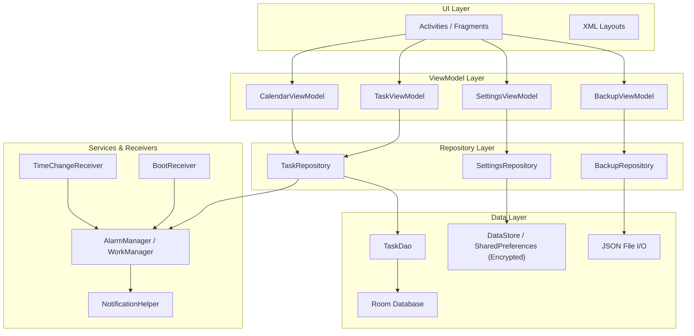

# 📋 Task Management App — Project Plan v2 (Chi tiết)

> **Project Code:** Android_UTH_01
> **Team Size:** 5 thành viên (1 Leader + 4 Members)
> **Tech Stack:** Kotlin + Android SDK + Room + ViewModel + LiveData + Coroutines
> **Thời gian dự kiến:** 8 tuần (8 Sprints, 1 tuần/sprint)

---

## 🏗️ Kiến trúc tổng quan (MVVM + Repository Pattern)



---

## 👥 Phân công thành viên

| Vai trò | Thành viên | Phụ trách chính |
|---------|-----------|----------------|
| **Leader (Core)** | Member 1 | Kiến trúc, Database, Repository, ViewModel, Data Model, Security (PIN), Git management |
| **UI Implementation** | Member 2 | Code lại giao diện theo design có sẵn (XML layouts, Activities, Fragments, states), Navigation |
| **Feature Developer 1** | Member 3 | CRUD Task, Task List, Filter/Sort, Recurring Tasks |
| **Feature Developer 2** | Member 4 | Notification, Alarm, Calendar View, Boot/Time Receiver |
| **QA & Backup** | Member 5 | Testing, Export/Import JSON, Demo video, Documentation |

---

## 📌 EPIC & STORY Breakdown (Chi tiết)

---

### 🟣 EPIC 1: Project Setup & Architecture (Leader — Member 1)

> Thiết lập nền tảng kiến trúc MVVM, database, repository pattern và các base class.

---

#### TMA-1 · Khởi tạo Android Studio Project

| Field | Detail |
|-------|--------|
| **Type** | Story |
| **Assignee** | Member 1 |
| **Priority** | 🔴 Highest |
| **Sprint** | Sprint 1 |
| **Description** | Tạo Android Studio project mới sử dụng Java, cấu hình `minSdk = 26`, `targetSdk = 34`. Thiết lập cấu trúc package theo kiến trúc MVVM: `data/`, `ui/`, `viewmodel/`, `notification/`, `receiver/`, `util/`. Cấu hình Gradle với các dependencies cần thiết: Room, LiveData, ViewModel, Material Design, RecyclerView. Đặt project trong thư mục `Code/` của repository. |
| **Đầu ra mong muốn** | ✅ File `build.gradle` (project & app) cấu hình đầy đủ dependencies<br>✅ Cấu trúc package: `com.team.taskmanager.{data, ui, viewmodel, notification, receiver, util}`<br>✅ `MainActivity.java` chạy được trên emulator (blank activity)<br>✅ Project nằm trong thư mục `Code/` |
| **Acceptance Criteria** | Project build thành công, chạy được trên emulator API 26+, cấu trúc thư mục đầy đủ |

---

#### TMA-2 · Thiết lập .gitignore, Gradle wrapper, cấu trúc repository

| Field | Detail |
|-------|--------|
| **Type** | Story |
| **Assignee** | Member 1 |
| **Priority** | 🔴 Highest |
| **Sprint** | Sprint 1 |
| **Description** | Tạo file `.gitignore` loại bỏ: `build/`, `.gradle/`, `local.properties`, `*.apk`, `*.aab`, `*.jks`, IDE-specific files. Giữ lại Gradle wrapper (`gradle/wrapper/`). Tạo cấu trúc thư mục root: `Code/`, `DOCX/`, `Extra/`, `PPTX/`, `README.md`. Đảm bảo không có build output, dependency cache, password hay secret nào bị commit. |
| **Đầu ra mong muốn** | ✅ File `.gitignore` đầy đủ rules<br>✅ Thư mục `gradle/wrapper/` có `gradle-wrapper.jar` + `gradle-wrapper.properties`<br>✅ Cấu trúc root: `Code/`, `DOCX/`, `Extra/`, `PPTX/`, `README.md`<br>✅ Không có file nhạy cảm trong Git history |
| **Acceptance Criteria** | `git status` không hiển thị file thừa; `./gradlew build` chạy thành công |

---

#### TMA-3 · Thiết kế Data Model (Entity: Task, RecurrenceRule)

| Field | Detail |
|-------|--------|
| **Type** | Story |
| **Assignee** | Member 1 |
| **Priority** | 🔴 Highest |
| **Sprint** | Sprint 1 |
| **Description** | Thiết kế các Room Entity phản ánh nghiệp vụ quản lý task. Entity `Task` chứa đầy đủ thông tin: id (PK, auto-generate), title, description, dueDate (long — timestamp), dueTime (long), priority (enum), status (enum), isCompleted (boolean), isRecurring (boolean), recurrenceType, recurrenceInterval, createdAt, updatedAt. Tạo các enum `Priority` (LOW, MEDIUM, HIGH, URGENT) và `TaskStatus` (TODO, IN_PROGRESS, COMPLETED, OVERDUE). Tạo TypeConverter cho enum ↔ String. |
| **Đầu ra mong muốn** | ✅ File `Task.java` — Room Entity với `@Entity`, `@PrimaryKey`, `@ColumnInfo` annotations<br>✅ File `Priority.java` — Enum (LOW, MEDIUM, HIGH, URGENT)<br>✅ File `TaskStatus.java` — Enum (TODO, IN_PROGRESS, COMPLETED, OVERDUE)<br>✅ File `Converters.java` — TypeConverter cho enum, Date<br>✅ Tài liệu ER diagram trong `DOCX/` |
| **Acceptance Criteria** | Entity compile thành công, TypeConverter hoạt động đúng, cover đủ fields theo Basic Requirements |

---

#### TMA-4 · Tạo Room Database + DAO (TaskDao)

| Field | Detail |
|-------|--------|
| **Type** | Story |
| **Assignee** | Member 1 |
| **Priority** | 🔴 Highest |
| **Sprint** | Sprint 1 |
| **Description** | Tạo `AppDatabase` extends `RoomDatabase` với singleton pattern (thread-safe). Tạo `TaskDao` interface với các query: `insert`, `update`, `delete`, `getAll`, `getById`, `getByStatus`, `getByPriority`, `getByDateRange`, `getOverdueTasks`, `searchByTitle`. Sử dụng `LiveData<List<Task>>` cho các query list. Cấu hình database version = 1, fallback strategy khi migration thất bại. |
| **Đầu ra mong muốn** | ✅ File `AppDatabase.java` — Singleton RoomDatabase class<br>✅ File `TaskDao.java` — Interface với `@Insert`, `@Update`, `@Delete`, `@Query` annotations<br>✅ Tối thiểu 10 query methods trong DAO<br>✅ Hỗ trợ `LiveData` return type cho observe |
| **Acceptance Criteria** | Database tạo thành công, tất cả CRUD operations hoạt động đúng, LiveData observe được dữ liệu |

---

#### TMA-5 · Tạo TaskRepository

| Field | Detail |
|-------|--------|
| **Type** | Story |
| **Assignee** | Member 1 |
| **Priority** | 🔴 Highest |
| **Sprint** | Sprint 1 |
| **Description** | Tạo `TaskRepository` làm abstraction layer giữa ViewModel và DAO. Repository chịu trách nhiệm: thực thi các database operation trên background thread (sử dụng `ExecutorService` hoặc `AsyncTask`), expose `LiveData` từ DAO lên ViewModel, xử lý business logic liên quan đến data (ví dụ: auto-set `updatedAt` khi update). Không cho phép ViewModel truy cập DAO trực tiếp. |
| **Đầu ra mong muốn** | ✅ File `TaskRepository.java` với constructor nhận `Application`<br>✅ Methods: `insert(Task)`, `update(Task)`, `delete(Task)`, `getAll()`, `getById(int)`, `getByStatus(TaskStatus)`, `getByPriority(Priority)`, `getByDateRange(long, long)`, `getOverdueTasks()`, `searchByTitle(String)`<br>✅ Tất cả write operations chạy trên background thread<br>✅ Return `LiveData` cho read operations |
| **Acceptance Criteria** | ViewModel chỉ tương tác qua Repository, không gọi DAO trực tiếp; main thread không bị block |

---

#### TMA-6 · Tạo Base ViewModel + State Management

| Field | Detail |
|-------|--------|
| **Type** | Story |
| **Assignee** | Member 1 |
| **Priority** | 🔴 Highest |
| **Sprint** | Sprint 1 |
| **Description** | Tạo `TaskViewModel` extends `AndroidViewModel`. ViewModel giữ `LiveData` cho danh sách task, task hiện tại, trạng thái filter/sort, và UI state (loading, error, success). Dữ liệu phải survive configuration change (xoay màn hình). Tạo class `UiState<T>` generic wrapper với các trạng thái: Loading, Success(data), Error(message), Empty. |
| **Đầu ra mong muốn** | ✅ File `TaskViewModel.java` extends `AndroidViewModel`<br>✅ File `UiState.java` — Generic wrapper class với Loading/Success/Error/Empty states<br>✅ `MutableLiveData` cho internal state, `LiveData` cho expose ra UI<br>✅ Methods: `loadAllTasks()`, `loadTaskById(int)`, `insertTask(Task)`, `updateTask(Task)`, `deleteTask(Task)`, `filterByStatus(TaskStatus)`, `sortBy(SortType)` |
| **Acceptance Criteria** | Xoay màn hình không mất dữ liệu; UI observe được trạng thái qua LiveData |

---

#### TMA-7 · Tách config ra khỏi business logic

| Field | Detail |
|-------|--------|
| **Type** | Story |
| **Assignee** | Member 1 |
| **Priority** | 🟡 Medium |
| **Sprint** | Sprint 1 |
| **Description** | Tạo file `Constants.java` chứa các constant dùng chung (notification channel ID, database name, preferences keys...). Đảm bảo không hard-code password, API secret hoặc private key trong source code. Nếu có config môi trường, đặt trong `local.properties` hoặc `BuildConfig`. Phân tách rõ ràng mock/simulator code với production code (nếu có). |
| **Đầu ra mong muốn** | ✅ File `Constants.java` chứa tất cả constant<br>✅ Không có hard-coded secret nào trong codebase (grep verify)<br>✅ Comment rõ ràng cho mock data vs. real data<br>✅ `local.properties` trong `.gitignore` |
| **Acceptance Criteria** | Code review pass — không tìm thấy hard-coded secrets; tất cả config tập trung 1 chỗ |

---

#### TMA-8 · Viết README.md đầy đủ

| Field | Detail |
|-------|--------|
| **Type** | Story |
| **Assignee** | Member 1 |
| **Priority** | 🟡 Medium |
| **Sprint** | Sprint 1 |
| **Description** | Viết README.md tại root repo với đầy đủ: tên đề tài + mã đề tài, danh sách thành viên (tên + MSSV + vai trò), mô tả kiến trúc MVVM, yêu cầu môi trường (Android Studio version, JDK version, min SDK, target SDK), hướng dẫn clone & chạy project, link video demo (sẽ bổ sung sau). Cập nhật liên tục khi có thay đổi. |
| **Đầu ra mong muốn** | ✅ File `README.md` tại root repo với các section:<br>&nbsp;&nbsp;— Tên & mã đề tài<br>&nbsp;&nbsp;— Danh sách thành viên (bảng)<br>&nbsp;&nbsp;— Kiến trúc (diagram hoặc mô tả)<br>&nbsp;&nbsp;— Yêu cầu môi trường<br>&nbsp;&nbsp;— Hướng dẫn cài đặt & chạy<br>&nbsp;&nbsp;— Link video demo (placeholder) |
| **Acceptance Criteria** | README theo đúng format yêu cầu của thầy; đọc xong có thể clone & chạy được project |

---

### 🟣 EPIC 2: UI Implementation & Navigation (Member 2)

> ⚠️ **Giao diện đã được thiết kế sẵn.** Member 2 chỉ cần implement (code) theo design, KHÔNG cần thiết kế mới.

---

#### TMA-9 · Implement Theme & Color Scheme theo design có sẵn

| Field | Detail |
|-------|--------|
| **Type** | Story |
| **Assignee** | Member 2 |
| **Priority** | 🔴 Highest |
| **Sprint** | Sprint 1 |
| **Description** | Dựa trên bản design có sẵn, code lại hệ thống theme trong Android: `colors.xml` (primary, secondary, surface, background, error, on-colors...), `styles.xml` / `themes.xml` (AppTheme kế thừa Material), `dimens.xml` (spacing, radius, text sizes), `font` resources (nếu design dùng custom font). Đảm bảo tất cả màn hình sử dụng theme attributes thay vì hard-code giá trị. |
| **Đầu ra mong muốn** | ✅ File `res/values/colors.xml` — palette đúng design<br>✅ File `res/values/themes.xml` — AppTheme + các style con<br>✅ File `res/values/dimens.xml` — spacing, corner radius, text sizes<br>✅ File `res/values/strings.xml` — tất cả text dùng string resource (không hard-code)<br>✅ Font resources (nếu cần) trong `res/font/` |
| **Acceptance Criteria** | Theme nhất quán toàn app, đúng theo bản design; không có hard-coded color/dimen trong XML layout |

---

#### TMA-10 · Implement Main Activity + Bottom Navigation theo design

| Field | Detail |
|-------|--------|
| **Type** | Story |
| **Assignee** | Member 2 |
| **Priority** | 🔴 Highest |
| **Sprint** | Sprint 1 |
| **Description** | Code `MainActivity.java` với `BottomNavigationView` theo design. Sử dụng Navigation Component hoặc FragmentTransaction để chuyển giữa 3 tab chính: Task List, Calendar, Settings. Tạo `nav_graph.xml` (nếu dùng Navigation Component) hoặc logic chuyển Fragment thủ công. Đảm bảo giữ state khi chuyển tab (không recreate Fragment). Implement icon + label cho mỗi tab theo design. |
| **Đầu ra mong muốn** | ✅ File `activity_main.xml` — layout với `BottomNavigationView` + `FragmentContainerView`<br>✅ File `MainActivity.java` — logic chuyển tab<br>✅ File `res/menu/bottom_nav_menu.xml` — menu items (3 tabs)<br>✅ File `nav_graph.xml` (nếu dùng Navigation Component)<br>✅ Icons cho 3 tab trong `res/drawable/` |
| **Acceptance Criteria** | Chuyển tab mượt mà, không mất dữ liệu khi switch; giao diện đúng design |

---

#### TMA-11 · Code layout Task List Screen theo design

| Field | Detail |
|-------|--------|
| **Type** | Story |
| **Assignee** | Member 2 |
| **Priority** | 🔴 Highest |
| **Sprint** | Sprint 1 |
| **Description** | Code `TaskListFragment.java` + `fragment_task_list.xml` theo design. Sử dụng `RecyclerView` + `TaskAdapter` + `TaskViewHolder`. Mỗi item hiển thị: title, due date/time, priority badge (color-coded), status indicator, checkbox complete. Thêm FAB (Floating Action Button) để tạo task mới. Implement swipe-to-delete hoặc long-press context menu nếu design có. Tích hợp filter/sort chips hoặc toolbar menu. |
| **Đầu ra mong muốn** | ✅ File `fragment_task_list.xml` — layout đúng design với RecyclerView + FAB<br>✅ File `item_task.xml` — layout cho mỗi task item đúng design<br>✅ File `TaskListFragment.java` — Fragment class<br>✅ File `TaskAdapter.java` — RecyclerView.Adapter<br>✅ File `TaskViewHolder.java` — ViewHolder bind data |
| **Acceptance Criteria** | Danh sách task hiển thị đúng design; FAB hoạt động; scroll mượt; click item mở detail |

---

#### TMA-12 · Code layout Add/Edit Task Screen theo design

| Field | Detail |
|-------|--------|
| **Type** | Story |
| **Assignee** | Member 2 |
| **Priority** | 🔴 Highest |
| **Sprint** | Sprint 1 |
| **Description** | Code `AddEditTaskActivity.java` (hoặc Fragment) + layout theo design. Form bao gồm: TextInputLayout cho title (required), TextInputLayout cho description, DatePicker button cho due date, TimePicker button cho due time, Spinner/Dropdown cho priority, Spinner/Dropdown cho recurrence type (None/Daily/Weekly/Monthly), nút Save và Cancel. Activity phải phân biệt mode Add (tạo mới) vs. Edit (load task có sẵn qua Intent extra). |
| **Đầu ra mong muốn** | ✅ File `activity_add_edit_task.xml` — layout đúng design<br>✅ File `AddEditTaskActivity.java` — Activity class<br>✅ DatePickerDialog & TimePickerDialog khi tap vào field date/time<br>✅ Priority dropdown/spinner với 4 mức<br>✅ Recurrence dropdown/spinner<br>✅ Phân biệt Add mode vs. Edit mode (title bar thay đổi) |
| **Acceptance Criteria** | Form hiển thị đúng design; date/time picker hoạt động; Edit mode load đúng dữ liệu cũ |

---

#### TMA-13 · Code layout Task Detail Screen theo design

| Field | Detail |
|-------|--------|
| **Type** | Story |
| **Assignee** | Member 2 |
| **Priority** | 🟠 High |
| **Sprint** | Sprint 2 |
| **Description** | Code `TaskDetailActivity.java` (hoặc Fragment) + layout theo design. Hiển thị đầy đủ thông tin task: title, description, due date/time (formatted), priority (badge), status, recurrence info, created/updated timestamps. Có 3 action buttons: Edit (mở AddEditTask ở Edit mode), Delete (show confirm dialog), Mark Complete/Uncomplete (toggle). Hiển thị visual indicator cho task overdue (ví dụ: red border hoặc warning icon). |
| **Đầu ra mong muốn** | ✅ File `activity_task_detail.xml` — layout đúng design<br>✅ File `TaskDetailActivity.java` — Activity class<br>✅ Nút Edit → mở AddEditTaskActivity với task data<br>✅ Nút Delete → AlertDialog confirm → delete<br>✅ Nút Complete → toggle trạng thái<br>✅ Visual indicator cho OVERDUE tasks |
| **Acceptance Criteria** | Hiển thị đầy đủ info theo design; 3 action buttons hoạt động; overdue visual rõ ràng |

---

#### TMA-14 · Implement UI States theo design: Loading, Empty, Error, Success, Overdue

| Field | Detail |
|-------|--------|
| **Type** | Story |
| **Assignee** | Member 2 |
| **Priority** | 🔴 Highest |
| **Sprint** | Sprint 2 |
| **Description** | Implement các trạng thái UI cho tất cả màn hình chính. Sử dụng `ViewSwitcher` hoặc show/hide View theo `UiState` từ ViewModel. **Loading**: ProgressBar hoặc shimmer placeholder khi đang load dữ liệu. **Empty**: Icon + message "Chưa có task nào" + button "Tạo task đầu tiên". **Error**: Icon lỗi + message + button Retry. **Success**: Snackbar/Toast khi thao tác thành công (tạo/sửa/xóa task). **Overdue**: Highlight visual cho task quá hạn (màu đỏ, icon cảnh báo). |
| **Đầu ra mong muốn** | ✅ File `layout_loading_state.xml` — include layout cho loading<br>✅ File `layout_empty_state.xml` — include layout cho empty<br>✅ File `layout_error_state.xml` — include layout cho error + retry button<br>✅ Logic show/hide state trong `TaskListFragment.java` dựa trên `UiState`<br>✅ Snackbar/Toast cho success actions<br>✅ Overdue visual style (color, icon) trong `item_task.xml` |
| **Acceptance Criteria** | Mỗi state hiển thị đúng design; transition mượt giữa các state; retry button hoạt động |

**Sub-tasks:**

| ID | Summary | Đầu ra |
|----|---------|--------|
| TMA-14.1 | Code Loading View theo design | `layout_loading_state.xml` + ProgressBar/shimmer |
| TMA-14.2 | Code Empty State View theo design | `layout_empty_state.xml` + icon + message + CTA button |
| TMA-14.3 | Code Error State View theo design | `layout_error_state.xml` + error icon + message + retry button |
| TMA-14.4 | Code Success feedback | Snackbar helper method reusable |
| TMA-14.5 | Code Overdue visual cho task quá hạn | Style/drawable cho overdue items |

---

#### TMA-15 · Code layout Settings Screen theo design

| Field | Detail |
|-------|--------|
| **Type** | Story |
| **Assignee** | Member 2 |
| **Priority** | 🟡 Medium |
| **Sprint** | Sprint 2 |
| **Description** | Code `SettingsFragment.java` + `fragment_settings.xml` theo design. Bao gồm: SwitchCompat toggle cho PIN Lock (on/off), SwitchCompat toggle cho Notification (on/off), section Backup/Restore (nút Export, nút Import), thông tin app (version, team). Sử dụng PreferenceFragment hoặc custom layout tùy design. |
| **Đầu ra mong muốn** | ✅ File `fragment_settings.xml` — layout đúng design<br>✅ File `SettingsFragment.java` — Fragment class<br>✅ SwitchCompat cho PIN lock toggle<br>✅ SwitchCompat cho notification toggle<br>✅ Nút navigate đến Backup/Restore screen |
| **Acceptance Criteria** | Settings hiển thị đúng design; toggle states persist khi quay lại màn hình |

---

#### TMA-16 · Code layout Calendar View Screen theo design

| Field | Detail |
|-------|--------|
| **Type** | Story |
| **Assignee** | Member 2 |
| **Priority** | 🟠 High |
| **Sprint** | Sprint 2 |
| **Description** | Code `CalendarFragment.java` + `fragment_calendar.xml` theo design. Sử dụng `CalendarView` hoặc thư viện calendar (MaterialCalendarView) hoặc custom grid. Hiển thị: lịch tháng với các ngày có task được đánh dấu (dot indicator hoặc highlight), phần dưới là danh sách task của ngày được chọn (RecyclerView). Hỗ trợ swipe/navigate giữa các tháng. |
| **Đầu ra mong muốn** | ✅ File `fragment_calendar.xml` — layout đúng design (calendar + task list)<br>✅ File `CalendarFragment.java` — Fragment class<br>✅ Calendar widget hiển thị tháng, navigate tháng trước/sau<br>✅ Dot indicator cho ngày có task<br>✅ RecyclerView phía dưới hiển thị tasks của ngày selected |
| **Acceptance Criteria** | Calendar hiển thị đúng design; tap ngày → hiện task list; scroll tháng hoạt động |

---

#### TMA-17 · Code PIN Lock Screen theo design

| Field | Detail |
|-------|--------|
| **Type** | Story |
| **Assignee** | Member 2 |
| **Priority** | 🟡 Medium |
| **Sprint** | Sprint 3 |
| **Description** | Code `PinLockActivity.java` + layout theo design. Hai mode: **Enter PIN** (khi mở app, nhập 4-6 digit PIN) và **Set/Change PIN** (nhập PIN mới + confirm). Giao diện: keypad số 0-9, nút xóa (backspace), indicator dots cho PIN đã nhập, hiển thị lỗi khi PIN sai. Có logic giới hạn số lần nhập sai (hiển thị trong UI). |
| **Đầu ra mong muốn** | ✅ File `activity_pin_lock.xml` — layout đúng design (keypad + dots)<br>✅ File `PinLockActivity.java` — Activity class<br>✅ Custom keypad (hoặc dùng GridLayout với buttons 0-9)<br>✅ PIN indicator dots (4-6 dots)<br>✅ Error text hiển thị khi PIN sai<br>✅ Phân biệt mode Enter vs. Set/Change |
| **Acceptance Criteria** | PIN screen đúng design; keypad hoạt động; indicator dots animate khi nhập; error message hiển thị |

---

#### TMA-18 · Code layout Backup/Restore Screen theo design

| Field | Detail |
|-------|--------|
| **Type** | Story |
| **Assignee** | Member 2 |
| **Priority** | 🟡 Medium |
| **Sprint** | Sprint 3 |
| **Description** | Code `BackupRestoreActivity.java` (hoặc Fragment) + layout theo design. Bao gồm: nút "Export Data" (xuất JSON), nút "Import Data" (nhập JSON), hiển thị lần backup gần nhất (timestamp), progress indicator khi đang export/import, trạng thái thành công (checkmark + message) hoặc thất bại (error icon + message). |
| **Đầu ra mong muốn** | ✅ File `activity_backup_restore.xml` — layout đúng design<br>✅ File `BackupRestoreActivity.java` — Activity class<br>✅ Nút Export + nút Import<br>✅ ProgressBar khi đang xử lý<br>✅ Success/Error state UI<br>✅ Hiển thị last backup timestamp |
| **Acceptance Criteria** | Giao diện đúng design; progress indicator hoạt động; success/error states hiển thị đúng |

---

#### TMA-19 · Xử lý screen recreation & configuration change

| Field | Detail |
|-------|--------|
| **Type** | Story |
| **Assignee** | Member 2 |
| **Priority** | 🟠 High |
| **Sprint** | Sprint 3 |
| **Description** | Đảm bảo tất cả màn hình xử lý đúng configuration change: xoay màn hình (portrait ↔ landscape), thay đổi font size, thay đổi locale. Dữ liệu form (đang nhập dở) phải được giữ qua `ViewModel` hoặc `onSaveInstanceState`. RecyclerView scroll position phải được restore. Dialog đang hiển thị không bị dismiss. Test tất cả màn hình với "Don't keep activities" enabled trong Developer Options. |
| **Đầu ra mong muốn** | ✅ Tất cả Activity/Fragment giữ dữ liệu qua config change<br>✅ `onSaveInstanceState` / `onRestoreInstanceState` cho form data<br>✅ RecyclerView scroll position restored<br>✅ Dialog survive rotation<br>✅ Test report: list tất cả màn hình + kết quả test rotation |
| **Acceptance Criteria** | App không crash khi xoay; dữ liệu form không mất; dialog không dismiss; scroll position giữ nguyên |

---

### 🟣 EPIC 3: Task CRUD & Business Logic (Member 3)

> Xây dựng toàn bộ logic tạo, sửa, xóa, hoàn thành task, filter/sort và recurring tasks.

---

#### TMA-20 · Implement Create Task

| Field | Detail |
|-------|--------|
| **Type** | Story |
| **Assignee** | Member 3 |
| **Priority** | 🔴 Highest |
| **Sprint** | Sprint 1 |
| **Description** | Implement logic tạo task mới trong `AddEditTaskActivity`. Khi user nhấn Save: validate required fields (title không rỗng, due date hợp lệ), tạo object `Task` với dữ liệu từ form, set `createdAt` = current timestamp, set `status` = TODO, gọi `TaskViewModel.insertTask()`. Nếu thành công → show Snackbar + navigate back. Nếu validation fail → highlight field lỗi + hiển thị error message inline. |
| **Đầu ra mong muốn** | ✅ Logic validate trong `AddEditTaskActivity.java`: title required, date valid<br>✅ Gọi `viewModel.insertTask(task)` khi validate pass<br>✅ Error message inline trên TextInputLayout khi validation fail<br>✅ Snackbar "Task created successfully" khi thành công<br>✅ Navigate back (finish Activity) sau khi save thành công |
| **Acceptance Criteria** | Tạo task thành công lưu vào DB; validation hoạt động cho từng field; UI feedback rõ ràng |

---

#### TMA-21 · Implement Edit Task

| Field | Detail |
|-------|--------|
| **Type** | Story |
| **Assignee** | Member 3 |
| **Priority** | 🔴 Highest |
| **Sprint** | Sprint 1 |
| **Description** | Implement logic chỉnh sửa task trong `AddEditTaskActivity` (Edit mode). Khi mở ở Edit mode: nhận task ID qua Intent extra, load task từ ViewModel, populate tất cả fields vào form. Khi Save: validate fields giống Create, cập nhật `updatedAt` = current timestamp, gọi `viewModel.updateTask()`. Đảm bảo nếu user thay đổi due date/time → cập nhật lại alarm/notification tương ứng (trigger qua callback). |
| **Đầu ra mong muốn** | ✅ `AddEditTaskActivity.java` nhận `EXTRA_TASK_ID` từ Intent<br>✅ Load task by ID → populate form fields<br>✅ Validate + update task khi Save<br>✅ `updatedAt` auto-set khi update<br>✅ Callback/Event để Member 4 reschedule notification khi date/time thay đổi |
| **Acceptance Criteria** | Edit mode load đúng dữ liệu cũ; save cập nhật DB; updatedAt thay đổi; alarm reschedule |

---

#### TMA-22 · Implement Delete Task

| Field | Detail |
|-------|--------|
| **Type** | Story |
| **Assignee** | Member 3 |
| **Priority** | 🔴 Highest |
| **Sprint** | Sprint 2 |
| **Description** | Implement logic xóa task. Khi user nhấn Delete (từ Detail screen hoặc swipe trong list): hiển thị `AlertDialog` confirm "Bạn có chắc chắn muốn xóa task này?". Nếu confirm → gọi `viewModel.deleteTask()`, cancel alarm liên quan (trigger event cho Member 4), show Snackbar "Task deleted" với nút Undo (optional). Nếu cancel → dismiss dialog. Nếu task là recurring → hỏi "Xóa chỉ task này hay tất cả recurring?" |
| **Đầu ra mong muốn** | ✅ `AlertDialog` confirm delete trong `TaskDetailActivity.java`<br>✅ Gọi `viewModel.deleteTask(task)` khi confirm<br>✅ Event/callback để cancel alarm khi task bị xóa<br>✅ Snackbar "Task deleted" (optional: Undo action)<br>✅ UI cập nhật list sau khi xóa (LiveData auto-update) |
| **Acceptance Criteria** | Confirm dialog hiển thị; task xóa khỏi DB; alarm bị cancel; UI update real-time |

---

#### TMA-23 · Implement Mark Task as Completed

| Field | Detail |
|-------|--------|
| **Type** | Story |
| **Assignee** | Member 3 |
| **Priority** | 🔴 Highest |
| **Sprint** | Sprint 2 |
| **Description** | Implement toggle complete/uncomplete cho task. Hai entry points: (1) Checkbox trong task list item, (2) Button trong Task Detail screen. Khi toggle completed: set `isCompleted = true/false`, set `status = COMPLETED / TODO`, set `updatedAt` = current timestamp. Nếu task recurring và được mark completed → trigger tạo task instance tiếp theo (gọi logic recurring của TMA-26). Nếu mark uncompleted → revert status. |
| **Đầu ra mong muốn** | ✅ Checkbox click listener trong `TaskAdapter.java`<br>✅ Complete button trong `TaskDetailActivity.java`<br>✅ `viewModel.toggleComplete(task)` method<br>✅ Logic: completed → status = COMPLETED, uncompleted → status = TODO<br>✅ UI update: item visual change (strikethrough title, dimmed, checkmark) |
| **Acceptance Criteria** | Toggle hoạt động từ cả list và detail; status/isCompleted đồng bộ; UI feedback tức thì |

---

#### TMA-24 · Implement Task List Filter

| Field | Detail |
|-------|--------|
| **Type** | Story |
| **Assignee** | Member 3 |
| **Priority** | 🟠 High |
| **Sprint** | Sprint 2 |
| **Description** | Implement filter cho danh sách task. Thêm filter options trong UI (filter chips, dropdown, hoặc dialog): **By Status** (All, TODO, IN_PROGRESS, COMPLETED, OVERDUE), **By Priority** (All, LOW, MEDIUM, HIGH, URGENT), **By Due Date** (Today, This Week, This Month, Overdue, Custom Range). Khi user chọn filter → ViewModel query DB với điều kiện tương ứng → cập nhật LiveData → UI auto-update. Hỗ trợ combine multiple filters (ví dụ: HIGH priority + This Week). |
| **Đầu ra mong muốn** | ✅ Filter UI component (Chips/Dropdown/Dialog) trong `TaskListFragment.java`<br>✅ `TaskViewModel.applyFilter(FilterCriteria)` method<br>✅ File `FilterCriteria.java` — data class chứa filter conditions<br>✅ DAO queries hỗ trợ filter combinations<br>✅ Active filter indicator trong UI (hiển thị filter đang active) |
| **Acceptance Criteria** | Filter hoạt động chính xác cho từng tiêu chí; combine filters đúng; clear filter trở về All |

---

#### TMA-25 · Implement Task List Sort

| Field | Detail |
|-------|--------|
| **Type** | Story |
| **Assignee** | Member 3 |
| **Priority** | 🟠 High |
| **Sprint** | Sprint 2 |
| **Description** | Implement sort cho danh sách task. Options: **By Due Date** (sớm nhất trước / muộn nhất trước), **By Priority** (cao nhất trước / thấp nhất trước), **By Created Date** (mới nhất / cũ nhất), **By Title** (A-Z / Z-A). UI: sort button trong toolbar hoặc popup menu. Sort preference persist qua SharedPreferences (giữ lựa chọn khi quay lại app). Default sort: Due Date ascending. |
| **Đầu ra mong muốn** | ✅ Sort menu/button trong `TaskListFragment.java` toolbar<br>✅ `TaskViewModel.applySort(SortType, SortOrder)` method<br>✅ File `SortType.java` — enum (DUE_DATE, PRIORITY, CREATED_DATE, TITLE)<br>✅ File `SortOrder.java` — enum (ASC, DESC)<br>✅ Sort preference lưu trong SharedPreferences<br>✅ Sort indicator trong UI (hiển thị sort hiện tại) |
| **Acceptance Criteria** | Sort hoạt động đúng cho mỗi tiêu chí + direction; preference persist sau khi restart app |

---

#### TMA-26 · Implement Recurring Tasks

| Field | Detail |
|-------|--------|
| **Type** | Story |
| **Assignee** | Member 3 |
| **Priority** | 🟠 High |
| **Sprint** | Sprint 3 |
| **Description** | Implement logic recurring tasks (daily, weekly, monthly). Khi user tạo task với recurrence != None: lưu recurrence type + interval vào Task entity. Khi recurring task được mark completed → tự động tạo task mới với due date tính theo rule (ví dụ: daily → +1 ngày, weekly → +7 ngày, monthly → +1 tháng). Task mới inherit: title, description, priority, recurrence rule. Task mới có status = TODO. Xử lý edge case: tháng 31 → tháng tiếp theo không có 31 ngày. |
| **Đầu ra mong muốn** | ✅ Logic tính next due date trong `RecurrenceHelper.java`<br>✅ Method `calculateNextDueDate(Task, RecurrenceType)` trả về Date tiếp theo<br>✅ Auto-create next task instance khi complete recurring task<br>✅ UI hiển thị recurrence info (icon + text "Repeats daily/weekly/monthly")<br>✅ Edit recurring: option "Edit this task only" vs. "Edit all future tasks"<br>✅ Delete recurring: option "Delete this task only" vs. "Delete all" |
| **Acceptance Criteria** | Recurring task tạo instance mới đúng rule; edge cases handled; UI hiển thị recurrence info |

**Sub-tasks:**

| ID | Summary | Đầu ra |
|----|---------|--------|
| TMA-26.1 | Logic tính ngày tiếp theo | `RecurrenceHelper.java` với `calculateNextDueDate()` |
| TMA-26.2 | UI chọn recurrence type | Spinner/Dropdown trong Add/Edit form |
| TMA-26.3 | Auto-create next task instance | Logic trong `TaskRepository` hoặc `TaskViewModel` |
| TMA-26.4 | Edit/Delete recurring task dialog | AlertDialog với options "This only" / "All future" |

---

#### TMA-27 · Implement Input Validation cho tất cả form fields

| Field | Detail |
|-------|--------|
| **Type** | Story |
| **Assignee** | Member 3 |
| **Priority** | 🔴 Highest |
| **Sprint** | Sprint 2 |
| **Description** | Implement validation toàn diện cho form Add/Edit Task. Rules: **Title** — required, không rỗng, max 200 characters. **Description** — optional, max 1000 characters. **Due Date** — required, không được là ngày trong quá khứ (khi tạo mới). **Due Time** — optional, nhưng nếu due date là hôm nay thì time phải trong tương lai. **Priority** — required, phải chọn 1 trong 4 mức. Hiển thị error inline (setError trên TextInputLayout). Validate lại khi user sửa field (TextWatcher). Validate toàn bộ form khi nhấn Save trước khi submit. |
| **Đầu ra mong muốn** | ✅ File `ValidationHelper.java` — utility class với static methods validate từng field<br>✅ `validateTitle(String)`, `validateDueDate(long)`, `validateDueTime(long, long)` methods<br>✅ TextWatcher real-time validation trên title field<br>✅ `TextInputLayout.setError()` cho inline error messages<br>✅ `validateAll()` method check toàn bộ form trước khi save |
| **Acceptance Criteria** | Không thể save task với data không hợp lệ; error messages rõ ràng; real-time validation cho title |

---

#### TMA-28 · Implement Overdue Task Detection

| Field | Detail |
|-------|--------|
| **Type** | Story |
| **Assignee** | Member 3 |
| **Priority** | 🟡 Medium |
| **Sprint** | Sprint 3 |
| **Description** | Implement logic tự động phát hiện và đánh dấu task quá hạn. Khi app mở hoặc khi list được load: kiểm tra tất cả task có `dueDate < currentDate` và `status != COMPLETED` → auto-update `status = OVERDUE`. Có thể dùng WorkManager để check periodic (mỗi giờ hoặc khi app khởi động). Task OVERDUE hiển thị khác biệt trong list (dựa vào UI state từ TMA-14.5). Khi user update due date của overdue task về tương lai → revert status về TODO. |
| **Đầu ra mong muốn** | ✅ Method `checkAndUpdateOverdueTasks()` trong `TaskRepository.java`<br>✅ Gọi method này khi app start (`Application.onCreate` hoặc `MainActivity.onResume`)<br>✅ DAO query: `UPDATE tasks SET status = 'OVERDUE' WHERE dueDate < ? AND status != 'COMPLETED'`<br>✅ Logic revert OVERDUE → TODO khi due date được update về tương lai<br>✅ (Optional) WorkManager periodic check |
| **Acceptance Criteria** | Task quá hạn tự động OVERDUE; revert khi date cập nhật; không ảnh hưởng completed tasks |

---

### 🟣 EPIC 4: Notifications, Calendar & System Events (Member 4)

> Xây dựng hệ thống notification, alarm, calendar view và xử lý system events.

---

#### TMA-29 · Implement NotificationHelper

| Field | Detail |
|-------|--------|
| **Type** | Story |
| **Assignee** | Member 4 |
| **Priority** | 🔴 Highest |
| **Sprint** | Sprint 2 |
| **Description** | Tạo `NotificationHelper.java` utility class quản lý notifications. Tạo Notification Channel (required Android 8.0+) với name, description, importance level. Build notification với: title = task title, body = task description hoặc "Task due at [time]", icon, priority mapping (URGENT → HIGH importance, LOW → LOW importance). Hỗ trợ actions: "Mark Complete" (PendingIntent), "Snooze" (PendingIntent delay 15 phút). Notification ID = task ID để tránh trùng. |
| **Đầu ra mong muốn** | ✅ File `NotificationHelper.java` với methods:<br>&nbsp;&nbsp;— `createNotificationChannel(Context)`<br>&nbsp;&nbsp;— `showTaskReminder(Context, Task)` → build & show notification<br>&nbsp;&nbsp;— `cancelNotification(Context, int taskId)`<br>✅ Notification Channel tạo trong `Application.onCreate()`<br>✅ PendingIntent cho action "Mark Complete"<br>✅ PendingIntent cho action "Snooze 15min"<br>✅ Notification icon trong `res/drawable/` |
| **Acceptance Criteria** | Notification hiển thị đúng title/body/icon; actions hoạt động; channel tạo thành công |

---

#### TMA-30 · Implement AlarmManager để schedule task reminders

| Field | Detail |
|-------|--------|
| **Type** | Story |
| **Assignee** | Member 4 |
| **Priority** | 🔴 Highest |
| **Sprint** | Sprint 2 |
| **Description** | Tạo `AlarmScheduler.java` utility class để schedule/cancel alarms cho task reminders. Sử dụng `AlarmManager.setExactAndAllowWhileIdle()` cho exact timing (Android 6.0+). Handle `SCHEDULE_EXACT_ALARM` permission cho Android 12+ (API 31). Tạo `AlarmReceiver.java` (BroadcastReceiver) nhận alarm trigger → gọi `NotificationHelper.showTaskReminder()`. Khi task được tạo/edit với due date → schedule alarm. Khi task bị xóa hoặc completed → cancel alarm. Alarm time = dueDate + dueTime (hoặc dueDate 9:00 AM nếu không có time). |
| **Đầu ra mong muốn** | ✅ File `AlarmScheduler.java` với methods:<br>&nbsp;&nbsp;— `scheduleAlarm(Context, Task)` → set exact alarm<br>&nbsp;&nbsp;— `cancelAlarm(Context, int taskId)` → cancel PendingIntent<br>&nbsp;&nbsp;— `rescheduleAlarm(Context, Task)` → cancel old + schedule new<br>✅ File `AlarmReceiver.java` extends `BroadcastReceiver`<br>✅ Handle `SCHEDULE_EXACT_ALARM` permission (Android 12+)<br>✅ PendingIntent với `FLAG_IMMUTABLE` + unique request code = taskId<br>✅ Manifest: `<receiver android:name=".receiver.AlarmReceiver" />` |
| **Acceptance Criteria** | Alarm fire đúng thời gian; notification hiển thị; cancel hoạt động; permission handled |

**Sub-tasks:**

| ID | Summary | Đầu ra |
|----|---------|--------|
| TMA-30.1 | Tạo AlarmScheduler utility class | `AlarmScheduler.java` |
| TMA-30.2 | Handle SCHEDULE_EXACT_ALARM permission | Permission request + fallback logic |
| TMA-30.3 | Tạo AlarmReceiver BroadcastReceiver | `AlarmReceiver.java` + manifest registration |
| TMA-30.4 | Cancel alarm khi task xóa/update | Integration với TaskRepository events |

---

#### TMA-31 · Handle Notification Permission (Android 13+)

| Field | Detail |
|-------|--------|
| **Type** | Story |
| **Assignee** | Member 4 |
| **Priority** | 🔴 Highest |
| **Sprint** | Sprint 2 |
| **Description** | Implement runtime permission request cho `POST_NOTIFICATIONS` (Android 13+, API 33). Flow: (1) Check permission status, (2) Nếu chưa cấp → show rationale dialog giải thích "App cần gửi notification để nhắc nhở task", (3) Request permission, (4) Nếu granted → schedule alarms bình thường, (5) Nếu denied → show message "Bạn sẽ không nhận được nhắc nhở. Vào Settings để bật lại", (6) Nếu "Don't ask again" → hướng dẫn vào System Settings. Sử dụng `ActivityResultLauncher` (không dùng deprecated `onRequestPermissionsResult`). |
| **Đầu ra mong muốn** | ✅ Permission request trong `MainActivity.java` hoặc `TaskListFragment.java`<br>✅ `ActivityResultLauncher<String>` cho POST_NOTIFICATIONS<br>✅ Rationale dialog giải thích mục đích<br>✅ Fallback UI khi permission denied<br>✅ Deep link to System Settings khi "Don't ask again"<br>✅ Manifest: `<uses-permission android:name="android.permission.POST_NOTIFICATIONS" />` |
| **Acceptance Criteria** | Permission request hiển thị đúng; app hoạt động cả khi granted/denied; rationale rõ ràng |

---

#### TMA-32 · Implement BootReceiver (khôi phục alarms sau reboot)

| Field | Detail |
|-------|--------|
| **Type** | Story |
| **Assignee** | Member 4 |
| **Priority** | 🟠 High |
| **Sprint** | Sprint 3 |
| **Description** | Tạo `BootReceiver.java` extends `BroadcastReceiver`, lắng nghe `BOOT_COMPLETED`. Khi device reboot → tất cả alarms bị mất → BootReceiver phải reschedule tất cả active reminders. Flow: (1) Nhận BOOT_COMPLETED broadcast, (2) Query tất cả tasks có `dueDate >= now` và `status != COMPLETED`, (3) Với mỗi task → gọi `AlarmScheduler.scheduleAlarm()`. Chạy trên background thread (không block main). Sử dụng `goAsync()` nếu cần thêm thời gian xử lý. |
| **Đầu ra mong muốn** | ✅ File `BootReceiver.java` extends `BroadcastReceiver`<br>✅ Manifest: `<receiver>` với `<intent-filter>` cho `BOOT_COMPLETED`<br>✅ Manifest: `<uses-permission android:name="android.permission.RECEIVE_BOOT_COMPLETED" />`<br>✅ Logic query pending tasks + reschedule alarms<br>✅ Background thread execution (goAsync hoặc IntentService) |
| **Acceptance Criteria** | Sau reboot → tất cả reminders được khôi phục; alarm fire đúng thời gian; không ANR |

---

#### TMA-33 · Implement TimeChangeReceiver

| Field | Detail |
|-------|--------|
| **Type** | Story |
| **Assignee** | Member 4 |
| **Priority** | 🟠 High |
| **Sprint** | Sprint 3 |
| **Description** | Tạo `TimeChangeReceiver.java` extends `BroadcastReceiver`, lắng nghe: `ACTION_TIME_CHANGED` (user thay đổi giờ), `ACTION_TIMEZONE_CHANGED` (thay đổi timezone), `ACTION_DATE_CHANGED` (ngày thay đổi). Khi nhận event → reschedule tất cả alarms vì thời gian đã thay đổi (logic tương tự BootReceiver). Đồng thời re-check overdue tasks (vì timezone change có thể làm task trở thành overdue hoặc ngược lại). |
| **Đầu ra mong muốn** | ✅ File `TimeChangeReceiver.java` extends `BroadcastReceiver`<br>✅ Manifest: `<receiver>` với `<intent-filter>` cho 3 actions: TIME_SET, TIMEZONE_CHANGED, DATE_CHANGED<br>✅ Logic reschedule tất cả active alarms<br>✅ Trigger `checkAndUpdateOverdueTasks()` sau time change<br>✅ Background thread execution |
| **Acceptance Criteria** | Alarms reschedule khi time/timezone/date change; overdue tasks re-checked; không ANR |

---

#### TMA-34 · Implement Calendar View logic

| Field | Detail |
|-------|--------|
| **Type** | Story |
| **Assignee** | Member 4 |
| **Priority** | 🟠 High |
| **Sprint** | Sprint 2 |
| **Description** | Implement logic cho Calendar View (UI đã code bởi Member 2). Khi CalendarFragment load → query tasks trong tháng hiện tại → đánh dấu ngày có task trên calendar. Khi user tap vào ngày → query tasks của ngày đó → hiển thị trong RecyclerView phía dưới. Khi navigate tháng (prev/next) → query tasks tháng mới. Optimize: cache tasks per month, chỉ query DB khi navigate sang tháng mới chưa cache. |
| **Đầu ra mong muốn** | ✅ Logic trong `CalendarFragment.java`: load tasks by month, mark dates<br>✅ `CalendarViewModel.loadTasksForMonth(int year, int month)` method<br>✅ `CalendarViewModel.getTasksForDate(long date)` method<br>✅ Map<Long, List<Task>> cache cho tháng hiện tại<br>✅ Event listener khi user tap ngày → update task list |
| **Acceptance Criteria** | Calendar đánh dấu đúng ngày có task; tap ngày → hiện task list; navigate tháng hoạt động |

---

#### TMA-35 · Implement CalendarViewModel

| Field | Detail |
|-------|--------|
| **Type** | Story |
| **Assignee** | Member 4 |
| **Priority** | 🟠 High |
| **Sprint** | Sprint 2 |
| **Description** | Tạo `CalendarViewModel.java` extends `AndroidViewModel`. Quản lý state: selectedDate (LiveData), tasksForMonth (LiveData), tasksForSelectedDate (LiveData), currentMonth/currentYear. Methods: `loadTasksForMonth(year, month)` — query TaskRepository với date range, `selectDate(date)` — filter tasks cho ngày selected, `navigateMonth(direction)` — +1/-1 tháng, auto-load tasks. Sử dụng MediatorLiveData nếu cần combine multiple sources. |
| **Đầu ra mong muốn** | ✅ File `CalendarViewModel.java`<br>✅ `LiveData<List<Task>> tasksForMonth` — tasks trong tháng<br>✅ `LiveData<List<Task>> tasksForSelectedDate` — tasks ngày selected<br>✅ `LiveData<Long> selectedDate` — ngày đang chọn<br>✅ `LiveData<Set<Long>> datesWithTasks` — set ngày có task (để đánh dấu calendar)<br>✅ Methods: `loadTasksForMonth()`, `selectDate()`, `navigateMonth()` |
| **Acceptance Criteria** | ViewModel cung cấp đúng data cho Calendar UI; survive config change; observe đúng lifecycle |

---

#### TMA-36 · Giải phóng resources đúng theo lifecycle

| Field | Detail |
|-------|--------|
| **Type** | Story |
| **Assignee** | Member 4 |
| **Priority** | 🟡 Medium |
| **Sprint** | Sprint 3 |
| **Description** | Đảm bảo tất cả resources liên quan đến notification/alarm được giải phóng đúng cách. Khi task bị xóa → cancel alarm + dismiss notification (nếu đang hiển thị). Khi Activity/Fragment destroy → unregister receivers (nếu register dynamically). Không có memory leak từ context references. Verify bằng LeakCanary hoặc Android Profiler. Check: tất cả PendingIntent dùng `FLAG_NO_CREATE` khi check existence, `FLAG_CANCEL_CURRENT` khi update. |
| **Đầu ra mong muốn** | ✅ `AlarmScheduler.cancelAlarm()` gọi khi task bị xóa/completed<br>✅ `NotificationHelper.cancelNotification()` gọi khi task completed/deleted<br>✅ Unregister dynamic receivers trong `onDestroy()`<br>✅ PendingIntent flags đúng (`FLAG_IMMUTABLE`, `FLAG_CANCEL_CURRENT`)<br>✅ Test report: không memory leak (profiler screenshot) |
| **Acceptance Criteria** | Không resource leak; alarm cancel khi task xóa; notification dismiss khi task complete |

---

#### TMA-37 · Xử lý offline/lỗi cho notification scheduling

| Field | Detail |
|-------|--------|
| **Type** | Story |
| **Assignee** | Member 4 |
| **Priority** | 🟡 Medium |
| **Sprint** | Sprint 3 |
| **Description** | Implement error handling và retry cho notification scheduling. Cases: (1) AlarmManager.setExact() throw SecurityException (permission denied) → catch + show user message + log, (2) Schedule alarm cho quá khứ → skip + log, (3) Too many alarms (Android limit) → fallback dùng WorkManager, (4) Notification channel bị user disable → detect + show warning. Logging không được chứa sensitive data (task description, user PIN...). Tạo retry mechanism cho failed schedules. |
| **Đầu ra mong muốn** | ✅ Try-catch trong `AlarmScheduler.scheduleAlarm()` cho SecurityException<br>✅ Check `AlarmManager.canScheduleExactAlarms()` trước khi schedule<br>✅ Skip schedule nếu alarm time < current time<br>✅ Fallback WorkManager khi exact alarm không available<br>✅ `NotificationManager.areNotificationsEnabled()` check + warning UI<br>✅ Log.w() cho errors, KHÔNG log sensitive data |
| **Acceptance Criteria** | App không crash khi schedule fail; user được thông báo; fallback hoạt động; log sạch |

---

### 🟣 EPIC 5: Security — PIN Lock (Leader — Member 1)

> Implement tính năng khóa app bằng PIN code.

---

#### TMA-38 · Implement PIN storage bảo mật

| Field | Detail |
|-------|--------|
| **Type** | Story |
| **Assignee** | Member 1 |
| **Priority** | 🟠 High |
| **Sprint** | Sprint 3 |
| **Description** | Implement lưu trữ PIN bảo mật. KHÔNG lưu plaintext PIN. Flow: khi user set PIN → hash PIN bằng SHA-256 + random salt → lưu hash + salt vào `EncryptedSharedPreferences` (hoặc Android Keystore). Khi verify PIN → hash input PIN với salt đã lưu → so sánh hash. Tạo `PinManager.java` utility class quản lý toàn bộ PIN operations. Dữ liệu demo phải dùng dữ liệu giả (không chứa PIN thật). |
| **Đầu ra mong muốn** | ✅ File `PinManager.java` với methods:<br>&nbsp;&nbsp;— `setPin(String pin)` → hash + salt + save<br>&nbsp;&nbsp;— `verifyPin(String inputPin)` → hash + compare → boolean<br>&nbsp;&nbsp;— `isPinEnabled()` → boolean<br>&nbsp;&nbsp;— `removePin()` → clear stored hash<br>✅ SHA-256 hashing + random salt<br>✅ `EncryptedSharedPreferences` hoặc Keystore storage<br>✅ Không plaintext PIN nào trong storage/log |
| **Acceptance Criteria** | PIN hash + salt lưu đúng; verify đúng PIN → true, sai PIN → false; không plaintext |

---

#### TMA-39 · Implement PIN Lock/Unlock flow

| Field | Detail |
|-------|--------|
| **Type** | Story |
| **Assignee** | Member 1 |
| **Priority** | 🟠 High |
| **Sprint** | Sprint 3 |
| **Description** | Implement flow yêu cầu PIN khi mở app. Khi PIN enabled: app start → check `PinManager.isPinEnabled()` → true → launch `PinLockActivity` (Enter mode) → user nhập PIN → `PinManager.verifyPin()` → đúng → proceed to MainActivity → sai → show error, giới hạn 5 lần nhập sai → sau 5 lần → lock 30 giây. Khi app đi background > 1 phút → yêu cầu PIN lại (sử dụng `ProcessLifecycleOwner` hoặc `ActivityLifecycleCallbacks`). |
| **Đầu ra mong muốn** | ✅ Logic trong `Application.java` hoặc `BaseActivity.java` check PIN on start<br>✅ `PinLockActivity.java` nhận mode (ENTER / SET / CHANGE) qua Intent<br>✅ Giới hạn 5 lần nhập sai → lock 30 giây (countdown hiển thị)<br>✅ Auto-lock khi app background > 1 phút<br>✅ `ProcessLifecycleOwner` observer hoặc `ActivityLifecycleCallbacks` |
| **Acceptance Criteria** | App yêu cầu PIN đúng flow; 5 lần sai → lock; background > 1 phút → re-lock |

---

#### TMA-40 · Implement Enable/Disable PIN trong Settings

| Field | Detail |
|-------|--------|
| **Type** | Story |
| **Assignee** | Member 1 |
| **Priority** | 🟡 Medium |
| **Sprint** | Sprint 3 |
| **Description** | Implement toggle PIN lock trong Settings screen. **Enable PIN**: toggle ON → navigate to PinLockActivity (SET mode) → nhập PIN mới → confirm PIN → save → toggle activated. **Disable PIN**: toggle OFF → yêu cầu nhập PIN hiện tại để xác nhận → đúng → `PinManager.removePin()` → toggle deactivated → sai → show error, không disable. Toggle state reflect `PinManager.isPinEnabled()`. |
| **Đầu ra mong muốn** | ✅ SwitchCompat listener trong `SettingsFragment.java`<br>✅ Enable flow: toggle ON → PinLockActivity SET mode → callback → update toggle<br>✅ Disable flow: toggle OFF → PinLockActivity VERIFY mode → callback → removePin → update toggle<br>✅ Toggle state sync với `PinManager.isPinEnabled()` |
| **Acceptance Criteria** | Enable/Disable flow hoạt động đúng; cần PIN cũ để disable; toggle state persistent |

---

#### TMA-41 · Implement Change PIN flow

| Field | Detail |
|-------|--------|
| **Type** | Story |
| **Assignee** | Member 1 |
| **Priority** | 🟡 Medium |
| **Sprint** | Sprint 3 |
| **Description** | Implement change PIN trong Settings (chỉ hiển thị khi PIN đã enabled). Flow: nhấn "Change PIN" → PinLockActivity (CHANGE mode) → (1) Nhập PIN cũ → verify → (2) Nhập PIN mới → (3) Confirm PIN mới → nếu match → save new PIN → show success → sai PIN cũ → show error. Ba bước hiển thị tuần tự trên cùng 1 screen (thay đổi title: "Enter current PIN" → "Enter new PIN" → "Confirm new PIN"). |
| **Đầu ra mong muốn** | ✅ "Change PIN" button/item trong Settings (chỉ hiện khi PIN enabled)<br>✅ PinLockActivity CHANGE mode: 3 bước tuần tự<br>✅ Step 1: Verify current PIN<br>✅ Step 2: Enter new PIN<br>✅ Step 3: Confirm new PIN (must match step 2)<br>✅ Success: save new PIN + finish + Snackbar "PIN changed" |
| **Acceptance Criteria** | 3-step flow hoạt động đúng; PIN cũ phải đúng; new + confirm phải match; hash correctly saved |

---

### 🟣 EPIC 6: Backup & Restore (Member 5)

> Export/Import task data dưới dạng JSON file.

---

#### TMA-42 · Implement Export Tasks to JSON file

| Field | Detail |
|-------|--------|
| **Type** | Story |
| **Assignee** | Member 5 |
| **Priority** | 🟠 High |
| **Sprint** | Sprint 3 |
| **Description** | Implement export tất cả tasks ra file JSON. Flow: user nhấn "Export" → chạy background thread → query tất cả tasks từ DB → serialize thành JSON (sử dụng Gson hoặc org.json) → mở SAF file picker (ACTION_CREATE_DOCUMENT) → user chọn vị trí → ghi file → show success. JSON format: `{"version": 1, "exportDate": "...", "tasks": [...]}`. Mỗi task object chứa đầy đủ fields. File extension: `.json`. Chạy trên background thread, không block main. |
| **Đầu ra mong muốn** | ✅ Method `exportToJson()` trong `BackupRepository.java`<br>✅ JSON format chuẩn với version + exportDate + tasks array<br>✅ SAF Intent `ACTION_CREATE_DOCUMENT` với MIME type `application/json`<br>✅ Ghi file qua `ContentResolver.openOutputStream()`<br>✅ ProgressBar khi đang export<br>✅ Success Snackbar: "Exported [N] tasks successfully" |
| **Acceptance Criteria** | Export tạo file JSON valid; chứa đầy đủ tasks; file readable; chạy background |

---

#### TMA-43 · Implement Import/Restore Tasks from JSON file

| Field | Detail |
|-------|--------|
| **Type** | Story |
| **Assignee** | Member 5 |
| **Priority** | 🟠 High |
| **Sprint** | Sprint 3 |
| **Description** | Implement import tasks từ file JSON. Flow: user nhấn "Import" → mở SAF file picker (ACTION_OPEN_DOCUMENT) → user chọn file → đọc file → parse JSON → validate data → insert vào DB. **Conflict handling**: nếu task ID trùng → cho user chọn: "Replace", "Skip", "Replace All". Sử dụng Room transaction để atomic insert (tất cả hoặc không). Nếu file corrupt/invalid → show error message cụ thể. Chạy trên background thread. |
| **Đầu ra mong muốn** | ✅ Method `importFromJson(Uri fileUri)` trong `BackupRepository.java`<br>✅ SAF Intent `ACTION_OPEN_DOCUMENT` với MIME type filter<br>✅ JSON parse + map to Task objects<br>✅ Conflict dialog: "Replace" / "Skip" / "Replace All"<br>✅ Room `@Transaction` cho atomic insert<br>✅ ProgressBar khi đang import<br>✅ Success: "Imported [N] tasks" / Error: chi tiết lỗi |
| **Acceptance Criteria** | Import parse đúng JSON; insert vào DB; conflict handled; invalid file → error message rõ |

---

#### TMA-44 · Implement BackupRepository

| Field | Detail |
|-------|--------|
| **Type** | Story |
| **Assignee** | Member 5 |
| **Priority** | 🟠 High |
| **Sprint** | Sprint 3 |
| **Description** | Tạo `BackupRepository.java` làm abstraction layer cho backup/restore operations. Repository chịu trách nhiệm: đọc/ghi file qua ContentResolver (SAF), serialize/deserialize JSON (Gson), xử lý lỗi I/O (FileNotFoundException, IOException, JsonSyntaxException), chạy operations trên background thread (ExecutorService). Expose `LiveData<UiState>` cho ViewModel observe trạng thái (loading, success, error). Lưu timestamp lần backup gần nhất vào SharedPreferences. |
| **Đầu ra mong muốn** | ✅ File `BackupRepository.java` với methods:<br>&nbsp;&nbsp;— `exportTasks(Uri outputUri)` → LiveData<UiState><br>&nbsp;&nbsp;— `importTasks(Uri inputUri)` → LiveData<UiState><br>&nbsp;&nbsp;— `getLastBackupTime()` → LiveData<Long><br>✅ File `BackupViewModel.java` expose repository LiveData<br>✅ Gson dependency trong `build.gradle`<br>✅ Try-catch cho IOException, JsonSyntaxException<br>✅ Background thread execution |
| **Acceptance Criteria** | Repository pattern đúng; I/O errors handled; background thread; LiveData state updates |

---

#### TMA-45 · Validate imported JSON data

| Field | Detail |
|-------|--------|
| **Type** | Story |
| **Assignee** | Member 5 |
| **Priority** | 🟡 Medium |
| **Sprint** | Sprint 3 |
| **Description** | Implement validation cho JSON data khi import. Checks: (1) File là valid JSON (không corrupt), (2) Có field `version` và `tasks` array, (3) Mỗi task có required fields: title (non-empty string), status (valid enum value), priority (valid enum value), (4) dueDate là valid timestamp (> 0), (5) String fields không quá max length. Nếu validation fail → trả về error message cụ thể chỉ rõ lỗi (ví dụ: "Task at index 3: missing title"). Không import partial data — tất cả hoặc không (atomic). |
| **Đầu ra mong muốn** | ✅ File `JsonValidator.java` với method `validate(String json)` → `ValidationResult`<br>✅ File `ValidationResult.java` — chứa isValid, errorMessages list<br>✅ Validate: JSON syntax, version field, tasks array, required fields per task<br>✅ Error messages cụ thể: chỉ rõ task index + field + lỗi<br>✅ Reject invalid file entirely (atomic) |
| **Acceptance Criteria** | Valid JSON → pass; invalid JSON → reject với error message cụ thể; partial invalid → reject all |

---

#### TMA-46 · Implement file picker (SAF)

| Field | Detail |
|-------|--------|
| **Type** | Story |
| **Assignee** | Member 5 |
| **Priority** | 🟡 Medium |
| **Sprint** | Sprint 3 |
| **Description** | Implement Storage Access Framework (SAF) cho file picker. **Export**: `ACTION_CREATE_DOCUMENT` với `MIME_TYPE = "application/json"`, default filename = `task_backup_YYYYMMDD.json`. **Import**: `ACTION_OPEN_DOCUMENT` với `MIME_TYPE = "application/json"`. Sử dụng `ActivityResultLauncher` (không dùng deprecated `startActivityForResult`). Handle cases: user cancel picker, file permission denied, file too large. Đọc/ghi file qua `ContentResolver.openInputStream/OutputStream()`. |
| **Đầu ra mong muốn** | ✅ `ActivityResultLauncher` cho CREATE_DOCUMENT trong BackupRestoreActivity<br>✅ `ActivityResultLauncher` cho OPEN_DOCUMENT trong BackupRestoreActivity<br>✅ Default filename format: `task_backup_20260725.json`<br>✅ Handle user cancel (result code != OK)<br>✅ ContentResolver read/write với try-with-resources<br>✅ File size check trước khi import (prevent OOM) |
| **Acceptance Criteria** | File picker mở đúng; export tạo file; import đọc file; cancel handled; errors handled |

---

### 🟣 EPIC 7: Testing (Member 5 lead, all members contribute)

> Kiểm thử toàn bộ ứng dụng theo yêu cầu.

---

#### TMA-47 · Functional Test cho tất cả chức năng bắt buộc

| Field | Detail |
|-------|--------|
| **Type** | Story |
| **Assignee** | Member 5 |
| **Priority** | 🔴 Highest |
| **Sprint** | Sprint 4 |
| **Description** | Thực hiện manual functional test cho toàn bộ 11 Basic Requirements. Tạo test cases document liệt kê từng chức năng → steps → expected result → actual result → pass/fail → evidence (screenshot/video). Cover: CRUD task, filter/sort, notification, PIN lock, recurring tasks, calendar view, boot/timezone recovery, export/import, overdue detection, UI states. Mỗi test case chạy trên ít nhất 1 thiết bị/emulator, ghi rõ device + Android version. |
| **Đầu ra mong muốn** | ✅ File `DOCX/test_cases_functional.xlsx` hoặc `.md` với columns:<br>&nbsp;&nbsp;— Test ID, Feature, Steps, Input Data, Expected Result, Actual Result, Status, Evidence<br>✅ Tối thiểu 30 test cases cover 11 Basic Requirements<br>✅ Screenshots/video cho mỗi test case<br>✅ Ghi rõ: device name, Android version, date tested |
| **Acceptance Criteria** | Tất cả 11 Basic Requirements có test case; kết quả ghi rõ ràng; evidence đầy đủ |

---

#### TMA-48 · Automated Unit Test cho business rules

| Field | Detail |
|-------|--------|
| **Type** | Story |
| **Assignee** | Member 5 |
| **Priority** | 🟠 High |
| **Sprint** | Sprint 4 |
| **Description** | Viết JUnit test cho các business rules quan trọng. Targets: `RecurrenceHelper.calculateNextDueDate()` — test daily/weekly/monthly/edge cases (month-end). `ValidationHelper` — test validate title, date, time với valid/invalid inputs. `PinManager` — test hash + verify PIN (mock EncryptedSharedPreferences). `JsonValidator` — test valid/invalid JSON structures. Sử dụng JUnit 4 + Mockito cho mocking dependencies. Mỗi class có tối thiểu 5 test methods. |
| **Đầu ra mong muốn** | ✅ File `RecurrenceHelperTest.java` — test daily/weekly/monthly + edge cases (≥5 tests)<br>✅ File `ValidationHelperTest.java` — test valid/invalid inputs (≥5 tests)<br>✅ File `PinManagerTest.java` — test hash/verify (≥3 tests)<br>✅ File `JsonValidatorTest.java` — test valid/invalid JSON (≥5 tests)<br>✅ Tổng ≥18 unit tests, tất cả pass |
| **Acceptance Criteria** | Tất cả tests pass; cover business rules critical; edge cases tested |

---

#### TMA-49 · Automated Test cho Room DAO queries

| Field | Detail |
|-------|--------|
| **Type** | Story |
| **Assignee** | Member 1 |
| **Priority** | 🟠 High |
| **Sprint** | Sprint 4 |
| **Description** | Viết instrumented tests cho `TaskDao` sử dụng in-memory Room database. Test targets: `insert` → verify data saved, `update` → verify data changed, `delete` → verify data removed, `getByStatus(COMPLETED)` → verify filter đúng, `getByPriority(HIGH)` → verify filter đúng, `getByDateRange(start, end)` → verify range query, `getOverdueTasks()` → verify overdue logic, `searchByTitle("keyword")` → verify search. Sử dụng `@RunWith(AndroidJUnit4.class)` + `Room.inMemoryDatabaseBuilder()`. |
| **Đầu ra mong muốn** | ✅ File `TaskDaoTest.java` trong `src/androidTest/`<br>✅ In-memory Room database setup trong `@Before`<br>✅ Close database trong `@After`<br>✅ Test methods: testInsert, testUpdate, testDelete, testGetByStatus, testGetByPriority, testGetByDateRange, testGetOverdue, testSearch (≥8 tests)<br>✅ Tất cả tests pass |
| **Acceptance Criteria** | DAO tests chạy trên emulator; tất cả pass; cover CRUD + filter + search queries |

---

#### TMA-50 · Test dữ liệu không hợp lệ

| Field | Detail |
|-------|--------|
| **Type** | Story |
| **Assignee** | Member 5 |
| **Priority** | 🟠 High |
| **Sprint** | Sprint 4 |
| **Description** | Test app với các loại dữ liệu không hợp lệ. Cases: (1) Create task với empty title → expect validation error, (2) Create task với past due date → expect warning hoặc reject, (3) Import corrupt JSON file → expect error message, (4) Import JSON với missing required fields → expect specific error, (5) Nhập PIN toàn chữ (nếu UI chỉ cho số thì verify), (6) Special characters trong title/description, (7) Very long text (>10000 chars) trong description. Ghi kết quả: input → expected → actual → evidence. |
| **Đầu ra mong muốn** | ✅ File `DOCX/test_invalid_data.md` với test results<br>✅ Tối thiểu 10 test cases cho invalid data<br>✅ Mỗi case: Input, Expected behavior, Actual behavior, Pass/Fail, Screenshot<br>✅ App KHÔNG crash cho bất kỳ case nào<br>✅ Error messages rõ ràng cho user |
| **Acceptance Criteria** | App xử lý gracefully tất cả invalid data; không crash; error messages hữu ích |

---

#### TMA-51 · Test tình huống lỗi: offline, permission denied, app restart

| Field | Detail |
|-------|--------|
| **Type** | Story |
| **Assignee** | Member 5 |
| **Priority** | 🟠 High |
| **Sprint** | Sprint 4 |
| **Description** | Test ít nhất các tình huống lỗi sau: (1) **Permission denied**: từ chối POST_NOTIFICATIONS → app vẫn hoạt động, chỉ không có notification, (2) **Permission denied**: từ chối SCHEDULE_EXACT_ALARM → fallback hoạt động, (3) **App restart từ background**: Android kill app → user quay lại → data still intact (Room persistence), (4) **Device reboot** → reminders khôi phục, (5) **Timezone change** → alarms reschedule, (6) **"Don't keep activities" enabled** → test tất cả screens. Ghi kết quả chi tiết. |
| **Đầu ra mong muốn** | ✅ File `DOCX/test_error_scenarios.md` với test results<br>✅ Tối thiểu 6 test scenarios (liệt kê ở trên)<br>✅ Mỗi scenario: Steps to reproduce, Expected, Actual, Pass/Fail, Evidence<br>✅ Ghi rõ device + Android version cho mỗi test<br>✅ App KHÔNG crash cho bất kỳ scenario nào |
| **Acceptance Criteria** | Tất cả error scenarios tested; app hoạt động gracefully; evidence đầy đủ |

---

#### TMA-52 · Test với tập dữ liệu lớn

| Field | Detail |
|-------|--------|
| **Type** | Story |
| **Assignee** | Member 3 |
| **Priority** | 🟡 Medium |
| **Sprint** | Sprint 4 |
| **Description** | Test app với tập dữ liệu lớn và thao tác lặp lại. Cases: (1) Tạo 100+ tasks → verify list scroll mượt (không jank), (2) Tạo 500+ tasks → verify app không OOM, (3) Filter/Sort với 100+ tasks → verify response time < 1 giây, (4) Export 100+ tasks ra JSON → verify file correct, (5) Import file JSON 100+ tasks → verify speed + correctness, (6) Calendar view với nhiều tasks trên nhiều ngày → verify performance. Có thể viết script hoặc test helper để bulk-create tasks. |
| **Đầu ra mong muốn** | ✅ File `DOCX/test_performance.md` với test results<br>✅ Helper script/method để bulk-create 100/500 tasks<br>✅ Test: scroll FPS (Android Profiler), memory usage, response time<br>✅ Screenshot Android Profiler cho memory/CPU<br>✅ Kết quả: list scroll FPS, filter response time, export/import duration |
| **Acceptance Criteria** | App không lag với 100+ tasks; không OOM với 500+; filter < 1s; evidence từ Profiler |

---

#### TMA-53 · Ghi kết quả kiểm thử đầy đủ

| Field | Detail |
|-------|--------|
| **Type** | Story |
| **Assignee** | Member 5 |
| **Priority** | 🔴 Highest |
| **Sprint** | Sprint 4 |
| **Description** | Tổng hợp tất cả kết quả kiểm thử (TMA-47 đến TMA-52) thành 1 document chính thức. Format theo yêu cầu thầy: thiết bị/máy ảo, phiên bản Android, dữ liệu đầu vào, kết quả mong đợi, kết quả thực tế, bằng chứng (link screenshot/video). Tạo bảng summary: tổng test cases, passed, failed, pass rate. Liệt kê known issues/bugs chưa fix (nếu có). |
| **Đầu ra mong muốn** | ✅ File `DOCX/test_report.md` (hoặc `.docx`) — tổng hợp tất cả test results<br>✅ Bảng summary: Total / Passed / Failed / Pass Rate<br>✅ Mỗi test case có: Device, Android Version, Input, Expected, Actual, Evidence<br>✅ Section "Known Issues" liệt kê bugs chưa fix<br>✅ Screenshots/videos trong `DOCX/evidence/` folder |
| **Acceptance Criteria** | Report đầy đủ theo format thầy; evidence đính kèm; tất cả test types covered |

---

### 🟣 EPIC 8: Demo & Documentation (All members)

> Chuẩn bị demo video, báo cáo và tài liệu.

---

#### TMA-54 · Quay video demo đầy đủ chức năng

| Field | Detail |
|-------|--------|
| **Type** | Story |
| **Assignee** | Member 5 |
| **Priority** | 🔴 Highest |
| **Sprint** | Sprint 4 |
| **Description** | Quay video demo trình diễn toàn bộ chức năng app. Nội dung bắt buộc: (1) Tạo task mới (đầy đủ fields), (2) Edit task, (3) Delete task, (4) Mark complete, (5) Filter/Sort, (6) Recurring task (tạo + complete → auto-create next), (7) Notification reminder (fire đúng giờ), (8) Calendar view (xem tasks), (9) PIN lock (enable, lock, unlock), (10) Export JSON, (11) Import JSON, (12) **Ít nhất 1 tình huống lỗi** (ví dụ: nhập invalid data, permission denied, corrupt JSON import). Video có âm thanh hoặc chú thích giải thích. Upload Public hoặc Unlisted. |
| **Đầu ra mong muốn** | ✅ Video demo 5-15 phút trên YouTube (Public/Unlisted)<br>✅ Cover tất cả 11 Basic Requirements<br>✅ Ít nhất 1 error scenario demo<br>✅ Âm thanh narration HOẶC text annotations/subtitles<br>✅ Link video (YouTube URL) |
| **Acceptance Criteria** | Video cover đủ chức năng; có error demo; audio/annotations rõ ràng; link accessible |

---

#### TMA-55 · Ghi link video demo vào README.md

| Field | Detail |
|-------|--------|
| **Type** | Story |
| **Assignee** | Member 1 |
| **Priority** | 🔴 Highest |
| **Sprint** | Sprint 4 |
| **Description** | Cập nhật `README.md` thêm section "Demo Video" với link YouTube. Format: `## Demo Video` + `[Watch Demo](https://youtube.com/...)`. Verify link accessible (Public/Unlisted, không Private). |
| **Đầu ra mong muốn** | ✅ Section "## Demo Video" trong `README.md`<br>✅ Clickable YouTube link<br>✅ Link verified accessible |
| **Acceptance Criteria** | Link video trong README; click → mở được video |

---

#### TMA-56 · Viết báo cáo đầy đủ

| Field | Detail |
|-------|--------|
| **Type** | Story |
| **Assignee** | All |
| **Priority** | 🔴 Highest |
| **Sprint** | Sprint 4 |
| **Description** | Viết báo cáo dự án đặt trong `DOCX/`. Các mục bắt buộc: (1) Mục tiêu dự án, (2) Phạm vi (trong/ngoài scope), (3) Kiến trúc (MVVM diagram + giải thích), (4) Data Model (ER diagram + table description), (5) Screen Flow (navigation diagram), (6) Thành phần Android sử dụng (Activity, Fragment, ViewModel, Room, AlarmManager, BroadcastReceiver, WorkManager...), (7) Permissions yêu cầu (list + lý do), (8) Storage/API/Hardware/Background tasks, (9) Kết quả kiểm thử (summary), (10) Hạn chế và giới hạn sản phẩm. Mỗi member viết phần mình phụ trách. |
| **Đầu ra mong muốn** | ✅ File `DOCX/bao_cao_du_an.docx` hoặc `.md` với 10 mục trên<br>✅ Diagrams: kiến trúc MVVM, ER diagram, screen flow<br>✅ Bảng permissions: permission name, purpose, when requested<br>✅ Bảng Android components: component, class name, purpose<br>✅ Section "Hạn chế": liệt kê rõ limitations |
| **Acceptance Criteria** | Báo cáo đầy đủ 10 mục; diagrams rõ ràng; tất cả thành viên contribute |

---

#### TMA-57 · Mô tả data model, luồng điều hướng, API, components trong tài liệu

| Field | Detail |
|-------|--------|
| **Type** | Story |
| **Assignee** | Member 1 |
| **Priority** | 🟠 High |
| **Sprint** | Sprint 4 |
| **Description** | Viết phần technical documentation trong báo cáo. Bao gồm: (1) **Data Model**: ER diagram, bảng mô tả từng field (tên, kiểu, ràng buộc, mô tả), (2) **Luồng điều hướng**: screen flow diagram (dùng Mermaid hoặc hình), (3) **API/Components**: liệt kê tất cả Android components sử dụng (Room, AlarmManager, NotificationManager, SAF, WorkManager...), (4) **Background tasks**: mô tả từng tác vụ nền (alarm scheduling, boot recovery, overdue check), (5) **Hardware**: thiết bị/cảm biến sử dụng (nếu có). |
| **Đầu ra mong muốn** | ✅ ER Diagram (Mermaid hoặc image) trong báo cáo<br>✅ Bảng field description cho mỗi Entity<br>✅ Screen flow diagram (mũi tên giữa các màn hình)<br>✅ Bảng Android components: Component Type, Class Name, Purpose<br>✅ Bảng Background Tasks: Task, Trigger, Frequency, Implementation |
| **Acceptance Criteria** | Tài liệu kỹ thuật đầy đủ; diagrams chính xác; đọc hiểu được kiến trúc |

---

#### TMA-58 · Công bố giới hạn sản phẩm

| Field | Detail |
|-------|--------|
| **Type** | Story |
| **Assignee** | All |
| **Priority** | 🟡 Medium |
| **Sprint** | Sprint 4 |
| **Description** | Liệt kê rõ ràng các giới hạn (limitations) và chức năng ngoài phạm vi (out of scope) của sản phẩm. Ví dụ: không hỗ trợ cloud sync, không hỗ trợ multi-user/sharing, không hỗ trợ widget, không hỗ trợ dark mode (nếu không có), giới hạn số lượng tasks, platform support (chỉ Android 8.0+)... Section này nằm trong báo cáo (DOCX) và có thể thêm vào README.md. |
| **Đầu ra mong muốn** | ✅ Section "Limitations & Out of Scope" trong báo cáo<br>✅ Danh sách ≥5 limitations rõ ràng<br>✅ Danh sách chức năng out of scope<br>✅ (Optional) Section tương tự trong README.md |
| **Acceptance Criteria** | Giới hạn liệt kê rõ ràng, trung thực; không giấu limitations |

---

#### TMA-59 · Chuẩn bị slide thuyết trình

| Field | Detail |
|-------|--------|
| **Type** | Story |
| **Assignee** | Member 2 |
| **Priority** | 🟡 Medium |
| **Sprint** | Sprint 4 |
| **Description** | Tạo slide PowerPoint/Google Slides cho buổi thuyết trình. Nội dung: (1) Giới thiệu đề tài + team, (2) Mục tiêu + phạm vi, (3) Kiến trúc (MVVM diagram), (4) Demo highlights (screenshots), (5) Thành phần Android chính, (6) Challenges & Solutions, (7) Kết quả kiểm thử (summary), (8) Hạn chế, (9) Q&A. Slide chuyên nghiệp, có hình minh họa, không quá nhiều text. Đặt trong thư mục `PPTX/`. |
| **Đầu ra mong muốn** | ✅ File `PPTX/presentation.pptx` hoặc Google Slides link<br>✅ 10-15 slides<br>✅ Hình minh họa: architecture diagram, app screenshots, test results chart<br>✅ Slide design chuyên nghiệp (consistent theme, readable font)<br>✅ Speaker notes (optional) |
| **Acceptance Criteria** | Slide đầy đủ nội dung; design chuyên nghiệp; readable; đặt trong PPTX/ |

---

## 📅 Sprint Plan (8 Sprints — 8 Tuần)

### 🚀 Sprint 1 (Tuần 1): Project Setup, Architecture & Database Foundation
| Thành viên | Nhiệm vụ chính (Stories) |
|------------|-------------------------|
| **Member 1 (Leader)** | TMA-1 (Setup Project), TMA-2 (Git/.gitignore), TMA-3 (Data Model), TMA-4 (Room DB & DAO), TMA-5 (TaskRepository), TMA-6 (Base ViewModel), TMA-7 (Config Constants), TMA-8 (README base) |

### 🎨 Sprint 2 (Tuần 2): Core Theme, Navigation & Base XML Layouts
| Thành viên | Nhiệm vụ chính (Stories) |
|------------|-------------------------|
| **Member 2 (UI)** | TMA-9 (Theme & Colors XML), TMA-10 (MainActivity & Bottom Nav), TMA-11 (Task List Layout XML), TMA-12 (Add/Edit Task Layout XML), TMA-13 (Task Detail Layout XML) |

### ⚡ Sprint 3 (Tuần 3): Core Task CRUD Logic & Input Validation
| Thành viên | Nhiệm vụ chính (Stories) |
|------------|-------------------------|
| **Member 3 (CRUD)** | TMA-20 (Create Task Logic), TMA-21 (Edit Task Logic), TMA-22 (Delete Task + Confirm Dialog), TMA-23 (Mark Task Complete), TMA-27 (Input Validation Helper) |

### 🔔 Sprint 4 (Tuần 4): Filter/Sort, NotificationHelper & AlarmManager
| Thành viên | Nhiệm vụ chính (Stories) |
|------------|-------------------------|
| **Member 3 (CRUD)** | TMA-24 (Task List Filter), TMA-25 (Task List Sort) |
| **Member 4 (Notification)** | TMA-29 (NotificationHelper Class & Channel), TMA-30 (AlarmManager Scheduler & Receiver), TMA-31 (POST_NOTIFICATIONS Permission Android 13+) |

### 📅 Sprint 5 (Tuần 5): UI States, Calendar View & System Receivers
| Thành viên | Nhiệm vụ chính (Stories) |
|------------|-------------------------|
| **Member 2 (UI)** | TMA-14 (UI States: Loading, Empty, Error, Success, Overdue), TMA-15 (Settings Layout XML), TMA-16 (Calendar Layout XML) |
| **Member 4 (Notification)** | TMA-34 (Calendar View Logic), TMA-35 (CalendarViewModel), TMA-32 (BootReceiver), TMA-33 (TimeChangeReceiver) |

### 🔒 Sprint 6 (Tuần 6): Advanced Features (Recurring Tasks & PIN Security)
| Thành viên | Nhiệm vụ chính (Stories) |
|------------|-------------------------|
| **Member 1 (Leader)** | TMA-38 (PIN Storage Hash), TMA-39 (PIN Lock/Unlock Flow), TMA-40 (Enable/Disable PIN Settings), TMA-41 (Change PIN Flow) |
| **Member 2 (UI)** | TMA-17 (PIN Lock Screen Layout XML) |
| **Member 3 (CRUD)** | TMA-26 (Recurring Tasks Logic: Daily, Weekly, Monthly), TMA-28 (Overdue Task Auto-Detection) |

### 📁 Sprint 7 (Tuần 7): Backup & Restore JSON, Lifecycle & Rotation Handling
| Thành viên | Nhiệm vụ chính (Stories) |
|------------|-------------------------|
| **Member 2 (UI)** | TMA-18 (Backup/Restore Layout XML), TMA-19 (Screen Recreation & Rotation Handling) |
| **Member 4 (Notification)** | TMA-36 (Lifecycle Resource Cleanup), TMA-37 (Notification Error Handling) |
| **Member 5 (QA & Backup)** | TMA-42 (Export JSON), TMA-43 (Import JSON), TMA-44 (BackupRepository), TMA-45 (Validate JSON Data), TMA-46 (File Picker SAF) |

### 🏁 Sprint 8 (Tuần 8): Testing, Bug Fixing, Demo Video & Final Delivery
| Thành viên | Nhiệm vụ chính (Stories) |
|------------|-------------------------|
| **Member 1 (Leader)** | TMA-49 (Room DAO Automated Tests), TMA-55 (Link Demo Video vào README.md), TMA-57 (Viết Technical Architecture Docs) |
| **Member 2 (UI)** | Pixel-perfect UI Polish theo design, TMA-59 (Soạn Slide Thuyết trình PPTX) |
| **Member 3 (CRUD)** | TMA-52 (Test Tập dữ liệu lớn 100+ tasks & Performance Profiling), Fix bugs CRUD/Filter |
| **Member 4 (Notification)** | Integration Test cho Notification/AlarmManager, Fix bugs System Events |
| **Member 5 (QA Lead)** | TMA-48 (Automated Unit Tests), TMA-50 (Test Invalid Data), TMA-51 (Test Error Scenarios), TMA-53 (Viết Test Report Đầy đủ), TMA-54 (Quay Video Demo trên YouTube) |
| **Tất cả (All)** | TMA-56 (Viết Báo cáo Đồ án DOCX đầy đủ 10 mục), TMA-58 (Công bố Giới hạn Sản phẩm) |

---

## 📊 Tổng hợp Story Points theo Member

| Member | Số Stories | Epics chính | Ước lượng effort |
|--------|-----------|-------------|-----------------|
| **Member 1 (Leader)** | 14 stories | EPIC 1, 5, 7 (partial), 8 (partial) | ~30% |
| **Member 2 (UI Implementation)** | 11 stories | EPIC 2 | ~20% |
| **Member 3 (Feature 1)** | 10 stories | EPIC 3, 7 (partial) | ~20% |
| **Member 4 (Feature 2)** | 9 stories | EPIC 4 | ~15% |
| **Member 5 (QA & Backup)** | 12 stories | EPIC 6, 7, 8 (partial) | ~15% |

---

## 🔑 Quy tắc Git cho nhóm

```
Commit message format:
[TYPE] Short description

Types:
- [FEAT]    : Tính năng mới
- [FIX]     : Sửa lỗi
- [UI]      : Thay đổi giao diện
- [REFACTOR]: Tái cấu trúc code
- [TEST]    : Thêm/sửa test
- [DOCS]    : Tài liệu
- [CHORE]   : Config, build, dependencies

Ví dụ:
- [FEAT] Add create task with validation
- [FIX] Fix alarm not rescheduled after reboot
- [UI] Add empty state for task list
- [TEST] Add unit tests for TaskRepository
```

> [!IMPORTANT]
> **Không dùng commit message chung chung** như "update", "fix", "final". Mỗi commit phải mô tả rõ thay đổi.

> [!WARNING]
> **Giảng viên kiểm tra repo cuối mỗi tuần.** Không có tiến độ trong 3 tuần liên tiếp = không đạt yêu cầu tiến độ.

---

## 📁 Cấu trúc thư mục Project

```
Task-Management-App/
├── Code/                          # Android Studio project
│   ├── app/
│   │   ├── src/main/java/com/team/taskmanager/
│   │   │   ├── data/              # Data layer
│   │   │   │   ├── db/            # Room DB, DAO, Entities
│   │   │   │   ├── repository/    # Repositories
│   │   │   │   └── model/         # Data models, enums
│   │   │   ├── ui/                # UI layer
│   │   │   │   ├── task/          # Task list, detail, add/edit
│   │   │   │   ├── calendar/      # Calendar view
│   │   │   │   ├── settings/      # Settings, PIN
│   │   │   │   ├── backup/        # Backup/Restore
│   │   │   │   └── common/        # Base classes, custom views
│   │   │   ├── viewmodel/         # ViewModels
│   │   │   ├── notification/      # Notification, Alarm
│   │   │   ├── receiver/          # BroadcastReceivers
│   │   │   └── util/              # Utilities, constants
│   │   └── src/test/              # Unit tests
│   │   └── src/androidTest/       # Instrumented tests
│   └── build.gradle
├── DOCX/                          # Báo cáo, tài liệu
│   ├── bao_cao_du_an.docx         # Báo cáo chính
│   ├── test_report.md             # Kết quả kiểm thử
│   ├── test_cases_functional.md   # Functional test cases
│   ├── test_invalid_data.md       # Invalid data test
│   ├── test_error_scenarios.md    # Error scenario test
│   ├── test_performance.md        # Performance test
│   └── evidence/                  # Screenshots, videos
├── Extra/                         # Files bổ sung
├── PPTX/                         # Slide thuyết trình
│   └── presentation.pptx
└── README.md                      # Thông tin project
```
