# 🗺️ WORKFLOW TOÀN BỘ HỆ THỐNG — Task Management App

---

## 1. 🏗️ SYSTEM OVERVIEW — Kiến trúc tổng quan

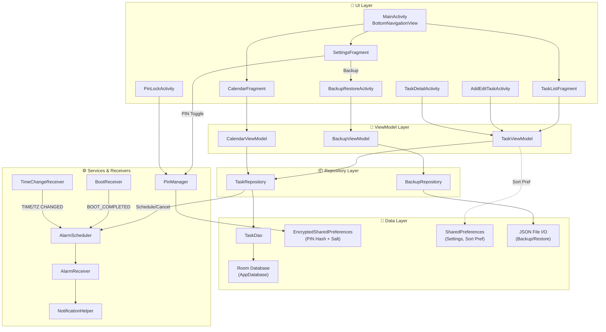

---

## 2. 🚀 APP LAUNCH FLOW — Luồng khởi động ứng dụng

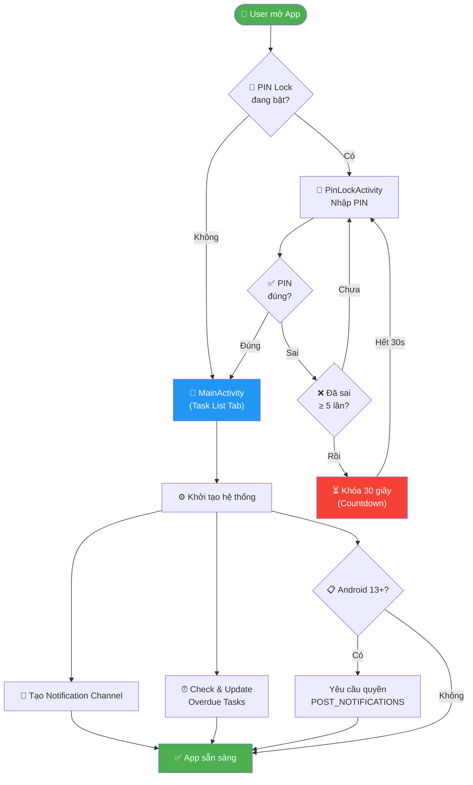

---

## 3. 🧭 MAIN NAVIGATION — Điều hướng chính

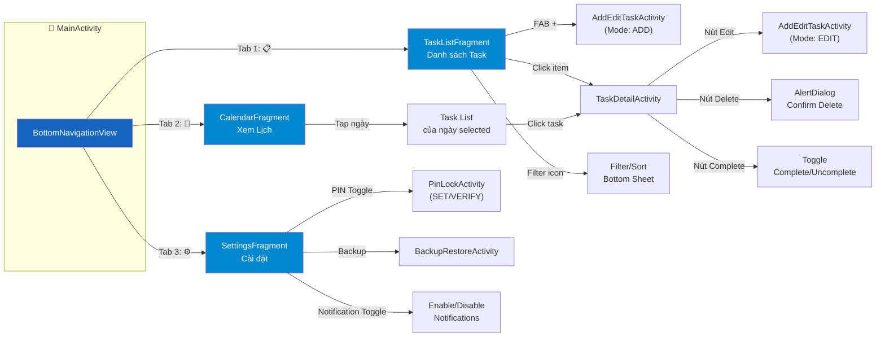

---

## 4. ✏️ TASK CRUD FLOW — Luồng Tạo / Sửa / Xóa / Hoàn thành

```mermaid
flowchart TD
    subgraph "📝 CREATE TASK"
        C1["Nhấn FAB (+)"] --> C2["Mở AddEditTaskActivity<br/>(Mode: ADD)"]
        C2 --> C3["Điền Form:<br/>Title*, Description,<br/>Due Date*, Due Time,<br/>Priority*, Recurrence"]
        C3 --> C4{"🔍 Validate<br/>form?"}
        C4 -->|"❌ Fail"| C5["Hiển thị error<br/>inline trên TextInputLayout"]
        C5 --> C3
        C4 -->|"✅ Pass"| C6["viewModel.insertTask(task)"]
        C6 --> C7["Repository.insert()<br/>→ DAO.insert() (Background Thread)"]
        C7 --> C8["📅 AlarmScheduler<br/>.scheduleAlarm()"]
        C8 --> C9["✅ Snackbar: Task created!<br/>→ Navigate back"]
    end

    subgraph "✏️ EDIT TASK"
        E1["Nhấn Edit<br/>từ TaskDetail"] --> E2["Mở AddEditTaskActivity<br/>(Mode: EDIT, taskId)"]
        E2 --> E3["Load task by ID<br/>→ Populate form"]
        E3 --> E4["Sửa fields"]
        E4 --> E5{"🔍 Validate?"}
        E5 -->|"❌ Fail"| E4
        E5 -->|"✅ Pass"| E6["viewModel.updateTask(task)<br/>updatedAt = now"]
        E6 --> E7{"📅 Date/Time<br/>thay đổi?"}
        E7 -->|Có| E8["AlarmScheduler<br/>.rescheduleAlarm()"]
        E7 -->|Không| E9["✅ Snackbar: Task updated!"]
        E8 --> E9
    end

    subgraph "🗑️ DELETE TASK"
        D1["Nhấn Delete<br/>từ TaskDetail"] --> D2["AlertDialog:<br/>Xác nhận xóa?"]
        D2 -->|Cancel| D3["Đóng dialog"]
        D2 -->|Confirm| D4["viewModel.deleteTask(task)"]
        D4 --> D5["AlarmScheduler<br/>.cancelAlarm(taskId)"]
        D5 --> D6["NotificationHelper<br/>.cancelNotification(taskId)"]
        D6 --> D7["✅ Snackbar: Task deleted!<br/>→ Navigate back"]
    end

    subgraph "✅ MARK COMPLETE"
        M1["Checkbox (List)<br/>hoặc Button (Detail)"] --> M2["viewModel.toggleComplete(task)"]
        M2 --> M3{"🔄 Task có<br/>Recurrence?"}
        M3 -->|Không| M4["status = COMPLETED<br/>isCompleted = true"]
        M3 -->|Có| M5["RecurrenceHelper<br/>.calculateNextDueDate()"]
        M5 --> M6["Tạo Task mới<br/>(kế thừa title, desc, priority,<br/>recurrence)"]
        M6 --> M7["Schedule alarm<br/>cho task mới"]
        M7 --> M4
        M4 --> M8["Cancel alarm<br/>task hiện tại"]
        M8 --> M9["✅ UI Update:<br/>Strikethrough, dim, checkmark"]
    end

    style C1 fill:#4CAF50,color:white
    style E1 fill:#FF9800,color:white
    style D1 fill:#F44336,color:white
    style M1 fill:#2196F3,color:white
```

---

## 5. 🔍 FILTER & SORT FLOW — Luồng Lọc và Sắp xếp

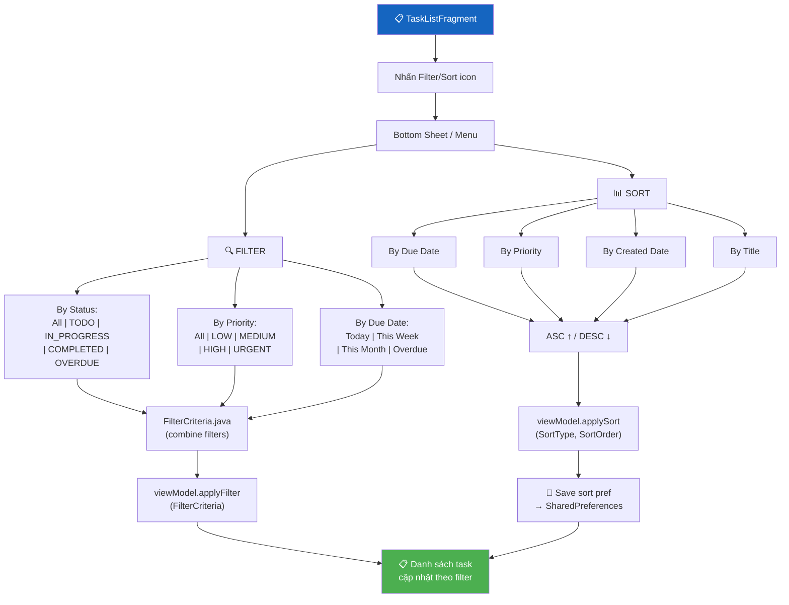

---

## 6. 🔔 NOTIFICATION & ALARM SYSTEM — Hệ thống thông báo nhắc nhở

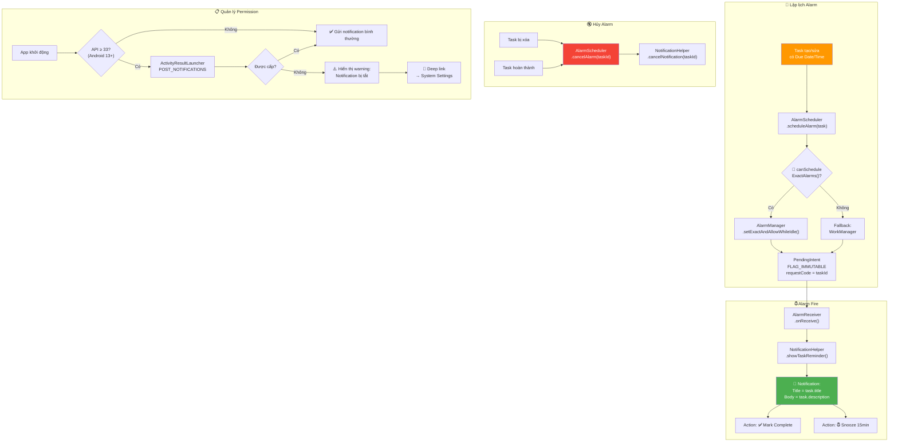

---

## 7. 📅 CALENDAR VIEW FLOW — Luồng Xem Lịch

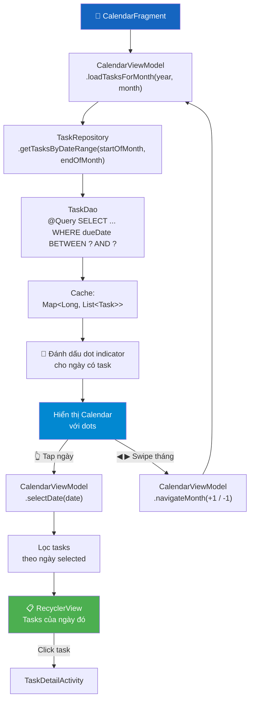

---

## 8. 🔄 RECURRING TASKS FLOW — Luồng Công việc lặp lại

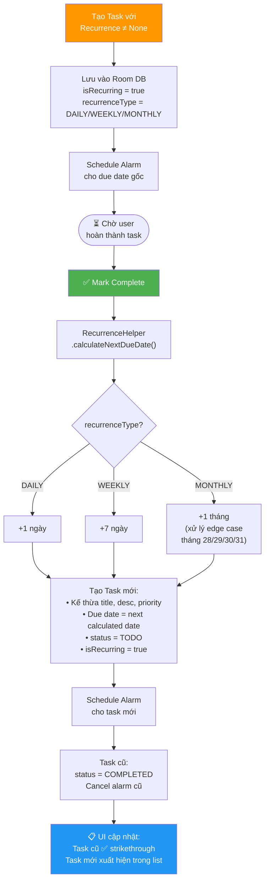

---

## 9. 🔐 PIN SECURITY FLOW — Luồng Bảo mật PIN

```mermaid
flowchart TD
    subgraph "🔓 ENABLE PIN"
        EN1["Settings: Toggle PIN ON"] --> EN2["PinLockActivity<br/>(Mode: SET)"]
        EN2 --> EN3["Nhập PIN mới<br/>(4-6 số)"]
        EN3 --> EN4["Xác nhận PIN<br/>(nhập lại)"]
        EN4 --> EN5{"Match?"}
        EN5 -->|Không| EN3
        EN5 -->|Có| EN6["PinManager.setPin():<br/>Salt = random bytes<br/>Hash = SHA-256(PIN + Salt)"]
        EN6 --> EN7["Lưu Hash + Salt<br/>→ EncryptedSharedPreferences"]
        EN7 --> EN8["✅ PIN enabled"]
    end

    subgraph "🔑 VERIFY PIN (Mở app)"
        V1["App mở / Resume<br/>sau > 1 phút"] --> V2["PinLockActivity<br/>(Mode: ENTER)"]
        V2 --> V3["Nhập PIN"]
        V3 --> V4["PinManager.verifyPin():<br/>Hash(input + stored Salt)<br/>== stored Hash?"]
        V4 -->|"✅ Đúng"| V5["Mở app"]
        V4 -->|"❌ Sai"| V6["Đếm lần sai"]
        V6 --> V7{"≥ 5 lần?"}
        V7 -->|Chưa| V3
        V7 -->|Rồi| V8["⏳ Lock 30s<br/>(Countdown timer)"]
        V8 --> V3
    end

    subgraph "🔄 CHANGE PIN"
        CH1["Settings: Change PIN"] --> CH2["Step 1: Nhập PIN cũ"]
        CH2 --> CH3{"Verify?"}
        CH3 -->|Sai| CH2
        CH3 -->|Đúng| CH4["Step 2: Nhập PIN mới"]
        CH4 --> CH5["Step 3: Xác nhận PIN mới"]
        CH5 --> CH6{"Match?"}
        CH6 -->|Không| CH4
        CH6 -->|Có| CH7["PinManager.setPin()<br/>(New Hash + New Salt)"]
        CH7 --> CH8["✅ PIN changed!"]
    end

    subgraph "🔓 DISABLE PIN"
        DIS1["Settings: Toggle PIN OFF"] --> DIS2["Verify PIN hiện tại"]
        DIS2 --> DIS3{"Đúng?"}
        DIS3 -->|Không| DIS2
        DIS3 -->|Có| DIS4["PinManager.removePin()"]
        DIS4 --> DIS5["✅ PIN disabled"]
    end

    style EN8 fill:#4CAF50,color:white
    style V5 fill:#4CAF50,color:white
    style CH8 fill:#4CAF50,color:white
    style DIS5 fill:#4CAF50,color:white
    style V8 fill:#F44336,color:white
```

---

## 10. 💾 BACKUP & RESTORE FLOW — Luồng Sao lưu / Khôi phục

```mermaid
flowchart TD
    subgraph "📤 EXPORT (Backup)"
        EX1["Nhấn Export<br/>trong BackupRestoreActivity"] --> EX2["SAF: ACTION_CREATE_DOCUMENT<br/>filename: task_backup_20260725.json"]
        EX2 --> EX3["User chọn vị trí lưu"]
        EX3 --> EX4["BackupRepository.exportTasks(uri)"]
        EX4 --> EX5["Query tất cả tasks<br/>từ Room DB"]
        EX5 --> EX6["Serialize → JSON (Gson)<br/>{version, exportDate, tasks: [...]}"]
        EX6 --> EX7["Ghi file qua<br/>ContentResolver.openOutputStream()"]
        EX7 --> EX8["Lưu last backup timestamp"]
        EX8 --> EX9["✅ Snackbar:<br/>Exported N tasks successfully!"]
    end

    subgraph "📥 IMPORT (Restore)"
        IM1["Nhấn Import<br/>trong BackupRestoreActivity"] --> IM2["SAF: ACTION_OPEN_DOCUMENT<br/>MIME: application/json"]
        IM2 --> IM3["User chọn file JSON"]
        IM3 --> IM4["Đọc file qua<br/>ContentResolver.openInputStream()"]
        IM4 --> IM5["JsonValidator.validate(json)"]
        IM5 --> IM6{"Valid?"}
        IM6 -->|"❌ Invalid"| IM7["Error: Hiển thị lỗi cụ thể<br/>(file corrupt, missing fields...)"]
        IM6 -->|"✅ Valid"| IM8["Parse JSON → List&lt;Task&gt;"]
        IM8 --> IM9{"Conflict?<br/>(Task trùng ID)"}
        IM9 -->|"Có"| IM10["Dialog:<br/>Replace / Skip / Replace All"]
        IM9 -->|"Không"| IM11["Room @Transaction<br/>Atomic insert all tasks"]
        IM10 --> IM11
        IM11 --> IM12["✅ Snackbar:<br/>Imported N tasks successfully!"]
    end

    style EX9 fill:#4CAF50,color:white
    style IM12 fill:#4CAF50,color:white
    style IM7 fill:#F44336,color:white
```

---

## 11. 📡 SYSTEM EVENTS FLOW — Xử lý sự kiện hệ thống

```mermaid
flowchart TD
    subgraph "🔄 BOOT_COMPLETED"
        BOOT["📱 Device khởi động lại"] --> BR["BootReceiver.onReceive()"]
        BR --> ASYNC["goAsync() — Background thread"]
        ASYNC --> QUERY_PENDING["Query tasks:<br/>dueDate ≥ now<br/>AND status ≠ COMPLETED"]
        QUERY_PENDING --> LOOP["Với mỗi task →<br/>AlarmScheduler.scheduleAlarm()"]
        LOOP --> DONE1["✅ Tất cả alarms<br/>đã được khôi phục"]
    end

    subgraph "🕐 TIME / TIMEZONE / DATE CHANGED"
        TIME["⏰ User đổi giờ<br/>hoặc timezone"] --> TCR["TimeChangeReceiver.onReceive()<br/>ACTION_TIME_CHANGED<br/>ACTION_TIMEZONE_CHANGED<br/>ACTION_DATE_CHANGED"]
        TCR --> RESCHED["Reschedule<br/>TẤT CẢ active alarms"]
        RESCHED --> RECHECK["checkAndUpdateOverdueTasks()<br/>(re-check overdue)"]
        RECHECK --> DONE2["✅ Alarms & Overdue<br/>đã cập nhật"]
    end

    subgraph "⏰ OVERDUE DETECTION"
        APP_RESUME["App resume /<br/>WorkManager periodic"] --> CHECK["checkAndUpdateOverdueTasks()"]
        CHECK --> SQL["UPDATE tasks<br/>SET status = 'OVERDUE'<br/>WHERE dueDate < now<br/>AND status ≠ 'COMPLETED'"]
        SQL --> UI["🔴 UI update:<br/>Overdue visual indicator"]
    end

    style DONE1 fill:#4CAF50,color:white
    style DONE2 fill:#4CAF50,color:white
    style UI fill:#FF5722,color:white
```

---

## 12. 🎨 UI STATES FLOW — 5 Trạng thái giao diện

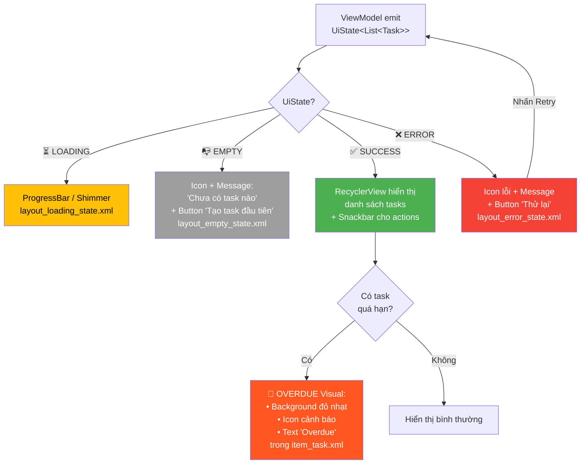

---

## 13. 🔀 DATA FLOW ARCHITECTURE — Luồng dữ liệu MVVM End-to-End

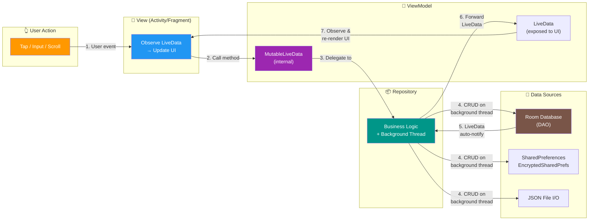

---

## 📊 TỔNG HỢP CÁC CHỨC NĂNG THEO MODULE

| Module | Chức năng | Screens liên quan |
|--------|-----------|-------------------|
| **🏠 Home & Navigation** | Bottom Navigation 3 tabs, Dashboard | `MainActivity`, `TaskListFragment`, `CalendarFragment`, `SettingsFragment` |
| **✏️ Task CRUD** | Tạo / Sửa / Xóa / Hoàn thành task | `AddEditTaskActivity`, `TaskDetailActivity` |
| **🔍 Filter & Sort** | Lọc (Status, Priority, Date) + Sắp xếp (4 tiêu chí × 2 hướng) | `TaskListFragment` (Bottom Sheet) |
| **🔄 Recurring Tasks** | Lặp lại Daily / Weekly / Monthly, tự tạo task mới khi hoàn thành | `RecurrenceHelper`, `AddEditTaskActivity` |
| **📅 Calendar View** | Xem lịch tháng, đánh dấu ngày có task, xem task theo ngày | `CalendarFragment`, `CalendarViewModel` |
| **🔔 Notifications** | Nhắc nhở đúng giờ, action Mark Complete & Snooze 15min | `NotificationHelper`, `AlarmScheduler`, `AlarmReceiver` |
| **📡 System Events** | Khôi phục alarms sau reboot / timezone / date change | `BootReceiver`, `TimeChangeReceiver` |
| **🔐 PIN Security** | Bật/Tắt/Đổi PIN, SHA-256 hash, auto-lock sau 1 phút background | `PinLockActivity`, `PinManager` |
| **💾 Backup & Restore** | Xuất/Nhập file JSON qua SAF, validate data, atomic transaction | `BackupRestoreActivity`, `BackupRepository`, `JsonValidator` |
| **🎨 UI States** | Loading, Empty, Error, Success, Overdue — 5 trạng thái giao diện | Tất cả Fragments |
| **✅ Validation** | Title required, date valid, max chars, real-time TextWatcher | `ValidationHelper`, `AddEditTaskActivity` |
| **⏰ Overdue Detection** | Tự động phát hiện & đánh dấu task quá hạn | `TaskRepository`, `TaskDao` |
