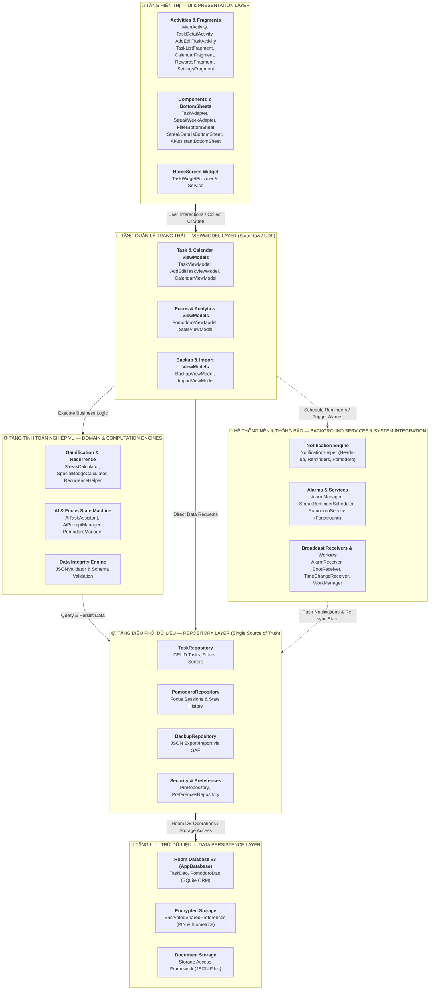

# Task Management App — Ứng dụng Quản lý Công việc (Kotlin)

> **Mã đề tài:** Android_UTH_01  
> **Ngôn ngữ & Công nghệ:** Kotlin, MVVM Architecture, Room Database, ViewModel, LiveData, Coroutines, AlarmManager, Material Design 3  
> **Môi trường phát triển:** Android Studio (minSdk 26, targetSdk 34, JDK 17)

---

## Danh sách thành viên nhóm

| STT | Họ và Tên | MSSV | Vai trò | Trách nhiệm chính |
| :---: | :--- | :---: | :---: | :--- |
| 1 | **Trần Văn Thái (Leader)** | 051206002315 | Leader (Core Architecture) | Kiến trúc MVVM, Database Room, Repository, Security (PIN Lock), Git Management, UI Bento Grid |
| 2 | **Huỳnh Đình Chấn** | 077206002307 | UI Implementation | Code XML Layouts theo design, Filter & Overdue Task, Configuration Changes, Pomodoro Focus Timer |
| 3 | **Trần Văn Ngọc Thắng** | 046206001641 | Feature Developer 1 | Calendar View, Edit Task, Export JSON (SAF), Sinh trắc học (Biometric Auth), App Shortcuts |
| 4 | **Nguyễn Lê Huy Tâm** | 056206011188 | Feature Developer 2 | Task Detail Screen, UI States, Recurring Tasks, Import JSON & Validation, Hệ thống Streak & Badges |
| 5 | **Nguyễn Ngọc Gia Bảo** | 079206008279 | QA & Backup | Material 3 Theme, Settings Screen, AlarmManager Notifications, Input Validation, Trợ lý AI Assistant |

---

## Cấu trúc Repository (Directory Structure)

```
Task-Management-App/
├── Code/                                      # Mã nguồn dự án Android Studio
│   └── TaskManagementApp/
│       ├── app/                               # Android App Module chính
│       │   ├── src/main/java/com/team/taskmanagementapp/
│       │   │   ├── ai/                        # Trợ lý AI (Gemini / Firebase AI Logic)
│       │   │   ├── data/                      # Tầng dữ liệu: Local DB (Room v3), Entities, DAOs, Repositories, Validators
│       │   │   ├── pomodoro/                  # Quản lý & Service đếm giờ tập trung Pomodoro
│       │   │   ├── receiver/                  # BroadcastReceivers (Alarm, Boot, TimeChange, StreakReminder)
│       │   │   ├── security/                  # Bảo mật mã PIN, Sinh trắc học & Mã hóa SharedPreferences
│       │   │   ├── ui/                        # Tầng hiển thị: Activities, Fragments, Adapters, BottomSheets
│       │   │   │   ├── activity/              # AddEditTaskActivity, ImportActivity...
│       │   │   │   ├── detail/                # TaskDetailActivity (Bento Grid) & DeleteDialog
│       │   │   │   ├── pin/                   # SetPinActivity, VerifyPinActivity...
│       │   │   │   └── viewmodel/             # AddEditTaskViewModel, StatsViewModel, PomodoroViewModel...
│       │   │   ├── util/                      # Tiện ích: RecurrenceHelper, StreakCalculator, SpecialBadgeCalculator...
│       │   │   ├── viewmodel/                 # TaskViewModel, CalendarViewModel, ImportViewModel...
│       │   │   ├── widget/                    # App Widget trên màn hình chính (HomeScreen Task Widget)
│       │   │   ├── worker/                    # WorkManager cho các tác vụ chạy ngầm định kỳ
│       │   │   ├── MainActivity.kt            # Activity chính điều hướng Navigation Component
│       │   │   └── TaskApplication.kt         # Cấu hình khởi tạo toàn cục (Notification Channels, Logging)
│       │   └── src/main/res/                  # Layouts XML, Drawables, Menus, NavGraph, Values đa ngôn ngữ
│       ├── gradle/                            # Gradle Wrapper & Version Catalog (libs.versions.toml)
│       ├── build.gradle.kts                   # Project & Module build script
│       └── settings.gradle.kts                # Cấu hình Plugin Management & Dependency Repositories
├── DOCX/                                      # Tài liệu đồ án, kế hoạch & báo cáo kỹ thuật
│   ├── Bao_Cao_Do_An/                         # Báo cáo tổng hợp, tóm tắt đồ án & chi tiết đóng góp cá nhân
│   ├── UI-UX/                                 # Tài liệu thiết kế giao diện & bản mẫu Wireframe
│   ├── project_plan.md                        # Kế hoạch & lộ trình triển khai dự án
│   └── system_workflow.md                     # Tài liệu tổng hợp Workflow & Sequence Diagram
├── Extra/                                     # Tài nguyên hình ảnh, biểu đồ tham khảo
├── PPTX/                                      # Slide thuyết trình đồ án
└── README.md                                  # Tài liệu giới thiệu tổng quan dự án
```

---

## Kiến trúc ứng dụng (MVVM Architecture)

Ứng dụng được xây dựng tuân thủ nghiêm ngặt theo **Kiến trúc MVVM (Model - View - ViewModel)** chuẩn Google khuyến nghị, kết hợp luồng dữ liệu một chiều (**UDF — Unidirectional Data Flow**) và mô hình phản ứng **Reactive Programming (Kotlin Coroutines & Flow)**:



### Chi tiết các tầng trong kiến trúc:

1. **UI Layer (View):**
   - Chỉ đảm nhận vai trò hiển thị giao diện và thu thập sự kiện tương tác của người dùng.
   - Hoàn toàn thụ động (Passive View), không chứa logic tính toán nghiệp vụ hay truy xuất trực tiếp cơ sở dữ liệu.
   - Lắng nghe luồng dữ liệu an toàn vòng đời thông qua `lifecycleScope.launch` kết hợp `repeatOnLifecycle(Lifecycle.State.STARTED)`.

2. **ViewModel Layer:**
   - Đóng vai trò cầu nối trung gian giữa View và Repository.
   - Nắm giữ và phát ra các `StateFlow<UiState>` đại diện cho trạng thái của màn hình (`Loading`, `Success`, `Empty`, `Error`).
   - Xử lý các sự kiện đơn lẻ (Single Events) như thông báo `Snackbar`, điều hướng màn hình thông qua `SharedFlow` / `Channel`.

3. **Domain & Computation Layer (Engine tính toán):**
   - Độc lập với Android Framework, xử lý các thuật toán cốt lõi: tính toán chu kỳ lặp lại đa dạng (`RecurrenceHelper`), thuật toán chuỗi ngày streak và mở khóa 21 danh hiệu thành tựu (`StreakCalculator`, `SpecialBadgeCalculator`), kiểm tra định dạng tệp sao lưu (`JSONValidator`).

4. **Repository Layer:**
   - Trừu tượng hóa nguồn dữ liệu (*Single Source of Truth*), cung cấp API sạch cho ViewModel.
   - Chuyển đổi và xử lý các tác vụ I/O nặng trên luồng nền (`Dispatchers.IO`), đảm bảo giao diện luôn mượt mà.

5. **Data & Persistence Layer:**
   - Lưu trữ dữ liệu có cấu trúc với **Room Database** (hỗ trợ Coroutines Flow và Room Migration v2 ➔ v3).
   - Bảo mật thông tin mã PIN bằng `EncryptedSharedPreferences`.
   - Tích hợp chuẩn Android SAF để người dùng sao lưu và phục hồi dữ liệu từ bộ nhớ trong hoặc Google Drive.

---

## Hướng dẫn Cài đặt & Chạy ứng dụng

### Yêu cầu môi trường:
1. **Android Studio:** Jellyfish / Hedgehog hoặc phiên bản mới hơn.
2. **JDK:** JDK 17.
3. **Android SDK:** minSdk = 26 (Android 8.0+), targetSdk = 34 (Android 14).

### Các bước thực hiện:
```bash
# 1. Clone repository về máy
git clone https://github.com/ThaiDevv/Task-Management-App.git

# 2. Mở Android Studio
# Chọn "Open" -> Trỏ đến thư mục: Code/TaskManagementApp

# 3. Sync Gradle và Run app
# Bấm nút "Sync Project with Gradle Files"
# Chọn Emulator (API 26+) hoặc Thiết bị thật và bấm "Run"
```

### Thiết lập trợ lý AI

Trợ lý AI sử dụng Firebase AI Logic. Trước khi Sync/Run, mỗi thành viên cần đăng ký
Android app với package `com.team.taskmanagementapp` trong cùng Firebase project,
tải `google-services.json` từ Firebase Console và đặt tại
`Code/TaskManagementApp/app/google-services.json`. Tệp này được `.gitignore` loại
khỏi Git; không đưa token App Check debug hoặc thông tin cấu hình riêng lên commit.

Trong Firebase Console, bật Gemini Developer API cho Firebase AI Logic và đăng ký
App Check cho Android app. Bản debug dùng App Check debug provider: lấy token riêng
của máy từ Logcat, sau đó đăng ký token đó trong Firebase Console. Bản release dùng
Play Integrity và cần cấu hình chứng thực phù hợp trước khi phát hành. Các thao tác
tạo hoặc sửa task do AI đề xuất chỉ được lưu sau khi người dùng xác nhận.

---

## Video Demo Sản Phẩm

*(Link video demo YouTube sẽ được cập nhật sau khi hoàn thành sản phẩm)*

---

## Giấy phép & Quy định
Đồ án thuộc môn học Lập trình Android — Trường Đại học Giao thông Vận tải TP.HCM (UTH).
